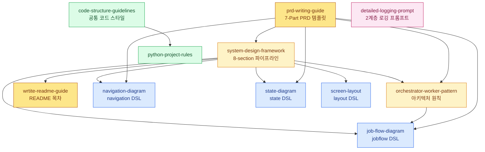

# Project Guides

프로젝트 설계·문서화·구현을 위한 **가이드 모음**. 이 README 자체가 "어떤 상황에 어떤 문서를 참조해야 하는가" 를 알려주는 **인덱스 스킬(Skill-style index)** 로 동작한다.

> 📌 **이 README 를 읽는 법**
> 1. 먼저 [⚡ 트리거 요약](#-트리거-요약-이런-상황--이-문서) 표에서 지금 상황에 맞는 문서를 찾는다.
> 2. [🗺️ 워크플로별 문서 묶음](#️-워크플로별-문서-묶음) 으로 전체 흐름상 위치를 확인한다.
> 3. [🔗 문서 간 관계](#-문서-간-관계) 다이어그램으로 의존 관계를 파악한다.
> 4. 필요한 문서의 [📚 상세 설명](#-상세-설명) 섹션에서 `언제 쓰는가 / 핵심 내용 / 연계 문서` 를 읽고 본 문서로 진입한다.

---

## ⚡ 트리거 요약 (이런 상황 → 이 문서)

| 상황 / 키워드 | 우선 참조 문서 | 보조 문서 |
|---|---|---|
| "새 프로젝트를 설계해야 한다" / 요구사항을 구조화 | [system-design-framework.md](system-design-framework.md) | PBS, Input Datas, Key Events 작성법 |
| "PRD / 제품 요구사항 문서를 쓰자" | [prd-writing-guide.md](prd-writing-guide.md) | system-design, orchestrator-worker, job-flow 를 전제로 함 |
| "모듈을 어떻게 쪼갤까" / 객체 역할 분담 / 제어권 흐름 | [orchestrator-worker-pattern-guide.md](orchestrator-worker-pattern-guide.md) | job-flow-diagram-guide |
| "객체 간 메서드 호출·이벤트 흐름을 그려야 한다" | [job-flow-diagram-guide.md](job-flow-diagram-guide.md) | orchestrator-worker |
| "화면 전환 / API 호출 흐름을 정리" | [navigation-diagram-guide.md](navigation-diagram-guide.md) | screen-layout-guide |
| "객체의 상태 전이를 표현" | [state-diagram-guide.md](state-diagram-guide.md) | job-flow-diagram-guide |
| "화면 레이아웃 구조를 정의" | [screen-layout-guide.md](screen-layout-guide.md) | navigation-diagram-guide |
| "코드 스타일 / 파일 분리 / 주석 정책" | [code-structure-guidelines.md](code-structure-guidelines.md) | 각 언어별 프로젝트 룰 |
| "Python 프로젝트 구조 / 네이밍 / import 순서" | [python-project-rules.md](python-project-rules.md) | code-structure-guidelines |
| "프로젝트 README 템플릿을 만들자" | [wrtite-readme-guide.md](wrtite-readme-guide.md) | system-design-framework (8 섹션이 README 목차와 일치) |
| "LLM · API 호출 · 상태 스냅샷을 깊이 있게 로깅하고 싶다" / 2계층 로깅 / 세션 기반 로그 | [detailed-logging-prompt.md](detailed-logging-prompt.md) | — (독립 프롬프트) |

> 🔑 **키워드 기반 자동 매칭**: "PBS", "Input Datas", "Key Events" → system-design-framework · "jobflow", "master·Object" → job-flow-diagram-guide · "Orchestrator", "Worker", "Gateway" → orchestrator-worker-pattern-guide · "Screen Flow", "Logic Flow" → navigation-diagram-guide · "2계층 로그", "세션 로그", "LLM 프롬프트 로그" → detailed-logging-prompt.

---

## 🗺️ 워크플로별 문서 묶음

프로젝트 생애주기 순으로 문서를 읽으면 자연스럽게 연결된다.

### 1. 요구사항 & 설계 (What to build)

- **[system-design-framework.md](system-design-framework.md)** — Input Datas → Key Events → Services List → PBS → 4종 다이어그램 (Job Flow / Navigation / State / Screen Layout) 의 8 섹션 파이프라인. **가장 먼저 읽는 문서.**
- **[orchestrator-worker-pattern-guide.md](orchestrator-worker-pattern-guide.md)** — Services List 를 실제 코드 모듈로 펼치는 아키텍처 원칙 (Main · core · gateways · service · utils).

### 2. 설계 시각화 (Diagram DSL)

각 다이어그램은 **독자적인 텍스트 DSL** 을 갖는다. PRD / README / 설계 문서에서 이 DSL 블록을 그대로 사용한다.

- **[job-flow-diagram-guide.md](job-flow-diagram-guide.md)** — `jobflow` 블록. 객체 간 메서드 호출과 이벤트 구독 흐름.
- **[navigation-diagram-guide.md](navigation-diagram-guide.md)** — `navigation` 블록. 화면 ↔ API ↔ 내부 프로세스 흐름.
- **[state-diagram-guide.md](state-diagram-guide.md)** — `state` 블록. 객체의 상태 전이도 (Mermaid `graph LR` 로 변환).
- **[screen-layout-guide.md](screen-layout-guide.md)** — `layout` 블록. `V`(세로) / `>`(가로) 연산자 기반 화면 구조.

### 3. PRD 작성 (How to spec)

- **[prd-writing-guide.md](prd-writing-guide.md)** — 1·2·3 단계 위 문서들을 전제로, **7 Part 두괄식 PRD 템플릿** (요약·모듈·시나리오·데이터·알고리즘·운영·설정) + `jobflow` 직후 **4 요소 의무화** (다이어그램·객체·이벤트·시나리오) + Must/Should/Optional 체크리스트 + 전역 **텍스트 다이어그램(ASCII) 금지** 정책.

### 4. 구현 (How to build)

- **공통 스타일**: [code-structure-guidelines.md](code-structure-guidelines.md) — 가독성·단일책임·탑다운·상수·주석 금지.
- **언어별 프로젝트 룰**: [python-project-rules.md](python-project-rules.md).

### 5. 문서화 & 관측성 (How to document & observe)

- **[wrtite-readme-guide.md](wrtite-readme-guide.md)** — 프로젝트 README 목차 템플릿 (system-design 8 섹션과 1:1 매핑).
- **[detailed-logging-prompt.md](detailed-logging-prompt.md)** — **프롬프트 형식** 으로 제공되는 로깅 시스템 구현 요청서. 2 계층 로깅(텍스트 `.log` + 구조화 `.md`/`.json`), 세션 기반 디렉토리, 자동 프로세스 다이어그램 생성. 구현 대상 프로젝트에 붙여 넣어 사용한다.

---

## 🔗 문서 간 관계

- **노랑 계열** = 최상위 설계/스펙 문서. 프로젝트 시작 시 먼저 읽는다.
- **파랑** = 다이어그램 DSL. 스펙·PRD 본문 안에 블록으로 삽입된다.
- **초록** = 구현 단계 규칙·패턴.
- **분홍** = 운영/관측 단계에서 붙여 쓰는 프롬프트.

---

## 📚 상세 설명

각 항목은 **언제 쓰는가 / 핵심 내용 / 연계 문서** 3 요소로 정리한다.

### 설계 프레임워크

#### [system-design-framework.md](system-design-framework.md)
- **언제 쓰는가**: 새 시스템·기능의 요구사항을 **구조화된 양식** 으로 정리해야 할 때. PRD 나 README 작성 직전의 선행 단계.
- **핵심 내용**: 8 섹션 파이프라인 — ① Input Datas ② Key Events ③ Services List ④ PBS(Process Breakdown Structure) ⑤ Job Flow ⑥ Navigation ⑦ State ⑧ Screen Layout. ⑤~⑧ 은 별도의 DSL 가이드로 분기된다.
- **연계 문서**: orchestrator-worker-pattern-guide (③ Services List 펼치기), 4 종 다이어그램 가이드 (⑤~⑧ 시각화), prd-writing-guide · wrtite-readme-guide (이 프레임워크를 전제로 하는 소비자).

#### [orchestrator-worker-pattern-guide.md](orchestrator-worker-pattern-guide.md)
- **언제 쓰는가**: 모듈 경계를 잡고 **제어권 흐름(누가 누구를 호출하는가 / 누가 이벤트를 올리는가)** 을 확정해야 할 때.
- **핵심 내용**: `Main`(Orchestrator) / `core`(Worker) / `gateways`(외부 통신) / `service`(싱글톤) / `utils`(무상태) 구조. 단방향 제어 · 이벤트 기반 보고 · 수평적 고립 · 재귀적 Sub-Orchestrator · 외부 접근 캡슐화의 6 원칙.
- **연계 문서**: job-flow-diagram-guide (이 원칙을 다이어그램으로 표현).

#### [prd-writing-guide.md](prd-writing-guide.md)
- **언제 쓰는가**: 도메인과 무관하게 **PRD 한 편을 처음부터 끝까지** 작성할 때. 리뷰어와 구현자 모두를 독자로 삼는다.
- **핵심 내용**:
  - **7 Part 구조** — Part 1~3 (요약·모듈·시나리오) 만으로 리뷰 완결, Part 4~7 (데이터·알고리즘·운영·설정) 은 구현 시 참조.
  - **jobflow 직후 4 요소 세트** (다이어그램·객체 목록·이벤트 명세·시나리오 내러티브) 의무화.
  - **Must / Should / Optional 체크리스트**.
  - **ASCII 박스·트리 다이어그램 전역 금지** · 모든 다이어그램은 mermaid 또는 허용된 3 종 DSL(`jobflow` / `state` / `navigation`) 로만 작성.
- **연계 문서**: system-design-framework (선행), orchestrator-worker-pattern-guide (모듈 정의의 근거), job-flow-diagram-guide (핵심 DSL).

### 다이어그램 DSL 가이드

#### [job-flow-diagram-guide.md](job-flow-diagram-guide.md)
- **언제 쓰는가**: 객체(클래스/모듈) 간 **메서드 호출과 이벤트 구독** 흐름을 한 장에 담을 때. PRD Part 3 의 주력 DSL.
- **핵심 내용**: `master`(오케스트레이터) + `Object:` 목록으로 선언. `Object.MethodName` / `Object.OnEventName` / `.result` / `.value` 4 표기. 시나리오 시작점은 master Public 메서드, 프로세스 진입 이벤트, 외부 이벤트 중 하나.
- **연계 문서**: orchestrator-worker-pattern-guide (용어 · 역할 정의), prd-writing-guide (4 요소 의무화 규칙).

#### [navigation-diagram-guide.md](navigation-diagram-guide.md)
- **언제 쓰는가**: 화면 전환, API 호출, 내부 프로세스 분기를 **스크립트 한 장** 으로 표현할 때. 프론트엔드 시나리오 / 백엔드 라우팅 모두 적용.
- **핵심 내용**: `FrontPage` / `(/backend_api)` / `(process)` 3 요소. 5 가지 전이 규칙 (Page→Page, Page→API, API→Page, Page→Process, Process→Page/API). 분기는 `: error`, `: success` 등 라벨로 표기.
- **연계 문서**: screen-layout-guide (노드마다 레이아웃 정의), system-design-framework 섹션 6.

#### [state-diagram-guide.md](state-diagram-guide.md)
- **언제 쓰는가**: 객체의 **상태 전이** 와 entry/exit action 을 텍스트로 정의할 때.
- **핵심 내용**: `<s>`(시작), `(State)`(상태), `Action`(괄호 없음, 직사각형 액션), `<e>`(종료). 전이 조건은 `: Text` 라벨. 자동으로 Mermaid `graph LR` 로 변환.
- **연계 문서**: prd-writing-guide (단, 표현력이 부족하면 mermaid `stateDiagram-v2` 우선).

#### [screen-layout-guide.md](screen-layout-guide.md)
- **언제 쓰는가**: 화면을 **픽셀·좌표 없이 구조로만** 정의할 때. UI 리뷰·목업 이전 단계.
- **핵심 내용**: `Container V Child1, Child2`(세로) / `Container > Child1, Child2`(가로). `Child : 20` 형태 비율 지정 (세로는 무시). 컨테이너는 좌변에 재등장, 컴포넌트는 좌변에 등장하지 않는 말단.
- **연계 문서**: navigation-diagram-guide (각 FrontPage 별 레이아웃 정의).

### 코딩 가이드라인

#### [code-structure-guidelines.md](code-structure-guidelines.md)
- **언제 쓰는가**: 언어 무관하게 **모든 코드 작성 전**.
- **핵심 내용**: 가독성 우선 · 단일 책임(한 파일 한 책임) · 탑다운(상위는 "무엇", 하위는 "어떻게") · 상수 선언(매직 넘버/스트링 금지) · **주석 금지**(필요하면 이름·구조를 다시 설계).
- **연계 문서**: 모든 언어별 규칙의 상위 원칙.

#### [python-project-rules.md](python-project-rules.md)
- **언제 쓰는가**: Python 프로젝트를 **디렉토리부터** 세팅할 때.
- **핵심 내용**: `run.py` 엔트리 / `src/main.py` 부트스트랩 / `src/core/ModuleName/ModuleName.py` (PascalCase 디렉토리 & 파일, 동일 이름 메인 클래스) / `src/services` / `src/utils` / `src/test/test_ModuleName.py`. 네이밍: 디렉토리·파일·클래스 PascalCase, 함수·변수 snake_case, 상수 UPPER_SNAKE_CASE. Import 순서: 표준 → 3rd-party → `src.*`. 이벤트 wiring 은 `main.py` 에서 `self.a.on_x = self.b.method` 식으로.
- **연계 문서**: code-structure-guidelines (공통 상위 원칙).

### 기타

#### [wrtite-readme-guide.md](wrtite-readme-guide.md)
- **언제 쓰는가**: 이 가이드 묶음 아래에서 만든 프로젝트의 **README.md 본문** 을 쓸 때.
- **핵심 내용**: 목차 템플릿 — 시스템 개요 / 시스템 구성 / Input Datas / Key Events / Services List / PBS / Job Flow / Navigation (Screen/Logic) / Screen Layout / 프로젝트 구조 / 설정 / 실행. **system-design-framework 의 8 섹션이 그대로 README 목차가 된다.**
- **파일명 주의**: 오타 (`wrtite`) 가 있으나 실제 파일명이 이렇게 유지되고 있다. 링크 시 정확히 복사.

#### [detailed-logging-prompt.md](detailed-logging-prompt.md)
- **언제 쓰는가**: 이미 만들어진 프로젝트에 **"상세 분석 로그 시스템"** 을 얹고 싶을 때. 문서가 아니라 **에이전트에게 통째로 붙여 넣는 프롬프트** 다.
- **핵심 내용**:
  - **2 계층 로깅**: (1 층) 한 줄 텍스트 `.log` — 시간순 훑어보기. (2 층) 구조화 `.md` / `.json` — LLM 시스템/사용자 프롬프트·응답 전문, API 요청/응답 body, 상태 스냅샷 등.
  - **세션 단위 관리**: `start_session()` → 타임스탬프 디렉토리 자동 생성(`logs/YYYYMMDD-HHMMSS-NNN/`) → 카테고리 하위 디렉토리 · 세션 텍스트 로그 파일 오픈. `end_session()` → 수집된 이벤트로 Mermaid 프로세스 다이어그램 자동 생성.
  - **파일명 컨벤션**으로 디렉토리 목록만 봐도 시간순·성공/실패 파악.
  - 자동 삭제 주기 **7 일** (최근 업데이트로 30 일 → 7 일 단축).
- **연계 문서**: 프롬프트 자체가 self-contained. 도메인 카테고리 설계는 해당 프로젝트 코드 분석에 의존.

---

## 📎 부록: 모든 문서 한눈 목록

| 파일 | 분류 | 한 줄 역할 |
|---|---|---|
| [system-design-framework.md](system-design-framework.md) | 설계 | 요구사항 → 설계 → 시각화 8 섹션 파이프라인 |
| [orchestrator-worker-pattern-guide.md](orchestrator-worker-pattern-guide.md) | 설계 | 모듈 경계 및 제어권 흐름 6 원칙 |
| [prd-writing-guide.md](prd-writing-guide.md) | 스펙 | 7 Part 두괄식 범용 PRD 템플릿 |
| [job-flow-diagram-guide.md](job-flow-diagram-guide.md) | DSL | `jobflow` — 객체 간 호출·이벤트 흐름 |
| [navigation-diagram-guide.md](navigation-diagram-guide.md) | DSL | `navigation` — 화면 · API · 프로세스 흐름 |
| [state-diagram-guide.md](state-diagram-guide.md) | DSL | `state` — 상태 전이 (Mermaid 변환) |
| [screen-layout-guide.md](screen-layout-guide.md) | DSL | `layout` — V/> 연산자 기반 화면 구조 |
| [code-structure-guidelines.md](code-structure-guidelines.md) | 구현 | 가독성·단일책임·탑다운·주석 금지 |
| [python-project-rules.md](python-project-rules.md) | 구현 | Python 구조/네이밍/import |
| [wrtite-readme-guide.md](wrtite-readme-guide.md) | 문서 | README 목차 템플릿 (8 섹션 매핑) |
| [detailed-logging-prompt.md](detailed-logging-prompt.md) | 운영 | 2 계층 로깅 시스템 구현 프롬프트 |
