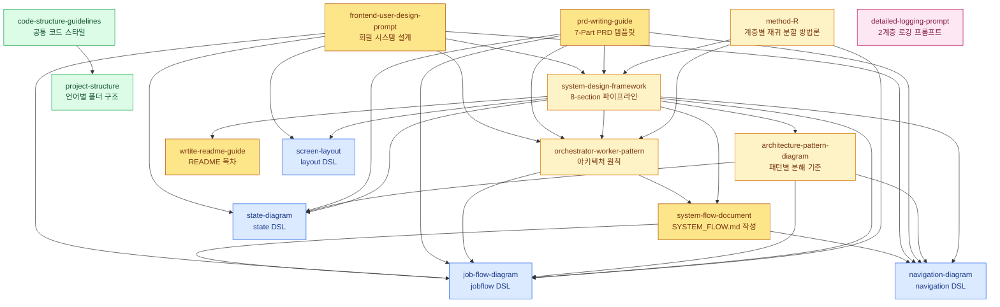

# Project Guides

프로젝트 설계·문서화·구현을 위한 **가이드 모음**. 이 README 자체가 "어떤 상황에 어떤 문서를 참조해야 하는가" 를 알려주는 **인덱스 스킬(Skill-style index)** 로 동작한다.

> 📁 **폴더 구조**
> - **[`guides/`](guides/)** — 참조용 가이드·방법론·DSL 문서. 필요할 때 열어 읽는다.
> - **[`prompts/`](prompts/)** — 에이전트에게 통째로 붙여 넣어 사용하는 실행 프롬프트 (`detailed-logging-prompt`, `system-design-as-is-prompt`, `system-design-to-be-prompt`, `feature-design-prompt`, `frontend-user-design-prompt`, `multi-agent-task-prompt`).

> 📌 **이 README 를 읽는 법**
> 1. 먼저 [⚡ 트리거 요약](#-트리거-요약-이런-상황--이-문서) 표에서 지금 상황에 맞는 문서를 찾는다.
> 2. [🗺️ 워크플로별 문서 묶음](#️-워크플로별-문서-묶음) 으로 전체 흐름상 위치를 확인한다.
> 3. [🔗 문서 간 관계](#-문서-간-관계) 다이어그램으로 의존 관계를 파악한다.
> 4. 필요한 문서의 [📚 상세 설명](#-상세-설명) 섹션에서 `언제 쓰는가 / 핵심 내용 / 연계 문서` 를 읽고 본 문서로 진입한다.

---

## ⚡ 트리거 요약 (이런 상황 → 이 문서)

| 상황 / 키워드 | 우선 참조 문서 | 보조 문서 |
|---|---|---|
| "시스템을 계층적으로(매크로→시스템→모듈→상세) 재귀 분할하는 방법론이 필요" / 메시지 vs 이벤트 기반 선택 | [method-R.md](guides/method-R.md) | system-design-framework, orchestrator-worker, job-flow |
| "새 프로젝트를 설계해야 한다" / 요구사항을 구조화 | [system-design-framework.md](guides/system-design-framework.md) | PBS, Input Datas, Key Events 작성법 |
| "PRD / 제품 요구사항 문서를 쓰자" | [prd-writing-guide.md](guides/prd-writing-guide.md) | system-design, orchestrator-worker, job-flow 를 전제로 함 |
| "아키텍처 패턴을 고르자" / Layered, Clean, DDD, Event-Driven, Saga 비교 | [architecture-pattern-diagram-guide.md](guides/architecture-pattern-diagram-guide.md) | system-design, job-flow, navigation, state |
| "모듈을 어떻게 쪼갤까" / 객체 역할 분담 / 제어권 흐름 | [orchestrator-worker-pattern-guide.md](guides/orchestrator-worker-pattern-guide.md) | job-flow-diagram-guide |
| "시스템 전체를 쉽게 설명하는 문서를 만들자" / SYSTEM_FLOW.md / 동적 흐름과 정적 구성 | [system-flow-document-guide.md](guides/system-flow-document-guide.md) | job-flow, navigation, orchestrator-worker |
| "객체 간 메서드 호출·이벤트 흐름을 그려야 한다" | [job-flow-diagram-guide.md](guides/job-flow-diagram-guide.md) | orchestrator-worker |
| "화면 전환 / API 호출 흐름을 정리" | [navigation-diagram-guide.md](guides/navigation-diagram-guide.md) | screen-layout-guide |
| "객체의 상태 전이를 표현" | [state-diagram-guide.md](guides/state-diagram-guide.md) | job-flow-diagram-guide |
| "화면 레이아웃 구조를 정의" | [screen-layout-guide.md](guides/screen-layout-guide.md) | navigation-diagram-guide |
| "코드 스타일 / 파일 분리 / 주석 정책" | [code-structure-guidelines.md](guides/code-structure-guidelines.md) | 각 언어별 프로젝트 룰 |
| "프로젝트 폴더 구조를 어떻게 잡을까" / 언어별 표준 디렉토리·네이밍 (Python·Node·React·Next·Go) | [project-structure-guide.md](guides/project-structure-guide.md) | code-structure-guidelines |
| "프로젝트 README 템플릿을 만들자" | [wrtite-readme-guide.md](guides/wrtite-readme-guide.md) | system-design-framework (8 섹션이 README 목차와 일치) |
| "특정 요구사항(기능 하나) 설계를 요청하자" / 기능 추가·변경의 영향 범위만 설계 / FR 추적성 | [feature-design-prompt.md](prompts/feature-design-prompt.md) | system-design-as-is-prompt, system-design-to-be-prompt (전체 재설계 시 전환) |
| "회원제 프론트엔드를 설계하자" / 회원가입·로그인·세션·자기 정보·탈퇴 / DynamoDB 회원 모델 | [frontend-user-design-prompt.md](prompts/frontend-user-design-prompt.md) | system-design-framework, 4종 다이어그램 DSL |
| "LLM · API 호출 · 상태 스냅샷을 깊이 있게 로깅하고 싶다" / 2계층 로깅 / 세션 기반 로그 | [detailed-logging-prompt.md](prompts/detailed-logging-prompt.md) | — (독립 프롬프트) |
| "여러 전문 에이전트로 분업·상호 견제하며 작업을 진행" / Architect·Critic·Developer·Tester 협업 루프 | [multi-agent-task-prompt.md](prompts/multi-agent-task-prompt.md) | orchestrator-worker-pattern-guide |
| "tools.camp 마크다운 에디터 문법" / 다이어그램·코드·페이지 분할 / 콜아웃·표·변수 등 SmartMD 확장 / `:::`, `{table}`, `{{var}}` | [tools-camp-markdown-guide.md](guides/tools-camp-markdown-guide.md) | 4종 다이어그램 가이드 |

> 🔑 **키워드 기반 자동 매칭**: "PBS", "Input Datas", "Key Events" → system-design-framework · "jobflow", "orchestrator:/scope:·Object" → job-flow-diagram-guide · "Orchestrator", "Worker", "Gateway" → orchestrator-worker-pattern-guide · "Screen Flow", "Logic Flow" → navigation-diagram-guide · "회원가입", "로그인", "세션", "탈퇴" → frontend-user-design-prompt · "2계층 로그", "세션 로그", "LLM 프롬프트 로그" → detailed-logging-prompt.

---

## 🗺️ 워크플로별 문서 묶음

프로젝트 생애주기 순으로 문서를 읽으면 자연스럽게 연결된다.

### 1. 요구사항 & 설계 (What to build)

- **[method-R.md](guides/method-R.md)** — 시스템을 매크로 → 시스템 → 모듈 → 상세의 4 단계로 **재귀적으로 분할** 하는 설계 방법론. 외부 경계는 📨 메시지 기반(강제), 내부는 ⚡ 이벤트 기반(강제), 그 중간(시스템 단계)은 선택. 마스터 역할이 계층마다 재정의된다.
- **[system-design-framework.md](guides/system-design-framework.md)** — Input Datas → Key Events → Services List → PBS → 4종 다이어그램 (Job Flow / Navigation / State / Screen Layout) 의 8 섹션 파이프라인. **가장 먼저 읽는 문서.**
- **[architecture-pattern-diagram-guide.md](guides/architecture-pattern-diagram-guide.md)** — Layered / Clean / DDD / Pipeline / Event-Driven / State Machine / Saga 등 아키텍처 패턴별 분해 기준과 다이어그램 샘플.
- **[orchestrator-worker-pattern-guide.md](guides/orchestrator-worker-pattern-guide.md)** — Services List 를 실제 코드 모듈로 펼치는 아키텍처 원칙 (Main · core · gateways · service · utils).
- **[system-flow-document-guide.md](guides/system-flow-document-guide.md)** — 시스템을 이해하는 데 필요한 최소 조각에서 시작해 전체를 설명하는 문서 작성 가이드. 동적 흐름(jobflow/navigation)과 정적 구성(classDiagram/책임 표)을 함께 사용한다.
- **[feature-design-prompt.md](prompts/feature-design-prompt.md)** — **프롬프트 형식**. 특정 요구사항(기능 추가·변경) 하나를 입력받아 영향 범위로 한정된 기능 설계 문서를 생성한다. 요구사항을 FR-NN 으로 분해 → 영향 범위 분석 → 8섹션 선택 적용 + method-R 깊이 판정 → FR 추적성 자가검증. 전체 재설계는 as-is/to-be 프롬프트로 전환.
- **[frontend-user-design-prompt.md](prompts/frontend-user-design-prompt.md)** — **프롬프트 형식**. 회원가입·인증·세션·계정 복구·자기 정보·탈퇴를 화면, jobflow/navigation/state/layout, API 계약, DynamoDB 접근 패턴까지 간명한 핵심 설계 문서와 상세 파일 세트로 생성한다. 복잡한 관계형 비즈니스 규칙만 RDS 예외로 분리한다.

### 2. 설계 시각화 (Diagram DSL)

각 다이어그램은 **독자적인 텍스트 DSL** 을 갖는다. PRD / README / 설계 문서에서 이 DSL 블록을 그대로 사용한다.

- **[job-flow-diagram-guide.md](guides/job-flow-diagram-guide.md)** — `jobflow` 블록. 객체 간 메서드 호출과 이벤트 구독 흐름.
- **[navigation-diagram-guide.md](guides/navigation-diagram-guide.md)** — `navigation` 블록. 화면 ↔ API ↔ 내부 프로세스 흐름.
- **[state-diagram-guide.md](guides/state-diagram-guide.md)** — `state` 블록. 객체의 상태 전이도 (Mermaid `graph LR` 로 변환).
- **[screen-layout-guide.md](guides/screen-layout-guide.md)** — `layout` 블록. `V`(세로) / `>`(가로) 연산자 기반 화면 구조.

### 3. PRD 작성 (How to spec)

- **[prd-writing-guide.md](guides/prd-writing-guide.md)** — 1·2·3 단계 위 문서들을 전제로, **7 Part 두괄식 PRD 템플릿** (요약·모듈·시나리오·데이터·알고리즘·운영·설정) + `jobflow` 직후 **4 요소 의무화** (다이어그램·객체·이벤트·시나리오) + Must/Should/Optional 체크리스트 + 전역 **텍스트 다이어그램(ASCII) 금지** 정책.

### 4. 구현 (How to build)

- **공통 스타일**: [code-structure-guidelines.md](guides/code-structure-guidelines.md) — 가독성·단일책임·탑다운·상수·주석 금지.
- **폴더 구조**: [project-structure-guide.md](guides/project-structure-guide.md) — 언어별(Python·Node·React·Next·Go) 표준 디렉토리·네이밍.

### 5. 문서화 & 관측성 (How to document & observe)

- **[wrtite-readme-guide.md](guides/wrtite-readme-guide.md)** — 프로젝트 README 목차 템플릿 (system-design 8 섹션과 1:1 매핑).
- **[detailed-logging-prompt.md](prompts/detailed-logging-prompt.md)** — **프롬프트 형식** 으로 제공되는 로깅 시스템 구현 요청서. 2 계층 로깅(텍스트 `.log` + 구조화 `.md`/`.json`), 세션 기반 디렉토리, 자동 프로세스 다이어그램 생성. 구현 대상 프로젝트에 붙여 넣어 사용한다.

---

## 🔗 문서 간 관계

- **노랑 계열** = 최상위 설계/스펙 문서. 프로젝트 시작 시 먼저 읽는다.
- **파랑** = 다이어그램 DSL. 스펙·PRD 본문 안에 블록으로 삽입된다.
- **초록** = 구현 단계 규칙·패턴.
- **분홍** = 운영/관측 단계에서 붙여 쓰는 프롬프트.

---

## 📚 상세 설명

각 항목은 **언제 쓰는가 / 핵심 내용 / 연계 문서** 3 요소로 정리한다.

### 설계 프레임워크

#### [method-R.md](guides/method-R.md)
- **언제 쓰는가**: 시스템 전체를 어떤 깊이로, 어떤 순서로 쪼갤지 결정해야 할 때. system-design-framework 의 상위 설계 철학으로 작동한다.
- **핵심 내용**: 4 단계 재귀 분할 — ① **매크로 설계** (시스템 경계, 📨 메시지 강제) ② **시스템 설계** (서비스 분할, 📨/⚡ 선택) ③ **모듈 설계** (Main = Orchestrator, ⚡ 이벤트 강제) ④ **상세 설계** (Sub-Orchestrator 승격, ⚡ 이벤트 강제, 재귀). 핵심 원칙: 재귀적 분할 · 조각 간 무지 · 단방향 호출 + 이벤트 보고 · 결과 연결은 마스터의 책임 · 오케스트레이터 승격. 단계별 멈춤 휴리스틱 제공.
- **연계 문서**: system-design-framework (Method-R 의 8 섹션 산출물 양식), orchestrator-worker-pattern-guide (모듈/상세 단계의 6 원칙), job-flow-diagram-guide (모든 단계의 표현 DSL).

#### [system-design-framework.md](guides/system-design-framework.md)
- **언제 쓰는가**: 새 시스템·기능의 요구사항을 **구조화된 양식** 으로 정리해야 할 때. PRD 나 README 작성 직전의 선행 단계.
- **핵심 내용**: 8 섹션 파이프라인 — ① Input Datas ② Key Events ③ Services List ④ PBS(Process Breakdown Structure) ⑤ Job Flow ⑥ Navigation ⑦ State ⑧ Screen Layout. ⑤~⑧ 은 별도의 DSL 가이드로 분기된다.
- **연계 문서**: orchestrator-worker-pattern-guide (③ Services List 펼치기), 4 종 다이어그램 가이드 (⑤~⑧ 시각화), prd-writing-guide · wrtite-readme-guide (이 프레임워크를 전제로 하는 소비자).

#### [architecture-pattern-diagram-guide.md](guides/architecture-pattern-diagram-guide.md)
- **언제 쓰는가**: 시스템을 어떤 기준으로 나눌지 정해야 할 때. Layered, Clean/Hexagonal, DDD, Pipeline, Event-Driven, Actor, State Machine, Command/Handler, CQRS, Microservices, Saga, Plugin 구조를 비교해야 할 때.
- **핵심 내용**: 패턴별 분해 기준 / 적합한 경우 / 추천 다이어그램 / Mermaid·jobflow·navigation 샘플. jobflow를 전체 아키텍처 패턴이 아니라 실행 흐름을 설명하고 세분화하는 표현 방식으로 정리한다.
- **연계 문서**: system-design-framework (상위 설계 흐름), job-flow-diagram-guide (Pipeline/Event/Command/Saga 상세 흐름), navigation-diagram-guide (화면/API 흐름), state-diagram-guide (상태 전이).

#### [orchestrator-worker-pattern-guide.md](guides/orchestrator-worker-pattern-guide.md)
- **언제 쓰는가**: 모듈 경계를 잡고 **제어권 흐름(누가 누구를 호출하는가 / 누가 이벤트를 올리는가)** 을 확정해야 할 때.
- **핵심 내용**: `Main`(Orchestrator) / `core`(Worker) / `gateways`(외부 통신) / `service`(싱글톤) / `utils`(무상태) 구조. 단방향 제어 · 이벤트 기반 보고 · 수평적 고립 · 재귀적 Sub-Orchestrator · 외부 접근 캡슐화의 6 원칙.
- **연계 문서**: job-flow-diagram-guide (이 원칙을 다이어그램으로 표현).

#### [system-flow-document-guide.md](guides/system-flow-document-guide.md)
- **언제 쓰는가**: 시스템을 설계하거나 설명할 때, 전체를 한 번에 나열하지 않고 **시스템 이해에 필요한 최소 조각부터 전체 구조로 확장하는 문서** 를 작성해야 할 때.
- **핵심 내용**: 최소 조각 표 → 전체 Mermaid classDiagram → 대표 시나리오 → 최상위 jobflow → API/navigation → 필요한 내부 흐름 상세 → 상태/데이터 → 런타임 경계 → 책임 소유 표. 동적 흐름과 정적 구성을 함께 사용해 시스템을 쉽게 이해하게 만든다.
- **연계 문서**: job-flow-diagram-guide (동적 메서드/이벤트 흐름), navigation-diagram-guide (화면/API/queue 흐름), orchestrator-worker-pattern-guide (orchestrator/worker/gateway 역할).

#### [prd-writing-guide.md](guides/prd-writing-guide.md)
- **언제 쓰는가**: 도메인과 무관하게 **PRD 한 편을 처음부터 끝까지** 작성할 때. 리뷰어와 구현자 모두를 독자로 삼는다.
- **핵심 내용**:
  - **7 Part 구조** — Part 1~3 (요약·모듈·시나리오) 만으로 리뷰 완결, Part 4~7 (데이터·알고리즘·운영·설정) 은 구현 시 참조.
  - **jobflow 직후 4 요소 세트** (다이어그램·객체 목록·이벤트 명세·시나리오 내러티브) 의무화.
  - **Must / Should / Optional 체크리스트**.
  - **ASCII 박스·트리 다이어그램 전역 금지** · 모든 다이어그램은 mermaid 또는 허용된 3 종 DSL(`jobflow` / `state` / `navigation`) 로만 작성.
- **연계 문서**: system-design-framework (선행), orchestrator-worker-pattern-guide (모듈 정의의 근거), job-flow-diagram-guide (핵심 DSL).

### 다이어그램 DSL 가이드

#### [job-flow-diagram-guide.md](guides/job-flow-diagram-guide.md)
- **언제 쓰는가**: 객체(클래스/모듈) 간 **메서드 호출과 이벤트 구독** 흐름을 한 장에 담을 때. PRD Part 3 의 주력 DSL.
- **핵심 내용**: 흐름 제어 주체가 있으면 `orchestrator:`, 자율 협력 경계면 `scope:` 헤더와 `Object:` 목록으로 선언. `Object.MethodName` / `Object.OnEventName` / `.result` / `.value`를 쓰며, 시작점은 객체의 Public 메서드·프로세스 진입 이벤트·외부 이벤트 중 하나다.
- **연계 문서**: orchestrator-worker-pattern-guide (용어 · 역할 정의), prd-writing-guide (4 요소 의무화 규칙).

#### [navigation-diagram-guide.md](guides/navigation-diagram-guide.md)
- **언제 쓰는가**: 화면 전환, API 호출, 내부 프로세스 분기를 **스크립트 한 장** 으로 표현할 때. 프론트엔드 시나리오 / 백엔드 라우팅 모두 적용.
- **핵심 내용**: `FrontPage` / `(/backend_api)` / `(process)` 3 요소. 5 가지 전이 규칙 (Page→Page, Page→API, API→Page, Page→Process, Process→Page/API). 분기는 `: error`, `: success` 등 라벨로 표기.
- **연계 문서**: screen-layout-guide (노드마다 레이아웃 정의), system-design-framework 섹션 6.

#### [state-diagram-guide.md](guides/state-diagram-guide.md)
- **언제 쓰는가**: 객체의 **상태 전이** 와 entry/exit action 을 텍스트로 정의할 때.
- **핵심 내용**: `<s>`(시작), `(State)`(상태), `Action`(괄호 없음, 직사각형 액션), `<e>`(종료). 전이 조건은 `: Text` 라벨. 자동으로 Mermaid `graph LR` 로 변환.
- **연계 문서**: prd-writing-guide (단, 표현력이 부족하면 mermaid `stateDiagram-v2` 우선).

#### [screen-layout-guide.md](guides/screen-layout-guide.md)
- **언제 쓰는가**: 화면을 **픽셀·좌표 없이 구조로만** 정의할 때. UI 리뷰·목업 이전 단계.
- **핵심 내용**: `Container V Child1, Child2`(세로) / `Container > Child1, Child2`(가로). `Child : 20` 형태 비율 지정 (세로는 무시). 컨테이너는 좌변에 재등장, 컴포넌트는 좌변에 등장하지 않는 말단.
- **연계 문서**: navigation-diagram-guide (각 FrontPage 별 레이아웃 정의).

### 코딩 가이드라인

#### [code-structure-guidelines.md](guides/code-structure-guidelines.md)
- **언제 쓰는가**: 언어 무관하게 **모든 코드 작성 전**.
- **핵심 내용**: 가독성 우선 · 단일 책임(한 파일 한 책임) · 탑다운(상위는 "무엇", 하위는 "어떻게") · 상수 선언(매직 넘버/스트링 금지) · **주석 금지**(필요하면 이름·구조를 다시 설계).
- **연계 문서**: 모든 언어별 규칙의 상위 원칙.

#### [project-structure-guide.md](guides/project-structure-guide.md)
- **언제 쓰는가**: 프로젝트를 **디렉토리부터** 세팅할 때. 언어를 정한 뒤 폴더·네이밍을 잡는 단계.
- **핵심 내용**: 역할 기반 공통 원칙(`core`/`services`/`gateways`/`repositories`/`api`/`utils`) + 언어별 표준 구조·네이밍 — Python(`src` layout, `snake_case`) · Node.js(TS, `kebab-case`) · React(`features` 중심) · Next.js(App Router) · Go(`cmd`/`internal`/`pkg`). 문서에 넣을 수 있는 규칙 문장 예시 포함.
- **연계 문서**: code-structure-guidelines (공통 상위 원칙).

### 기타

#### [wrtite-readme-guide.md](guides/wrtite-readme-guide.md)
- **언제 쓰는가**: 이 가이드 묶음 아래에서 만든 프로젝트의 **README.md 본문** 을 쓸 때.
- **핵심 내용**: 목차 템플릿 — 시스템 개요 / 시스템 구성 / Input Datas / Key Events / Services List / PBS / Job Flow / Navigation (Screen/Logic) / Screen Layout / 프로젝트 구조 / 설정 / 실행. **system-design-framework 의 8 섹션이 그대로 README 목차가 된다.**
- **파일명 주의**: 오타 (`wrtite`) 가 있으나 실제 파일명이 이렇게 유지되고 있다. 링크 시 정확히 복사.

#### [feature-design-prompt.md](prompts/feature-design-prompt.md)
- **언제 쓰는가**: 시스템 전체가 아니라 **특정 요구사항(신규 기능·기능 변경) 하나**의 설계 문서가 필요할 때. **에이전트에게 요구사항과 함께 붙여 넣는 프롬프트** 다.
- **핵심 내용**:
  - **4단계 파이프라인**: Step 0 요구사항 확정(FR-NN 분해·가정·성공 기준·Out of Scope) → Step 1 영향 범위 분석(기존 프로젝트만) → Step 2 기능 설계서(8섹션 선택 적용 + method-R 깊이 판정) → 자가검증 게이트.
  - **범위 한정 원칙**: 요구사항 무관 영역의 분석·개선 금지(발견 문제는 보고만), 빈 섹션 날조 금지, 영향이 전체로 번지면 AS-IS→TO-BE 파이프라인 전환 권고.
  - **FR 추적성**: 모든 FR ↔ 설계 요소 1:1 매핑 표가 종료 조건.
  - 산출물: `docs/design/{DATE}/feature/{slug}/feature-design.md` 단일 문서.
- **연계 문서**: system-design-as-is-prompt · system-design-to-be-prompt (전체 재설계 시 전환), prd-writing-guide (설계서를 PRD Part 입력으로 인계), multi-agent-task-prompt · comprehensive-test-prompt (구현·검증 인계).

#### [frontend-user-design-prompt.md](prompts/frontend-user-design-prompt.md)
- **언제 쓰는가**: 회원제 사이트의 **프론트엔드 사용자 영역 전체**를 신규 설계하거나 기존 구현을 범용 구조로 개선할 때. 대상 프로젝트·요구사항과 선택적으로 참고 구현을 함께 입력한다.
- **핵심 내용**:
  - **공통 회원 흐름**: 회원가입·연락처 소유 검증·로그인/로그아웃·세션 복원/갱신·계정 복구·자기 정보·비밀번호·탈퇴/재가입을 정상/예외 흐름까지 설계한다.
  - **실제 네비게이션 베이스라인**: 화면 색인과 공개 진입, 가입, 로그인/세션, 복구, 자기 정보, 탈퇴의 범용 `navigation` 다이어그램 6개를 프롬프트 안에 제공한다.
  - **4종 DSL 산출물**: 객체 협력은 `jobflow`, 화면 이동은 `navigation`, 계정·세션·화면 내부 상태는 `state`, 모든 Page 구조는 `layout`으로 작성한다.
  - **DynamoDB 기본값**: 접근 패턴부터 PK/SK·GSI·조건부 쓰기·트랜잭션·TTL·멱등성을 설계하고, 관계형 제약이 핵심인 비즈니스 데이터만 RDS 예외로 둔다.
  - **검증 가능한 추적성**: 모든 FR을 적용 가능한 Page/Component·API·다이어그램·데이터 항목·테스트에 매핑하고, 비적용 사유와 보안·접근성·관측성 게이트를 검증해야 종료한다.
  - 산출물: 핵심 문서 `docs/design/{DATE}/frontend-user/frontend-user-design.md` + 상세 파일 `details/{NN}-{slug}.md` 세트.
- **연계 문서**: system-design-framework (8섹션 골격), 4종 다이어그램 가이드, method-R · orchestrator-worker-pattern-guide (경계와 책임 분리).

#### [detailed-logging-prompt.md](prompts/detailed-logging-prompt.md)
- **언제 쓰는가**: 이미 만들어진 프로젝트에 **"상세 분석 로그 시스템"** 을 얹고 싶을 때. 문서가 아니라 **에이전트에게 통째로 붙여 넣는 프롬프트** 다.
- **핵심 내용**:
  - **2 계층 로깅**: (1 층) 한 줄 텍스트 `.log` — 시간순 훑어보기. (2 층) 구조화 `.md` / `.json` — LLM 시스템/사용자 프롬프트·응답 전문, API 요청/응답 body, 상태 스냅샷 등.
  - **세션 단위 관리**: `start_session()` → 타임스탬프 디렉토리 자동 생성(`logs/YYYYMMDD-HHMMSS-NNN/`) → 카테고리 하위 디렉토리 · 세션 텍스트 로그 파일 오픈. `end_session()` → 수집된 이벤트로 Mermaid 프로세스 다이어그램 자동 생성.
  - **파일명 컨벤션**으로 디렉토리 목록만 봐도 시간순·성공/실패 파악.
  - 자동 삭제 주기 **7 일** (최근 업데이트로 30 일 → 7 일 단축).
- **연계 문서**: 프롬프트 자체가 self-contained. 도메인 카테고리 설계는 해당 프로젝트 코드 분석에 의존.

---

## 📎 부록: 모든 문서 한눈 목록

| 파일 | 분류 | 한 줄 역할 |
|---|---|---|
| [method-R.md](guides/method-R.md) | 설계 | 매크로 → 시스템 → 모듈 → 상세의 4 단계 재귀 분할 방법론 |
| [system-design-framework.md](guides/system-design-framework.md) | 설계 | 요구사항 → 설계 → 시각화 8 섹션 파이프라인 |
| [orchestrator-worker-pattern-guide.md](guides/orchestrator-worker-pattern-guide.md) | 설계 | 모듈 경계 및 제어권 흐름 6 원칙 |
| [system-flow-document-guide.md](guides/system-flow-document-guide.md) | 문서 | 최소 조각에서 전체 시스템을 설명하는 흐름 문서 작성 가이드 |
| [prd-writing-guide.md](guides/prd-writing-guide.md) | 스펙 | 7 Part 두괄식 범용 PRD 템플릿 |
| [job-flow-diagram-guide.md](guides/job-flow-diagram-guide.md) | DSL | `jobflow` — 객체 간 호출·이벤트 흐름 |
| [navigation-diagram-guide.md](guides/navigation-diagram-guide.md) | DSL | `navigation` — 화면 · API · 프로세스 흐름 |
| [state-diagram-guide.md](guides/state-diagram-guide.md) | DSL | `state` — 상태 전이 (Mermaid 변환) |
| [screen-layout-guide.md](guides/screen-layout-guide.md) | DSL | `layout` — V/> 연산자 기반 화면 구조 |
| [code-structure-guidelines.md](guides/code-structure-guidelines.md) | 구현 | 가독성·단일책임·탑다운·주석 금지 |
| [project-structure-guide.md](guides/project-structure-guide.md) | 구현 | 언어별(Python·Node·React·Next·Go) 표준 폴더 구조/네이밍 |
| [wrtite-readme-guide.md](guides/wrtite-readme-guide.md) | 문서 | README 목차 템플릿 (8 섹션 매핑) |
| [feature-design-prompt.md](prompts/feature-design-prompt.md) | 프롬프트 | 특정 요구사항 하나의 영향 범위 한정 기능 설계 요청 |
| [frontend-user-design-prompt.md](prompts/frontend-user-design-prompt.md) | 프롬프트 | DynamoDB 기반 범용 프론트엔드 회원 시스템 설계 요청 |
| [detailed-logging-prompt.md](prompts/detailed-logging-prompt.md) | 운영 | 2 계층 로깅 시스템 구현 프롬프트 |
| [multi-agent-task-prompt.md](prompts/multi-agent-task-prompt.md) | 프롬프트 | Architect·Critic·Developer·Tester 멀티 에이전트 협업 작업 지시 |
| [tools-camp-markdown-guide.md](guides/tools-camp-markdown-guide.md) | 문서 | tools.camp 마크다운 문법 전체(코드·다이어그램·SmartMD·페이지 분할) |
