# Architecture Pattern Diagram Guide

아키텍처 패턴별로 **무엇을 기준으로 시스템을 나누는지** 정리하고, 그 분해 기준을 문서에서 어떤 다이어그램으로 표현할지 안내한다.

이 문서는 전체 설계 패턴을 고르는 문서이면서, `jobflow` / `navigation` / Mermaid 다이어그램을 어떤 상황에 써야 하는지 연결하는 가이드다.

---

## 핵심 관점

`jobflow`는 **실행 흐름을 중심으로 시스템을 쪼개는 표현 방식**이다.

오케스트레이터가 흐름을 잡고 워커가 개별 작업을 수행한다. 복잡한 워커나 모듈은 다시 별도 `jobflow`로 세분화할 수 있으므로, jobflow는 재귀적 분해와 잘 맞는다.

반면 다른 아키텍처 패턴들은 시스템을 나누는 기준이 다르다.

| 기준 | 대표 패턴 |
|---|---|
| 실행 흐름 | jobflow, Pipeline, Saga |
| 역할 계층 | Layered Architecture |
| 의존성 방향 | Clean Architecture, Hexagonal Architecture |
| 업무 의미 | DDD, Bounded Context |
| 재사용 가능한 부품 | Component-Based Architecture |
| 이벤트 | Event-Driven Architecture |
| 상태 변화 | State Machine |
| 요청 단위 | Command / Handler, CQRS |
| 독립 실행 단위 | Actor Model, Microservices |
| 코어와 확장 | Microkernel / Plugin Architecture |
| 화면/사용자 흐름 | Navigation Diagram |

---

## 빠른 선택표

| 패턴 | 나누는 기준 | 핵심 아이디어 | 적합한 경우 | 추천 다이어그램 |
|---|---|---|---|---|
| **Layered Architecture** | 계층 | UI, Application, Domain, Infrastructure처럼 역할별 분리 | 일반적인 웹/앱 서버 구조 | Mermaid `flowchart`, `classDiagram` |
| **Clean / Hexagonal Architecture** | 의존성 방향 | 핵심 도메인을 가운데 두고 외부 DB, API, UI는 어댑터로 분리 | 외부 기술 변경에 강한 구조 | Mermaid `flowchart` |
| **DDD Bounded Context** | 업무 도메인 | 주문, 결제, 회원, 정산처럼 업무 의미 단위로 분리 | 비즈니스 규칙이 복잡한 시스템 | Mermaid `flowchart`, `C4` 스타일 |
| **Component-Based Architecture** | 재사용 가능한 부품 | 독립 컴포넌트를 만들고 인터페이스로 연결 | UI, 게임, 플러그인형 시스템 | Mermaid `flowchart`, `classDiagram` |
| **Pipeline / Filter Pattern** | 처리 단계 | 입력 데이터를 여러 단계가 순서대로 변환 | ETL, 컴파일러, 이미지 처리, LLM 체인 | `jobflow` |
| **Event-Driven Architecture** | 이벤트 | 객체가 직접 호출하지 않고 이벤트 발행/구독으로 연결 | 비동기 처리, 알림, 주문 후속 처리 | `jobflow`, Mermaid `flowchart` |
| **Actor Model** | 독립 실행 주체 | 각 Actor가 상태와 메시지 큐를 가지고 독립 동작 | 동시성, 실시간 시스템, 채팅/게임 서버 | Mermaid `flowchart` |
| **State Machine Pattern** | 상태 | 상태와 상태 전이를 중심으로 로직 분리 | 주문 상태, 세션, 워크플로우, 장비 제어 | `state`, Mermaid `stateDiagram-v2`, `jobflow` |
| **Command / Handler Pattern** | 요청 단위 | 하나의 명령을 하나의 Handler가 처리 | API 요청, 유스케이스, 작업 큐 | `jobflow`, Mermaid `classDiagram` |
| **CQRS** | 읽기/쓰기 책임 | Command와 Query 모델을 분리 | 조회가 복잡하거나 읽기/쓰기 모델이 다른 경우 | Mermaid `flowchart` |
| **Microservices / Modular Monolith** | 배포 또는 모듈 경계 | 기능을 독립 서비스 또는 독립 모듈로 분리 | 큰 시스템을 팀/도메인 단위로 관리 | Mermaid `flowchart`, `deployment` 스타일 |
| **Saga Pattern** | 장기 트랜잭션 단계 | 여러 작업을 단계별로 실행하고 실패 시 보상 작업 수행 | 결제, 예약, 주문처럼 분산 트랜잭션이 필요한 경우 | `jobflow`, Mermaid `sequenceDiagram` |
| **Microkernel / Plugin Architecture** | 코어와 확장 | 핵심 엔진은 작게 두고 기능은 플러그인으로 추가 | IDE, 에디터, 분석 도구, 확장형 플랫폼 | Mermaid `flowchart`, `classDiagram` |
| **Navigation Flow / Screen Flow** | 화면/사용자 흐름 | 화면, API, 내부 프로세스를 순서대로 연결 | 프론트엔드, API, 사용자 시나리오 설명 | `navigation` |

---

## 전체 비교 다이어그램

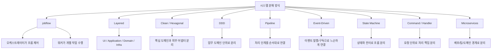

---

## 패턴별 작성 샘플

### 1. Layered Architecture

역할 계층을 기준으로 시스템을 나눈다. 일반적인 서버 애플리케이션에서 기본 구조로 쓰기 좋다.

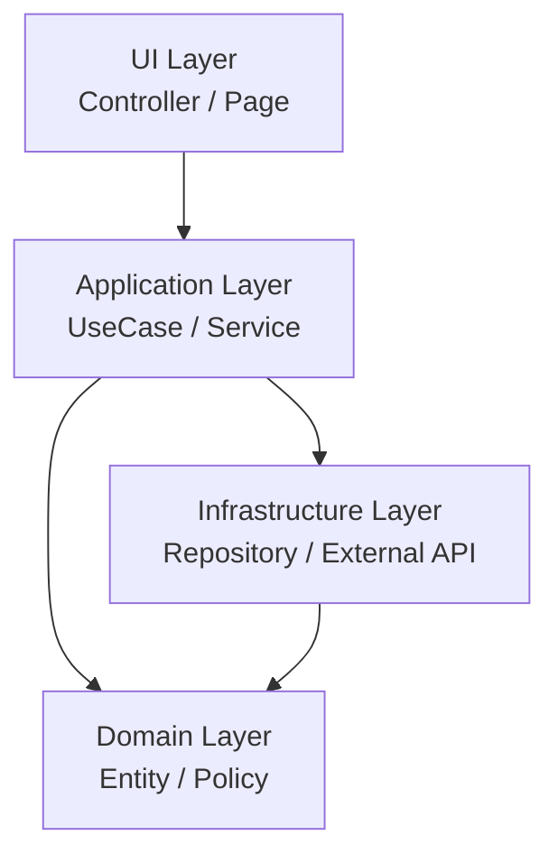

작성 가이드:

* 계층 이름은 기술명이 아니라 역할명으로 쓴다.
* `Domain`은 가능한 한 외부 기술에 의존하지 않게 표현한다.
* 실제 요청 흐름은 별도 `jobflow`로 한 단계 더 풀어 쓴다.

---

### 2. Clean Architecture / Hexagonal Architecture

의존성 방향을 기준으로 시스템을 나눈다. 핵심 도메인과 유스케이스를 중앙에 두고, DB/API/UI 같은 외부 요소는 어댑터로 분리한다.

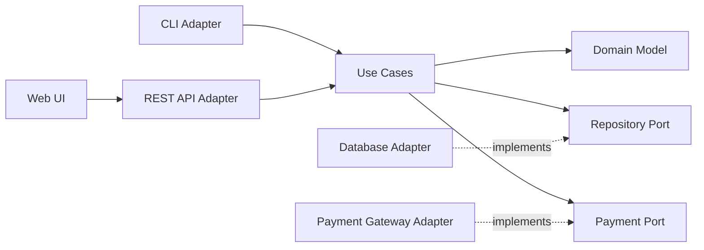

작성 가이드:

* 안쪽 노드는 `Domain`, `UseCase`, `Port`처럼 정책과 인터페이스로 표현한다.
* 바깥쪽 노드는 `Adapter`, `Gateway`, `Controller`처럼 기술 접점으로 표현한다.
* 점선은 구현 관계, 실선은 런타임 호출 방향으로 구분하면 읽기 쉽다.

---

### 3. DDD Bounded Context

업무 의미를 기준으로 시스템을 나눈다. 객체나 함수보다 큰 단위인 **업무 경계**를 먼저 잡는다.

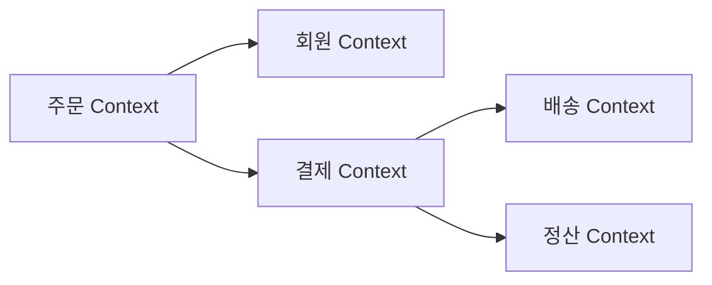

작성 가이드:

* Context 이름은 팀이나 DB 이름이 아니라 업무 언어로 정한다.
* Context 사이에는 데이터베이스 테이블 공유가 아니라 API, 이벤트, 메시지 같은 통신 경계를 둔다.
* Context 내부 구조는 Clean Architecture 또는 Layered Architecture로 다시 설계한다.

---

### 4. Component-Based Architecture

재사용 가능한 부품을 기준으로 시스템을 나눈다. UI, 게임, 플러그인형 시스템에서 특히 유용하다.

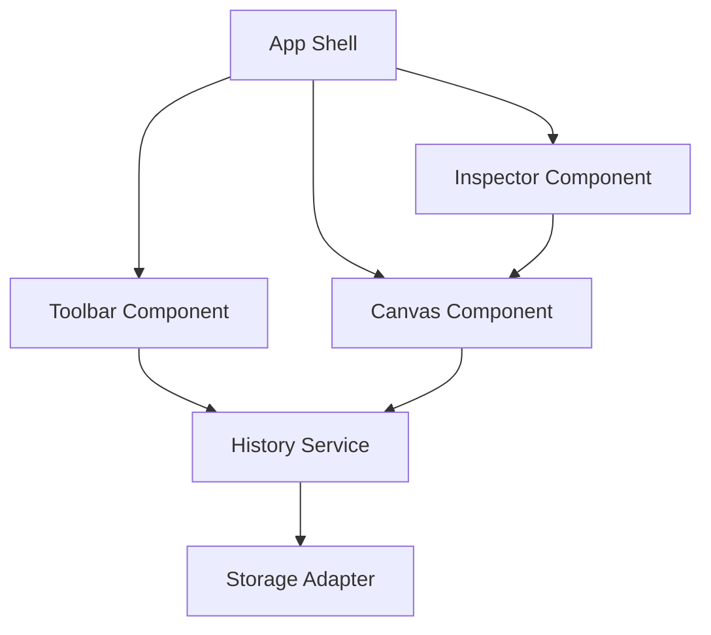

작성 가이드:

* 각 컴포넌트는 입력, 출력, 이벤트를 명확히 가진 독립 부품으로 표현한다.
* 공유 상태가 많아지면 컴포넌트 경계가 무너진다. 공유 상태는 별도 Service나 Store로 분리한다.
* 컴포넌트 내부의 복잡한 동작은 별도 `jobflow`로 세분화한다.

---

### 5. Pipeline / Filter Pattern

처리 단계를 기준으로 시스템을 나눈다. 데이터가 단계별로 변환되는 구조이므로 `jobflow`의 `A.result --> B` 표현과 잘 맞다.

```jobflow
master: PipelineRunner
Object: PipelineRunner, Loader, Parser, Validator, Saver

PipelineRunner.Run --> Loader.Load
Loader.Load.result --> Parser.Parse
Parser.Parse.result --> Validator.Validate
Validator.Validate.result --> Saver.Save
Saver.Save.result --> PipelineRunner.Run.result
```

작성 가이드:

* 각 단계는 입력을 받아 출력으로 변환하는 단일 책임을 가진다.
* 단계 사이의 결과 전달은 `A.result --> B`로 쓴다.
* 특정 단계가 복잡하면 그 단계 자체를 다시 별도 `jobflow`의 master로 만든다.

---

### 6. Event-Driven Architecture

이벤트를 기준으로 시스템을 연결한다. 객체들이 서로를 직접 강하게 의존하기보다 이벤트 발행/구독으로 느슨하게 연결된다.

```jobflow
master: OrderOrchestrator
Object: OrderOrchestrator, OrderService, PaymentService, EmailService, LogService

OrderService.OnOrderCreated --> PaymentService.Pay
PaymentService.Pay.result --> EmailService.SendReceipt
PaymentService.Pay.result --> LogService.SavePaymentLog
```

동일 구조를 더 큰 시스템 관점에서 보면 다음처럼 표현할 수 있다.

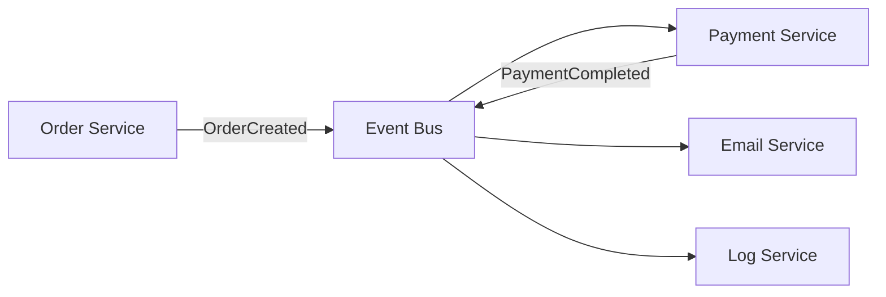

작성 가이드:

* `jobflow`에서는 특정 시나리오의 이벤트 구독 흐름을 보여준다.
* Mermaid에서는 전체 이벤트 토폴로지와 Event Bus, Topic, Consumer를 보여준다.
* 이벤트명은 과거형 도메인 사건으로 쓴다. 예: `OrderCreated`, `PaymentCompleted`.

---

### 7. Actor Model

독립 실행 주체를 기준으로 시스템을 나눈다. 각 Actor는 자기 상태와 메시지 큐를 가지고 독립적으로 동작한다.

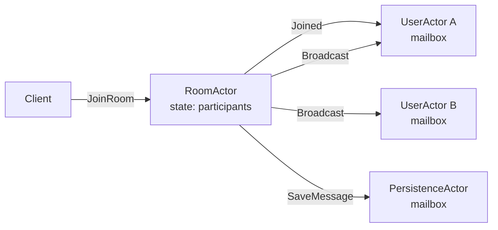

작성 가이드:

* Actor 내부 상태는 노드 안에 짧게 적는다.
* 화살표 라벨은 메서드 호출이 아니라 메시지 이름으로 쓴다.
* 동시성 제어의 핵심은 공유 메모리가 아니라 메시지 경계임을 드러낸다.

---

### 8. State Machine Pattern

상태와 상태 전이를 기준으로 로직을 나눈다. 상태 자체가 핵심 비즈니스 규칙일 때 사용한다.

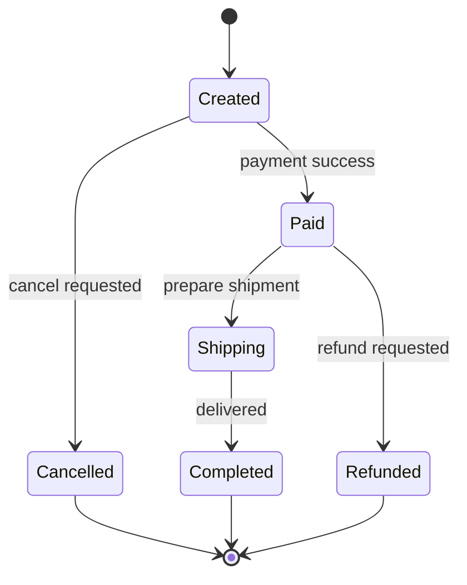

상태 전이 과정의 실행 흐름은 `jobflow`로 보완한다.

```jobflow
master: OrderStateMachine
Object: OrderStateMachine, Payment, Shipping, CancelService

OrderStateMachine.OnCreated --> Payment.Request
Payment.Request.success --> Shipping.Prepare
Payment.Request.failed --> CancelService.Cancel
```

작성 가이드:

* 상태도는 가능한 모든 상태와 전이를 보여준다.
* `jobflow`는 특정 전이가 발생했을 때 어떤 객체가 어떤 작업을 하는지 보여준다.
* 상태명은 명사 또는 과거분사, 전이 라벨은 사건이나 조건으로 쓴다.

---

### 9. Command / Handler Pattern

요청 단위를 기준으로 시스템을 나눈다. 하나의 명령을 하나의 Handler가 책임진다.

```jobflow
master: CommandBus
Object: CommandBus, CreateOrderHandler, PayOrderHandler, CancelOrderHandler

CommandBus.HandleCreateOrder --> CreateOrderHandler.Handle
CommandBus.HandlePayOrder --> PayOrderHandler.Handle
CommandBus.HandleCancelOrder --> CancelOrderHandler.Handle
```

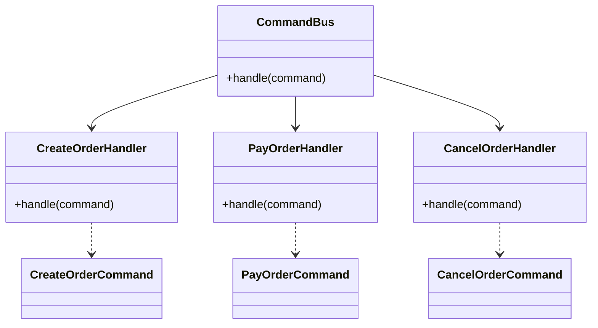

작성 가이드:

* Command는 사용자의 의도나 시스템 요청을 나타낸다.
* Handler는 하나의 Command만 처리한다.
* Handler 내부가 길어지면 Pipeline, State Machine, Saga로 다시 분해한다.

---

### 10. CQRS

읽기와 쓰기 책임을 기준으로 시스템을 나눈다. Command 모델과 Query 모델이 다르거나 조회 최적화가 중요한 경우에 쓴다.

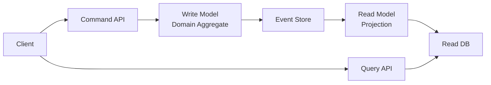

작성 가이드:

* Command 경로와 Query 경로를 한눈에 분리되게 그린다.
* Projection 지연이 있으면 eventual consistency를 문서에 명시한다.
* 단순 CRUD 시스템에는 과한 구조가 될 수 있으므로, 읽기 모델의 이점이 명확할 때 사용한다.

---

### 11. Microservices / Modular Monolith

배포 또는 모듈 경계를 기준으로 시스템을 나눈다. 큰 시스템을 팀, 도메인, 배포 단위로 관리할 때 사용한다.

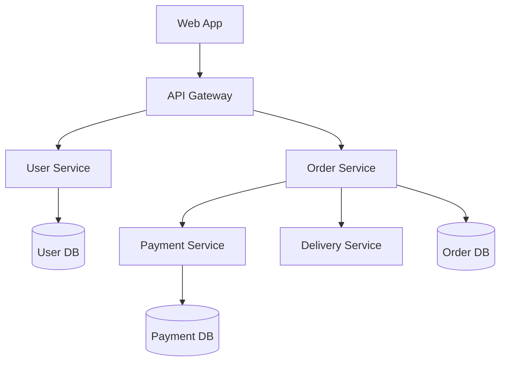

작성 가이드:

* Microservices는 배포 경계를 강조한다.
* Modular Monolith는 같은 프로세스 안의 모듈 경계를 강조한다.
* 두 경우 모두 DB 소유권과 API/Event 경계를 함께 표시해야 한다.

---

### 12. Saga Pattern

장기 트랜잭션 단계를 기준으로 시스템을 나눈다. 여러 서비스 작업을 순서대로 실행하고 실패하면 보상 작업을 수행한다.

```jobflow
master: OrderSaga
Object: OrderSaga, OrderService, PaymentService, InventoryService, DeliveryService, CompensationService

OrderSaga.Start --> OrderService.CreateOrder
OrderService.CreateOrder.result --> PaymentService.Capture
PaymentService.Capture.success --> InventoryService.Reserve
PaymentService.Capture.failed --> CompensationService.CancelOrder
InventoryService.Reserve.success --> DeliveryService.RequestDelivery
InventoryService.Reserve.failed --> CompensationService.RefundPayment
DeliveryService.RequestDelivery.result --> OrderSaga.Start.result
```

작성 가이드:

* 성공 경로와 실패 보상 경로를 반드시 함께 그린다.
* 각 단계는 멱등성을 가져야 한다.
* 보상 작업은 `Cancel`, `Refund`, `Release`처럼 원래 작업의 반대 의미가 드러나게 쓴다.

---

### 13. Microkernel / Plugin Architecture

코어와 확장을 기준으로 시스템을 나눈다. 핵심 엔진은 작게 두고 기능은 플러그인으로 추가한다.

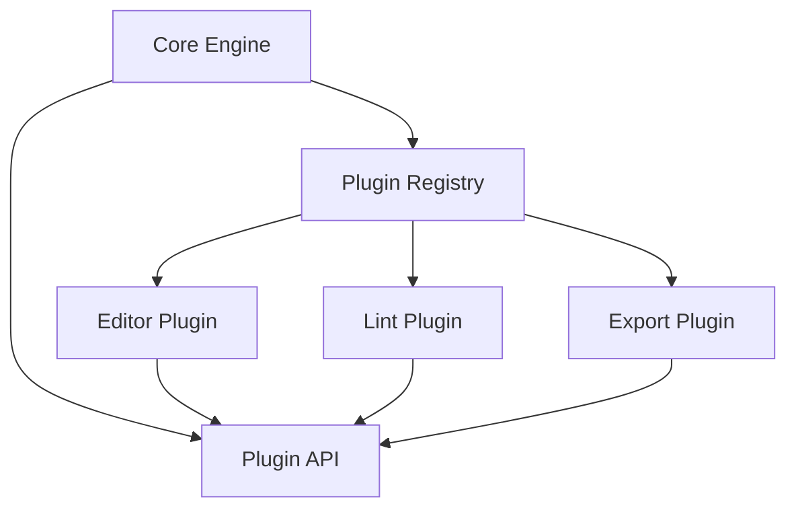

작성 가이드:

* Core는 플러그인의 구현체를 직접 알지 않게 표현한다.
* Plugin API가 안정적인 계약임을 강조한다.
* 플러그인 로딩, 권한, 생명주기는 별도 `jobflow`로 풀면 좋다.

---

### 14. Navigation Flow / Screen Flow

화면 전환, API 호출, 내부 프로세스를 기준으로 시스템을 나눈다. 사용자 시나리오와 백엔드 흐름을 함께 설명할 때 좋다.

```navigation
Home --> LoginForm
LoginForm --> (/signin)
(/signin) --> Dashboard : success
(/signin) --> LoginForm : error
```

작성 가이드:

* 화면은 `PascalCase`, API는 `(/snake_case)`로 쓴다.
* API 응답 분기는 `: success`, `: error`, `: invalid`처럼 짧게 표기한다.
* 화면 내부의 세부 배치는 `screen-layout-guide.md`의 `layout` 블록으로 분리한다.

---

## jobflow와 특히 잘 맞는 패턴

`jobflow`는 실행 흐름을 보여주는 표현 방식이므로 다음 패턴과 특히 잘 맞다.

| 패턴 | 잘 맞는 이유 |
|---|---|
| Pipeline | 단계별 결과 전달이 `A.result --> B`와 직접 대응한다. |
| Event-Driven | 이벤트 구독과 후속 작업을 `A.OnEvent --> B.Method`로 표현한다. |
| State Machine | 특정 상태 전이 이후 실행되는 작업 흐름을 보여준다. |
| Command / Handler | 요청 하나가 어떤 Handler로 라우팅되는지 간단히 표현한다. |
| Saga | 성공 경로와 실패 보상 경로를 한 흐름에서 표현한다. |

주의할 점:

* `jobflow`는 전체 아키텍처 패턴 자체라기보다 **흐름을 설명하고 세분화하는 설계 표현 방식**이다.
* DDD, Clean Architecture, Layered Architecture로 큰 구조를 잡은 뒤, 중요한 유스케이스를 `jobflow`로 풀어 쓰는 방식이 가장 자연스럽다.
* 화면 중심 시나리오는 `navigation`, 객체/메서드 중심 시나리오는 `jobflow`, 상태 중심 로직은 `state` 또는 Mermaid `stateDiagram-v2`를 우선 사용한다.

---

## 실무 조합 예시

보통 하나의 패턴만 쓰지 않고 다음처럼 조합한다.

```text
DDD로 큰 업무 경계를 나눈다
→ 각 Context 내부는 Clean Architecture로 구성한다
→ 주요 유스케이스는 Command/Handler로 나눈다
→ 복잡한 실행 흐름은 jobflow로 설명한다
→ 비동기 후속 처리는 Event-Driven으로 연결한다
```

문서 작성 순서는 다음을 권장한다.

1. **큰 경계**: DDD Bounded Context 또는 Microservices/Modular Monolith 다이어그램을 먼저 그린다.
2. **내부 구조**: 각 Context 내부를 Clean Architecture 또는 Layered Architecture로 정리한다.
3. **요청 단위**: 주요 유스케이스를 Command/Handler로 나눈다.
4. **실행 흐름**: 복잡한 유스케이스는 `jobflow`로 단계별 호출, 이벤트, 반환값을 표현한다.
5. **상태 변화**: 상태가 핵심이면 State Machine을 별도 다이어그램으로 분리한다.
6. **화면 흐름**: 사용자 화면, API, 내부 프로세스는 `navigation`으로 표현한다.

---

## 다이어그램 선택 규칙

| 보여주려는 것 | 우선 사용 |
|---|---|
| 객체 간 메서드 호출, 이벤트 구독, 반환값 전달 | `jobflow` |
| 화면 전환, API 호출, 내부 프로세스 | `navigation` |
| 객체 상태와 전이 | `state` 또는 Mermaid `stateDiagram-v2` |
| 계층, 의존성 방향, 서비스 토폴로지 | Mermaid `flowchart` |
| 클래스, 인터페이스, Handler 관계 | Mermaid `classDiagram` |
| 시간 순서가 중요한 외부 시스템 대화 | Mermaid `sequenceDiagram` |

문서에서 한 패턴을 설명할 때는 다음 3가지를 함께 적는다.

1. **분해 기준**: 무엇을 기준으로 나누는가.
2. **다이어그램**: 경계와 흐름이 어떻게 연결되는가.
3. **상세 흐름 링크**: 더 복잡한 부분은 어떤 `jobflow`, `navigation`, `state` 블록으로 내려가는가.
