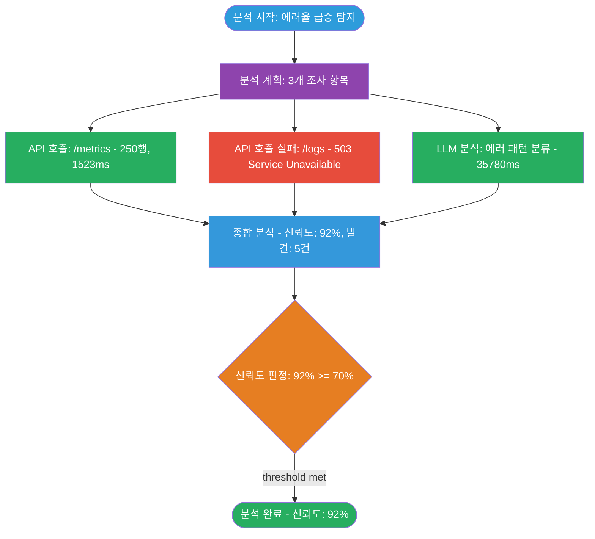

# 상세 분석 로그 시스템 구현 요청

이 프로젝트에 상세 분석 로그 시스템을 구현해줘. 아래 설명을 읽고 이 프로젝트의 도메인에 맞게 적응시켜줘.

## 작업 방식

* 자연스러운 이름의 브랜치를 생성하고 작업을 해줘.
* 이 프로젝트의 기존 코드를 먼저 분석해서, 어떤 단계들이 있는지 파악한 뒤 로그 카테고리를 설계해줘.

---

## 1. 로그 구현 방식

이 로그 시스템의 핵심 아이디어는 **2계층 로깅**이야:

### 1계층: 텍스트 로그 (`.log` 파일)

일반적인 로깅이야. 콘솔과 파일에 동시에 한 줄짜리 메시지를 남겨. 전체 흐름을 시간순으로 빠르게 훑어보는 용도야.

```
[2026-03-07 17:00:48.657] INFO  [Agent] 작업 실행 시작
[2026-03-07 17:01:24.537] INFO    [생성된 결과] 100건, 23756ms
[2026-03-07 17:01:25.704] ERROR   [결과] 실패 - Binder Error: ...
```

`logger.info()`, `logger.error()` 같은 레벨별 메서드로 호출해. DEBUG/INFO/WARN/ERROR 4단계 레벨 필터링을 지원하고, 콘솔에는 짧게 잘라서 출력하고, 파일에는 전문을 기록해.

### 2계층: 상세 로그 (하위 디렉토리의 `.md`/`.json` 파일)

한 줄 텍스트로는 담을 수 없는 구조화된 데이터를 별도 파일로 남겨. 예를 들어:

- **LLM 호출**: 시스템 프롬프트, 사용자 프롬프트, 응답 전문이 각각 수천 자인데, 이걸 텍스트 로그 한 줄에 넣을 수는 없어. 그래서 `llm/` 하위 디렉토리에 마크다운 파일로 저장해.
- **외부 API 호출**: 요청 payload, 응답 body, 헤더 등을 마크다운으로 저장.
- **상태 스냅샷**: 특정 시점의 내부 상태를 JSON으로 덤프.

**2계층 로그를 만드는 기준**: 한 줄 텍스트 메시지로 충분히 표현할 수 있는 정보는 1계층 텍스트 로그로 충분해. 하지만 입력/출력이 구조화되어 있거나, 분량이 많아서 나중에 전문을 확인해야 하는 단계는 반드시 2계층 상세 로그 파일로 남겨야 해.

### 세션 관리

모든 로깅은 **세션** 단위로 관리돼:

```python
session_id = logger.start_session()  # 세션 시작 → 디렉토리 자동 생성
# ... 작업 수행, 로그 기록 ...
logger.end_session()                 # 세션 종료 → 프로세스 다이어그램 자동 생성
```

`start_session()`을 호출하면:
1. 타임스탬프 기반 세션 디렉토리가 자동 생성됨 (`logs/YYYYMMDD-HHMMSS-NNN/`)
2. 그 안에 카테고리별 하위 디렉토리가 생성됨
3. 세션 전체 텍스트 로그 파일이 열림

`end_session()`을 호출하면:
1. 수집된 프로세스 이벤트로 Mermaid 다이어그램을 자동 생성
2. 로그 파일을 닫음

### 파일명 컨벤션

모든 상세 로그 파일은 이 패턴을 따라. 디렉토리 목록만 봐도 시간순서와 성공/실패를 즉시 파악할 수 있어:

```
{YYYYMMDD-HHMMSS}_{세션ID앞8자}_{카테고리}_{순번3자리}_{ok|err}.md
```

예시:
```
20260307-170124_147f180b_llm_001_ok.md     <- LLM 호출 #1, 성공
20260307-170125_147f180b_llm_002_err.md    <- LLM 호출 #2, 실패
20260307-170138_147f180b_api_001_ok.md     <- API 호출 #1, 성공
```

### 환경변수 설정

| 환경변수 | 기본값 | 설명 |
|---------|--------|------|
| `DEBUG_MODE` | `false` | `true`여야 로그가 출력됨 |
| `LOG_TO_FILE` | `false` | `true`여야 파일에 기록됨 |
| `LOG_DIR` | `logs` | 로그 디렉토리 경로 |
| `LOG_LEVEL` | `INFO` | DEBUG/INFO/WARN/ERROR |

### 자동 정리

7일 이상 된 로그 파일은 세션 시작 시 자동으로 삭제돼. 빈 하위 디렉토리도 함께 정리해.

---

## 2. 로그 디렉토리 구조

세션 하나가 만들어내는 디렉토리 구조야. 이 프로젝트에 맞게 하위 디렉토리 이름을 변경해줘.

```
logs/
  ├── 20260307-165633.log                          <- 세션 외부 텍스트 로그
  │
  ├── 20260307-170047-001/                         <- 세션 디렉토리 (자동 증분 시퀀스)
  │   ├── 20260307-170047_147f180b.log             <- 세션 전체 텍스트 로그 (1계층)
  │   │
  │   ├── llm/                                     <- [2계층] LLM 호출 상세
  │   │   ├── 20260307-170124_147f180b_llm_001_ok.md
  │   │   ├── 20260307-170138_147f180b_llm_002_ok.md
  │   │   └── ...
  │   │
  │   ├── {카테고리}/                               <- [2계층] 이 프로젝트 고유 카테고리
  │   │   ├── 20260307-170125_147f180b_{카테고리}_001_err.md
  │   │   └── ...
  │   │
  │   ├── state/                                   <- [2계층] 상태 스냅샷 (JSON)
  │   │   └── 20260307-170704_147f180b_state_store.json
  │   │
  │   └── process/                                 <- [2계층] 프로세스 플로우 다이어그램
  │       └── 20260307-170706_147f180b_process.md
  │
  └── 20260307-171211-001/                         <- 다음 세션 디렉토리
      └── ...
```

**하위 디렉토리 설계 기준**:
- `llm/`: LLM 호출이 있는 프로젝트라면 그대로 유지. 프롬프트와 응답 전문을 마크다운으로 저장.
- `{카테고리}/`: 이 프로젝트에서 2계층 로그가 필요한 단계를 파악해서 디렉토리명을 정해줘. 예를 들어 외부 API 호출이 핵심이면 `api/`, 데이터 변환이 핵심이면 `transform/` 등.
- `state/`: 내부 상태를 스냅샷으로 남기는 디렉토리. 프로젝트에 따라 불필요할 수 있어.
- `process/`: 프로세스 시각화 다이어그램. 항상 유지.

---

## 3. 카테고리별 상세 로그 예시

### LLM 호출 로그 (`llm/..._llm_001_ok.md`)

LLM을 호출하는 프로젝트라면 이 형식을 그대로 써. 시스템 프롬프트, 사용자 프롬프트, 응답 전문을 모두 기록해서, 나중에 "왜 이런 결과가 나왔지?" 할 때 프롬프트부터 추적할 수 있어.

```markdown
# LLM Request #1

## 메타 정보

| 항목 | 값 |
|------|-----|
| 시간 | 2026-03-07 17:01:24.535 |
| 세션 ID | 147f180b-0f18-4c92-850a-533e88dafd1f |
| Provider | openai |
| 모델 | gpt-4o |
| 소요 시간 | 35780.65ms |
| 결과 | 성공 |

## 시스템 프롬프트

```
당신은 데이터 분석 전문가입니다...
```

## 사용자 프롬프트

```
아래 데이터를 분석하세요...
```

## LLM 응답

```
분석 결과: ...
```
```

호출 코드:
```python
artifact_path = logger.log_llm_request(
    model="gpt-4o",
    system_prompt="당신은 데이터 분석 전문가입니다...",
    user_prompt="아래 데이터를 분석하세요...",
    response="분석 결과: ...",
    duration_ms=35780.65,
    error=None,           # 실패 시 에러 메시지
    provider="openai"
)
# -> llm/20260307-170124_147f180b_llm_001_ok.md 에 저장됨
# -> artifact_path를 log_process_event()에 전달하면 다이어그램에서 링크됨
```

### 외부 호출 로그 (예: `api/..._api_001_err.md`)

외부 시스템 호출(API, DB 쿼리, 파일 처리 등)도 같은 패턴으로 만들어. 요청과 응답의 전문을 기록하고, 에러 시 에러 메시지도 포함해.

```markdown
# API Call #3

## 메타 정보

| 항목 | 값 |
|------|-----|
| 시간 | 2026-03-07 17:02:15.123 |
| 세션 ID | 147f180b-0f18-4c92-850a-533e88dafd1f |
| 소요 시간 | 1523.45ms |
| 결과 | 실패 |

## 요청

```
POST /api/v1/analyze
Content-Type: application/json

{"query": "error rate last 1h", "filters": {...}}
```

## 에러

```
HTTP 503 Service Unavailable
{"error": "upstream timeout after 30s"}
```
```

### 상태 스냅샷 (`state/..._state_store.json`)

특정 시점의 내부 상태를 JSON으로 덤프해. 디버깅할 때 "이 시점에 내부 상태가 어땠지?"를 확인할 수 있어.

```json
{
  "meta": {
    "timestamp": "2026-03-07 17:07:04.427",
    "session_id": "7e863a2c-ed23-4e5d-8b3c-8b5bf0aad92d",
    "trigger": "store",
    "total_items": 3
  },
  "items": [
    {
      "source": "analysis_result",
      "description": "1차 분석 완료",
      "score": 0.95,
      "metadata": { "type": "conclusion", "confidence": 0.95 }
    }
  ]
}
```

---

## 4. 프로세스 시각화 (Mermaid 다이어그램)

세션 동안 `log_process_event()`로 이벤트를 수집하면, `end_session()` 때 자동으로 Mermaid flowchart가 생성돼. 요청부터 결론까지 어떤 프로세스를 거쳤는지 한눈에 볼 수 있어.

### 이벤트 기록 방법

각 주요 단계에서 이벤트를 기록해:

```python
# 시작
logger.log_process_event(
    phase="start", event_type="start",
    node_label="분석 시작: 에러율 급증 탐지"
)

# 전략 수립
logger.log_process_event(
    phase="strategy", event_type="start",
    node_label="분석 계획: 3개 조사 항목",
    iteration=1
)

# 실행 (성공)
logger.log_process_event(
    phase="execution", event_type="step_ok",
    node_label="API 호출: /metrics - 250행, 1523ms",
    artifact_path="api/20260307-170215_147f180b_api_001_ok.md",  # 상세 로그 링크
    iteration=1, duration_ms=1523
)

# 실행 (실패)
logger.log_process_event(
    phase="execution", event_type="step_err",
    node_label="API 호출 실패: /logs - 503 Service Unavailable",
    artifact_path="api/20260307-170220_147f180b_api_002_err.md",
    iteration=1
)

# 종합
logger.log_process_event(
    phase="synthesis", event_type="end",
    node_label="종합 분석 - 신뢰도: 92%, 발견: 5건",
    confidence=0.92, findings_count=5
)

# 판정 (분기)
logger.log_process_event(
    phase="decision", event_type="branch_ok",  # 또는 branch_fail
    node_label="신뢰도 판정: 92% >= 70%",
    confidence=0.92
)

# 종료
logger.log_process_event(
    phase="end", event_type="end",
    node_label="분석 완료 - 신뢰도: 92%",
    confidence=0.92
)
```

### phase와 event_type

| phase | 설명 | 노드 모양 |
|-------|------|----------|
| `start` | 시작 | 둥근 사각형 `([...])` |
| `strategy` | 전략/계획 수립 | 사각형 `[...]` |
| `execution` | 실제 작업 수행 | 사각형 `[...]` |
| `synthesis` | 결과 종합 | 사각형 `[...]` |
| `decision` | 분기 판정 | 마름모 `{...}` |
| `end` | 종료 | 둥근 사각형 `([...])` |

| event_type | 설명 | CSS 클래스 |
|------------|------|-----------|
| `start` | 시작 | start (파랑) |
| `end` | 종료 | end_ok (초록) |
| `step_ok` | 단계 성공 | step_ok (초록) |
| `step_err` | 단계 실패 | step_err (빨강) |
| `branch_ok` | 조건 충족 | decision (주황) |
| `branch_fail` | 조건 미달 | decision (주황) |
| `error` | 에러 | end_fail (빨강) |

이 phase와 event_type은 이 프로젝트의 파이프라인에 맞게 바꿔줘.

### 자동 렌더링 규칙

- **fan-out**: `strategy` 노드에서 같은 iteration의 `execution` 노드들로 병렬 분기
- **fan-in**: `execution` 노드들에서 `synthesis` 노드로 합류
- **분기 엣지**: `decision`에서 `branch_ok`이면 `end`로, `branch_fail`이면 다음 `strategy`로
- **아티팩트 링크**: `artifact_path`가 있는 노드는 클릭하면 해당 상세 로그 파일로 이동

### 생성되는 다이어그램 예시

```
분석시작 --> 기본 연관자료 조회
기본 연관자료 조회 --> 분석
분석 --> 전후 1시간 CPU 사용량 조회
전후 1시간 CPU 사용량 조회 --> 결론 : 자료 충분
전후 1시간 CPU 사용량 조회 --> 전후 5분간 이상 로그 패턴 조회 : 자료 부족
```

실제 생성되는 Mermaid 코드:



다이어그램 파일에는 세션 메타 정보 테이블과 아티팩트 링크 목록도 함께 포함돼:

```markdown
# Process Flow

| 항목 | 값 |
|------|-----|
| Session ID | `147f180b` |
| 시작 시각 | 2026-03-07 17:00:48 |
| 종료 시각 | 2026-03-07 17:07:04 |
| 소요 시간 | 375.8s |

(위의 mermaid 코드 블록)

## Artifacts

| Node | Type | Path |
|------|------|------|
| N2 | step_ok | `api/20260307-170215_147f180b_api_001_ok.md` |
| N3 | step_err | `api/20260307-170220_147f180b_api_002_err.md` |
| N4 | step_ok | `llm/20260307-170124_147f180b_llm_001_ok.md` |
```

---

## 5. 코드 구현 가이드

### 파일 구성

2개 파일로 구성해:

| 파일 | 역할 |
|------|------|
| `process_event.py` | `ProcessEvent` 데이터클래스 + `MermaidRenderer` 클래스 |
| `Logger.py` | 싱글톤 로거 본체 (1계층 텍스트 로그 + 2계층 상세 로그 + 프로세스 이벤트) |

### 구현 순서

1. **코드 분석**: 이 프로젝트의 파이프라인을 파악해서, 어떤 단계가 있고, 어떤 단계에 2계층 상세 로그가 필요한지 결정
2. **process_event.py 구현**: `ProcessEvent` 데이터클래스와 `MermaidRenderer` 구현
3. **Logger.py 구현**: 싱글톤 로거에 1계층 텍스트 로그 + 2계층 카테고리별 메서드 + 프로세스 이벤트 수집 구현
4. **기존 코드에 통합**: 진입점에 `start_session()`/`end_session()`, 각 단계에 로그 호출 삽입

### 통합 시 주의사항

- 진입점에서 `start_session()` / `end_session()` 호출
- 각 주요 처리 단계에서 해당 카테고리의 로그 메서드 호출 (반환값인 `artifact_path`를 보관)
- 각 단계에서 `log_process_event()` 호출 (위에서 받은 `artifact_path`를 전달)
- 기존 `print`문이 있으면 `logger.info()` 등으로 교체
- 설정 주입은 이 프로젝트의 설정 방식에 맞게 조정. 없으면 환경변수 직접 읽기로 구현.

### 유지할 설계 원칙

- **싱글톤 패턴**: 어디서든 `from ... import logger`로 같은 인스턴스 사용
- **모듈 레벨 편의 함수**: `logger.info()` 외에 `from ... import info` 로도 호출 가능
- **로그 메서드의 반환값**: 2계층 메서드는 저장된 파일 경로를 반환 → `log_process_event()`의 `artifact_path`로 전달
- **fail-safe**: 로그 저장 실패가 메인 로직을 중단시키면 안 됨. 모든 I/O를 try-except로 감싸줘.

---

## 6. 레퍼런스 소스 코드

아래는 실제 동작하는 레퍼런스 구현의 전체 소스 코드야. 이 코드를 복사해서 쓰는 게 아니라, 구조와 패턴을 이해하고 이 프로젝트에 맞게 재구현해줘.

### 파일 1: `process_event.py`

```python
from __future__ import annotations

import os
import time
from dataclasses import dataclass, field
from typing import List, Optional


@dataclass
class ProcessEvent:
    """분석 파이프라인의 단일 단계를 기록하는 데이터클래스."""

    timestamp: float  # time.time()
    phase: str        # "start", "strategy", "coordination", "execution", "synthesis", "decision", "end"
    event_type: str   # "start", "end", "step_ok", "step_err", "branch_ok", "branch_fail", "error", "cancel"
    node_label: str   # 구체적인 설명 (한국어 가능)
    metadata: dict = field(default_factory=dict)
    # metadata 키: artifact_path, duration_ms, rows_returned, condition,
    #              iteration, error_message, intent_count, confidence, findings_count


class MermaidRenderer:
    """ProcessEvent 목록을 Mermaid 플로우차트 마크다운 문서로 변환하는 클래스."""

    _NODE_PREFIX = "N"

    @staticmethod
    def _sanitize_label(text: str, max_len: int = 80) -> str:
        """Mermaid 레이블에 사용할 수 없는 특수문자를 안전한 문자로 치환."""
        text = text.replace('"', "'")
        text = text.replace("(", "[").replace(")", "]")
        text = text.replace("{", "[").replace("}", "]")
        text = text.replace("|", "/")
        text = text.replace("#", "No.")
        text = text.replace(";", ",")
        text = text.replace("<", "&lt;").replace(">", "&gt;")
        text = text.replace("\n", "<br/>")
        if len(text) > max_len:
            text = text[:max_len] + "..."
        return text

    @staticmethod
    def _node_shape(phase: str, label: str) -> str:
        """phase에 따라 Mermaid 노드 형태 문자열 반환."""
        if phase in ("start", "end"):
            return f'(["{label}"])'
        elif phase == "decision":
            return '{"' + label + '"}'
        else:
            return f'["{label}"]'

    def render(
        self,
        events: List[ProcessEvent],
        session_id: str = "",
        log_dir: str = "",
    ) -> str:
        """ProcessEvent 목록을 완전한 마크다운 문서로 렌더링."""
        if not events:
            return "No process events recorded."

        # --- 세션 메타 정보 ---
        start_ts = events[0].timestamp
        end_ts = events[-1].timestamp
        duration_sec = end_ts - start_ts

        start_time_str = time.strftime("%Y-%m-%d %H:%M:%S", time.localtime(start_ts))
        end_time_str = time.strftime("%Y-%m-%d %H:%M:%S", time.localtime(end_ts))
        duration_str = f"{duration_sec:.1f}s"

        # --- 노드 ID 할당 ---
        node_ids: List[str] = [f"{self._NODE_PREFIX}{i}" for i in range(len(events))]

        # --- Mermaid 라인 구성 ---
        lines: List[str] = []

        # classDef 스타일 정의
        lines += [
            "classDef start      fill:#2d9cdb,color:#fff;",
            "classDef strategy   fill:#8e44ad,color:#fff;",
            "classDef step_ok    fill:#27ae60,color:#fff;",
            "classDef step_err   fill:#e74c3c,color:#fff;",
            "classDef synthesis  fill:#3498db,color:#fff;",
            "classDef decision   fill:#e67e22,color:#fff;",
            "classDef end_ok     fill:#27ae60,color:#fff;",
            "classDef end_fail   fill:#e74c3c,color:#fff;",
            "",
        ]

        # 노드 정의
        for idx, ev in enumerate(events):
            nid = node_ids[idx]
            label = self._sanitize_label(ev.node_label)
            shape = self._node_shape(ev.phase, label)
            lines.append(f"{nid}{shape}")

        lines.append("")

        # --- 엣지 로직 (fan-out / fan-in) ---
        iter_exec_nodes: dict[int, List[str]] = {}
        iter_strategy_node: dict[int, str] = {}
        synthesis_nodes: List[str] = []

        for idx, ev in enumerate(events):
            it = ev.metadata.get("iteration", 0)
            if ev.phase == "strategy":
                iter_strategy_node[it] = node_ids[idx]
            elif ev.phase == "execution":
                iter_exec_nodes.setdefault(it, []).append(node_ids[idx])
            elif ev.phase == "synthesis":
                synthesis_nodes.append(node_ids[idx])

        connected: set[tuple[str, str, str]] = set()

        def add_edge(src: str, dst: str, label: str = "") -> None:
            if label:
                unlabeled_key = (src, dst, "")
                if unlabeled_key in connected:
                    connected.discard(unlabeled_key)
                    plain = f"{src} --> {dst}"
                    while plain in lines:
                        lines.remove(plain)
            key = (src, dst, label)
            if key in connected:
                return
            connected.add(key)
            if label:
                lines.append(f'{src} -->|"{label}"| {dst}')
            else:
                lines.append(f"{src} --> {dst}")

        prev_node: Optional[str] = None

        for idx, ev in enumerate(events):
            nid = node_ids[idx]
            it = ev.metadata.get("iteration", 0)

            if ev.phase == "start":
                prev_node = nid
            elif ev.phase == "strategy":
                if prev_node:
                    add_edge(prev_node, nid)
                prev_node = nid
            elif ev.phase in ("coordination",):
                if prev_node:
                    add_edge(prev_node, nid)
                prev_node = nid
            elif ev.phase == "execution":
                strategy_nid = iter_strategy_node.get(it)
                if strategy_nid:
                    add_edge(strategy_nid, nid)
                elif prev_node:
                    add_edge(prev_node, nid)
            elif ev.phase == "synthesis":
                exec_nodes = iter_exec_nodes.get(it, [])
                if exec_nodes:
                    for en in exec_nodes:
                        add_edge(en, nid)
                elif prev_node:
                    add_edge(prev_node, nid)
                prev_node = nid
            elif ev.phase == "decision":
                if prev_node:
                    add_edge(prev_node, nid)
                prev_node = nid
            elif ev.phase == "end":
                if prev_node:
                    add_edge(prev_node, nid)
                prev_node = nid

        # decision 분기 엣지 후처리
        for idx, ev in enumerate(events):
            nid = node_ids[idx]
            if ev.phase == "decision":
                if ev.event_type == "branch_ok":
                    end_nid = _find_next_end(events, node_ids, idx)
                    if end_nid:
                        add_edge(nid, end_nid, "threshold met")
                elif ev.event_type == "branch_fail":
                    next_strategy = _find_next_strategy(events, node_ids, idx)
                    if next_strategy:
                        add_edge(nid, next_strategy, "below threshold")

        lines.append("")

        # --- 스타일 클래스 할당 ---
        for idx, ev in enumerate(events):
            nid = node_ids[idx]
            css_class = _resolve_css_class(ev)
            lines.append(f"class {nid} {css_class};")

        lines.append("")

        # --- Click 링크 (아티팩트 경로) ---
        artifact_rows: List[tuple[str, str, str]] = []

        for idx, ev in enumerate(events):
            art_path = ev.metadata.get("artifact_path", "")
            if art_path:
                nid = node_ids[idx]
                rel_path = os.path.relpath(art_path, log_dir) if log_dir else art_path
                lines.append(f'click {nid} "{rel_path}" "Open artifact"')
                artifact_rows.append((nid, ev.event_type, rel_path))

        # --- 마크다운 문서 조합 ---
        doc_parts: List[str] = []

        doc_parts.append("# Process Flow\n")
        doc_parts.append("| 항목 | 값 |")
        doc_parts.append("|------|-----|")
        doc_parts.append(f"| Session ID | `{session_id or '-'}` |")
        doc_parts.append(f"| 시작 시각 | {start_time_str} |")
        doc_parts.append(f"| 종료 시각 | {end_time_str} |")
        doc_parts.append(f"| 소요 시간 | {duration_str} |")
        doc_parts.append("")

        doc_parts.append("```mermaid")
        doc_parts.append("flowchart TD")
        for line in lines:
            doc_parts.append(f"    {line}" if line else "")
        doc_parts.append("```")
        doc_parts.append("")

        if artifact_rows:
            doc_parts.append("## Artifacts\n")
            doc_parts.append("| Node | Type | Path |")
            doc_parts.append("|------|------|------|")
            for nid, etype, path in artifact_rows:
                doc_parts.append(f"| {nid} | {etype} | `{path}` |")
            doc_parts.append("")

        return "\n".join(doc_parts)


def _find_next_strategy(
    events: List[ProcessEvent], node_ids: List[str], after: int
) -> Optional[str]:
    for i in range(after + 1, len(events)):
        if events[i].phase == "strategy":
            return node_ids[i]
    return None


def _find_next_end(
    events: List[ProcessEvent], node_ids: List[str], after: int
) -> Optional[str]:
    for i in range(after + 1, len(events)):
        if events[i].phase == "end":
            return node_ids[i]
    return None


def _resolve_css_class(ev: ProcessEvent) -> str:
    if ev.phase == "start":
        return "start"
    if ev.phase == "strategy":
        return "strategy"
    if ev.phase == "execution":
        return "step_ok" if ev.event_type == "step_ok" else "step_err"
    if ev.phase == "synthesis":
        return "synthesis"
    if ev.phase == "decision":
        return "decision"
    if ev.phase == "end":
        if ev.event_type in ("cancel", "error", "branch_fail"):
            return "end_fail"
        return "end_ok"
    return "start"
```

### 파일 2: `Logger.py`

```python
import json
import os
import time
from datetime import datetime
from pathlib import Path
from typing import Optional, TextIO, List

from .process_event import ProcessEvent, MermaidRenderer


class Logger:
    _instance = None

    def __new__(cls):
        if cls._instance is None:
            cls._instance = super(Logger, cls).__new__(cls)
            cls._instance._initialized = False
        return cls._instance

    def __init__(self):
        if self._initialized:
            return
        self._initialized = True
        self._log_file: Optional[TextIO] = None
        self._log_file_path: Optional[str] = None
        self._session_id: Optional[str] = None
        self._process_events: List[ProcessEvent] = []
        self._session_start_time: Optional[float] = None
        self._request_log_dir: Optional[Path] = None
        self._mermaid_renderer = MermaidRenderer()
        # 카테고리별 카운터 (이 프로젝트에 맞게 추가/변경)
        self._llm_request_count: int = 0
        # 설정 (이 프로젝트의 설정 방식에 맞게 변경)
        self._log_level = self._parse_log_level(os.getenv("LOG_LEVEL", "INFO"))
        self._to_file = os.getenv("LOG_TO_FILE", "false").lower() == "true"
        self._log_dir_path = os.getenv("LOG_DIR", "logs")
        self._debug_mode = os.getenv("DEBUG_MODE", "false").lower() == "true"

    # --- 내부 유틸리티 ---

    def _parse_log_level(self, level: str) -> int:
        levels = {"DEBUG": 0, "INFO": 1, "WARNING": 2, "WARN": 2, "ERROR": 3}
        return levels.get(level.upper(), 1)

    def _should_log(self, level: int = 1) -> bool:
        if not self._debug_mode:
            return False
        return level >= self._log_level

    def _get_timestamp(self) -> str:
        return datetime.now().strftime("%H:%M:%S")

    def _get_full_timestamp(self) -> str:
        return datetime.now().strftime("%Y-%m-%d %H:%M:%S.%f")[:-3]

    def _truncate_message(self, message: str, max_length: int = 64) -> str:
        if len(message) > max_length:
            return message[:max_length] + "..."
        return message

    def _ensure_log_dir(self) -> Path:
        log_dir = Path(self._log_dir_path)
        if not log_dir.is_absolute():
            log_dir = Path(os.getcwd()) / log_dir
        log_dir.mkdir(parents=True, exist_ok=True)
        return log_dir

    def _cleanup_old_logs(self, max_age_days: int = 7):
        try:
            log_dir = self._ensure_log_dir()
            cutoff = time.time() - (max_age_days * 86400)
            removed = 0
            for file_path in log_dir.rglob("*"):
                if file_path.is_file() and file_path.stat().st_mtime < cutoff:
                    file_path.unlink()
                    removed += 1
            for dir_path in sorted(log_dir.rglob("*"), reverse=True):
                if dir_path.is_dir() and not any(dir_path.iterdir()):
                    dir_path.rmdir()
            if removed > 0:
                self.info(f"[Logger] Cleaned up {removed} log file(s) older than {max_age_days} days")
        except Exception as e:
            self.warning(f"Log cleanup failed: {e}")

    def _write_to_file(self, message: str):
        if not self._to_file or self._log_file is None:
            return
        try:
            self._log_file.write(message + "\n")
            self._log_file.flush()
        except Exception:
            pass

    def _close_file(self):
        if self._log_file is not None:
            try:
                self._log_file.close()
            except Exception:
                pass
            self._log_file = None

    # --- 세션 관리 ---

    def start_session(self, session_id: Optional[str] = None) -> str:
        if self._to_file:
            self._close_file()
            self._cleanup_old_logs()

            self._session_id = session_id
            self._llm_request_count = 0
            self._process_events = []
            self._session_start_time = time.time()
            log_dir = self._ensure_log_dir()
            timestamp = datetime.now().strftime("%Y%m%d-%H%M%S")

            if not session_id:
                self._session_id = timestamp

            # 자동 증분 시퀀스 디렉토리
            seq = 1
            while (log_dir / f"{timestamp}-{seq:03d}").exists():
                seq += 1
            self._request_log_dir = log_dir / f"{timestamp}-{seq:03d}"

            # 카테고리별 하위 디렉토리 생성 (이 프로젝트에 맞게 변경)
            for subdir in ("llm", "state", "process"):
                (self._request_log_dir / subdir).mkdir(parents=True, exist_ok=True)

            if session_id:
                filename = f"{timestamp}_{session_id[:8]}.log"
            else:
                filename = f"{timestamp}.log"

            self._log_file_path = str(self._request_log_dir / filename)
            try:
                self._log_file = open(self._log_file_path, "w", encoding="utf-8")
                self._write_to_file(f"=== Session Started: {self._get_full_timestamp()} ===")
                self._write_to_file(f"Session ID: {self._session_id}")
                self._write_to_file("=" * 60)
            except Exception as e:
                print(f"[{self._get_timestamp()}] WARN  Failed to create log file: {e}")
                self._log_file = None

        return self._session_id or ""

    def end_session(self):
        if self._log_file is not None:
            self._write_to_file("=" * 60)
            self._write_to_file(f"=== Session Ended: {self._get_full_timestamp()} ===")
            self._save_process_diagram()
            self._close_file()
        self._session_id = None
        self._process_events = []
        self._session_start_time = None
        self._request_log_dir = None

    def get_log_file_path(self) -> Optional[str]:
        return self._log_file_path

    # --- 1계층: 텍스트 로그 ---

    def _log(self, level: str, level_num: int, message: str, end: str, flush: bool, truncate: bool):
        if not self._should_log(level_num):
            return
        display_message = self._truncate_message(message) if truncate else message
        console_msg = f"[{self._get_timestamp()}] {level} {display_message}"
        print(console_msg, end=end, flush=flush)
        if self._to_file:
            file_msg = f"[{self._get_full_timestamp()}] {level} {message}"
            self._write_to_file(file_msg)

    def debug(self, message: str, end: str = "\n", flush: bool = False, truncate: bool = False):
        self._log("DEBUG", 0, message, end, flush, truncate)

    def info(self, message: str, end: str = "\n", flush: bool = False, truncate: bool = False):
        self._log("INFO ", 1, message, end, flush, truncate)

    def warning(self, message: str, end: str = "\n", flush: bool = False, truncate: bool = False):
        self._log("WARN ", 2, message, end, flush, truncate)

    def error(self, message: str, end: str = "\n", flush: bool = False, truncate: bool = False):
        self._log("ERROR", 3, message, end, flush, truncate)

    # --- 2계층: LLM 호출 상세 로그 ---

    def log_llm_request(
        self,
        model: str,
        system_prompt: str,
        user_prompt: str,
        response: str,
        duration_ms: Optional[float] = None,
        error: Optional[str] = None,
        provider: Optional[str] = None
    ) -> Optional[str]:
        """LLM 요청/응답을 마크다운 파일로 저장. 반환값: 저장된 파일 경로."""
        if not self._to_file:
            return None

        self._llm_request_count += 1
        log_dir = (self._request_log_dir / "llm") if self._request_log_dir else (self._ensure_log_dir() / "llm")
        log_dir.mkdir(parents=True, exist_ok=True)

        timestamp = datetime.now().strftime("%Y%m%d-%H%M%S")
        session_prefix = f"{self._session_id[:8]}_" if self._session_id else ""
        status = "ok" if error is None else "err"
        filename = f"{timestamp}_{session_prefix}llm_{self._llm_request_count:03d}_{status}.md"
        file_path = log_dir / filename

        duration_str = f"{duration_ms:.2f}ms" if duration_ms else "N/A"
        status_str = "성공" if error is None else "실패"

        md_content = f"""# LLM Request #{self._llm_request_count}

## 메타 정보

| 항목 | 값 |
|------|-----|
| 시간 | {self._get_full_timestamp()} |
| 세션 ID | {self._session_id or 'N/A'} |
| Provider | {provider or 'N/A'} |
| 모델 | {model} |
| 소요 시간 | {duration_str} |
| 결과 | {status_str} |

"""
        if error:
            md_content += f"## 에러\n\n```\n{error}\n```\n\n"

        md_content += f"## 시스템 프롬프트\n\n```\n{system_prompt}\n```\n\n"
        md_content += f"## 사용자 프롬프트\n\n```\n{user_prompt}\n```\n\n"
        md_content += f"## LLM 응답\n\n```\n{response}\n```\n"

        try:
            with open(file_path, "w", encoding="utf-8") as f:
                f.write(md_content)
            return str(file_path)
        except Exception as e:
            self.warning(f"LLM 로그 저장 실패: {e}")
            return None

    # --- 2계층: 상태 스냅샷 ---

    def log_state_snapshot(
        self,
        data: dict,
        trigger: str = "store"
    ) -> Optional[str]:
        """내부 상태를 JSON 파일로 저장. 반환값: 저장된 파일 경로."""
        if not self._to_file:
            return None

        log_dir = (self._request_log_dir / "state") if self._request_log_dir else (self._ensure_log_dir() / "state")
        log_dir.mkdir(parents=True, exist_ok=True)

        timestamp = datetime.now().strftime("%Y%m%d-%H%M%S")
        session_prefix = f"{self._session_id[:8]}_" if self._session_id else ""
        filename = f"{timestamp}_{session_prefix}state_{trigger}.json"
        file_path = log_dir / filename

        snapshot = {
            "meta": {
                "timestamp": self._get_full_timestamp(),
                "session_id": self._session_id,
                "trigger": trigger
            },
            "data": data
        }

        try:
            with open(file_path, "w", encoding="utf-8") as f:
                json.dump(snapshot, f, ensure_ascii=False, indent=2, default=str)
            return str(file_path)
        except Exception as e:
            self.warning(f"스냅샷 저장 실패: {e}")
            return None

    # --- 프로세스 이벤트 ---

    def log_process_event(self, phase: str, event_type: str, node_label: str, **metadata) -> None:
        """프로세스 이벤트를 기록. end_session() 시 Mermaid 다이어그램으로 렌더링됨."""
        event = ProcessEvent(
            timestamp=time.time(),
            phase=phase,
            event_type=event_type,
            node_label=node_label,
            metadata=metadata
        )
        self._process_events.append(event)

    def _save_process_diagram(self) -> Optional[str]:
        if not self._to_file or not self._process_events:
            return None
        try:
            if self._request_log_dir is not None:
                process_dir = self._request_log_dir / "process"
                render_log_dir = str(self._request_log_dir)
            else:
                log_dir = self._ensure_log_dir()
                process_dir = log_dir / "process"
                render_log_dir = str(log_dir)
            process_dir.mkdir(parents=True, exist_ok=True)

            timestamp = datetime.now().strftime("%Y%m%d-%H%M%S")
            session_prefix = f"{self._session_id[:8]}_" if self._session_id else ""
            filename = f"{timestamp}_{session_prefix}process.md"
            file_path = process_dir / filename

            md_content = self._mermaid_renderer.render(
                events=self._process_events,
                session_id=self._session_id or "",
                log_dir=render_log_dir
            )
            with open(file_path, "w", encoding="utf-8") as f:
                f.write(md_content)
            self.info(f"[Process] Diagram saved: {file_path}")
            return str(file_path)
        except Exception as e:
            self.warning(f"프로세스 다이어그램 저장 실패: {e}")
            return None

    def __del__(self):
        self._close_file()


# --- 모듈 레벨 편의 함수 ---

logger = Logger()

def start_session(session_id=None): return logger.start_session(session_id)
def end_session(): logger.end_session()
def get_log_file_path(): return logger.get_log_file_path()
def debug(message, **kw): logger.debug(message, **kw)
def info(message, **kw): logger.info(message, **kw)
def warning(message, **kw): logger.warning(message, **kw)
def error(message, **kw): logger.error(message, **kw)
def log_llm_request(**kw): return logger.log_llm_request(**kw)
def log_state_snapshot(**kw): return logger.log_state_snapshot(**kw)
def log_process_event(phase, event_type, node_label, **metadata):
    logger.log_process_event(phase, event_type, node_label, **metadata)
```
