# Architecture Pattern Diagram Guide

아키텍처 패턴별로 **무엇을 기준으로 시스템을 나누는지** 정리하고, 그 분해 기준을 문서에서 어떤 다이어그램으로 표현할지 안내한다.

이 문서는 필요한 설계 관점을 고르고 `jobflow` / `navigation` / Mermaid를 어떤 상황에 쓸지 연결하는 참고서다. 모든 패턴·모든 예시를 읽거나 프로젝트에 적용할 필요는 없다. 책임·계약·데이터 소유권과 분해 중단 기준은 [module-boundary-guide.md](module-boundary-guide.md)를 먼저 적용하고, 현재 문제에 필요한 항목만 선택한다.

다이어그램은 설계 패턴 자체가 아니다. 실행 흐름이 단순해 보이더라도 타입·데이터·전역 상태·시간 순서에 숨은 의존성이 남을 수 있다. 각 그림은 경계, 공개 계약, 화살표 의미를 본문과 연결해야 한다. 선택한 독자 DSL은 원본으로 유지하고, 아래 Mermaid 예시는 정적 관계·상태 모델·시간 순서의 추가 관점으로 참고한다. 기존 DSL을 Mermaid로 일괄 대체하지 않는다. 기존 `master:` 예시는 보존하며, `orchestrator:`/`scope:`와의 의미·렌더러 호환은 [job-flow-diagram-guide.md](job-flow-diagram-guide.md)를 따른다.

---

## 핵심 관점

`jobflow`는 **객체/조각의 실행 흐름을 표현하는 독자 다이어그램**이다. 흐름을 검토하며 책임을 나눌 수 있지만, 단계마다 반드시 별도 모듈을 만들라는 뜻은 아니다.

오케스트레이터가 흐름을 잡고 워커가 개별 작업을 수행한다. 복잡한 워커나 모듈은 다시 별도 `jobflow`로 세분화할 수 있으므로, jobflow는 재귀적 분해와 잘 맞는다.

반면 다른 아키텍처 패턴들은 시스템을 나누는 기준이 다르다.

| 기준 | 대표 패턴 |
|---|---|
| 실행 흐름 | Pipeline, Saga (`jobflow`로 표현) |
| 역할 계층 | Layered Architecture |
| 의존성 방향 | Clean Architecture, Hexagonal Architecture |
| 업무 의미 | DDD, Bounded Context |
| 재사용 가능한 부품 | Component-Based Architecture |
| 이벤트 | Event-Driven Architecture |
| 상태 변화 | State Machine |
| 요청 단위 | Command / Handler, CQRS |
| 독립 실행 단위 | Actor Model, Microservices |
| 코어와 확장 | Microkernel / Plugin Architecture |
| 화면/사용자 흐름 | 사용자 시나리오 (`navigation`으로 표현) |

---

## 빠른 선택표

| 패턴 | 나누는 기준 | 핵심 아이디어 | 적합한 경우 | 추천 다이어그램 |
|---|---|---|---|---|
| **Layered Architecture** | 계층 | UI, Application, Domain, Infrastructure처럼 역할별 분리 | 일반적인 웹/앱 서버 구조 | Mermaid `flowchart`, `classDiagram` |
| **Clean / Hexagonal Architecture** | 의존성 방향 | 핵심 도메인을 가운데 두고 외부 DB, API, UI는 어댑터로 분리 | 외부 기술 변경에 강한 구조 | Mermaid `flowchart` |
| **DDD Bounded Context** | 업무 도메인 | 주문, 결제, 회원, 정산처럼 업무 의미 단위로 분리 | 비즈니스 규칙이 복잡한 시스템 | Mermaid `flowchart`, `C4` 스타일 |
| **Component-Based Architecture** | 재사용 가능한 부품 | 독립 컴포넌트를 만들고 인터페이스로 연결 | UI, 게임, 플러그인형 시스템 | Mermaid `flowchart`, `classDiagram` |
| **Pipeline / Filter Pattern** | 처리 단계 | 입력 데이터를 여러 단계가 순서대로 변환 | ETL, 컴파일러, 이미지 처리, LLM 체인 | `jobflow` |
| **Event-Driven Architecture** | 이벤트 | 객체가 직접 호출하지 않고 이벤트 발행/구독으로 연결 | 비동기 처리, 알림, 주문 후속 처리 | `jobflow`, Mermaid `flowchart` |
| **Actor Model** | 독립 실행 주체 | 각 Actor가 상태와 메시지 큐를 가지고 독립 동작 | 동시성, 실시간 시스템, 채팅/게임 서버 | Mermaid `flowchart` |
| **State Machine Pattern** | 상태 | 상태와 상태 전이를 중심으로 로직 분리 | 주문 상태, 세션, 워크플로우, 장비 제어 | `state`, Mermaid `stateDiagram-v2`, `jobflow` |
| **Command / Handler Pattern** | 요청 단위 | 하나의 명령을 하나의 Handler가 처리 | API 요청, 유스케이스, 작업 큐 | `jobflow`, Mermaid `classDiagram` |
| **CQRS** | 읽기/쓰기 책임 | Command와 Query 모델을 분리 | 조회가 복잡하거나 읽기/쓰기 모델이 다른 경우 | Mermaid `flowchart` |
| **Microservices / Modular Monolith** | 배포 또는 모듈 경계 | 기능을 독립 서비스 또는 독립 모듈로 분리 | 큰 시스템을 팀/도메인 단위로 관리 | Mermaid `flowchart`, `deployment` 스타일 |
| **Saga Pattern** | 장기 트랜잭션 단계 | 여러 작업을 단계별로 실행하고 실패 시 보상 작업 수행 | 결제, 예약, 주문처럼 분산 트랜잭션이 필요한 경우 | `jobflow`, Mermaid `sequenceDiagram` |
| **Microkernel / Plugin Architecture** | 코어와 확장 | 핵심 엔진은 작게 두고 기능은 플러그인으로 추가 | IDE, 에디터, 분석 도구, 확장형 플랫폼 | Mermaid `flowchart`, `classDiagram` |
| **Navigation Flow / Screen Flow** | 화면/사용자 흐름 | 화면과 이동 판단을 연결 | 사용자 시나리오 설명 | `navigation` |

---

## 선택 전 확인

- 현재 변경에서 함께 바뀌는 업무 규칙과 상태 소유자는 누구인가?
- 경계를 넘길 입력·결과·오류를 공개 계약만으로 설명할 수 있는가?
- 새 패턴이 줄이는 구체 문제와 추가하는 맥락·운영 비용은 무엇인가?
- 기존의 단순한 모듈과 함수로 해결할 수 있다면 추가 계층 없이 유지할 수 있는가?

Layered, Clean, DDD, CQRS, Microservices는 한꺼번에 도입하는 단계가 아니다. 필요한 관점만 조합하고 선택하지 않은 패턴의 빈 산출물을 만들지 않는다.

## 전체 비교 다이어그램

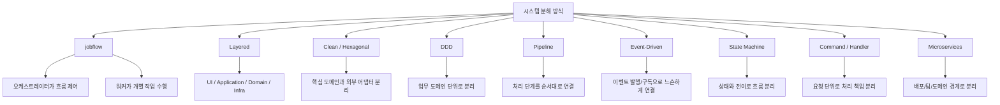

---

## 패턴별 작성 샘플

### 1. Layered Architecture

역할 계층을 기준으로 시스템을 나눈다. 일반적인 서버 애플리케이션에서 기본 구조로 쓰기 좋다.

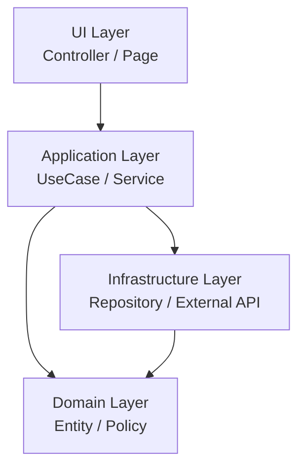

작성 가이드:

* 계층 이름은 기술명이 아니라 역할명으로 쓴다.
* `Domain`은 가능한 한 외부 기술에 의존하지 않게 표현한다.
* 계층 사이 실선은 코드 의존으로 읽는다. 실제 요청 순서가 설명에 필요할 때만 별도 `jobflow`를 연결한다.

---

### 2. Clean Architecture / Hexagonal Architecture

의존성 방향을 기준으로 시스템을 나눈다. 핵심 도메인과 유스케이스를 중앙에 두고, DB/API/UI 같은 외부 요소는 어댑터로 분리한다.

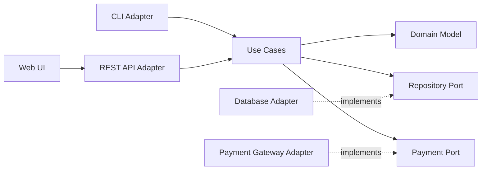

작성 가이드:

* 안쪽 노드는 `Domain`, `UseCase`, `Port`처럼 정책과 인터페이스로 표현한다.
* 바깥쪽 노드는 `Adapter`, `Gateway`, `Controller`처럼 기술 접점으로 표현한다.
* 이 그림의 실선은 코드/계약 의존, 점선은 인터페이스 구현 관계다. 런타임 호출은 주입된 구현체로 향할 수 있으므로 별도 흐름도에서 설명한다. 의존성 방향과 런타임 호출 방향을 같은 선 의미로 섞지 않는다.

---

### 3. DDD Bounded Context

업무 의미를 기준으로 시스템을 나눈다. 객체나 함수보다 큰 단위인 **업무 경계**를 먼저 잡는다.

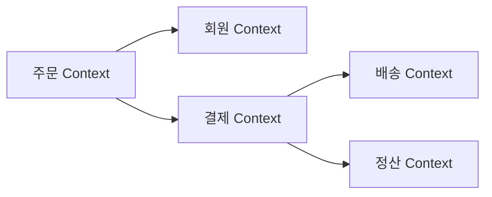

작성 가이드:

* Context 이름은 팀이나 DB 이름이 아니라 업무 언어로 정한다.
* Context 사이에는 데이터베이스 테이블 공유가 아니라 API, 이벤트, 메시지 같은 통신 경계를 둔다.
* Context 내부 구조는 복잡도에 맞게 선택한다. 별도 계층이 필요하지 않으면 작은 모듈로 유지한다. 각 Context의 상태를 쓰는 소유자와 경계를 넘는 계약을 명시한다.

---

### 4. Component-Based Architecture

재사용 가능한 부품을 기준으로 시스템을 나눈다. UI, 게임, 플러그인형 시스템에서 특히 유용하다.

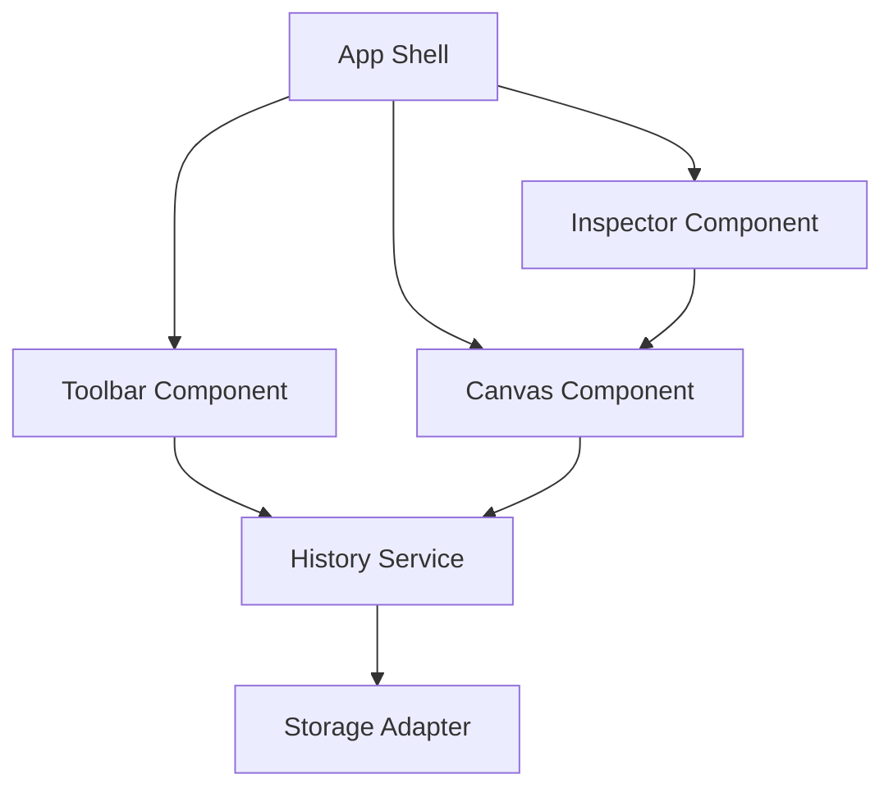

작성 가이드:

* 각 컴포넌트는 입력, 출력, 이벤트를 명확히 가진 독립 부품으로 표현한다.
* 공유 상태가 많으면 변경 책임과 소유권을 먼저 점검한다. Service/Store를 하나 더 만드는 것만으로 결합이 줄지는 않는다. 쓰기 소유자는 하나로 정하고, 소비자는 필요한 상태/명령 계약만 받는다.
* 컴포넌트 내부의 복잡한 동작은 별도 `jobflow`로 세분화한다.

---

### 5. Pipeline / Filter Pattern

처리 단계를 기준으로 시스템을 나눈다. 데이터가 단계별로 변환되는 구조이므로 `jobflow`의 `A.result --> B` 표현과 잘 맞다.

```jobflow
master: PipelineRunner
Object: PipelineRunner, Loader, Parser, Validator, Saver

PipelineRunner.Run --> Loader.Load
Loader.Load.result --> Parser.Parse
Parser.Parse.result --> Validator.Validate
Validator.Validate.result --> Saver.Save
Saver.Save.result --> PipelineRunner.Run.result
```

작성 가이드:

* 각 단계는 입력을 받아 출력으로 변환하는 단일 책임을 가진다.
* 단계 사이의 결과 전달은 `A.result --> B`로 쓴다.
* 특정 단계가 복잡하면 그 단계 자체를 다시 별도 `jobflow`의 master로 만든다.

---

### 6. Event-Driven Architecture

이벤트를 통해 사건의 발행과 후속 작업을 연결한다. 수신자 구현에 대한 직접 의존을 줄일 수 있지만 스키마·순서·시간·중복 처리에 대한 계약 의존성은 남는다.

아래 jobflow는 `OrderOrchestrator`가 이벤트를 구독해 후속 작업을 연결하는 **orchestration** 예시다. 이벤트를 사용한다고 중앙 조율자가 없는 choreography가 되는 것은 아니다.

```jobflow
master: OrderOrchestrator
Object: OrderOrchestrator, OrderService, PaymentService, EmailService, LogService

OrderService.OnOrderCreated --> PaymentService.Pay
PaymentService.Pay.result --> EmailService.SendReceipt
PaymentService.Pay.result --> LogService.SavePaymentLog
```

브로커에 구독한 서비스들이 중앙 조율자 없이 협력하는 별도 **choreography** 예시는 다음과 같다. 아래 화살표는 코드 의존성이 아니라 사건 전달이다.

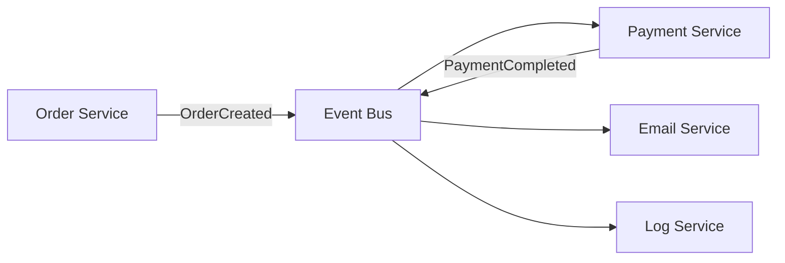

작성 가이드:

* `jobflow`에서는 특정 시나리오의 이벤트 구독 흐름을 보여준다.
* Mermaid에서는 전체 이벤트 토폴로지와 Event Bus, Topic, Consumer를 보여준다.
* 이벤트명은 과거형 도메인 사건으로 쓴다. 예: `OrderCreated`, `PaymentCompleted`.
* 필요한 순서 보장, 멱등 처리, 소비 실패·재처리, 스키마 변경의 책임을 계약에 남긴다. 전송 기술만으로 조율 방식을 판단하지 않는다.

---

### 7. Actor Model

독립 실행 주체를 기준으로 시스템을 나눈다. 각 Actor는 자기 상태와 메시지 큐를 가지고 독립적으로 동작한다.

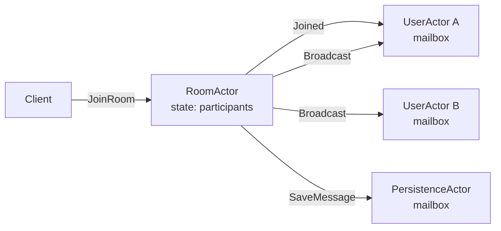

작성 가이드:

* Actor 내부 상태는 노드 안에 짧게 적는다.
* 화살표 라벨은 메서드 호출이 아니라 메시지 이름으로 쓴다.
* 동시성 제어의 핵심은 공유 메모리가 아니라 메시지 경계임을 드러낸다.

---

### 8. State Machine Pattern

상태와 상태 전이를 기준으로 로직을 나눈다. 상태 자체가 핵심 비즈니스 규칙일 때 사용한다.

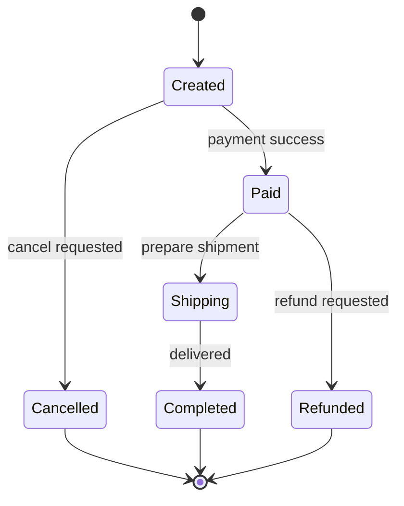

상태 전이 과정의 실행 흐름은 `jobflow`로 보완한다.

```jobflow
master: OrderStateMachine
Object: OrderStateMachine, Payment, Shipping, CancelService

OrderStateMachine.OnCreated --> Payment.Request
Payment.Request.success --> Shipping.Prepare
Payment.Request.failed --> CancelService.Cancel
```

작성 가이드:

* 상태도는 선택한 상태 소유자와 생명주기의 허용 상태·전이를 보여준다. 다른 모듈/UI의 독립 상태까지 합치지 않는다.
* `jobflow`는 특정 전이가 발생했을 때 어떤 객체가 어떤 작업을 하는지 보여준다.
* 상태명은 명사 또는 과거분사, 전이 라벨은 사건이나 조건으로 쓴다.

---

### 9. Command / Handler Pattern

요청 단위를 기준으로 시스템을 나눈다. 하나의 명령을 하나의 Handler가 책임진다.

```jobflow
master: CommandBus
Object: CommandBus, CreateOrderHandler, PayOrderHandler, CancelOrderHandler

CommandBus.HandleCreateOrder --> CreateOrderHandler.Handle
CommandBus.HandlePayOrder --> PayOrderHandler.Handle
CommandBus.HandleCancelOrder --> CancelOrderHandler.Handle
```

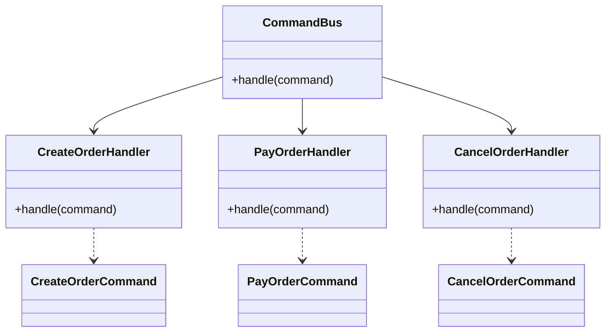

작성 가이드:

* Command는 사용자의 의도나 시스템 요청을 나타낸다.
* Handler는 하나의 Command만 처리한다.
* Handler 내부가 길어지면 Pipeline, State Machine, Saga로 다시 분해한다.

---

### 10. CQRS

읽기와 쓰기 책임을 기준으로 시스템을 나눈다. Command 모델과 Query 모델이 다르거나 조회 최적화가 중요한 경우에 쓴다.

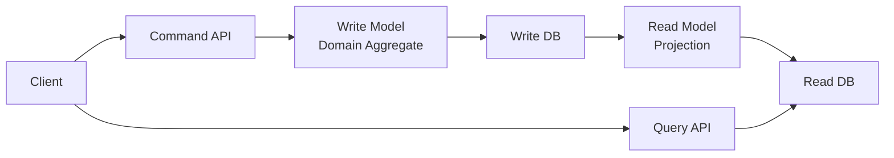

작성 가이드:

* 이 예시의 화살표는 쓰기·조회·projection 갱신의 데이터 흐름이다. Command 경로와 Query 경로를 구분한다.
* CQRS 자체가 Event Sourcing, 별도 DB, 이벤트 브로커를 요구하지는 않는다. 이 예시는 별도 읽기 모델을 갱신하는 구성이며, 갱신 책임과 일관성 요구가 있을 때 선택한다.
* Projection 지연이 있으면 eventual consistency를 문서에 명시한다.
* 단순 CRUD 시스템에는 과한 구조가 될 수 있으므로, 읽기 모델의 이점이 명확할 때 사용한다.

---

### 11. Microservices / Modular Monolith

배포 또는 모듈 경계를 기준으로 시스템을 나눈다. 큰 시스템을 팀, 도메인, 배포 단위로 관리할 때 사용한다.

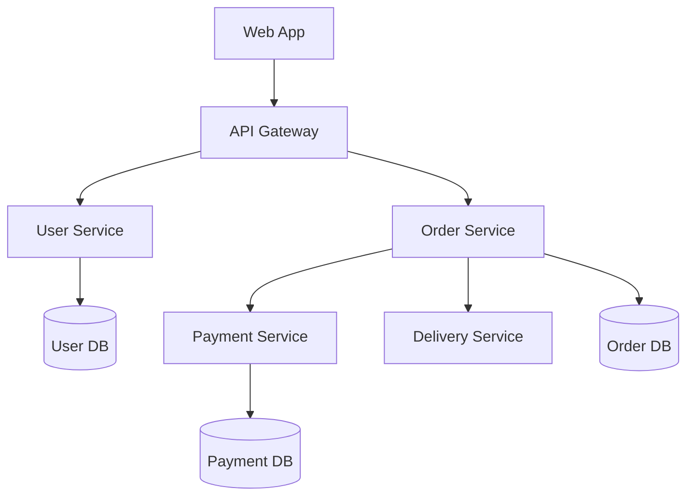

작성 가이드:

* Microservices는 배포 경계를 강조한다.
* Modular Monolith는 같은 프로세스 안의 모듈 경계를 강조한다.
* 두 경우 모두 DB 소유권과 API/Event 경계를 함께 표시해야 한다.

---

### 12. Saga Pattern

장기 트랜잭션 단계를 기준으로 시스템을 나눈다. 여러 서비스 작업을 순서대로 실행하고 실패하면 보상 작업을 수행한다.

```jobflow
master: OrderSaga
Object: OrderSaga, OrderService, PaymentService, InventoryService, DeliveryService, CompensationService

OrderSaga.Start --> OrderService.CreateOrder
OrderService.CreateOrder.result --> PaymentService.Capture
PaymentService.Capture.success --> InventoryService.Reserve
PaymentService.Capture.failed --> CompensationService.CancelOrder
InventoryService.Reserve.success --> DeliveryService.RequestDelivery
InventoryService.Reserve.failed --> CompensationService.RefundPayment
DeliveryService.RequestDelivery.success --> OrderSaga.Start.result
DeliveryService.RequestDelivery.failed --> CompensationService.ReleaseInventory
CompensationService.ReleaseInventory.result --> CompensationService.RefundPayment
CompensationService.RefundPayment.result --> CompensationService.CancelOrder
```

작성 가이드:

* 성공 경로와 실패 보상 경로를 반드시 함께 그린다.
* 재시도 가능한 단계는 멱등 키와 중복 효과 방지 책임을 정한다. 실패 응답이 부수 효과 없음과 같은지 확인한다.
* 보상 작업은 `Cancel`, `Refund`, `Release`처럼 업무 의미를 드러내며 원래 동작을 완전히 되돌릴 수 있다고 가정하지 않는다.
* 위는 주문 생성 성공, 결제/예약 실패 시 해당 단계의 효과 없음, 배송 요청 실패 시 접수되지 않음을 가정한 축약 예시다. 실제 구현은 timeout처럼 결과를 모르는 경우 조회·대사 계약이 필요하다. 취소 완료/보상 실패의 최종 결과, 재시도·운영 인계 책임은 별도로 명시한다.

---

### 13. Microkernel / Plugin Architecture

코어와 확장을 기준으로 시스템을 나눈다. 핵심 엔진은 작게 두고 기능은 플러그인으로 추가한다.

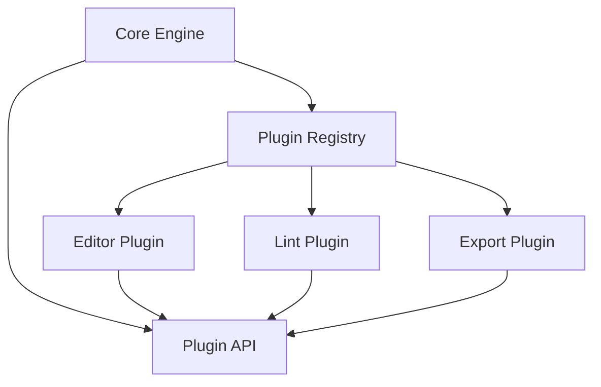

작성 가이드:

* Core는 플러그인의 구현체를 직접 알지 않게 표현한다.
* Plugin API가 안정적인 계약임을 강조한다.
* 플러그인 로딩, 권한, 생명주기는 별도 `jobflow`로 풀면 좋다.

---

### 14. Navigation Flow / Screen Flow

화면 전환과 그 판단에 필요한 API/처리를 표현한다. 화면 이름만으로 내부 모듈의 경계를 나누지 않으며 백엔드 간 통신은 이 관점에 넣지 않는다.

```navigation
Home --> LoginForm
LoginForm --> (/signin)
(/signin) --> Dashboard : success
(/signin) --> LoginForm : error
```

작성 가이드:

* 화면은 `PascalCase`, API는 `(/snake_case)`로 쓴다.
* API 응답 분기는 `: success`, `: error`, `: invalid`처럼 짧게 표기한다.
* 화면 내부의 세부 배치는 `screen-layout-guide.md`의 `layout` 블록으로 분리한다.

---

## jobflow와 특히 잘 맞는 패턴

`jobflow`는 실행 흐름을 보여주는 표현 방식이므로 다음 패턴과 특히 잘 맞다.

| 패턴 | 잘 맞는 이유 |
|---|---|
| Pipeline | 단계별 결과 전달이 `A.result --> B`와 직접 대응한다. |
| Event-Driven | 이벤트 구독과 후속 작업을 `A.OnEvent --> B.Method`로 표현한다. |
| State Machine | 특정 상태 전이 이후 실행되는 작업 흐름을 보여준다. |
| Command / Handler | 요청 하나가 어떤 Handler로 라우팅되는지 간단히 표현한다. |
| Saga | 성공 경로와 실패 보상 경로를 한 흐름에서 표현한다. |

주의할 점:

* `jobflow`는 전체 아키텍처 패턴 자체라기보다 **흐름을 설명하고 세분화하는 설계 표현 방식**이다.
* DDD, Clean Architecture, Layered Architecture로 큰 구조를 잡은 뒤, 중요한 유스케이스를 `jobflow`로 풀어 쓰는 방식이 가장 자연스럽다.
* 화면 중심 시나리오는 `navigation`, 객체/메서드 중심 시나리오는 `jobflow`, 상태 중심 로직은 `state`를 우선 사용하고 Mermaid `stateDiagram-v2`는 별도 관점이 필요할 때 보완한다.

---

## 실무 조합 예시

복잡한 업무 시스템에서는 필요에 따라 다음처럼 조합할 수 있다. 단순한 프로젝트의 기본 의무나 순서가 아니다.

```text
DDD로 큰 업무 경계를 나눈다
→ 각 Context 내부는 Clean Architecture로 구성한다
→ 주요 유스케이스는 Command/Handler로 나눈다
→ 복잡한 실행 흐름은 jobflow로 설명한다
→ 비동기 후속 처리는 Event-Driven으로 연결한다
```

아래는 필요한 항목만 고르는 탐색 순서다. 각 항목의 결과는 해당 경계의 계약과 링크로 연결하고 불필요한 내부 다이어그램은 생략한다.

1. **큰 경계**: DDD Bounded Context 또는 Microservices/Modular Monolith 다이어그램을 먼저 그린다.
2. **내부 구조**: 각 Context 내부를 Clean Architecture 또는 Layered Architecture로 정리한다.
3. **요청 단위**: 주요 유스케이스를 Command/Handler로 나눈다.
4. **실행 흐름**: 복잡한 유스케이스는 `jobflow`로 단계별 호출, 이벤트, 반환값을 표현한다.
5. **상태 변화**: 상태가 핵심이면 State Machine을 별도 다이어그램으로 분리한다.
6. **화면 흐름**: 사용자 화면 이동과 그 판단에 필요한 API/처리는 `navigation`으로 표현한다.

---

## 다이어그램 선택 규칙

| 보여주려는 것 | 우선 사용 |
|---|---|
| 객체 간 메서드 호출, 이벤트 구독, 반환값 전달 | `jobflow` |
| 화면 전환과 그 판단에 필요한 API/처리 | `navigation` |
| 객체 상태와 전이 | `state`; 별도 상태 모델 관점은 Mermaid `stateDiagram-v2`로 보완 |
| 계층, 의존성 방향, 서비스 토폴로지 | Mermaid `flowchart` |
| 클래스, 인터페이스, Handler 관계 | Mermaid `classDiagram` |
| 시간 순서가 중요한 외부 시스템 대화 | Mermaid `sequenceDiagram` |

문서에서 한 패턴을 설명할 때는 다음 3가지를 함께 적는다.

1. **분해 기준**: 무엇을 기준으로 나누는가.
2. **다이어그램**: 경계와 흐름이 어떻게 연결되는가.
3. **상세 계약·흐름 링크**: 다른 조각의 구현 대신 어떤 입력·출력·오류·상태 소유권을 알면 되는가. 복잡한 부분만 하위 다이어그램으로 연결한다.

검토자는 대표 변경 하나를 골라 수정해야 하는 조각과 읽어야 하는 맥락을 따라간다. 모든 그림이 작아도 관련 없는 구현을 계속 열어야 한다면 경계·계약을 다시 검토한다. 문법·의미 대조는 정적 검토이며 실제 렌더러에서의 표시 확인과 구분해 기록한다.
