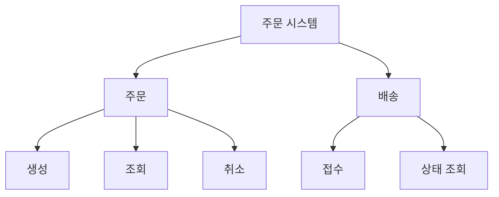

# 시스템 설계 프레임워크의 가상 예시

[시스템 설계 프레임워크](../system-design-framework.md)의 입력·이벤트·기능 분해를 설명하는 가상 주문 시스템이다. 이름·도메인·구조를 다른 프로젝트의 요구나 강제 규칙으로 사용하지 않는다.

## 입력

| 입력 | 출처·신뢰 경계 | 형식·단위 | 검증·누락 처리 | 소유 모듈 |
|---|---|---|---|---|
| 주문 요청 | 사용자 API | 상품 ID, 수량(정수) | 빈 항목·0 이하 수량 거절 | 주문 |
| 가격 조회 결과 | 가격 모듈의 공개 조회 | 금액·통화·기준 시점 | 유효기간과 재조회 정책 | 가격 |

## 명령과 이벤트

- `CancelOrder`: 주문 취소 요청. 주문 모듈이 현재 상태와 권한을 확인한 뒤 결과를 반환한다.
- `OrderCancelled`: 취소가 확정된 사실. 필요한 소비자만 구독한다. 취소 저장이 확정된 뒤 발행하며, 저장 성공과 발행 실패 사이의 복구 책임을 계약에 명시한다.

## 기능 계층

이는 기능 대응을 보여 주는 정적 예시다. Mermaid 렌더링 성공이나 특정 구현의 동작을 증명하지 않는다.
