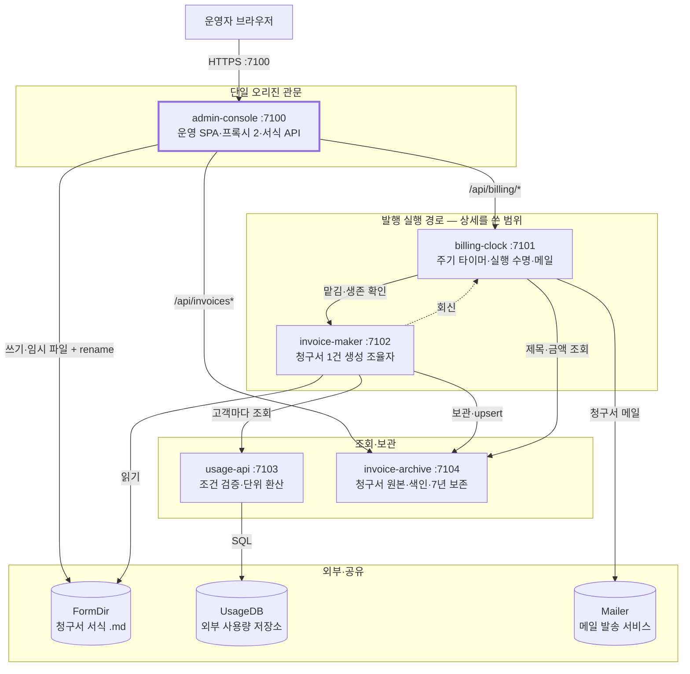

# 월별 청구서 발행 시스템 — AS-IS 시스템 설계서

> **가상의 예시 시스템** — 경로·줄 번호·수치는 형식 예시다. 양식의 원본은 [시스템 설계 문서 양식](../../../system-design-document-guide.md)이고, 이 파일은 그 양식을 채운 모양을 보여 준다. 둘이 다르면 양식을 따른다.
> **DATE** 2026.03.02 · **기준 커밋** `5e6f7a8`(가상·2026-03-02 09:30 +0900·`main`), 작업 트리 clean
> **범위** 프로세스 5개 + 공유 디렉터리 1개(추적 파일만 읽었다). 상세는 사용자가 지정한 「발행 실행 경로」의 두 경계(billing-clock·invoice-maker)만 쓴다. 일회용 스크립트 `tools/rate-import/`는 제외([근거 브리프 §1.2](../_evidence-brief.md#12-제외한-것과-이유))
> **근거** 소스 역추출(경계 5개 조사) + 문서 대조 → [`_evidence-brief.md`](../_evidence-brief.md), 경계별 상세는 [§8](#8-상세근거-인덱스와-한계)
> **표기** 구조·의존은 Mermaid `flowchart`, 협력 흐름은 [`jobflow`](../../../job-flow-diagram-guide.md), 상태 전이는 [`state`](../../../state-diagram-guide.md)(상세에만 둔다)
> **원칙** AS-IS는 현 코드를 있는 그대로 적는다. 찾은 결함은 고치지 않고 ID로 드러낸다([§9](#9-이슈--주제별-교차-뷰) — TO-BE 입력).
> **공통 한계** 근거는 코드와 설정 파일이다 — 프로세스 실행, UsageDB 질의, Mailer 발송은 해 보지 않았다. 런타임 동작은 코드상 예상이며, 실행으로 확인한 것만 (`사실·실행`)으로 표시한다.

## 0. 한눈에 보기 — 타이머를 가진 billing-clock이 맡기고 invoice-maker가 한 건씩 만든다



**범례** 굵은 테두리 = 운영자 요청이 처음 닿는 서버(밖으로 연 포트는 여기뿐), 점선 = 생성기가 시계로 돌려보내는 회신, 실린더 = 외부 시스템과 공유 디렉터리, 「발행 실행 경로」 묶음 = 상세를 쓴 두 경계(사용자 지정 범위).

**요지**

- **전체 그림**: 운영자 요청이 들어오는 곳은 7100번 포트의 admin-console이다. admin-console은 `/api/billing/*`을 billing-clock에, `/api/invoices*`를 invoice-archive에 넘기고, 서식 API는 스스로 처리한다. 정해진 시각에 일을 시작하는 것은 billing-clock의 20초 틱이다(§3·§4.2).
- **핵심 책임**: 청구서 한 건을 만드는 순서(서식 → 사용량 → 금액 계산·렌더 → 보관 → 회신)는 invoice-maker 안에서 정해진다. 재시도·마감·중지·메일처럼 실행의 앞뒤 일은 billing-clock이 맡고, 두 경계 사이에 오가는 것은 회신 한 통과 틱마다의 생존 확인 질의다. 맡김 요청에는 생성이 끝나기 전에 202가 돌아온다(§5.4·§5.5).
- **구조의 성격**: 저장소는 경계마다 따로다(H2 파일 DB, JSON 레코드, 파일 트리). 두 경계가 같은 저장 공간을 쓰는 곳은 FormDir 하나다 — admin-console이 쓰고 invoice-maker가 읽는데, 프로세스 사이 잠금은 없고 임시 파일 + rename으로 반쯤 쓴 파일만 막는다(§6.2).
- **가장 큰 약점 셋**: ① **조용한 열화** — 사용량 조회 실패가 0원 항목으로 성공 처리된다(`C-03`) ② **절반만 닫히는 중지** — 중지는 실행 행만 닫고, 계속 돈 생성의 회신이 그 행을 다시 닫아 메일까지 나간다(`B-01` — 회신에도 재시도가 없다 `C-02`) ③ **중복과 정합성** — 같은 주기 실행을 막는 키가 없고(`B-02`) 생성 단계 한도 합이 마감과 똑같다(`C-01`).

## 1. 핵심 용어

| 용어 | 뜻 | 원본 |
|---|---|---|
| **틱** | billing-clock의 20초 주기 실행. 한 번에 ① 도래·맡김 ② 생존 확인 ③ 마감 정리를 차례로 본다 | [billing-clock 상세 §3.1](details/billing-clock.md#31-틱-단계와-마감-정리) |
| **실행**(run) | 계획 하나의 한 주기 청구서를 만드는 시계 쪽 작업 단위 — `runs` 행 하나 | [billing-clock 상세 §4](details/billing-clock.md#4-소유-상태데이터) |
| **주기** `cycle` | 청구서가 덮는 사용 기간의 이름(`2026-02`). 실행을 만들 때 발행 규칙으로 정한다 | billing-clock `plan/IssueRule.kt` |
| **맡김** | 시계가 `POST /api/makes`로 생성기에 실행을 넘기는 것. 202는 접수 확인뿐이다 | [§5.4](#54-정기-청구서-생성--맡김에서-회신까지) |
| **회신** | 생성기가 일을 끝내고 `POST /api/replies`로 시계에 결과를 알리는 것. 재시도가 없다 | [§5.5](#55-실행-종결과-발송) |
| **생존 확인** | 회신 없이 끝난 실행을 찾으려고 틱마다 생성기에 단계를 묻는 것(맡긴 지 45초 뒤부터) | [billing-clock 상세 JF-2](details/billing-clock.md#jf-2-틱-2단계-생존-확인--billingclockcheckalive) |
| **마감** | 시도 한 번의 상한(기본 150s). 넘기면 틱 ③이 그 시도를 실패로 정리한다 | [billing-clock 상세 §6](details/billing-clock.md#6-실패-경계) |
| **0원 항목** | 사용량 조회에 실패한 고객을 금액 0으로 채운 청구서 줄 | [invoice-maker 상세 JF-2.1](details/invoice-maker.md#jf-21-고객별-사용량-조회--usageclientfetchall) |
| **`dedupKey`** | 청구서 중복 방지 키 `<planId>/<cycle>`. invoice-archive가 같은 키를 덮어쓴다(upsert) | invoice-archive `POST /api/invoices`(상세 없음) |
| **ETag / If-Match** | 서식 저장 충돌 검사. 열 때 받은 ETag를 저장할 때 돌려보내고, 그사이 바뀌었으면 412 | admin-console `/forms*`(상세 없음) |

## 2. 기능 — 무엇을 해주나

**결론**: 이 시스템이 내는 결과는 발행일마다 쌓이는 **청구서**와 고객에게 가는 **청구서 메일**이다. 서식 편집과 청구서 열람은 admin-console이 직접 처리하고, 청구서 생성은 언제나 billing-clock의 실행을 거쳐 invoice-maker가 맡는다.

| 사용자·업무 결과 | 트리거 | 책임 경계 |
|---|---|---|
| 청구서 서식을 만들고 고친다 | 서식 화면 「저장」 | admin-console `/forms*` → FormDir |
| 발행일이 되면 계획의 청구서가 만들어져 보관소에 들어간다 | 계획 화면, 20초 틱 | billing-clock → invoice-maker → invoice-archive |
| 발행일을 기다리지 않고 지금 한 번 발행한다 | 「지금 발행」 | billing-clock `issue` → invoice-maker |
| 진행 중인 발행을 멈춘다 | 실행 목록 「중지」 | billing-clock(실행 행만 닫는다 — `B-01`) |
| 고객이 청구서 메일을 받는다 | 실행 `closed` 종결 | billing-clock → Mailer |
| 보관된 청구서를 찾아 연다 | 검색, 행 선택 | admin-console 프록시 → invoice-archive |

**기능 트리와 소유 모듈**(PBS 관점): 청구 = {발행(정기·즉시), 보관(보관·검색·7년 보존), 운영(실행 목록·중지·메일)} + 서식 = {편집·계획 연결}. 메일 수신자는 계획마다 billing-clock이 갖고, 요금표는 계획 행에 함께 들어 있다.

## 3. 구조 — 무엇으로 이뤄져 있나

**결론**: 다섯 경계 중 다른 경계를 불러 일을 진행시키는 것은 billing-clock과 invoice-maker다. admin-console은 요청 경로를 보고 넘길 곳을 고르는 데서 끝나고, usage-api와 invoice-archive는 시스템 안의 다른 경계를 부르지 않는다(usage-api가 부르는 것은 외부 UsageDB다). 공유 DB는 없고, 두 경계가 함께 쓰는 자원은 서식 디렉터리다.

| 경계 | 포트·형태 | 한 줄 책임 | 공개 진입점 | 소유 상태 | 나가는 의존 |
|---|---|---|---|---|---|
| admin-console | 7100 | 단일 오리진 관문 — 운영 SPA + 관통 프록시 2 + 서식 API | 경로 접두 4갈래 | FormDir(쓰기) | billing-clock, invoice-archive, FormDir |
| [**billing-clock**](details/billing-clock.md) | 7101 | 20초 틱으로 발행일을 판정하고, 실행 수명과 청구서 메일을 맡는다 | 라우트 11개 + 20초 틱 | `clock.mv.db` 4표 | invoice-maker, invoice-archive, Mailer |
| [**invoice-maker**](details/invoice-maker.md) | 7102 | 청구서 1건의 생성 조율자 | 라우트 3개 | `makes/<runId>.json`, `spare/<runId>/` | FormDir(읽기), usage-api, invoice-archive, billing-clock(회신) |
| usage-api | 7103 | 외부 사용량 DB 조회 어댑터 — 조건 검증 + 단위 환산 | `POST /api/usage` | 없음(무상태) | UsageDB |
| invoice-archive | 7104 | 청구서 파일 원본 + 검색 색인 + 7년 보존 | 라우트 4개 | `invoices/<invoiceId>/` 파일 + `search.idx` | **0개** |

### 3.1 의존 방향에서 드러나는 사실

- **billing-clock과 invoice-maker는 서로를 부른다** — 시계가 맡기고 묻고, 생성기는 자기 설정에 적힌 시계 주소(`MAKER_REPLY_URL`)로 회신한다. 두 경계 모두 상대의 값(레코드 `phase` 3값, 회신 `outcome` 2값)을 알고 있다.
- **invoice-archive는 아무 경계도 부르지 않는다.** 부르는 쪽은 셋이다 — admin-console(검색·열람), invoice-maker(보관), billing-clock(메일에 넣을 제목·금액).
- FormDir은 HTTP가 아닌 접점이다 — 쓰는 쪽과 읽는 쪽이 파일 이름 `<formId>.md`와 자리 표시(`{{lines}}`·`{{total}}`)를 함께 안다.

## 4. 경계별 기능 목록 — 각 경계가 무엇을 하나

**결론**: §3 표의 경계마다 하는 일을 기능 단위로 나눠 적는다. 입력·오류·줄 번호 같은 계약 세부는 상세 §2에서 보고, 여기에는 기능과 진입점까지만 쓴다. 상세를 쓰지 않은 세 경계(사용자 지정 범위 밖)는 이 절의 표가 가장 자세한 기록이다.

### 4.1 admin-console :7100

| 기능 | 내용 | 진입점 |
|---|---|---|
| 운영 화면 서빙 | `web/`의 정적 파일. 모르는 경로에는 `index.html`을 준다 | `GET /*` |
| 관통 프록시 2 | `/api/billing/<rest>` → `:7101/api/<rest>`(접두만 바꾼다), `/api/invoices*` → `:7104` 그대로 | `proxyBilling`·`proxyInvoices` |
| 서식 편집 API | 목록·읽기(`ETag`)·저장(`If-Match` 불일치 412, 임시 파일 + rename)·삭제 | `/forms*` |

### 4.2 billing-clock :7101

| 기능 | 내용 | 진입점 |
|---|---|---|
| 청구 계획 관리 | 계획(고객군·요금표·발행 규칙·서식)과 수신자를 저장한다. 규칙 형식 오류 422, 삭제는 끄기 | `/api/plans*` |
| 즉시 발행 | 현재 주기로 실행 행을 만들어 맡긴 뒤 202 `{runId}`. 같은 주기 실행이 있어도 만든다(`B-02`) | `POST /api/plans/:planId/issue` |
| 틱 ① 도래·맡김 | 발행일이 된 계획마다 실행 행 생성 → 다음 발행 시각 기록 → `pending` 행 맡김(새 행과 재시도 차례 행을 한 질의로) | 20초 틱 |
| 틱 ②·③ 생존 확인·마감 정리 | 맡긴 지 45초 지난 `active` 행을 생성기에 묻는다. 마감 150s를 넘긴 시도는 묻지 않고 실패로 정리한다 | 20초 틱 |
| 종결·실행 조회·중지 | 회신과 생존 확인 결과를 종결 입구 `finishRun` 하나로 받는다. 실행 목록·상세, 중지(실행 행만) | `POST /api/replies`, `/api/runs*` |
| 청구서 메일 | `closed` 종결 뒤 수신자마다 1회 발송하고 결과를 `deliveries`에 적는다 | 실행 `closed` |

### 4.3 invoice-maker :7102

| 기능 | 내용 | 진입점 |
|---|---|---|
| 생성 접수 | 레코드를 쓰고 202 `{runId, alreadyRunning}`. 같은 runId가 `working`·`issued`면 새로 돌리지 않는다 | `POST /api/makes` |
| 준비·사용량 조회 | 서식 읽기 → 주기의 사용 기간 계산 → 고객마다 usage-api 조회(3명씩, 전체 예산 90s). 실패한 고객은 0원 항목 | 생성 단계 1~3 |
| 계산·보관·회신 | 금액 계산·렌더(45s) → invoice-archive 보관(15s, 실패면 `spare/` 사본 + `failed`) → 시계에 회신 1회 | 생성 단계 4~7 |
| 단계 조회·기동 정리 | 레코드를 그대로 돌려준다. 기동 때 `working`을 `failed`로 닫고 14일 지난 레코드를 지운다 | `GET /api/makes/:runId`, 기동 |

### 4.4 usage-api :7103

| 기능 | 내용 | 진입점 |
|---|---|---|
| 조건 검증·조회 | `accountIds` 1~50개, `from < to`, 기간 92일 이하(어기면 422) → UsageDB SQL(질의당 30s) → 계량 항목마다 GB·시간 단위로 환산 | `POST /api/usage` |

### 4.5 invoice-archive :7104

| 기능 | 내용 | 진입점 |
|---|---|---|
| 보관(upsert) | 청구서 HTML·메타 파일 쓰기 → 색인. 같은 `dedupKey`면 200 `replaced:true` | `POST /api/invoices` |
| 검색·열람 | 색인 질의 상위 25건, `invoiceId`로 메타 + 문서 | `GET /api/invoices/search`, `GET /api/invoices/:invoiceId` |
| 보존 정리 | 발행 7년이 지난 청구서 삭제 — 기동 때 1회(주기 타이머 없음) | 기동 |

## 5. 흐름 — 경계끼리 어떻게 소통하나

**결론**: 흐름은 정기 생성, 종결·메일, 운영자 요청 세 갈래다. billing-clock이 실행을 만들고 닫으며, invoice-maker가 서식·조회·보관을 조율한다. 맡김의 202는 접수 확인이고 업무 완료는 회신·생존 확인으로 안다.

이 절의 그림에는 경계 사이의 요청·응답만 그렸다. 경계 안의 협력은 상세 문서의 「3. 내부 Job Flow — 드릴다운」이 연다(→ [§5.8](#58-경계-내부-job-flow-드릴다운-색인)).

### 5.0 표기

- 그림은 모두 `scope:`다. 화살표는 요청을 보낸 경계에서 받은 경계로 긋는다([출발점은 실제 요청자](../../../job-flow-diagram-guide.md#scope-그림의-출발점은-실제-요청자다)). 생성처럼 한 경계가 조율하는 흐름도 그 경계 안을 그리지 않으므로 `orchestrator:`를 쓰지 않았다.
- 노드는 `경계객체.공개계약`이다. 원문 경로는 그림 아래 `노드 | 실제 계약` 표에 두었다. `.result`는 흐름을 잇는 응답만 그렸다(202 접수, `runId`, ETag, 청구서 문서).
- **실행 노드** `Maker.work` — 생성기 안에서 서식·사용량·보관·회신 요청을 차례로 보내는 실행 단위다. 맡김 요청이 202로 끝난 다음에 돌고, 공개 계약이 아니라는 것을 노드 표에 적었다.
- **종결 입구 노드** `Clock.finishRun` — 회신, 생존 확인, 마감 정리가 실행을 끝낼 때 모두 이 메서드를 부른다. 같은 경계 안의 화살표 `Clock.acceptReply --> Clock.finishRun`은 종결 입구로 들어가는 길을 보일 때만 썼다.
- **프록시를 지나는 응답** — 요청은 관통 프록시(`Console.proxyBilling`·`Console.proxyInvoices`)를 실제 홉으로 그렸다. 응답도 같은 프록시를 지나 돌아가지만, 응답 화살표는 프록시 칸을 빼고 원래 요청자의 다음 동작 노드(`Browser.showList` 등 — 공개 계약 아님)로 바로 이었다.
- **묶음 노드**(5.1에만) — `Browser.call`·`Console.route`·`Clock.operate`·`Archive.browse`·`FormDir.edit`는 같은 요청자와 제공자 사이의 여러 계약을 한 칸에 묶은 이름이다. 무엇을 묶었는지는 5.1 불릿에 적었고, 시나리오 그림(5.2·5.3·5.6)에서는 실제 계약으로 나눠 그렸다.
- FormDir은 admin-console이 쓰고 invoice-maker가 직접 읽어 객체로 뒀다. [줄 순서](../../../job-flow-diagram-guide.md#줄-순서-규칙)·[렌더 배치](../../../job-flow-diagram-guide.md#렌더러-배치-특성)를 따르며, [합류·재호출](../../../job-flow-diagram-guide.md#합류와-재호출-구분)의 해석은 해당 그림 아래에 적었다.

| 객체 | 경계 | 객체 | 경계 |
|---|---|---|---|
| `Browser` | admin-console 화면(SPA) | `Archive` | invoice-archive :7104 |
| `Console` | admin-console 서버 :7100 | `FormDir` | 청구서 서식 `.md` 공유 디렉터리(§6.2) |
| `Clock` | billing-clock :7101 | `UsageDB` | 외부 사용량 저장소 |
| `Maker` | invoice-maker :7102 | `Mailer` | 메일 발송 서비스 |
| `UsageApi` | usage-api :7103 | | |

### 5.1 전체 한 장

```jobflow
scope: 월별 청구서 발행 시스템 경계 간 협력 전체
Object: Browser, Console, FormDir, Maker, UsageApi, UsageDB, Archive, Clock, Mailer

Clock.OnTick --> Maker.make
Clock.OnTick --> Maker.peek
Maker.work --> FormDir.read
Maker.work --> UsageApi.fetch
UsageApi.fetch --> UsageDB.select
Maker.work --> Archive.file
Maker.work --> Clock.acceptReply
Clock.acceptReply --> Clock.finishRun
Clock.finishRun --> Archive.open
Clock.finishRun --> Mailer.send
Browser.call --> Console.route
Console.route --> FormDir.edit
Console.route --> Clock.operate
Console.route --> Archive.browse
```

**읽는 법** 줄은 네 무리다. 처음 둘은 `Clock.OnTick`이 생성기에 일을 맡기고 진행을 묻는 줄이다. 다음 다섯은 `Maker.work`가 서식 읽기·사용량 조회·보관·회신을 차례로 내보내는 부분이고, 그중 사용량 조회는 usage-api가 UsageDB로 다시 넘긴다. 그 뒤 셋은 회신이 종결 입구를 거쳐 청구서 정보 조회와 메일로 이어지는 줄이다(메일이 `issued` 종결에서만 나간다는 조건은 §5.5에 값 분기로 그렸다). 마지막 넷은 운영자 요청이 `Console.route`에서 서식 디렉터리·시계·보관소로 나뉘는 길이다. 트리거가 여럿(`Clock`·`Browser`)인 그림이라 `Object:` 순서는 [규칙](../../../job-flow-diagram-guide.md#렌더러-배치-특성)을 출발점으로 손으로 정했다 — 다시 불리지 않는 `Browser`는 맨 왼쪽이고, 회신을 받는 `Clock`은 오른쪽에 두어 회신 화살표가 앞 행에 끼어들지 않게 했다. 규칙대로면 `Clock`이 맨 오른쪽인데, 그렇게 두어도 그림이 흐트러지지 않는 것을 렌더로 확인한 뒤 메일 화살표가 오른쪽으로 나가도록 `Mailer`를 그 뒤에 두었다. 줄은 정기 발행이 중심 흐름이라 틱에서 시작하는 무리를 먼저 썼다.

- `Console.route`는 경로 접두만 보고 넘긴다 — 발행 순서를 정하는 코드는 admin-console에 없다. 묶음 노드가 묶은 계약은 이렇다: `Browser.call` = 화면이 보내는 서버 요청 전부, `Console.route` = 두 프록시와 서식 API, `Clock.operate` = 계획·실행 API, `Archive.browse` = 검색·열람, `FormDir.edit` = 서식 파일 읽기·쓰기.
- invoice-archive 칸에서는 화살표가 하나도 나가지 않는다. 대신 들어오는 화살표가 셋(`file`·`open`·`browse`)으로 가장 많다.
- FormDir 접점에는 HTTP가 없다 — admin-console과 invoice-maker가 같은 파일을 직접 쓰고 읽고, 그 사이를 막는 프로세스 잠금도 없다(§6.2).

| § | 시나리오 | 트리거 | 완료 사실 |
|---|---|---|---|
| [5.2](#52-청구서-서식-편집) | 청구서 서식 편집 | 서식 화면 「저장」 | 서식 파일 저장 + 새 ETag |
| [5.3](#53-청구-계획-등록즉시-발행중지) | 청구 계획 등록·즉시 발행·중지 | 계획 화면, 「지금 발행」, 「중지」 | `plans` 행, 202 `runId`, 실행 행 `dropped(stopped)` |
| [5.4](#54-정기-청구서-생성--맡김에서-회신까지) | 정기 청구서 생성 | 20초 틱의 발행일 도래 | invoice-archive 보관 + 회신 |
| [5.5](#55-실행-종결과-발송) | 실행 종결과 발송 | 회신, 생존 확인, 마감 | 실행 행 종결 + 메일 1회 |
| [5.6](#56-청구서-검색과-열람) | 청구서 검색과 열람 | 검색, 행 선택 | 검색 결과, 청구서 표시 |

### 5.2 청구서 서식 편집

```jobflow
scope: 서식 열기와 저장
Object: Browser, Console, FormDir

Browser.openForm --> Console.getForm
Console.getForm --> FormDir.read
Console.getForm.result --> Browser.showForm
Browser.saveForm --> Console.putForm
Console.putForm --> FormDir.write
Console.putForm.result --> Browser.keepTag
```

| 노드 | 실제 계약 |
|---|---|
| `Console.getForm`·`.putForm` | admin-console 자체 API — `GET /forms/:formId` → 본문 + `ETag`(내용 해시), `PUT /forms/:formId`(`If-Match` 필수, 다르면 412, 1MB 상한) → 200 + 새 `ETag` |
| `FormDir.read`·`.write` | `<FORM_ROOT>/<formId>.md`. 쓰기는 같은 디렉터리의 임시 파일에 쓴 뒤 rename |
| `Browser.showForm`·`.keepTag` | 응답을 받은 화면의 다음 동작(공개 계약 아님) — 편집기 표시, 새 ETag를 다음 저장의 `If-Match`로 보관 |

- 두 `.result`는 열 때와 저장 뒤의 ETag를 화면에 돌려준다. 412가 오면 화면은 「다른 사람이 먼저 저장했다」를 띄우고 편집 내용을 버린다. 두 판을 견줘 합치는 기능은 없다(§7).
- **저장할 때 서식 내용을 검사하지 않는다** — 자리 표시 `{{lines}}`가 빠진 서식도 저장되고, 생성기 1단계에서야 실패해 그 주기 실행이 재시도로 넘어간다(§5.4).
- 열기와 저장은 계약이 달라 노드도 `getForm`·`putForm` 둘로 썼다. 한 이름으로 묶으면 두 응답이 한 노드의 `.result`로 읽히고, 렌더러는 저장 응답을 그 이름의 새 칸에 다시 그린다([줄 순서 규칙](../../../job-flow-diagram-guide.md#줄-순서-규칙)).

### 5.3 청구 계획 등록·즉시 발행·중지

```jobflow
scope: 청구 계획 등록·즉시 발행·중지
Object: Browser, Console, Clock, Maker

Browser.savePlan --> Console.proxyBilling
Console.proxyBilling --> Clock.plans
Browser.issueNow --> Console.proxyBilling
Console.proxyBilling --> Clock.issueNow
Clock.issueNow --> Maker.make
Clock.issueNow.result --> Browser.openRun
Browser.openRun --> Console.proxyBilling
Console.proxyBilling --> Clock.getRun
Browser.stopRun --> Console.proxyBilling
Console.proxyBilling --> Clock.stopRun
```

| 노드 | 실제 계약 |
|---|---|
| `Console.proxyBilling` | `/api/billing/<rest>` → `:7101/api/<rest>` 관통 프록시 |
| `Clock.plans` | `POST·PATCH·GET·DELETE /api/plans` — `{customerGroup[], rates{}, rule, formId, contacts[]}`. 발행 규칙 `매월 <일> <시:분>` 형식 오류 422, `DELETE`는 `enabled=false`로 끈다 |
| `Clock.issueNow` → `Maker.make` | `POST /api/plans/:planId/issue` → 실행 행 생성 → `POST /api/makes`(§5.4와 같은 계약) → **202 `{runId}`**. 맡김이 실패해도 202 — 행이 `pending`으로 남아 재시도된다 |
| `Browser.openRun` → `Clock.getRun` | 실행 상세 화면 — `GET /api/runs/:runId`를 5초마다 다시 부른다 |
| `Clock.stopRun` | `POST /api/runs/:runId/stop` → `{stopped}` — **실행 행만** `dropped(stopped)`로 닫는다. 이미 끝난 행은 `stopped:false` |
| (그림 밖) `Clock.listRuns` | `GET /api/runs?state=` — 실행 목록 화면이 「중지」 버튼을 붙일 행을 받는다 |

- 「지금 발행」에 202가 와도 청구서는 아직 없다. 실행 행을 만들고 맡김을 한 번 시도한 시점에 응답하기 때문이다. 그 뒤의 길은 정기 발행(§5.4·§5.5)과 같고, 같은 주기 실행이 이미 있는지는 보지 않는다(`B-02`).
- 중지 요청은 `Clock.stopRun`에서 끝난다. 이 그림에 생성기로 가는 줄이 없는 것은 코드에 그런 호출이 없어서다. 생성은 끝까지 가고, 그 `issued` 회신이 중지된 행을 `closed`로 바꾼 뒤 메일을 보낸다(`B-01`, §5.5·§5.7).
- 프록시 칸이 넷인 것은 요청이 넷이어서다(합류가 아니다). `Browser.openRun`의 반복은 실제 재호출 — 5초 간격으로 화면을 닫을 때까지 부른다.

### 5.4 정기 청구서 생성 — 맡김에서 회신까지

```jobflow
scope: 정기 청구서 1건 생성
Object: Maker, FormDir, UsageApi, UsageDB, Archive, Clock

Clock.OnTick --> Maker.make
Maker.work --> FormDir.read
Maker.work --> UsageApi.fetch
UsageApi.fetch --> UsageDB.select
Maker.work --> Archive.file
Maker.work --> Clock.acceptReply
```

| 노드 | 실제 계약 |
|---|---|
| `Clock.OnTick` → `Maker.make` | 틱 ① 발행일 도래 → 실행 행 `pending` → `POST /api/makes {runId, planId, cycle, formId, rates, customers[]}` → **202 `{runId, alreadyRunning}`** — 접수 확인. 202를 받은 **뒤에** 행을 `active`(맡긴 시각·마감 시각)로 바꾼다. 즉시 발행·재시도도 같은 계약 |
| `Maker.work` | 실행 노드(공개 계약 아님) — 맡김 요청이 202로 끝난 뒤 생성기 안에서 돈다. 아래 넷을 줄 순서대로 보낸다. 앞 응답이 다음 요청의 입력이고, 금액 계산·렌더는 경계 안이라 그리지 않았다 |
| `FormDir.read` | `<FORM_ROOT>/<formId>.md`를 파일로 직접 읽는다 |
| `UsageApi.fetch` → `UsageDB.select` | 고객마다 `POST /api/usage {accountIds:[한 명], from, to}`(3명씩, 전체 예산 90s) → SQL(질의당 30s) → 단위를 바꾼 사용량 |
| `Archive.file` | `POST /api/invoices` — `dedupKey: <planId>/<cycle>` upsert → 201/200 `{invoiceId, replaced}`(15s) |
| `Clock.acceptReply` | `POST /api/replies {runId, outcome, invoiceId, note}` — 5s, **재시도 없음** |

실행을 `failed`로 끝내는 것은 서식·주기 해석·렌더·보관의 실패다(보관 실패는 `spare/` 사본을 남긴다). **사용량 조회 실패는 실행을 끝내지 않는다** — 그 고객을 0원 항목으로 채우고 계속한다(`C-03`). 회신이 실패하면 로그만 남고 §5.5의 생존 확인이 회수한다(`C-02`). 단계 전수는 [invoice-maker 상세 §3.1](details/invoice-maker.md#31-생성-단계와-시간-한도)에 있다.

- 화살표 하나가 여러 요청이다 — `UsageApi.fetch`는 고객 수만큼 나간다(세 명씩 묶어 차례로, 반복은 그림에 그리지 않았다).
- 생성 단계 한도 합(조회 90s + 렌더 45s + 보관 15s = **150s**)이 시계의 마감 기본 **150s**와 같다. 여유가 0이라 조회가 조금만 늦어도 틱 ③이 그 시도를 실패로 정리하고 다시 맡긴다 — 생성기가 아직 `working`이면 두 번째 `make`는 새 실행 없이 `alreadyRunning:true`로 끝나지만 시계는 재시도 1회를 쓴다(`C-01`).

### 5.5 실행 종결과 발송

```jobflow
scope: 실행 종결 — 회신·생존 확인·메일
Object: Maker, Clock, Archive, Mailer

Maker.work --> Clock.acceptReply
Clock.acceptReply --> Clock.finishRun
Clock.OnTick --> Maker.peek
Maker.peek.unreachable
Maker.peek.failed --> Clock.finishRun
Maker.peek.missing --> Clock.finishRun
Maker.peek.issued --> Clock.finishRun
Clock.finishRun.issued --> Archive.open
Clock.finishRun.issued --> Mailer.send
```

| 노드 | 실제 계약 |
|---|---|
| `Clock.acceptReply` → `.finishRun` | `POST /api/replies` → 종결 입구 `finishRun`(종결 입구 노드 — 공개 계약 없음) |
| `Clock.OnTick` → `Maker.peek` | 틱 ② 생존 확인 — 맡긴 지 45초 지난 `active` 실행마다 `GET /api/makes/:runId`(4s). `issued`·`failed` → 그 결과로 `finishRun`, 404 → `failed`(`생성 기록 없음`)로 `finishRun`, `working` → 그대로 둔다(그리지 않음), 응답 없음 → 이번 틱은 보류(단독 줄) |
| (그림 밖) 틱 ③ 마감 정리 | 마감 시각(맡긴 뒤 150s)이 지난 `active` 실행은 생성기에 묻지 않고 `failed`(`마감 초과`)로 `finishRun`에 넣는다 |
| `Clock.finishRun` | 가드는 `closed` 행만 버린다(**`dropped`는 거르지 않는다** — `B-01`). 가드를 지나면 받은 결과 값으로 가른다 — `issued`는 아래 행, `failed`는 재시도 판정(남았으면 `pending` + `retry_at` → 다음 틱 ①이 §5.4로 다시 맡김, 3회를 다 썼으면 `dropped(retry-exhausted)`). 재시도 판정은 경계 안의 일이라 그리지 않았다 |
| `Clock.finishRun.issued` | 종결 값이 `issued`인 분기 — 행을 `closed`(+`invoice_id`)로 쓰고 메일 일을 시계 안의 별도 스레드에 넘긴다. 아래 두 요청은 그 스레드가 보내지만, 일을 넘긴 이 분기에서 출발시켜 그렸다. 네 입구 중 어디로 들어왔든 같다 |
| `Archive.open`·`Mailer.send` | 메일 본문용 `GET /api/invoices/:invoiceId`(4s, 실패면 금액 없이 열람 주소만), 계획 수신자마다 SMTP 1회(10s), **재시도 없음** — 결과는 `deliveries` 행으로 |

- `finishRun`에 들어오는 화살표 넷은 회신과 생존 확인 세 분기가 한 메서드에서 만나는 합류다. 생존 확인은 `active` 행만 묻기 때문에, 회신으로 먼저 끝난 실행에는 틱 ②가 들어오지 않는다. 반대로 생존 확인이 먼저 `issued`로 닫은 뒤 늦은 회신이 오면 `closed` 가드가 버린다.
- 응답 없음만 단독 줄로 둔 것은 그 끝이 설계 정보여서다 — 생성기가 답하지 않아도 시계는 행을 실패로 바꾸지 않고 틱 ③의 마감 정리를 기다린다. `working`은 정상 진행이라 그리지 않았다(기본은 생략).
- 메일 두 갈래는 값 분기 `Clock.finishRun.issued`에서 나간다. 네 입구 가운데 어느 길로 들어왔든 종결 값이 `issued`일 때만 메일이 나간다는 뜻이다 — 회신의 `outcome: issued`와 생존 확인의 `issued`가 여기에 해당한다. 생존 확인의 `failed`·`missing`은 `failed` 값으로 들어와 재시도 판정으로 끝난다. 이 조건을 줄 순서로 만들지 않고 값 분기로 적었다([합류와 재호출 구분](../../../job-flow-diagram-guide.md#합류와-재호출-구분)). 회신이 유실되면 다음 생존 확인까지 종결이 늦고(`C-02` — 처리·질의 지연을 포함한 상한은 미확인), 메일이 실패해도 다시 보내지 않는다(`B-03`).
- `Object:` 순서는 [렌더러 배치 특성](../../../job-flow-diagram-guide.md#렌더러-배치-특성)의 규칙대로다. 첫 줄을 내보내는 `Maker`가 트리거이고, 그를 다시 부르는 `Clock.OnTick --> Maker.peek`은 처음 나오는 노드에서 나가므로 맨 오른쪽에 두는 규칙 3이 아니라 맨 왼쪽에 두는 규칙 4를 따랐다. 요청을 둘 이상 내보내는 객체가 없어(값 분기와 같은 객체 안 화살표는 세지 않는다) 나머지는 처음 호출되는 순서다.

### 5.6 청구서 검색과 열람

```jobflow
scope: 청구서 검색과 열람
Object: Browser, Console, Archive

Browser.searchInvoices --> Console.proxyInvoices
Console.proxyInvoices --> Archive.search
Archive.search.result --> Browser.showList
Browser.openInvoice --> Console.proxyInvoices
Console.proxyInvoices --> Archive.open
Archive.open.result --> Browser.showInvoice
```

| 노드 | 실제 계약 |
|---|---|
| `Console.proxyInvoices` | `/api/invoices*` → `:7104` 그대로 관통 |
| `Archive.search`·`.open` | `GET /api/invoices/search?q=` → 상위 25건 `{invoiceId, title, total, issuedAt}`, `GET /api/invoices/:invoiceId` → 메타 + 청구서 문서 |
| `Browser.showList`·`.showInvoice` | 응답을 받은 화면의 다음 동작(공개 계약 아님) — 목록 표시, 문서 표시 |

- `Archive.open`은 §5.5에서 시계가 메일 본문을 채우려고 부르는 것과 같은 `GET /api/invoices/:invoiceId`다. 여기서는 브라우저가 프록시를 거쳐 부른다.
- 색인은 `dedupKey`로 덮어쓴 청구서를 한 건으로 보여 준다 — 같은 주기 메일이 두 번 나갔어도(`B-02`) 화면에는 하나다.

### 5.7 실행 상태 — 두 상태 기계

**결론**: 실행 하나의 상태가 두 경계에 따로 적힌다 — billing-clock의 `runs.state` 4값(`pending`·`active`·`closed`·`dropped`)과 invoice-maker의 레코드 `phase` 3값(`working`·`issued`·`failed`)이다. 한쪽을 바꾸는 코드는 다른 쪽을 바꾸지 않는다. 시계가 생성기의 값을 알게 되는 때는 회신을 받을 때와 생존 확인 응답을 읽을 때이고, 두 값을 함께 커밋하는 곳은 없다.

| 상황 | `runs.state` | `phase` | 그 뒤 | ID |
|---|---|---|---|---|
| 운영자가 「중지」를 눌렀다 | `dropped(stopped)` | `working` 그대로 | 생성이 끝나면 `issued` 회신이 행을 `closed`로 바꾸고 메일이 나간다 | `B-01` |
| 회신이 유실됐다 | `active` 그대로 | `issued` | 틱 ②가 맡긴 지 45초 뒤부터 물어 회수한다 — 다음 질의가 성공하면 `closed`, 지연 상한은 미확인 | `C-02` |
| 시도가 마감 150s를 넘겼다 | `pending`(재시도 대기) | `working` | 다시 맡긴 `make`는 새 실행 없이 `alreadyRunning:true`로 끝나고, 재시도 횟수만 하나 줄어든다 | `C-01` |
| 일부 고객 조회가 실패했다 | `closed` | `issued` | 0원 항목이 든 청구서가 정상으로 보관·발송된다 | `C-03` |
| 같은 주기 실행이 둘 생겼다 | `closed` 행 둘 | 레코드 둘(runId가 다르다) | 청구서는 `dedupKey`로 하나, 메일은 두 번 | `B-02` |

상태 기계 그림은 각 값을 쓰는 경계의 상세에 있다 — `runs.state`는 [billing-clock §4.1](details/billing-clock.md#41-실행-행-상태-기계), `phase`는 [invoice-maker §4.1](details/invoice-maker.md#41-생성-레코드-단계-기계).

### 5.8 경계 내부 Job Flow 드릴다운 색인

위 그림의 각 노드는 상세의 내부 Job Flow 절에서 열리고, 상위 노드의 입력·출력·실패 의미는 하위 그림의 진입점과 같다.

| 경계 | 내부 Job Flow 절 | 그림 수 | 상위 노드 → 대표 하위 그림 |
|---|---|---|---|
| admin-console | — | — | 사용자 지정 범위(발행 실행 경로) 밖 — 상세 없음(§8) |
| billing-clock | [billing-clock 드릴다운](details/billing-clock.md#3-내부-job-flow--드릴다운) | 6 | `OnTick`→`make` → `JF-1` → `JF-1.1`, `acceptReply`·`finishRun` → `JF-3` → `JF-3.1`, `stopRun` → `JF-4` |
| invoice-maker | [invoice-maker 드릴다운](details/invoice-maker.md#3-내부-job-flow--드릴다운) | 5 | `make` → `JF-1`, `work` → `JF-2` → `JF-2.1` |
| usage-api·invoice-archive | — | — | 사용자 지정 범위 밖 — 상세 없음(§8) |

**드릴다운에서 드러난, 상위 그림을 읽을 때 알아야 할 사실**

- `Clock.finishRun`의 가드는 `closed`만 거른다 — 재시도를 다 쓴 실행에 늦게 온 `issued`를 살리려는 코드인데, 중지한 실행도 같은 길로 다시 닫힌다(billing-clock `JF-3`, `B-01`).
- 상위 `Maker.work`에 해당하는 코드는 메서드 `InvoiceMaker.work` 하나다. `InvoiceMaker.receive`가 레코드를 `working`으로 쓴 직후 끝나기를 기다리지 않고 부르므로, 202 응답과 회신 사이의 일은 모두 이 메서드 안에서 일어난다(invoice-maker `JF-2`).
- §5.4와 §5.5의 `Clock.OnTick`은 같은 20초 틱이다. 틱 한 번이 ① 맡김(`make`)과 ② 생존 확인(`peek`)을 차례로 하고, ③ 마감 정리는 생성기를 부르지 않아 §5 그림에 나오지 않는다([billing-clock §3.1](details/billing-clock.md#31-틱-단계와-마감-정리)).
- `Clock.stopRun`의 처리기는 `BillingClock` 클래스를 부르지 않고 `RunStore.markDropped`를 직접 호출한다. 그래서 행은 `finishRun`의 잠금 밖에서 바뀐다(billing-clock `JF-4`·§6).

## 6. 데이터 — 무엇이 들어오고 남나

### 6.1 입력

**결론**: 입력 넷 가운데 시스템 밖에서 오는 것은 사용량 하나이고, 서식·계획·요금표는 운영자가 화면에서 넣는다. 사용량 조회 실패와 정말 0인 사용량은 생성기에서 같은 값이 된다(`C-03`).

| 입력 | 출처·신뢰 경계 | 형식·단위 | 검증·누락 처리 | 소유 |
|---|---|---|---|---|
| 사용량 | UsageDB(외부) → usage-api | 계량 항목별 수량 — usage-api가 GB·시간으로 환산 | `accountIds` 1~50, 기간 92일 이하(422). 실패는 생성기에서 0원 항목 | usage-api |
| 청구서 서식 | 운영자 편집 → FormDir | Markdown + 자리 표시 `{{…}}` + 머리 설정(통화·세율) | 저장 때는 ETag 충돌만 412. 내용은 생성 1단계에서야 검사 | admin-console(쓰기), invoice-maker(읽기) |
| 청구 계획·수신자 | 계획 화면 | 발행 규칙 `매월 <일> <시:분>`, 고객 계정 목록, 메일 주소 | 규칙 형식 422. 서식이 있는지는 보지 않는다 | billing-clock |
| 요금표 | 계획 화면(계획 행 안) | 계량 항목 → 단가(원) | 키가 사용량 항목 이름과 다르면 그 항목이 0원이 된다 — 검사 없음 | billing-clock |

### 6.2 권위 소유자와 생명주기

**결론**: 각 데이터의 쓰기 소유자는 한 경계다. 서식은 admin-console이 쓰고 invoice-maker가 직접 읽으므로 파일 형식에 대한 결합은 남지만, 읽기 공유나 잠금 부재가 쓰기 소유자를 없애지는 않는다. 보존은 아래와 같다.

| 데이터 | 권위 소유자 | 저장 | 보존 | 일관성·실패 책임 |
|---|---|---|---|---|
| 청구서 문서·메타 | **invoice-archive** | `invoices/<invoiceId>/` 파일 + `search.idx`(파생) | 7년, 기동 때 정리 | `dedupKey` upsert로 주기당 1건 |
| 계획·실행·수신자·발송 결과 | **billing-clock** | `clock.mv.db`(H2) 4표 | 지우는 코드 없음 | `(plan_id, cycle)` 유니크 없음(`B-02`) |
| 생성 레코드·보관 실패 사본 | **invoice-maker** | `makes/*.json`, `spare/<runId>/` | 레코드 14일, 사본은 지우지 않음 | 실행 행과 따로 움직인다(§5.7) |
| 청구서 서식 `.md` | **admin-console**(쓰기), invoice-maker(읽기) | FormDir | 영구 | 임시 파일 + rename이라 반쯤 쓴 파일은 읽히지 않는다. 생성 중에 바뀐 서식은 다음 시도부터 쓰인다 |

### 6.3 트랜잭션 경계

**결론**: 청구서 1건이 끝날 때까지 원자적인 것은 저장소마다의 쓰기 한 번뿐이다. 실행 행·생성 레코드·청구서를 서로 다른 때에 따로 쓰므로, 중간에 끊기면 아래처럼 어긋난 채 남는다.

- 청구서는 보관됐는데 실행 행은 `dropped(stopped)` — 늦은 `issued` 회신이 오기 전까지(`B-01`).
- 같은 주기의 실행 행 둘, 청구서 하나, 메일 두 번(`B-02`).
- 레코드는 `issued`인데 실행 행은 `active` — 회신 유실, 다음 생존 확인까지(`C-02`).
- `spare/` 사본은 있는데 보관본은 없음 — 재시도가 보관에 성공할 때까지. 사본은 그 뒤에도 남는다.

## 7. 화면 — 사용자는 어디를 오가나

**결론**: 화면은 넷(주소 8개)이고 모두 admin-console이 내주는 SPA 안에 있다. 서식 API를 빼면 서버 계약은 전부 두 프록시를 지난다.

| 화면 | 주소 | 핵심 상호작용 | 서버 계약 |
|---|---|---|---|
| 서식 목록·편집 | `#/forms`, `#/forms/<formId>` | 원문 편집, 저장(ETag ↔ If-Match) | `/forms*` |
| 청구 계획 | `#/plans`, `#/plans/<planId>` | 규칙·고객·요금표·수신자 저장, 「지금 발행」 | `/api/billing/plans*` |
| 실행 목록·상세 | `#/runs`, `#/runs/<runId>` | 상태 거르기, 「중지」, 상세 5초 폴링 | `/api/billing/runs*` |
| 청구서 검색·보기 | `#/invoices`, `#/invoices/<invoiceId>` | 검색, 문서 표시 | `/api/invoices*` |

**편집 동시성**: 저장 충돌을 검사하는 화면은 서식 편집 하나다(`If-Match` 412). 412를 받으면 서식을 다시 열어 처음부터 고쳐야 한다. 계획 화면에는 이 검사가 없어서, 두 사람이 저장하면 뒤에 저장한 내용이 남는다. 화면 이동 다이어그램과 화면 상태 전수는 admin-console 상세에 둘 내용인데, 이 예시는 그 상세를 쓰지 않았다(사용자 지정 범위 밖 — §8).

## 8. 상세·근거 인덱스와 한계

| 상세 문서 | 경계 | 이슈 ID |
|---|---|---|
| [`details/billing-clock.md`](details/billing-clock.md) | billing-clock :7101 | `B-01`~`B-03` |
| [`details/invoice-maker.md`](details/invoice-maker.md) | invoice-maker :7102 | `C-01`~`C-03` |
| 없음 — 사용자가 분석 범위를 「발행 실행 경로」로 좁혀 생략했다([브리프 §1.1](../_evidence-brief.md#11-분석-범위)) | admin-console :7100, usage-api :7103, invoice-archive :7104(조사 ID A·D·E) | — |
| [`../_evidence-brief.md`](../_evidence-brief.md) | 범위 근거, 이슈 색인, 이 문서에 돌린 검사의 기록 | — |

### 8.1 확인하지 못한 범위

1. **띄우지 않은 프로세스** — 프로세스 5개는 실행하지 않았다. 틱 시각, 회신 유실 뒤 회수 지연, 마감 경합은 코드상 예상이고, 두 상세의 「7. 검증 경계」도 테스트 소스를 읽은 것이다.
2. **A·D·E 상세 없음** — 사용자 지정 범위 밖이다. 이 세 경계는 라우트 선언과 설정 파일까지만 읽었으므로 §3·§4·§5의 그 행들은 상세의 원문 계약으로 다시 확인되지 않았다.
3. **외부 쪽** — UsageDB 스키마와 Mailer의 수신 확인(반송·수신 거부)은 보지 않았다.

## 9. 이슈 — 주제별 교차 뷰

**결론**: 이 절은 전수 목록이 아니다 — 원본은 상세 「8. 이슈」 표와 [브리프 §3](../_evidence-brief.md#3-이슈-색인)이다. 이슈마다의 근거 `파일:줄`과 영향은 그 표에서 본다. 아래에는 두 경계에 함께 영향을 주는 이슈만 주제별로 모았다. 주제에 넣지 않은 `B-03`(메일 재시도 없음)은 billing-clock 한 경계 안의 일이다.

| 접두 → 근거 표 | |
|---|---|
| `B` [billing-clock §8](details/billing-clock.md#8-이슈) | `C` [invoice-maker §8](details/invoice-maker.md#8-이슈) |

### 9.1 조용한 열화

| ID | 한 줄 |
|---|---|
| `C-03` | 사용량 조회 실패가 **0원 항목으로 성공 처리**된다 — 생성기는 실패와 「사용량 0」을 가리지 않고, 레코드·회신에도 표시가 없어 시계는 행을 `closed`로 닫고 메일을 보낸다 |

### 9.2 중복과 정합성

| ID | 한 줄 |
|---|---|
| `B-02` | 같은 주기 실행을 막는 키가 없다 — 같은 달의 「지금 발행」이나 틱 ①의 중간 재기동으로 실행이 둘이 되면 메일이 두 번 나간다. **청구서는 `dedupKey` upsert로 한 건**이다 |
| `C-01` | 생성 단계 한도 합 150s가 마감 150s와 같다 — 조금 느린 정상 시도도 마감 정리로 실패 처리되고 다시 맡겨진다. 두 시간 값은 경계마다 따로 설정하고, 어느 쪽도 상대 값을 읽지 않는다 |

### 9.3 절반만 닫히는 중지

`B-01`과 `C-02`는 원인이 같다. 실행 행과 생성 레코드를 맞추는 계약은 둘이다 — 생성기가 시계에 보내는 회신 한 번과, 시계가 생성기에 묻는 생존 확인. 시계가 생성기에 멈추라고 말하는 계약은 없다. 그래서 중지는 시계 쪽 행만 바꾸고(`B-01`), 완료 소식도 회신 한 번이 실패하면 다음 생존 확인 때까지 늦는다(`C-02`). 여기에 종결 가드가 `dropped`를 거르지 않아, 중지한 실행이 생성 완료와 함께 `closed`로 돌아오고 메일까지 나간다 — §5.7의 첫 행이다.
