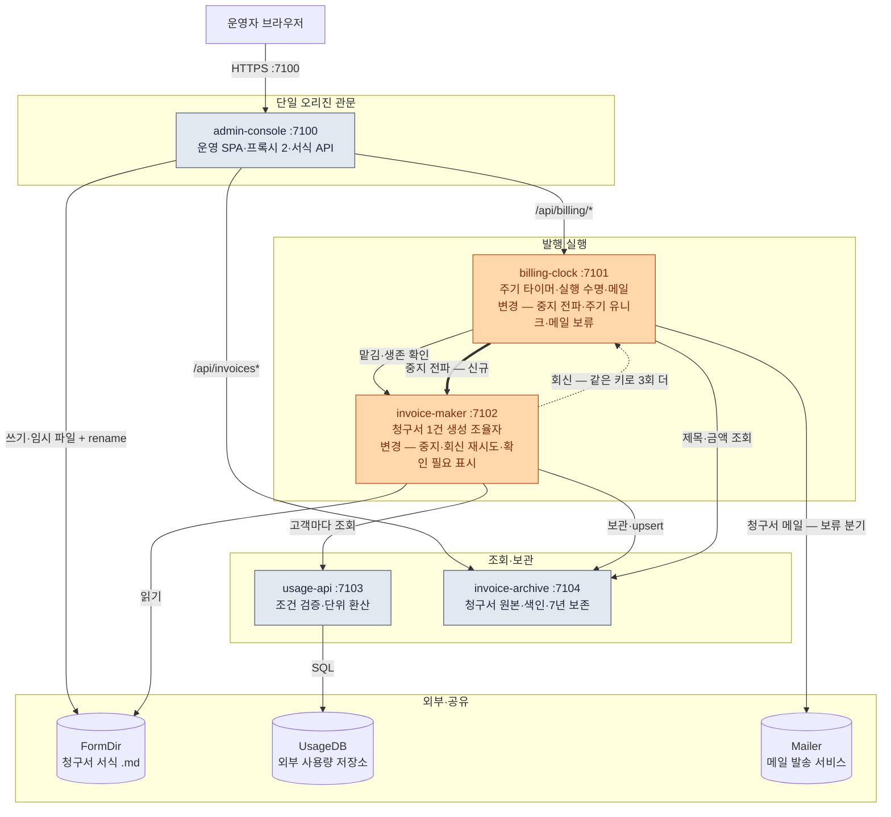

# 월별 청구서 발행 시스템 — TO-BE 시스템 설계서

> **가상의 예시 시스템** — 경로·줄 번호·수치는 형식 예시다. 양식의 원본은 [시스템 설계 문서 양식](../../../system-design-document-guide.md)이고, 이 파일은 그 TO-BE 열을 채운 모양을 보여 준다. 짝인 [AS-IS 예시](../as-is/system-design-as-is.md)와 같은 절 번호로 대조해 읽는다.
> **DATE** 2026.03.02 · **기준 커밋** `5e6f7a8`(가상·AS-IS와 같은 커밋), 작업 트리 clean
> **범위** 바뀌는 두 경계(billing-clock·invoice-maker)와 그 사이 계약 — AS-IS 이슈 6건 중 4건에 대한 개선안을 다룬다. 범위 밖: 메일 재시도(`B-03`), 마감 조정(`AS-IS C-01`) — 처분은 [§9.4](#94-물려받는-이슈-처분)
> **근거** AS-IS 이슈 6건 가운데 4건을 요구 4건으로 옮기고, 설계 항목 4건과 결정 2건으로 답했다(§2). 바뀌는 경계의 상세 목록은 [§8](#8-상세근거-인덱스와-한계)에 있다. TO-BE 브리프는 예시 분량 때문에 두지 않았다 — 실제 큰 설계는 `to-be/_evidence-brief.md`를 둔다([양식 §8](../../../system-design-document-guide.md#8-근거-브리프))
> **표기** 경계 토폴로지는 Mermaid `flowchart`, 경계 사이 흐름은 [`jobflow`](../../../job-flow-diagram-guide.md)로 그린다. 실행 행과 생성 레코드의 상태 기계는 [`state`](../../../state-diagram-guide.md)이고 상세에만 둔다
> **원칙** AS-IS에서 옮긴 사실은 AS-IS 절·ID로 인용하고, 새 계약·심볼은 `(제안)`, 가정은 「가정」, 확인하지 못한 것은 「미확인」으로 적는다. 2.3의 `상태`는 설계 반영 여부이고 구현 완료가 아니다. 설계 항목 `C-n`과 겹치는 AS-IS 접두 `C`는 `AS-IS C-01`처럼 쓴다
> **공통 한계** 가상 시스템이라 실행·측정한 것이 없다. 런타임 동작과 효과는 모두 설계상 예상이다
> **설계 유형** 기존 시스템 개선 — 동작 중인 다섯 경계의 AS-IS가 있고, 바꾸는 것은 그중 billing-clock ↔ invoice-maker 사이 계약이다
> **입력 근거** 요구는 [AS-IS 브리프의 이슈 색인](../_evidence-brief.md#3-이슈-색인)에서 왔다. AS-IS 문서는 [`../as-is/system-design-as-is.md`](../as-is/system-design-as-is.md)(DATE 2026.03.02·커밋 `5e6f7a8`)와 상세 2편([billing-clock](../as-is/details/billing-clock.md), [invoice-maker](../as-is/details/invoice-maker.md))이다

## 0. 한눈에 보기 — 경계는 그대로 두고 시계와 생성기 사이 계약 넷을 고친다



**범례** 주황 = 변경 경계, 회색 = 유지 경계, 굵은 화살표 = 신규 계약, 점선 = 생성기가 시계로 돌려보내는 회신, 실린더 = 외부 시스템과 공유 디렉터리. 신규·제거 경계는 없다.

**요지**

- **문제**: 중지가 실행 행만 닫고 종결 가드가 그 행을 다시 받아들여, 계속 돈 생성이 보관되고 메일까지 나간다(`B-01`). 같은 주기에 실행이 둘 생기면 고객이 메일을 두 번 받는다(`B-02`). 회신은 한 번만 보내서 유실되면 생존 확인이 거둘 때까지 늦고(`AS-IS C-02`), 사용량 조회 실패는 0원 항목인 채 성공으로 끝나 고객에게 나간다(`AS-IS C-03`).
- **해법**: 경계를 늘리지 않고 두 조율자 사이 계약 넷을 고친다 — 생성기 중지 라우트와 시계 전파·가드 보강(`C-01`·`D-01`), 주기 유니크와 맡김 멱등(`C-02`), 같은 키로 하는 회신 재시도(`C-03`·`D-02`), `확인 필요` 표시와 메일 보류(`C-04`).
- **효과**: 보관 직전 확인 전에 중지가 확정된 실행은 보관·메일을 막고(`R-01`), 주기마다 실행이 하나이며(`R-02`), 회신 재시도를 27초의 설정 예산 안에서 시도한다(`R-03` — 40초 종결 보장은 미확정), 사용량을 확인하지 못한 고객이 든 청구서는 고객에게 가지 않는다(`R-04`). 측정 전 설계상 예상이다.
- **남은 위험**: 단계 한도 합이 마감과 같은 문제(`AS-IS C-01`)와 메일 재시도 없음(`B-03`)은 보류다. 보관 직전 확인을 지난 실행은 멈출 수 없고, 보류한 메일을 푸는 절차는 정하지 못했다(§9.5).

## 1. 핵심 용어

AS-IS 용어(틱, 실행, 주기, 맡김, 회신, 생존 확인, 마감, 0원 항목, `dedupKey`)는 [AS-IS §1](../as-is/system-design-as-is.md#1-핵심-용어)을 따른다. 여기에는 이 설계가 새로 쓰는 말만 둔다.

| 용어 | 뜻 | 원본 |
|---|---|---|
| 중지 확인 지점 | 생성기가 실행 중에 중지를 보는 두 자리 — 사용량 조회 중단과 보관 직전 확인. 보관 직전 확인을 지난 실행은 중지를 받지 않는다(409 `TOO_LATE`) | `C-01`, [생성기 상세 `JF-2`](details/invoice-maker.md#jf-2-생성-조율과-중지-확인-지점--invoicemakerwork) |
| 중지 기록 | 실행 중이 아닌 runId에 중지가 오면 생성기가 남기는 `stopped` 레코드. 뒤늦게 온 `make`를 409 `STOPPED`로 돌려보낸다 | `C-01`, [생성기 상세 `JF-1.1`](details/invoice-maker.md#jf-11-중지-접수--invoicemakerstop) |
| 한 번도 맡기지 않은 행 | `pending`이면서 맡긴 시각(`handed_at`)이 비어 있는 실행 행. 생성기에 그 runId의 실행이 없다고 확신할 수 있는 유일한 경우다 | `C-01`, [시계 상세 `JF-3`](details/billing-clock.md#jf-3-운영-api-중지--billingclockstoprun) |
| 실행 번호 `try` | 생성기가 같은 runId를 몇 번째로 실행하는지. 시계가 재시도로 같은 runId를 다시 맡길 때마다 1씩 늘어난다. 회신 식별 키 `<runId>:<try>`의 뒷부분이고, 회신을 몇 번 다시 보냈는지와는 다르다 | `C-03`, [생성기 상세 §6](details/invoice-maker.md#6-실패-경계) |
| `needs-check` 항목 | 사용량 조회가 실패한 고객의 청구 항목. 금액 대신 `확인 필요`로 렌더되고 합계에서 빠지며, 고객 ID가 회신의 `heldLines`에 담긴다 | `C-04`, [생성기 상세 `JF-2.1`](details/invoice-maker.md#jf-21-고객별-사용량-조회--usageclientfetchall) |
| 메일 보류 | `heldLines`가 든 `issued` 회신을 받은 시계가 메일을 보내지 않고 수신자마다 `deliveries` 행을 `held`로 남기는 것 | `C-04`, [시계 상세 `JF-2`](details/billing-clock.md#jf-2-종결과-보류-발송--billingclockfinishrun) |

## 2. 기능·요구 — 무엇을 해주고 왜 바꾸나

**결론**: 운영자와 고객이 얻는 결과(발행일마다 보관되는 청구서와 청구서 메일)는 AS-IS와 같다. 바뀌는 것은 그 결과의 신뢰성 넷이다 — 중지하면 정말 멈추고, 주기마다 한 번만 나가고, 회신을 잃어도 제때 닫히고, 금액을 모르는 청구서는 나가지 않는다.

### 2.1 사용자·업무 결과

| 사용자·업무 결과 | 트리거 | 책임 경계 | 요구 | AS-IS 대비 |
|---|---|---|---|---|
| 청구서 서식을 만들고 고친다 | 서식 화면 「저장」 | admin-console `/forms*` → FormDir | — | 유지 |
| 청구 계획을 걸어 두면 발행일마다 청구서가 한 건씩 만들어져 보관된다 | 계획 화면, 20초 틱 | billing-clock → invoice-maker → invoice-archive | `R-02` | 변경 |
| 발행일을 기다리지 않고 지금 한 번 발행한다 | 「지금 발행」 | billing-clock `issue` → invoice-maker | `R-02` | 변경 |
| 진행 중인 발행을 멈추면 그 청구서가 보관·발송되지 않는다 | 실행 목록 「중지」 | billing-clock → invoice-maker | `R-01` | 변경 |
| 고객이 청구서 메일을 주기마다 한 번, 제때 받는다 | 실행 `closed` 종결 | billing-clock → Mailer | `R-02`·`R-03` | 변경 |
| 사용량을 확인하지 못한 고객이 든 청구서는 고객에게 가지 않는다 | 사용량 조회 실패 | invoice-maker → billing-clock(보류) | `R-04` | 변경 |
| 보관된 청구서를 찾아 연다 | 검색, 행 선택 | admin-console 프록시 → invoice-archive | — | 유지 |

### 2.2 요구

| R-ID | 필요한 기능/해결할 문제 | 근거 | 성공 기준 | 우선순위 |
|---|---|---|---|---|
| `R-01` | 중지하면 생성도 멈추고 청구서가 보관·발송되지 않아야 한다 | `B-01` | 실행 중이던 실행은 생성기의 중지 확인(200) 뒤 `Archive.file` 0회·메일 0회이고, 실행 행 `dropped(stopped)`와 생성 레코드 `stopped`로 끝나 늦은 회신에도 되살아나지 않는다. 한 번도 맡기지 않은 실행은 생성기를 부르지 않고 행만 `dropped(stopped)`가 된다 | 높음 |
| `R-02` | 같은 주기 실행은 하나만 생겨야 한다 | `B-02` | 틱과 「지금 발행」이 같은 주기를 겹쳐 시작해도, 틱 ①이 행 생성과 다음 발행 시각 사이에서 멈췄다 다시 떠도 실행 행 1개·메일 1회 | 높음 |
| `R-03` | 회신이 유실돼도 40초 안에 종결돼야 한다 | `AS-IS C-02` | 시계가 살아 있을 때 회신 첫 시도가 실패해도 생성이 끝난 뒤 40초 안에 실행 행이 닫힌다 | 중간 |
| `R-04` | 사용량 조회 실패를 0원이 아니라 `확인 필요` 항목으로 드러내고 그 청구서의 발송을 보류해야 한다 | `AS-IS C-03` | 고객 1명의 조회가 실패하면 문서에 그 고객의 `확인 필요` 항목, 회신 `heldLines`에 그 고객 ID가 있고 메일은 0회 | 높음 |

### 2.3 설계 항목

| C-ID | AS-IS 대비 | 무엇을 설계하나 | 근거 요구·이슈 | 소유 경계 | 상태 | 상세 |
|---|---|---|---|---|---|---|
| `C-01` | 변경 | 생성기 중지 라우트 `POST /api/makes/:runId/stop`(제안) + 시계의 전파 — 시계는 생성기가 중지를 확인한 뒤에만 맡긴 행을 닫고, 종결 가드가 `dropped(stopped)`도 거른다 | `R-01`, `B-01` | invoice-maker, billing-clock | 반영 | [생성기 상세 §2](details/invoice-maker.md#2-공개-계약), [시계 상세 `JF-3`](details/billing-clock.md#jf-3-운영-api-중지--billingclockstoprun), [§5.3](#53-청구-계획-등록즉시-발행중지) |
| `C-02` | 변경 | `runs (plan_id, cycle)` 유니크 + 맡김 멱등 — 같은 주기 행이 있으면 새로 만들지도 맡기지도 않는다 | `R-02`, `B-02` | billing-clock | 부분 — 끝난 주기의 다시 발행은 미확정(§9.5) | [시계 상세 `JF-1`](details/billing-clock.md#jf-1-맡김-멱등--billingclockstartdueruns), [§9.3](#93-이행롤백) |
| `C-03` | 변경 | 회신 재시도 — 1·4·10초 대기로 3회 더, 시도당 5s → 3s, 요청 식별 키 `<runId>:<try>` | `R-03`, `AS-IS C-02` | invoice-maker, billing-clock(수신 보장 미확정) | 부분 — 40초 종결·중복 failed 처리는 미확정(§9.5) | [생성기 상세 §6](details/invoice-maker.md#6-실패-경계), [§5.5](#55-실행-종결과-발송) |
| `C-04` | 변경 | 조회 실패 표시 계약 — 항목 `needs-check` 표시 + 회신 `heldLines` + 시계의 메일 보류 | `R-04`, `AS-IS C-03` | invoice-maker, billing-clock | 부분 — 보류를 푸는 절차는 미확정(§9.5) | [생성기 상세 `JF-2.1`](details/invoice-maker.md#jf-21-고객별-사용량-조회--usageclientfetchall), [시계 상세 `JF-2`](details/billing-clock.md#jf-2-종결과-보류-발송--billingclockfinishrun), [§5.4](#54-정기-청구서-생성--맡김에서-회신까지) |

### 2.4 주요 결정

장점·단점 앞머리는 [TO-BE 프롬프트](../../../../prompts/system-design-to-be-prompt.md#1-요구사항과-대안)의 비교 기준(응집, 의존 방향, 작업 맥락, 검증, 이행/운영 비용)이다.

#### D-01 중지 전파 방식

| 대안 | 장점 | 단점 | 판단 |
|---|---|---|---|
| A. 시계가 생성기 중지 라우트를 부른다 | 응집: 생성 레코드는 소유자인 생성기만 바꾼다. 의존 방향: 맡김·생존 확인과 같은 시계 → 생성기 방향이다. 검증: 보관 전에 멈췄는지를 응답 하나로 안다 | 이행/운영 비용: 생성기가 불통이면 중지가 503으로 실패해 운영자가 다시 눌러야 하고, 배포 순서가 묶인다(§9.3) | **선택** |
| B. 생성기가 시계의 실행 상태를 주기적으로 묻는다 | 이행/운영 비용: 시계의 호출 쪽을 바꾸지 않는다 | 의존 방향: 생성기 → 시계 읽기가 새로 생긴다. 검증: 묻는 간격만큼 늦게 멈추고, 보관과 겹치지 않게 하려면 보관 직전마다 다시 물어야 한다 | 기각 |
| C. 두 경계가 함께 보는 DB에 중지 플래그를 둔다 | 작업 맥락: 호출 계약을 새로 만들지 않는다 | 응집: 경계마다 자기 저장소를 갖는 구조가 깨지고 한 값의 쓰기 주체가 둘이 된다. 이행/운영 비용: 공유 저장소를 새로 운영한다 | 기각 |

- **선택** A — `Clock.stopRun`이 `Maker.stop`(`POST /api/makes/:runId/stop` — 제안)을 부르고 200을 받은 뒤에만 실행 행을 `dropped(stopped)`로 바꾼다. 종결 가드는 `dropped(stopped)` 행에 온 회신을 버린다(§5.3·§5.5, [시계 상세 `JF-3`](details/billing-clock.md#jf-3-운영-api-중지--billingclockstoprun)).
- **근거** 대안이 갈린 기준은 응집과 의존 방향이다 — 상태 소유자가 자기 레코드를 바꾸면서 두 경계의 결합이 계약 하나로 끝나는 것은 A뿐이다.
- **AS-IS 대비** AS-IS의 중지는 라우트 처리기가 실행 행만 닫았고, 늦은 `issued` 회신이 그 행을 `closed`로 되돌렸다(`B-01`, [AS-IS §5.3](../as-is/system-design-as-is.md#53-청구-계획-등록즉시-발행중지)).

#### D-02 회신 신뢰성

| 대안 | 장점 | 단점 | 판단 |
|---|---|---|---|
| A. 생성기가 같은 키로 회신을 다시 보낸다 | 이행/운영 비용: 새 인프라가 없다. 작업 맥락: 바뀌는 곳이 생성기 `ReplyClient` 하나다. 응집: 받는 쪽은 기존 `closed` 가드로 겹친 `issued`를 버린다 | 검증: 네 번 다 실패하면 여전히 생존 확인에 기댄다. 이행/운영 비용: 재시도 중 자원을 더 오래 사용한다(시도·대기 설정 합 27초) | **선택** |
| B. 메시지 브로커를 들인다 | 검증: 전달 보장과 재전송을 브로커가 맡는다 | 이행/운영 비용: 운영할 인프라와 배포 단위가 하나씩 늘고, 실행 하나에 회신 하나인 규모에 비해 크다 | 기각 — 새 인프라·운영 비용 |

- **선택** A — `ReplyClient.send` 재시도 + 헤더 `Idempotency-Key: <runId>:<try>`(제안 — 수신자는 로그에만 남기므로 이 키 자체가 멱등 처리를 보장하지 않는다). 받는 쪽 계약 `POST /api/replies`는 경로와 응답(204)이 그대로이고 본문에 `heldLines`만 더한다(§5.5).
- **근거** 갈린 기준은 이행/운영 비용이다. A를 잠정 선택하되 `R-03` 충족은 아직 입증하지 못했다. 제한된 재시도는 네 번 모두 실패할 수 있고, B도 브로커의 전달·지연 계약 없이는 40초 종결을 보장하지 않는다(§9.5).
- **AS-IS 대비** AS-IS 회신은 5s 한 번으로 끝난다(`AS-IS C-02`).

## 3. 구조 — 무엇으로 이뤄져 있나

**결론**: 경계 다섯과 조율자 둘(실행 수명 = billing-clock, 생성 = invoice-maker)은 AS-IS와 같다. 바뀌는 것은 두 조율자 사이 계약이고, 의존 방향은 늘지 않는다.

| 경계 | 포트·형태 | 한 줄 책임 | 공개 진입점 | 소유 상태 | 나가는 의존 | AS-IS 대비 |
|---|---|---|---|---|---|---|
| admin-console | 7100 | 단일 오리진 관문 — 운영 SPA + 관통 프록시 2 + 서식 API | 경로 접두 4갈래 | FormDir(쓰기) | billing-clock, invoice-archive, FormDir | 유지 — 「중지」도 기존 `/api/billing/*` 프록시를 지난다 |
| [**billing-clock**](details/billing-clock.md) | 7101 | 도래 판정 + 실행 수명 + 청구서 메일. 20초 틱이 도는 곳은 이 경계뿐이다 | 라우트 11개 + 20초 틱(라우트 수 유지) | `clock.mv.db` 4표(+`runs` 주기 유니크, `deliveries.result`에 `held`) | invoice-maker(+중지), invoice-archive, Mailer | 변경 — `C-01`·`C-02`·`C-04` |
| [**invoice-maker**](details/invoice-maker.md) | 7102 | 청구서 1건의 생성 조율자 | 라우트 4개(기존 3 + 중지 1 — 제안) | `makes/<runId>.json`(+`stopped`·`heldLines`·`try`), `spare/<runId>/` | FormDir(읽기), usage-api, invoice-archive, billing-clock(회신) | 변경 — `C-01`·`C-03`·`C-04` |
| usage-api | 7103 | 외부 사용량 DB 조회 어댑터 — 조건 검증 + 단위 환산 | `POST /api/usage` | 없음(무상태) | UsageDB | 유지 |
| invoice-archive | 7104 | 청구서 파일 원본 + 검색 색인 + 7년 보존 | 라우트 4개 | `invoices/<invoiceId>/` 파일 + `search.idx` | **0개** | 유지 |

### 3.1 의존 방향에서 드러나는 사실

- billing-clock ↔ invoice-maker의 양방향(맡김·생존 확인 / 회신)은 그대로이고, 시계 → 생성기 쪽에 중지 계약 하나가 늘어난다. 생성기가 시계의 상태를 읽는 의존은 만들지 않았다(`D-01`).
- 두 조율자 사이에 있는 것은 HTTP 계약 넷(맡김, 생존 확인, 신규 중지, 회신)이 전부다. 함께 쓰는 저장소나 트랜잭션은 여전히 없다(§5.7).
- 회신 재시도는 생성기 안에서 끝난다. 시계는 회신 경로가 그대로이고, 겹쳐 도착한 `issued`는 기존 `closed` 가드가 버린다(`D-02`).
- 같은 주기의 중복을 막는 곳이 둘이 된다 — invoice-archive의 `dedupKey` upsert(유지)는 청구서 파일을, 주기 유니크(`C-02`)는 실행 행과 메일을 막는다.

## 4. 경계별 기능 목록 — 각 경계가 무엇을 하나

**결론**: 변경 경계 둘만 기능 표를 펼친다. `AS-IS 대비` 열은 변경 종류(신규·변경·유지)이고, 2.3의 `상태`(설계 반영 여부)와 다른 열이다.

### 4.1 admin-console :7100

유지 — [AS-IS 4.1](../as-is/system-design-as-is.md#41-admin-console-7100)과 같다.

### 4.2 billing-clock :7101

| 기능 | 내용 | 진입점 | AS-IS 대비 | C-ID |
|---|---|---|---|---|
| 틱 ① 도래·맡김 | 실행 행을 `(plan_id, cycle)` 유니크로 만들고, 맡기기 전에 조건부로 `active`를 적은 뒤 맡긴다(AS-IS는 202를 받은 뒤 `active`) | 20초 틱 | 변경 | `C-01`·`C-02` |
| 즉시 발행 | 같은 주기 규칙을 탄다 — 그 주기 실행이 열려 있으면 그 runId로 202, 끝났으면 409(잠정 — §9.5) | `POST /api/plans/:planId/issue` | 변경 | `C-02` |
| 중지 | 한 번도 맡기지 않은 행이면 행만 닫는다. 그 밖의 열린 행(`active`, 재시도 대기)은 생성기 중지를 부르고 200일 때만 `dropped(stopped)`, 409나 불통이면 행을 그대로 두고 409·503 | `POST /api/runs/:runId/stop` | 변경 | `C-01` |
| 틱 ② 생존 확인 | 생성 레코드의 `stopped`를 새로 읽어 행을 `dropped(stopped)`로 닫는다 | 20초 틱 | 변경 | `C-01` |
| 종결·청구서 메일 | 종결 가드가 `closed`에 더해 `dropped(stopped)`도 버린다. `heldLines`가 있으면 메일 대신 수신자마다 `deliveries`에 `held` | `POST /api/replies`, 실행 `closed` 종결 | 변경 | `C-01`·`C-04` |
| 계획 관리·실행 조회·틱 ③ 마감 정리 | AS-IS와 같다 | `/api/plans*`, `GET /api/runs*`, 20초 틱 | 유지 | — |

### 4.3 invoice-maker :7102

| 기능 | 내용 | 진입점 | AS-IS 대비 | C-ID |
|---|---|---|---|---|
| 생성 접수 | `working`·`issued`면 `alreadyRunning:true`(유지), 중지 기록이 있으면 409 `STOPPED` | `POST /api/makes` | 변경 | `C-01` |
| 생성 중지 | 보관 직전 확인 전이면 중지를 확정하고 진행 중인 조회를 끊는다. 실행 중이 아니면 중지 기록을 남긴다. 보관 단계나 `issued`면 409 `TOO_LATE` | `POST /api/makes/:runId/stop`(제안) | 신규 | `C-01` |
| 준비·사용량 조회 | 조회 실패를 0원이 아니라 `needs-check`로 남긴다. 중지되면 남은 조회를 시작하지 않는다 | 생성 단계 1~3 | 변경 | `C-01`·`C-04` |
| 계산·보관·회신 | 보관 직전 중지 확인(신규), `확인 필요` 렌더, 회신 재시도 + 키 + `heldLines` | 생성 단계 4~7 | 변경 | `C-01`·`C-03`·`C-04` |
| 단계 조회·기동 정리 | `phase`에 `stopped`, 필드 `heldLines`·`try` / 기동 정리는 유지 | `GET /api/makes/:runId`, 기동 | 변경 | `C-01`·`C-04` |

### 4.4 usage-api :7103

유지 — [AS-IS 4.4](../as-is/system-design-as-is.md#44-usage-api-7103)와 같다. 생성기가 진행 중인 조회를 끊어도(`C-01`) 계약은 그대로다.

### 4.5 invoice-archive :7104

유지 — [AS-IS 4.5](../as-is/system-design-as-is.md#45-invoice-archive-7104)와 같다. `확인 필요` 항목이 든 청구서도 같은 계약으로 보관된다.

## 5. 흐름 — 경계끼리 어떻게 소통하나

**결론**: 협력은 AS-IS와 같은 세 갈래(운영자 요청, 20초 틱의 정기 생성, 생성 뒤의 종결과 메일)이고, 경계 사이에 새로 생기는 화살표는 시계 → 생성기의 중지 하나다. 나머지는 같은 노드의 계약 변경(주기 유니크, 회신 재시도, `heldLines`, 종결 가드)이다. 맡김의 202는 여전히 접수 확인이고, 업무가 끝났다는 사실은 보관 + 회신이다.

이 절의 그림에는 경계 사이의 요청·응답만 그렸다. 경계 안은 드릴다운 색인([§5.8](#58-경계-내부-job-flow-드릴다운-색인))으로 연다.

### 5.0 표기

- [AS-IS §5.0](../as-is/system-design-as-is.md#50-표기)의 `scope:`·요청자·프록시 응답·예외 노드 약속을 그대로 따른다. 경계별 객체도 아래처럼 유지한다.
- 유지되는 계약은 AS-IS와 같은 노드 이름을 쓴다. 노드 표는 `노드 | 실제 계약 | AS-IS 대비`이고, 새 계약·바뀐 계약에는 `(제안)`을 붙인다.

| 객체 | 경계 | 객체 | 경계 |
|---|---|---|---|
| `Browser` | admin-console 화면(SPA) | `Archive` | invoice-archive :7104 |
| `Console` | admin-console 서버 :7100 | `FormDir` | 청구서 서식 `.md` 공유 디렉터리 |
| `Clock` | billing-clock :7101 | `UsageDB` | 외부 사용량 저장소 |
| `Maker` | invoice-maker :7102 | `Mailer` | 메일 발송 서비스 |
| `UsageApi` | usage-api :7103 | | |

### 5.1 전체 한 장

```jobflow
scope: 월별 청구서 발행 시스템 경계 간 협력 전체 — TO-BE
Object: Browser, Console, FormDir, Maker, UsageApi, UsageDB, Archive, Clock, Mailer

Clock.OnTick --> Maker.make
Clock.OnTick --> Maker.peek
Maker.work --> FormDir.read
Maker.work --> UsageApi.fetch
UsageApi.fetch --> UsageDB.select
Maker.work --> Archive.file
Maker.work --> Clock.acceptReply
Clock.acceptReply --> Clock.finishRun
Clock.finishRun --> Archive.open
Clock.finishRun --> Mailer.send
Browser.call --> Console.route
Console.route --> FormDir.edit
Console.route --> Clock.operate
Clock.operate --> Maker.stop
Console.route --> Archive.browse
```

**읽는 법** 줄 무리는 AS-IS와 같은 넷이다 — `Clock.OnTick`이 맡기고 묻는 두 줄, `Maker.work`가 내보내는 서식 읽기·사용량 조회·보관·회신, 회신 뒤의 종결과 메일, `Browser.call`에서 시작해 `Console.route`에서 나뉘는 운영자 요청. 새 줄은 운영자 요청 무리의 `Clock.operate --> Maker.stop` 하나이고, 운영 API 가운데 「중지」가 생성기까지 닿는 길이다. 주기 유니크·회신 재시도·`heldLines`·종결 가드는 같은 화살표의 계약이나 경계 안 동작이 바뀌는 것이라 그림 모양에 드러나지 않는다. `Object:` 순서는 AS-IS와 같다 — 트리거가 둘(`Clock.OnTick`·`Browser.call`)이라 [순서 규칙](../../../job-flow-diagram-guide.md#렌더러-배치-특성)을 출발점으로 손으로 정했다. 호출되지 않는 `Browser`가 맨 왼쪽이고, 회신을 받는 `Clock`은 `Mailer` 바로 앞에 둬 회신 화살표가 앞 행에 끼어들지 않게 했다. 새 줄을 `Console.route --> Clock.operate` 바로 뒤에 둔 것도 배치 때문이다 — 왼쪽으로 가는 `Maker.stop` 칸이 `operate` 바로 아래 행에 그려진다.

- **묶음 노드** — `Clock.operate`는 계획·실행 API(`plans`·`issueNow`·`getRun`·`listRuns`·`stopRun`), `Archive.browse`는 검색·열람, `FormDir.edit`는 서식 읽기·쓰기, `Console.route`는 두 프록시와 서식 API, `Browser.call`은 화면이 보내는 요청 전부다. 실제 계약은 §5.2·§5.3·§5.6의 그림에서 연다.
- 중지도 시계에서 생성기로 미는 방향이다. 생성기는 여전히 시계의 상태를 읽지 않는다(`D-01`).
- 이 그림은 종결 뒤의 결과를 가르지 않는다. 메일이 `issued`에서만 나가고 보류(`held`)면 나가지 않는다는 것은 §5.5의 값 분기에서 보인다(`C-04`).

| § | 시나리오 | 트리거 | 완료 사실 | AS-IS 대비 |
|---|---|---|---|---|
| [5.2](#52-청구서-서식-편집) | 청구서 서식 편집 | 서식 화면 「저장」 | 서식 파일 저장 + 새 ETag | 유지 |
| [5.3](#53-청구-계획-등록즉시-발행중지) | 청구 계획 등록·즉시 발행·중지 | 계획 화면, 「지금 발행」, 「중지」 | `plans` 행, 202 `runId`, 실행 행 `dropped(stopped)` — 맡긴 적 있는 실행은 생성 레코드도 `stopped` | 변경 — `C-01`·`C-02` |
| [5.4](#54-정기-청구서-생성--맡김에서-회신까지) | 정기 청구서 생성 | 20초 틱의 발행일 도래 | invoice-archive 보관 + 회신(`heldLines` 포함), 중지면 둘 다 없음 | 변경 — `C-01`·`C-02`·`C-04` |
| [5.5](#55-실행-종결과-발송) | 실행 종결과 발송 | 회신(재시도), 생존 확인, 마감 | 실행 행 종결 + 메일 1회, `heldLines`가 있으면 메일 보류 | 변경 — `C-01`~`C-04` |
| [5.6](#56-청구서-검색과-열람) | 청구서 검색과 열람 | 검색, 행 선택 | 검색 결과, 청구서 표시 | 유지 |

교차 사실 [5.7](#57-실행-상태--두-상태-기계)도 바뀐다 — 생성 레코드에 `stopped` 값이 생긴다.

### 5.2 청구서 서식 편집

유지 — [AS-IS §5.2](../as-is/system-design-as-is.md#52-청구서-서식-편집)와 노드·계약·완료 사실이 같다.

### 5.3 청구 계획 등록·즉시 발행·중지

```jobflow
scope: 청구 계획 등록·즉시 발행·중지 — TO-BE
Object: Browser, Console, Clock, Maker

Browser.savePlan --> Console.proxyBilling
Console.proxyBilling --> Clock.plans
Browser.issueNow --> Console.proxyBilling
Console.proxyBilling --> Clock.issueNow
Clock.issueNow --> Maker.make
Clock.issueNow.result --> Browser.openRun
Browser.openRun --> Console.proxyBilling
Console.proxyBilling --> Clock.getRun
Browser.stopRun --> Console.proxyBilling
Console.proxyBilling --> Clock.stopRun
Clock.stopRun --> Maker.stop
Maker.stop.stopped
Maker.stop.tooLate
Maker.stop.unreachable
```

| 노드 | 실제 계약 | AS-IS 대비 |
|---|---|---|
| `Console.proxyBilling`·`Clock.plans`·`Browser.openRun` → `Clock.getRun` | `/api/billing/<rest>` → `:7101/api/<rest>` 관통 프록시, `POST·PATCH·GET·DELETE /api/plans`, 202를 받은 화면의 다음 동작 `openRun`(공개 계약 아님)이 `GET /api/runs/:runId`를 5초마다 | 유지 |
| `Clock.issueNow` → `Maker.make` | `POST /api/plans/:planId/issue` → 같은 주기 규칙으로 실행 행(제안) → `POST /api/makes` → **202 `{runId}`**(접수 확인) | 변경 — 그 주기 실행이 열려 있으면 그 runId로 202, 끝났으면 새 행 없이 409 `{error:'CYCLE_DONE', runId, state}`(`C-02`, 잠정) |
| `Clock.stopRun` → `Maker.stop` | `POST /api/runs/:runId/stop` → `POST /api/makes/:runId/stop`(제안) | 신규 화살표 — AS-IS는 라우트 처리기가 실행 행만 닫았다(`B-01`) |
| `.stopped`·`.tooLate`·`.unreachable` | (제안) 생성기 200 → 행 `dropped(stopped)`, 운영자에게 `{stopped:true}` / 409 `TOO_LATE` → 행 그대로, 회신이 `closed`로 닫는다 / 불통·5xx·그 밖의 응답(옛 생성기의 404 포함) → 행 그대로, 503 | 신규 — `C-01` |
| (그림 밖) `Clock.listRuns` | `GET /api/runs?state=` — 실행 목록이 「중지」 버튼을 붙일 행 | 유지 |

- **완료 사실이 바뀐다** — 맡긴 적 있는 행은 생성기가 `stopped`를 확정한 뒤에만 닫혀, 두 상태 기계가 같은 `stopped`로 끝난다(§5.7). `Maker.stop`의 세 응답은 단독 줄이다 — 그 뒤로 다른 경계를 부르지 않고, 시계가 행을 쓰고 운영자에게 줄 응답을 정해 끝낸다. 각 줄이 무엇으로 끝나는지는 표의 `.stopped`·`.tooLate`·`.unreachable` 행에 있다.
- **한 번도 맡기지 않은 행만 생성기를 부르지 않는다** — `pending`이고 맡긴 시각이 비어 있으면 생성기에 그 runId가 없으므로 AS-IS처럼 행만 `dropped(stopped)`로 닫는다. 재시도를 기다리는 `pending`은 다르다 — 마감 정리 뒤에도 앞 시도가 돌고 있을 수 있어(`AS-IS C-01`) 생성기 중지를 거친다. 같은 순간 틱 ①이 그 행을 맡기려 하면 한쪽만 행을 바꾼다([시계 상세 `JF-3`](details/billing-clock.md#jf-3-운영-api-중지--billingclockstoprun)).
- **대표 실패 흐름** — 보관 직전 확인을 지난 실행의 중지는 `.tooLate`로 거절되고 그 실행은 `closed`까지 간다. 생성기가 불통이면 `.unreachable`이고 운영자가 다시 누른다. 행만 닫고 넘어가면 AS-IS의 절반 중지로 돌아가므로 그렇게 하지 않는다.

### 5.4 정기 청구서 생성 — 맡김에서 회신까지

```jobflow
scope: 정기 청구서 1건 생성 — 확인 필요 표시 — TO-BE
Object: Maker, FormDir, UsageApi, UsageDB, Archive, Clock

Clock.OnTick --> Maker.make
Maker.work --> FormDir.read
Maker.work --> UsageApi.fetch
UsageApi.fetch --> UsageDB.select
Maker.work --> Archive.file
Maker.work --> Clock.acceptReply
```

| 노드 | 실제 계약 | AS-IS 대비 |
|---|---|---|
| `Clock.OnTick` → `Maker.make` | 틱 ① 발행일 도래 → 실행 행을 `(plan_id, cycle)` 유니크로 만들고(제안) → 맡기기 전에 조건부 `pending → active`(제안) → `POST /api/makes {runId, planId, cycle, formId, rates, customers[]}` → **202 `{runId, alreadyRunning}`**, 중지 기록이 있는 runId면 409 `STOPPED`(제안) | 변경 — 주기 유니크(`C-02`), `active`를 202 앞으로(`C-01`), 중지 기록(`C-01`) |
| `Maker.work` | 실행 노드 — 202 뒤의 백그라운드 실행(공개 계약 없음). 아래 요청을 줄 순서대로 보낸다 | 유지 |
| `FormDir.read`·`UsageApi.fetch` → `UsageDB.select` | 서식 파일 읽기, 고객마다 `POST /api/usage {accountIds, from, to}`(동시 3, 전체 90s) → SQL(질의당 30s) | 유지(계약) — 실패를 `needs-check`로 남기는 것(`C-04`)과 중지 때 조회를 끊는 것(`C-01`)은 생성기 안의 변경이다 |
| `Archive.file` | `POST /api/invoices` `dedupKey: <planId>/<cycle>` upsert → 201/200 `{invoiceId, replaced}`(15s) — `확인 필요` 항목이 있어도 보관한다 | 유지 |
| `Clock.acceptReply` | `POST /api/replies {runId, outcome, invoiceId, note}` + `heldLines`(제안), 헤더 `Idempotency-Key`(제안), 시도당 3s | 변경 — `C-03`·`C-04`(재시도는 §5.5). AS-IS는 5s 한 번 |
| (그림 밖) 중지 확인 지점 | (제안) `Maker.work` 안의 두 자리 — 조회 중단, 보관 직전 확인. 중지가 보이면 보관·회신 없이 끝난다. 실행 노드의 안쪽이라 이 그림에 그리지 않고 [생성기 상세 `JF-2`](details/invoice-maker.md#jf-2-생성-조율과-중지-확인-지점--invoicemakerwork)에서 연다 | 신규 — `C-01` |

- **대표 실패 흐름(부분 실패)** — 고객 한 명의 사용량 조회가 실패해도 흐름은 끊기지 않는다. 그 고객 항목은 0원이 아니라 `확인 필요`로 렌더되어 합계에서 빠지고, 청구서는 보관되며, 회신은 `outcome: issued`에 `heldLines: [그 고객]`을 싣는다. 메일은 시계가 보류한다(§5.5). AS-IS는 0원 항목으로 성공 처리했다(`AS-IS C-03`).
- 실행을 `failed`로 끝내는 단계는 AS-IS와 같다(서식·주기 해석·렌더·보관 실패 — [AS-IS 생성기 3.1](../as-is/details/invoice-maker.md#31-생성-단계와-시간-한도)). 중지된 실행은 그 단계에서 예외가 나도 레코드를 다시 쓰지 않는다.
- 단계 한도 합(조회 90s + 렌더 45s + 보관 15s)이 마감 150s와 같은 문제(`AS-IS C-01`)는 남는다. 마감에 생성기 중지를 걸지 않았다 — 걸면 조금 느린 정상 시도가 매번 끝까지 가지 못한다(§9.4).

### 5.5 실행 종결과 발송

```jobflow
scope: 실행 종결 — 회신 재시도·생존 확인 회수·메일 보류 — TO-BE
Object: Maker, Clock, Archive, Mailer

Maker.work --> Clock.acceptReply
Clock.acceptReply --> Clock.finishRun
Clock.OnTick --> Maker.peek
Maker.peek.unreachable
Maker.peek.stopped --> Clock.finishRun
Maker.peek.failed --> Clock.finishRun
Maker.peek.missing --> Clock.finishRun
Maker.peek.issued --> Clock.finishRun
Clock.finishRun.held
Clock.finishRun.issued --> Archive.open
Clock.finishRun.issued --> Mailer.send
```

| 노드 | 실제 계약 | AS-IS 대비 |
|---|---|---|
| `Maker.work` → `Clock.acceptReply` | `POST /api/replies` → 204 — (제안) 타임아웃·5xx·연결 실패면 같은 `Idempotency-Key: <runId>:<try>`로 1·4·10초 뒤 다시 보낸다. 최대 4회, 시도당 3s, 설정한 시도·대기 합 27초 — 조건은 [생성기 상세 §6](details/invoice-maker.md#6-실패-경계) | 변경 — 재시도(`C-03`). AS-IS는 5s 한 번(`AS-IS C-02`) |
| `Clock.acceptReply` → `Clock.finishRun` | `POST /api/replies` → 종결 입구 `finishRun`(종결 입구 노드 — 공개 계약 아님). 가드가 `closed` 행과 (제안) `dropped(stopped)` 행에 온 값을 버린다 | 변경 — `dropped(stopped)` 거르기(`C-01`). 겹쳐 온 `issued`는 기존 `closed` 가드가 버린다 |
| `Clock.OnTick` → `Maker.peek` | 틱 ② 생존 확인 — 맡긴 지 45초 지난 `active` 실행마다 `GET /api/makes/:runId`(4s). `working`은 그대로 둔다(그리지 않음), 응답 없음은 이번 틱은 보류(단독 줄), 404 → `failed`, (제안) `stopped` → 종결 | 변경 — `.stopped` 분기(`C-01`) |
| `Clock.finishRun` | 가드를 지난 값으로 가른다. `failed` → 재시도 판정(30·60·120s, 최대 3회), (제안) `stopped` → `dropped(stopped)`·메일 없음 — 이 둘은 경계 사이 후속이 없어 그리지 않았다 | 변경 — 중지 회수(`C-01`) |
| `Clock.finishRun.held` | (제안) `issued`에 `heldLines`가 있다 → 행 `closed`와 수신자마다 `deliveries`의 `held`를 남기고 메일은 보내지 않는다 | 신규 — `C-04` |
| `Clock.finishRun.issued` → `Archive.open`·`Mailer.send` | 보류할 항목이 없는 `issued` → 행 `closed` → `GET /api/invoices/:invoiceId`(4s)로 제목·금액을 읽고 수신자마다 SMTP 1회(10s), 재시도 없음 | 유지(`B-03` 보류) — 주기마다 실행이 하나라 같은 주기 메일이 두 번 나가지 않는다(`C-02`) |
| (그림 밖) 틱 ③ 마감 정리 | 맡긴 뒤 150s가 지난 `active`를 생성기에 묻지 않고 `failed`(`마감 초과`)로 종결 입구에 넣는다 — 마감에 생성기 중지를 걸지 않는다 | 유지(`AS-IS C-01` 보류) |

- `finishRun`으로 들어오는 화살표 다섯은 서로 다른 트리거(회신, 생존 확인)와 택일 응답의 **합류**다. `issued`·`stopped`의 중복 종결은 가드가 막는다 — 앞이 `issued`였으면 `closed`라서, 앞이 `stopped`였으면 `dropped(stopped)`라서 버린다. `failed`가 두 번 오는 경우는 [시계 상세 §8](details/billing-clock.md#8-위험미확정)에 있다. 회신 재시도는 같은 계약의 **실제 재호출**이지만 반복이라 화살표 하나로 그렸다([합류와 재호출 구분](../../../job-flow-diagram-guide.md#합류와-재호출-구분)).
- 메일 두 화살표는 합류한 `finishRun`의 값 분기 `issued`에서 나간다. 회신의 `issued`든 `peek.issued`든 같은 `finishRun`에서 같은 값이 되므로 두 길 모두 메일로 이어지고, 어느 줄이 마지막인지는 뜻을 바꾸지 않는다. `held`는 보류가 이 설계의 새 끝이라 단독 줄로 그렸다 — 보류 기록은 시계 안의 일이다([시계 상세 `JF-2`](details/billing-clock.md#jf-2-종결과-보류-발송--billingclockfinishrun)).
- **대표 실패 흐름(회수)** — 회신 네 번이 모두 실패하면 AS-IS처럼 생존 확인이 거둔다(맡긴 지 45초 뒤부터 매 틱). 시계가 살아 있어도 네트워크 실패나 처리 지연은 남으므로 `R-03`의 40초 종결은 보장되지 않는다(§9.5). `.stopped` 회수는 시계가 중지 200을 받고 행을 쓰기 전에 멈춘 경우를 닫는다.
- `Object:`는 [순서 규칙](../../../job-flow-diagram-guide.md#렌더러-배치-특성)대로다. AS-IS §5.5와 같이 첫 줄을 내보내는 `Maker`가 트리거이고, 그를 다시 부르는 `Clock.OnTick --> Maker.peek`은 처음 나오는 노드에서 나가므로 규칙 3이 아니라 규칙 4(맨 왼쪽)를 따랐다. 요청을 둘 이상 내보내는 객체가 없어(값 분기와 같은 객체 안 화살표는 세지 않는다) 나머지는 처음 호출되는 순서다.

### 5.6 청구서 검색과 열람

유지 — [AS-IS §5.6](../as-is/system-design-as-is.md#56-청구서-검색과-열람)과 같다. `확인 필요` 항목은 생성기가 청구서 문서에 렌더하므로 열람 계약은 바뀌지 않는다(가정 — 열람 화면이 문서를 그대로 보인다).

### 5.7 실행 상태 — 두 상태 기계

**결론**: 두 경계가 한 실행의 상태를 따로 적는 구조는 그대로다. 시계의 `runs.state`는 네 값이 그대로이고, 생성 레코드 `phase`는 `stopped`가 생겨 세 값에서 네 값이 된다. 그래서 맡긴 적 있는 실행을 멈추면 두 기록이 모두 `stopped`로 끝나고, 한 번도 맡기지 않은 실행은 시계의 행만 닫힌다. 두 기록을 한 번에 커밋하는 구간은 여전히 없다.

| 상황 | `runs.state` | `phase` | 그 뒤 | ID |
|---|---|---|---|---|
| 운영자가 실행 중에 「중지」를 눌렀다 | `dropped(stopped)` — 생성기 200 뒤 | `stopped` | 보관·회신·메일 없음. 늦게 온 값은 가드가 버린다 | `C-01` |
| 한 번도 맡기지 않은 실행을 멈췄다 | `dropped(stopped)` | 레코드 없음 | 틱 ①의 맡김과 한쪽만 이긴다 | `C-01` |
| 보관 단계에서 「중지」를 눌렀다 | `active` 그대로 → `closed` | `issued` | 운영자는 409를 받고, 메일은 정상으로 나간다 | `C-01` |
| 회신이 유실됐다 | 재시도 중 전달되면 `closed`, 모두 실패하면 `active`가 남을 수 있다 | `issued` | 설정한 시도·대기 합은 27초. 그 뒤는 생존 확인에 의존하며 40초 종결은 미확정 | `C-03` |
| 일부 고객 조회가 실패했다 | `closed` | `issued` + `heldLines` | 청구서는 보관되고 메일은 보류(`deliveries`에 `held`) | `C-04` |
| 시도가 마감 150s를 넘겼다 | `pending`(재시도 대기) | `working` | AS-IS와 같다 — 보류(§9.4) | `AS-IS C-01` |

`state` 그림은 각 기록을 쓰는 쪽의 상세에 있다 — 실행 행은 [시계 상세 4.1](details/billing-clock.md#41-실행-행-상태-기계)(값은 그대로, 전이 조건이 바뀐다), 생성 레코드는 [생성기 상세 4.1](details/invoice-maker.md#41-생성-레코드-단계-기계)(`stopped` 추가)이다.

### 5.8 경계 내부 Job Flow 드릴다운 색인

바뀌는 두 경계는 TO-BE 상세에서, 바뀌지 않는 영역은 AS-IS 상세에서 연다. 위 그림의 각 노드는 상세의 내부 Job Flow 절에서 열리고, 상위 노드의 입력·출력·실패 의미는 하위 그림의 진입점과 같다. 대표 칸의 경로는 상위 노드 이름으로 시작한다.

| 경계 | 내부 Job Flow 절 | 그림 수 | 상위 노드 → 대표 하위 그림 |
|---|---|---|---|
| billing-clock | [TO-BE 상세 §3](details/billing-clock.md#3-내부-job-flow--드릴다운) | 3 | `OnTick`→`make`·`issueNow` → `JF-1` / `acceptReply`·`peek` → `JF-2` / `operate`·`stopRun` → `JF-3` |
| invoice-maker | [TO-BE 상세 §3](details/invoice-maker.md#3-내부-job-flow--드릴다운) | 4 | `make`·`peek`·`stop` → `JF-1` / `stop` → `JF-1` → `JF-1.1` 중지 접수 / `work` → `JF-2` → `JF-2.1` 고객별 조회 |
| 두 경계의 유지 영역 | [AS-IS 시계 §3](../as-is/details/billing-clock.md#3-내부-job-flow--드릴다운), [AS-IS 생성기 §3](../as-is/details/invoice-maker.md#3-내부-job-flow--드릴다운) | — | 재시도 판정(시계 `JF-1.1`), 수신자·발송(시계 `JF-3.1`), 기동 정리(생성기 `JF-3`) |
| admin-console·usage-api·invoice-archive | — | — | 유지 — AS-IS 예시도 사용자가 정한 범위라 상세를 두지 않았다 |

**드릴다운에서 드러난, 상위 그림을 읽을 때 알아야 할 사실**

- `Maker.stop`의 200은 "이 runId로 보관·회신이 더는 일어나지 않는다"는 확정이다. 끊긴 조회의 자원이 풀리는 데는 잠시 걸린다.
- 중지가 실행을 실제로 멈추는 자리는 §5 그림에 없다. `Maker.work` 안의 두 자리(조회 중단, 보관 직전 확인)이고 생성기 `JF-2`에서 보인다. 보관 직전 확인과 중지 접수는 같은 프로세스의 동기 구간이라 서로 끼어들지 않는다.
- 상위 `Clock.stopRun`은 TO-BE에서 조율자 `BillingClock`을 지난다(AS-IS는 라우트 처리기가 저장소에 바로 썼다). 생성기를 부르는 동안에는 `finishRun`의 잠금을 잡지 않고, 행을 바꿀 때는 조건부 갱신을 쓴다.
- §5.5의 값 분기 `held`·`issued`는 시계 안에서 다른 저장 메서드(`RunStore.closeHeld`·`markClosed`)로 끝난다. 보류는 행과 발송 기록을 한 트랜잭션으로 쓴다(시계 `JF-2`).

## 6. 데이터 — 무엇이 들어오고 남나

### 6.1 입력

**결론**: 입력 넷은 AS-IS와 같고, 운영자의 중지가 생성기까지 닿는다. 사용량 조회 실패와 정말 0인 사용량이 이제 구별된다(`C-04`).

| 입력 | 출처·신뢰 경계 | 형식·단위 | 검증·누락 처리 | 소유 |
|---|---|---|---|---|
| 사용량 | UsageDB(외부) → usage-api | 계량 항목별 수량 — usage-api가 환산 | 검증은 AS-IS 그대로. 조회 실패는 0원이 아니라 `needs-check` 항목 + `heldLines`(`C-04`) | usage-api(조회), invoice-maker(항목 판정) |
| 청구서 서식, 청구 계획·수신자, 요금표 | 운영 화면 | AS-IS와 같음 | AS-IS 검증 + 같은 주기의 두 번째 실행 행은 만들지 않는다(`C-02`) | admin-console, billing-clock |
| 중지 요청 | 실행 목록 「중지」 → billing-clock → invoice-maker | `runId` | 보관 직전 확인 뒤면 409 `TOO_LATE`(`C-01`) | billing-clock(요청), invoice-maker(확정) |

### 6.2 권위 소유자와 생명주기

**결론**: 소유자는 AS-IS와 같다. 중지의 확정 권위는 생성기에 있고, 시계는 그 응답을 받아 자기 행을 닫는다. 이행 중(유니크를 걸기 전)에는 정리 규칙이 주기마다 고른 행이 권위다(§9.3).

| 데이터 | 권위 소유자 | 저장 | 보존 | 일관성·실패 책임 |
|---|---|---|---|---|
| 계획·실행·수신자·발송 결과 | **billing-clock** | `clock.mv.db` 4표(+`runs (plan_id, cycle)` 유니크, `deliveries.result`에 `held`) | AS-IS와 같음 | 주기당 실행 행 1개(`C-02`). 맡긴 적 있는 실행의 중지는 생성기 확인 뒤에만 `dropped(stopped)` |
| 생성 레코드·보관 실패 사본 | **invoice-maker** | `makes/*.json`(+`stopped`·`heldLines`·`try`), `spare/<runId>/` | 레코드 14일(중지 기록 포함), 사본은 지우지 않음 | 중지 확정이 이 레코드에 먼저 남는다(`C-01`) |
| 청구서 문서·메타, 서식 `.md` | invoice-archive, admin-console(쓰기)·invoice-maker(읽기) | AS-IS와 같음 | 7년, 영구 | AS-IS와 같음 |

### 6.3 트랜잭션 경계

**결론**: 경계를 넘는 원자 구간은 여전히 없다. 새 원자 구간은 셋이다 — 실행 행 생성(유니크 제약 아래 중복이면 기존 행을 선택하는 원자적 처리, `C-02`), 시계의 보류 종결(행 `closed`와 수신자마다의 `deliveries` `held`를 한 트랜잭션 — AS-IS는 문장마다 자동 커밋, `C-04`), 생성기 안의 중지 접수와 보관 직전 확인(각각 한 동기 구간, `C-01` — [생성기 상세 `JF-1.1`](details/invoice-maker.md#jf-11-중지-접수--invoicemakerstop)).

중간에 멈추면 남는 상태는 둘이고 모두 생존 확인이 거둔다 — 생성 레코드 `stopped` + 행 `active`(시계가 중지 200을 받고 행을 쓰기 전에 멈춤), 청구서 보관 + 회신 네 번 실패. AS-IS의 "청구서는 보관됐는데 실행 행은 `dropped(stopped)`"(`B-01`)는 생성기가 확인한 중지에서는 더 생기지 않는다.

## 7. 화면 — 사용자는 어디를 오가나

**결론**: 화면 넷과 주소는 [AS-IS §7](../as-is/system-design-as-is.md#7-화면--사용자는-어디를-오가나)과 같다. 「중지」의 응답이 셋(200·409·503)으로 늘고, 청구서 문서와 실행 상세에 `확인 필요`와 `held`가 보일 뿐이다.

| 화면 | 주소 | 핵심 상호작용 | 서버 계약 |
|---|---|---|---|
| 실행 목록·상세 | `#/runs`, `#/runs/<runId>` | 「중지」 → 200, 409 `TOO_LATE`, 503. 상세의 발송 결과에 `held` 행이 보인다(가정 — 화면이 `result` 값을 그대로 보인다) | `/api/billing/runs*`(유지) |
| 청구서 검색·보기 | `#/invoices`, `#/invoices/<invoiceId>` | 문서의 `확인 필요` 항목과 그 항목을 뺀 합계가 보인다 | `/api/invoices*`(유지) |
| 청구 계획 | `#/plans`, `#/plans/<planId>` | 유지 — 끝난 주기의 「지금 발행」만 409를 받을 수 있다(§9.5) | `/api/billing/plans*`(유지) |
| 서식 목록·편집 | `#/forms`, `#/forms/<formId>` | 유지 | `/forms*`(유지) |

프런트 코드는 바꾸지 않는다 — 비 2xx 응답은 기존 오류 표시로 보인다(가정). 409와 503의 문구를 나눌지와 보류를 목록에서 따로 알릴지는 §9.5에 둔다.

## 8. 상세·근거 인덱스와 한계

| 상세 문서 | 경계 | ID |
|---|---|---|
| [`details/billing-clock.md`](details/billing-clock.md) | billing-clock :7101(변경) | `C-01`·`C-02`·`C-04`·`D-01`·`R-01`·`R-02`·`R-04` |
| [`details/invoice-maker.md`](details/invoice-maker.md) | invoice-maker :7102(변경) | `C-01`·`C-03`·`C-04`·`D-01`·`D-02`·`R-01`·`R-03`·`R-04` |
| 없음 — 유지 경계 | admin-console :7100, usage-api :7103, invoice-archive :7104 | — |
| [AS-IS 핵심](../as-is/system-design-as-is.md)·[AS-IS 브리프](../_evidence-brief.md) | 입력 — AS-IS 핵심·브리프(기준선, [이슈 색인](../_evidence-brief.md#3-이슈-색인)) | 물려받는 `B-01`~`B-03`, `AS-IS C-01`~`AS-IS C-03` — 처분은 [§9.4](#94-물려받는-이슈-처분) |

### 8.1 확인하지 못한 범위

1. 가상 시스템이다 — 코드·시험·측정이 없다. 효과와 수치(27초 등)는 설계값이다.
2. 실제 단계별 생성 시간 분포 — 마감 조정(`AS-IS C-01`)의 근거가 없어 보류했다.
3. 메일 발송 서비스가 같은 메일의 중복을 걸러 주는지 — 확인하지 못해 메일 재시도(`B-03`)를 보류했다.
4. 화면이 `확인 필요` 항목과 `held` 발송 결과를 그대로 보이는지, 비 2xx를 오류로 보이는지 — 가정(§5.6, §7).
5. TO-BE 브리프를 두지 않았다 — 기준선과 이슈 색인은 AS-IS 브리프를 그대로 입력으로 썼다(머리 블록).

## 9. 구현·검증·이행

**결론**: 작업은 다섯이고 기다림은 셋이다 — 생성기의 조회 실패 표시는 생성기 중지·회신 재시도 뒤에, 시계 전파·보류는 생성기 배포 뒤에, `needs-check` 표시를 켜는 것은 시계 배포 뒤에 온다. 되돌릴 수 없는 지점은 유니크를 걸기 전의 중복 행 삭제 하나다.

### 9.1 독립 작업 순서

| 순서 | 작업(C-ID) | 쓰기 소유 | 완료 기준 | 검증 |
|---|---|---|---|---|
| 1 | 생성기 중지 — `C-01` | invoice-maker `MakeRoutes`, `InvoiceMaker`, `WorkRegistry`(제안), `MakeRecords` | 보관 직전 확인 전의 중지는 보관 0회, 뒤의 중지는 409, 중지된 runId의 `make`는 409 | 생성기 상세 §7 「중지 경쟁」·「중지 멱등·되살림」 |
| 1 | 회신 재시도 — `C-03` | invoice-maker `ReplyClient` | 같은 키로 최대 4회, 시도·대기 설정 합 27초. 전체 종결은 §9.5 미확정 | 생성기 상세 §7 「회신 장애 주입」 |
| 1 | 주기 유니크 — `C-02` | billing-clock `RunStore`(생성), DDL(`runs` 유니크), 이행 스크립트 | 같은 주기의 두 번째 실행 행이 생기지 않는다 | 시계 상세 §7 「주기 유니크」, §9.2 「주기 겹침」 |
| 2 | 조회 실패 표시(생성기 쪽) — `C-04` | invoice-maker `UsageClient`, `lines`, `InvoiceRenderer`, `InvoiceMaker`, `MakeRecords`(필드), `ReplyClient`(본문 필드) | 문서 `확인 필요`, 회신 `heldLines`, 설정으로 켜고 끈다 | 생성기 상세 §7 「확인 필요 항목」 |
| 3 | 시계 전파·가드·보류 — `C-01`·`C-04` | billing-clock `ApiRoutes`(`stopRun`), `BillingClock`, `MakerClient`, `RunStore`(맡김·중지·보류 갱신), DDL(`deliveries.result`) | 맡긴 행은 생성기 200일 때만 `dropped(stopped)`, `heldLines`가 있으면 메일 0회 | 시계 상세 §7, §9.2 「중지 끝단 시험」·「보류 발송」 |

- 순서 1의 셋은 쓰기 소유가 겹치지 않아 서로 기다리지 않는다.
- 쓰기 소유가 겹치는 곳은 순서로 나눈다 — 순서 2는 `InvoiceMaker`·`MakeRecords`(순서 1의 `C-01`)와 `ReplyClient`(순서 1의 `C-03`)를 이어 쓰고, 순서 3은 `RunStore`와 DDL을 순서 1의 `C-02` 뒤에 이어 쓴다. 순서 3의 배포는 생성기 배포(§9.3 ①)가 먼저다.
- 읽을 계약은 작업마다 작다 — 생성기 작업은 [생성기 상세 §2](details/invoice-maker.md#2-공개-계약)·§3·§6, 시계 작업은 [시계 상세 §2](details/billing-clock.md#2-공개-계약)·§3과 §5.3·§5.5의 생성기 응답만 본다.

### 9.2 검증

**이전 작성판의 검사 기록** — 아래는 이 예시 문서에 남아 있던 정적·렌더 검사 기록이다. 현재 수정판의 재검증 결과와 구분하며, 가상 시스템의 코드 시험은 아니다.

- `design-doc-check`로 이 문서와 두 상세를 검사했다 — jobflow 11블록, Mermaid 1블록, 상대 링크와 앵커에서 FAIL 0, WARN 1. 남은 WARN은 시계 상세 `JF-2`의 `JF-RETURN`이고, 회신과 생존 확인 두 트리거의 합류라 그 불릿에 이유를 적었다. 합격은 FAIL 0과 남은 WARN의 이유로 판정했고 `--strict`는 쓰지 않았다.
- jobflow 렌더러 사본으로 11블록을 SVG로 만든 뒤 PNG로 바꿔 결과 칸 위치, 출발점, 시간 순서, 합류 뒤 화살표가 붙는 칸을 눈으로 봤다 — §5.5의 메일 두 화살표는 합류한 `finishRun`의 값 분기 `issued` 칸에서 나가고, 단독 줄 `held` 칸에서는 화살표가 나가지 않는다.
- Mermaid와 `state`는 렌더 도구가 없어 라벨 안전 규칙 대조까지만 한 정적 검토다.

**구현 후 실행할 검증** — 경계를 넘는 것만 둔다. 경계 안의 시험은 각 상세 §7이 원본이다.

| 검증 | 대상 계약·시나리오 | 방법·명령 | 시점 |
|---|---|---|---|
| 중지 끝단 시험 | §5.3, `R-01` | 사용량 조회 중 「중지」 → 행 `dropped(stopped)`, 레코드 `stopped`, invoice-archive에 그 주기 보관 0건, 메일 0건, 늦게 보낸 회신에도 행 그대로 | 시계 전파 뒤 |
| 맡기기 전 중지 | §5.3, `R-01` | 한 번도 맡기지 않은 행에 「중지」 → 생성기 호출 0회, 행 `dropped(stopped)`, 다음 틱 ①이 그 행을 맡기지 않는다 | 시계 전파 뒤 |
| 회신 장애 주입 | §5.5, `R-03`의 일부 | 첫 요청만 5xx이고 후속 회신이 처리되는 조건 → 40초 안에 행 종결, 메일 1회. 네 번 모두 실패·처리 후 응답 유실·중복 `failed`·이전 `try`의 늦은 회신은 §9.5의 계약·판정 미확정이며, 이 한 사례로 `R-03` 전체 충족을 판정하지 않는다 | 회신 재시도 뒤 |
| 주기 겹침 | §5.4, `R-02` | 틱이 닫은 주기에 「지금 발행」, 그 반대 순서, 행 생성 직후 시계 재기동 → 실행 행 1, 메일 1 | 주기 유니크 뒤 |
| 보류 발송 | §5.4·§5.5, `R-04` | 고객 하나의 사용량 조회를 실패시킨다 → 문서 `확인 필요`, `heldLines` 1, 메일 0, `deliveries`에 `held` | `needs-check` 표시를 켠 뒤 |
| 배포 순서 역행 | §9.3 | 옛 생성기 + 새 시계 → 「중지」가 503이고 행이 그대로인지 | 배포 전 |

### 9.3 이행·롤백

- **배포 순서**: ① invoice-maker(중지 라우트, 회신 재시도, `needs-check` 코드 — 표시 설정은 끈 채) → ② billing-clock(전파, 가드, 보류, 주기 유니크) → ③ 생성기의 `needs-check` 표시를 켠다. ①②를 반대로 올리면 옛 생성기가 중지 라우트에 404를 돌려준다 — 시계는 200만 중지 확정으로 읽으므로 그때 중지는 503으로 실패하고 행은 그대로다. 조용한 절반 중지로 돌아가지 않는다.
- **표시를 늦게 켜는 이유**: 옛 시계는 `heldLines`를 읽지 않아 `확인 필요` 항목이 든 청구서를 그대로 메일로 보낸다. 그래서 시계가 보류를 읽게 된 뒤(②) 켠다.
- **데이터 이전(`C-02`)**: AS-IS에는 마이그레이션 도구가 없고 기동 때 `CREATE TABLE IF NOT EXISTS`만 돈다. 그래서 ② 배포 전에 한 번 돌리는 이행 스크립트를 둔다(제안) — `runs`에서 같은 `(plan_id, cycle)` 중복 행을 정리하고 유니크 인덱스를 만든다. 주기마다 `closed` 행을, 없으면 가장 최근 행을 남기고, 지울 행과 그 `deliveries` 행은 먼저 파일로 내보낸다.
- **불가역 지점**: 중복 행 삭제. 그 전까지는 코드 롤백만으로 AS-IS로 돌아간다. 그 뒤로는 코드를 되돌려도 지운 행이 돌아오지 않아 내보낸 파일로 손으로 되살린다. 유니크 인덱스 자체는 `DROP INDEX`로 되돌릴 수 있다.
- **롤백**: 배포의 역순 — ③ 표시를 끈다 → ② 시계 → ① 생성기. 표시를 켠 채 시계만 되돌리면 보류해야 할 청구서가 나가므로 ③이 먼저다. 시계만 되돌리면 중지는 AS-IS처럼 행만 닫는다 — 기능이 물러날 뿐 데이터는 손상되지 않는다.

### 9.4 물려받는 이슈 처분

| AS-IS ID | 처분 | 근거 |
|---|---|---|
| `B-01` | `C-01` | 중지를 생성기에 전파하고 확인 뒤에만 맡긴 행을 닫으며, 종결 가드가 `dropped(stopped)`를 거른다 — `R-01` |
| `B-02` | `C-02` | 주기 유니크 + 맡김 멱등 — `R-02` |
| `B-03` | 보류 | 메일을 다시 보내려면 발송 서비스가 같은 메일을 두 번 받았을 때 걸러 주는지(중복 억제 계약)를 먼저 알아야 한다. 모르고 다시 보내면 `C-02`로 막은 두 번 발송이 다른 길로 생긴다(§9.5) |
| `AS-IS C-01` | 보류 — 새 설계 항목 후보 | 마감을 늘릴지 단계 한도를 줄일지는 실제 단계별 시간 분포가 있어야 정한다. 이 설계는 마감에 생성기 중지를 걸지 않아 문제를 키우지 않는다(§9.5) |
| `AS-IS C-02` | `C-03`(부분) | 제한된 회신 재시도. `R-03`의 40초 종결과 중복 실패 회신의 안전성은 미확정 — §9.5 |
| `AS-IS C-03` | `C-04` | `needs-check` 표시 + `heldLines` + 메일 보류 — `R-04` |

### 9.5 미확정·필요 입력

경계를 넘는 것만 둔다. 경계 안의 것은 각 상세 §8이 원본이다.

| 항목 | 잠정안 | 영향 | 필요 입력 |
|---|---|---|---|
| 끝난 주기의 다시 발행 | 409 `CYCLE_DONE`으로 기존 실행을 알리고 새 행을 만들지 않는다 | 서식을 고치거나 `확인 필요`를 푼 뒤 같은 주기를 다시 만들 수 없다 | 같은 주기를 다시 발행할 요구와 권한 — 있으면 실행 세대를 두는 재발행 계약을 새 설계 항목으로 |
| 보류한 메일의 해제와 알림 | 해제 계약을 두지 않는다 — 운영자는 문서의 `확인 필요`와 실행 상세의 `held`로 알아본다 | 위 행이 정해질 때까지 보류한 청구서는 보내지 못한 채 남는다 | 운영 절차 — 누가 사용량을 확인하고 언제 보내는가, 보류를 목록에서 따로 알릴지 |
| 메일 재시도(`B-03`) | 보류 | 발송 실패는 `deliveries`에만 남는다 | 발송 서비스의 중복 억제 지원 여부 |
| 마감 vs 단계 한도 합(`AS-IS C-01`) | 150s 유지, 마감에 생성기 중지를 걸지 않는다 | 조금 느린 정상 시도가 마감 정리로 재시도 1회를 쓴다(AS-IS 그대로) | 단계별 시간 분포(p95) — 있으면 새 설계 항목으로 |
| 회신 종결 기한·중복 처리(`C-03`) | 재시도 A안을 잠정 적용한다. 수신 키 저장은 아직 없다 | 네 번 모두 실패하면 `R-03`을 못 채울 수 있고, 중복 `failed`가 재시도 횟수를 더 소비한다 | 허용 장애·처리 지연 범위, 수신 멱등·세대 판정 계약과 검증 — [시계 상세 §8](details/billing-clock.md#8-위험미확정) |
| 「중지」 응답 문구 | 프런트 무변경 | 409와 503이 같은 오류로 보인다 | 화면 요구 |
