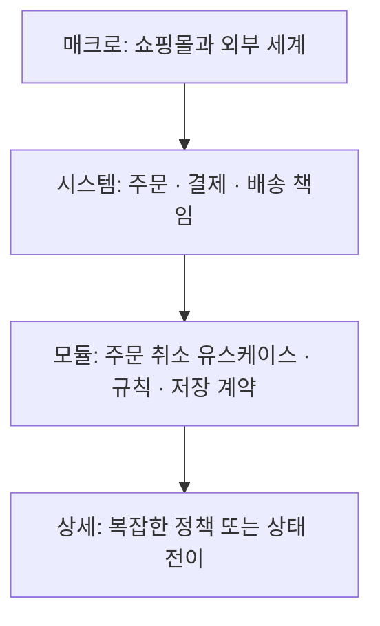

# 계층별 시스템 설계 방법론 Method-R

Method-R은 시스템을 **책임과 계약이 분명한 조각으로 재귀적으로 나누는 설계 방법론**이다. 각 조각은 상대 구현을 모르고 자기 책임에 집중하며, 협력이 필요한 결과는 상위 조율자나 명시된 이벤트 계약으로 연결한다. AI가 변경할 때 읽어야 할 구현 맥락을 줄이는 것이 목적이다.

분할의 기준은 [모듈 경계와 최소 맥락 가이드](./module-boundary-guide.md), 조율 구현은 [Orchestrator-Worker 가이드](./orchestrator-worker-pattern-guide.md), 다이어그램 문법은 [Job Flow 가이드](./job-flow-diagram-guide.md)를 따른다. 이 문서는 **어떤 경계를 어느 깊이까지 설계할지**를 다룬다.

## 1. 네 가지 설계 깊이



위 그림은 Method-R의 확대 관점을 설명하는 보조 그림이다. 실제 협력 시나리오는 `jobflow` 원본으로 작성한다.

| 깊이 | 핵심 질문 | 주된 산출물 | 다음으로 확대할 조건 |
|---|---|---|---|
| 매크로 | 시스템과 외부의 경계는 어디인가? | 외부 입력·결과·성공 조건 | 내부 책임을 나눠야 판단 가능 |
| 시스템 | 어느 조각이 규칙·데이터를 소유하는가? | 책임 지도·공개 계약·협력 흐름 | 특정 책임 내부의 변경 이유가 다름 |
| 모듈 | 한 책임 안에서 무엇을 조율·판정·저장하는가? | 진입점·의존·상태 소유권·검증 | 복잡한 내부 정책/전이를 감춰야 함 |
| 상세 | 남은 불확실성을 어떤 규칙으로 해결하는가? | 알고리즘·불변식·필요한 하위 흐름 | 새 독립 책임이 있을 때만 재귀 분할 |

상위의 조각 하나를 확대하면 그 조각의 **기존 공개 계약이 하위 설계의 외곽 경계**가 된다. 내부 분할 때문에 호출자가 더 많은 세부 정보를 알아야 한다면 경계를 다시 검토한다. 새 조율자가 실제로 필요할 때만 하위에 둔다.

새 시스템은 바깥 경계부터 확인하되, 기존 시스템의 작은 변경에 모든 깊이의 문서를 다시 만들지 않는다. 이미 확인된 상위 경계는 링크하고 대상 조각부터 시작할 수 있다. 부분마다 멈추는 깊이는 달라도 된다.

## 2. 분할 깊이와 통신 방식은 별개다

기존의 “내부는 반드시 이벤트, 시스템 단계만 통신 방식을 선택” 규칙은 적용하지 않는다. **조율 방식·프로세스 경계·전송 방식은 독립된 결정**이다.

| 관점 | 선택 | 기록할 이유 |
|---|---|---|
| 책임 분리 | 함수·모듈·서비스 | 변경 이유, 정보 은닉, 데이터 소유권 |
| 조율 | Orchestration / Choreography | 누가 순서·완료·복구를 책임지는가 |
| 실행 경계 | 같은 프로세스 / 별도 프로세스 | 배포·격리·확장·운영 요구 |
| 전달 | 호출과 반환 / 내부 이벤트 / 원격 요청·메시지 | 결과 수명, 구독자, 지연·실패 보장 |

* **Orchestration**: 한 유스케이스의 조율자가 참여 조각의 결과를 받아 다음 단계를 정한다. 같은 프로세스의 반환값, `await`, 이벤트, 원격 메시지 모두 사용할 수 있다.
* **Choreography**: 소비자가 발생한 사실을 자기 계약에 따라 처리하고, 전체 순서를 책임지는 단일 조율자는 없다. 같은 프로세스 이벤트로도 구현할 수 있지만 아래 예제는 메시지 버스를 사용한다.
* **경계 메시지**: 사용자·외부 시스템과의 논리적 입출력이다. HTTP·파일·UI 이벤트·큐 등을 포함하며 반드시 브로커 메시지를 뜻하지 않는다.

중앙 조율이 있다고 하나의 DB 트랜잭션이 보장되지는 않는다. 이벤트로 나눴다고 결합이나 장애 전파가 사라지지도 않는다. 필요한 원자성, 실패 후 남는 상태, 재시도와 복구 책임은 계약에서 별도로 정한다.

### Job Flow를 읽는 기준

* `scope: X`는 보는 범위이며 그 자체로 Choreography를 의미하지 않는다.
* `orchestrator: X`는 실제로 해당 시나리오를 조율하는 객체다.
* 조율자 뷰의 `A.method.result --> B.method`는 **조율자가 A의 결과를 받아 B를 호출**하는 축약이다. A가 B를 직접 호출하는 코드로 옮기지 않는다.
* `A.OnEvent`는 이벤트이며 호출할 메서드 이름으로 쓰지 않는다. 직접 호출은 `A.method`, 결과는 `.result`나 계약에 정의된 결과 분기로 표현한다.
* 내부의 A가 B Port를 호출하는 세부 구현은 A의 하위 뷰에서 표현한다. 상위 조율자가 그 호출을 수행한다고 꾸며 그리지 않는다.
* 문법·분기·반환·렌더러 지원에 관한 세부 기준은 [Job Flow 가이드](./job-flow-diagram-guide.md)를 따른다.

## 3. 매크로 설계: 시스템을 하나의 경계로 보기

사용자가 원하는 결과와 외부 의존부터 확인한다. 시스템 내부에 어떤 클래스가 있을지 추정하지 않는다.

```jobflow
scope: 쇼핑몰시스템
Object: 사용자, 쇼핑몰시스템, 결제사

사용자.On취소요청 --> 쇼핑몰시스템.주문취소
쇼핑몰시스템.주문취소.result --> 사용자.message.취소처리결과
쇼핑몰시스템.On환불요청 --> 결제사.message.환불요청
결제사.On환불상태변경 --> 쇼핑몰시스템.환불결과수신
```

여기서 `scope`는 내부 조율자 유무를 판정하지 않는다. 외부 환불 결과가 지연될 수 있다면 사용자에게 반환할 결과는 “취소 완료”와 “처리 중”을 구분해야 한다. 응답 완료를 업무 완료로 가정하지 않는다.

산출물은 외부 계약, 성공·실패·대기 결과, 주요 제약이다. UI가 없는 CLI나 작은 변환 도구라면 이 경계와 함수 계약만으로 충분할 수 있다.

## 4. 시스템 설계: 책임·상태 소유권과 협력

“서비스”는 논리적 책임을 뜻하며 독립 배포나 Singleton을 강제하지 않는다. 예를 들어 Orders는 주문 상태, Payments는 환불 요청과 결과, Delivery는 출고 상태를 소유한다. 다른 책임의 테이블을 직접 수정하지 않는다.

### 4.1 Orchestration 예제: 주문 취소

이 예제는 주문·환불 모듈의 공개 계약을 사용하며, 환불 대상 주문의 **최초 취소 요청** 흐름을 보여 준다. 취소 조율자는 결제사 SDK나 주문 테이블을 모른다. 중복 요청·재시작 경로는 아래 계약과 별도의 복구 검증으로 다룬다.

```jobflow
orchestrator: 취소조율자
Object: 취소조율자, 주문관리, 결제관리

취소조율자.취소 --> 주문관리.취소시작
주문관리.취소시작.거절 --> 취소조율자.거절응답
주문관리.취소시작.진행 --> 결제관리.환불요청
결제관리.환불요청.완료 --> 주문관리.취소완료
결제관리.환불요청.확정실패 --> 주문관리.취소실패기록
결제관리.환불요청.결과불명 --> 취소조율자.복구예약
주문관리.취소완료.result --> 취소조율자.취소.result
주문관리.취소실패기록.result --> 취소조율자.취소.result
취소조율자.거절응답.result --> 취소조율자.취소.result
취소조율자.복구예약.result --> 취소조율자.취소.result
```

* Orders의 `취소시작`은 취소 가능 판정과 진행 상태 반영을 원자적으로 수행하거나 버전 조건으로 경쟁 변경을 거절한다. 취소 진행 중 출고 같은 경쟁 명령의 허용 여부도 Orders 계약에 둔다.
* Payments는 같은 취소 작업의 중복 환불을 막고 결과 조회를 제공한다. `결과불명`은 “환불되지 않음”과 다르며 같은 식별자로 확인할 수 있어야 한다.
* `복구예약`은 후속 조회가 보장되는 상태를 남긴 뒤 처리 중을 반환한다. 예약 자체의 실패를 성공으로 숨기지 않는다.
* 주문 상태 저장 실패와 프로세스 재시작도 복구 계약으로 다룬다. 위 그림은 주요 업무 분기이며 모든 기술 예외를 나열한 완성 명세는 아니다.
* 조율자의 워크플로 상태와 모듈의 도메인 상태는 구분한다. 조율자에 주문 취소 가능 규칙을 복제하지 않는다.

### 4.2 Choreography 예제: 확정된 사실의 독립 소비

취소 확정 뒤 알림과 통계가 독립적으로 반응한다면 중앙 조율 없이 이벤트를 소비할 수 있다.

```jobflow
scope: 취소후속처리
Object: 주문관리, MessageBus, 알림관리, 통계관리, 운영알림

주문관리.OrderCancelled --> MessageBus.OrderCancelled
MessageBus.OrderCancelled --> 알림관리.HandleOrderCancelled
MessageBus.OrderCancelled --> 통계관리.HandleOrderCancelled
알림관리.NotificationFailed --> MessageBus.NotificationFailed
MessageBus.NotificationFailed --> 운영알림.HandleNotificationFailed
```

알림 실패가 확정된 주문 취소를 되돌리는 것은 아니다. 그런 업무 요구가 있다면 완료 조건과 복구 흐름을 다시 설계한다. 이벤트 이름을 안다는 것은 스키마·의미·발행 시점에 의존한다는 뜻이며 “서로 전혀 모른다”는 뜻은 아니다.

`OrderCancelled`는 취소 저장이 확정된 뒤 발행한다. 저장과 발행 사이 장애로 유실될 수 있다면 outbox 또는 재발행 등 요구에 맞는 복구 방법과 소유자를 정한다. 버스 수신 확인만으로 소비자 처리가 완료되었다고 보지 않는다.

### 4.3 선택 결과 기록

| 판단할 것 | Orchestration을 검토할 경우 | Choreography를 검토할 경우 |
|---|---|---|
| 흐름 소유 | 한 유스케이스가 순서·완료·복구를 소유 | 소비자마다 독립 완료 조건이 있음 |
| 실패 처리 | 중간 실패에 따른 다음 조치를 한곳에서 추적 | 각 소비자가 실패·재처리를 책임짐 |
| 가시성 | 조율 상태와 참여 계약으로 흐름 추적 | 이벤트·구독 지도와 인과 추적 필요 |
| 구조 비용 | 조율자 집중과 복구 상태 관리 비용 | 스키마·구독·전달·운영 비용 |

두 방식은 한 시스템에 공존할 수 있다. 위 취소 요청은 조율하고 후속 알림은 이벤트로 처리한다. 서비스 분리 여부는 이 선택과 별도로 기록한다.

## 5. 모듈 설계: 공개 계약 안을 확대하기

시스템 단계의 `주문관리.취소시작` 내부를 확대한다. 외부 호출자는 내부 규칙과 저장소를 모른 채 같은 공개 결과를 받는다.

```jobflow
orchestrator: 취소시작유스케이스
Object: 취소시작유스케이스, 주문저장소, 취소규칙

취소시작유스케이스.실행 --> 주문저장소.조회
주문저장소.조회.없음 --> 취소시작유스케이스.거절응답
주문저장소.조회.찾음 --> 취소규칙.판정
취소규칙.판정.불가 --> 취소시작유스케이스.거절응답
취소규칙.판정.가능 --> 주문저장소.버전조건부취소시작
주문저장소.버전조건부취소시작.충돌 --> 취소시작유스케이스.충돌응답
주문저장소.버전조건부취소시작.저장됨 --> 취소시작유스케이스.진행응답
취소시작유스케이스.거절응답.result --> 취소시작유스케이스.실행.result
취소시작유스케이스.충돌응답.result --> 취소시작유스케이스.실행.result
취소시작유스케이스.진행응답.result --> 취소시작유스케이스.실행.result
```

이 하위 그림도 최초 요청을 다룬다. 조회 결과에는 주문 버전이 있고, 조건부 저장은 그 버전이 여전히 같은 경우에만 반영한다. 도메인 규칙은 `취소규칙`이 소유하고, 원자적 비교·쓰기 구현은 저장소가 제공한다. 다른 작업과의 충돌은 상위의 `거절` 결과로 변환하되 재조회가 필요하다는 오류 의미를 보존한다. 같은 취소 ID 재요청은 기존 진행·완료 결과를 반환해야 한다. 중복 처리를 구현할 때는 단순 충돌 거절 대신 기존 결과 조회 경로를 별도로 설계·검증한다.

이 그림의 조건부 저장은 Port이며 SQL 구현을 뜻하지 않는다. Worker를 조회·변환·검사 같은 한 줄 동작마다 나누지 않는다. 실제 코드가 충분히 단순하면 `취소규칙`은 같은 모듈의 순수 함수로 구현해도 된다.

산출물은 모듈 공개 진입점, 내부 책임, 데이터·오류 계약, 필요한 의존, 해당 경계의 검증이다. 같은 프로세스의 일회성 결과는 직접 반환이나 `await`로 처리하고, 진행률·독립 구독이 필요할 때 이벤트를 선택한다.

## 6. 상세 설계: 불확실한 부분만 더 확대하기

취소 가능 규칙이 복잡하다면 상태·시각·정책 우선순위 같은 불변식을 먼저 정한다. 이것이 여러 독립 책임으로 나뉠 때만 Sub-Orchestrator를 만든다.

| 내부 상황 | 적절한 산출물 |
|---|---|
| 단순 조건식 몇 개 | 함수 시그니처와 경계값 테스트 |
| 상태와 허용 전이가 핵심 | `state` 다이어그램과 전이 불변식 |
| 독립 정책의 순서·결합이 복잡 | 하위 `jobflow`와 정책별 계약 |
| 외부 I/O의 반복·취소가 핵심 | 실행 수명·실패·재시도 계약 |

상세 Job Flow의 노드를 코드 한 줄에 대응시키는 것은 목표가 아니다. 내부 구현을 다 그리면 코드를 중복 관리하게 된다. 상위에 없던 책임·불변식·실패 경계가 드러날 때만 상세를 추가한다.

Sub-Orchestrator를 도입하더라도 상위가 보는 입력·결과·오류 의미는 유지한다. 상세 설계 때문에 공개 계약이 바뀐다면 호출자·소비자를 역방향으로 찾아 시스템 단계의 영향도 함께 갱신한다.

## 7. 흐름 밖에 필요한 계약

공통 [모듈 계약 양식](./module-boundary-guide.md)을 사용한다. 데이터 소유권, 입력·결과, 상태 변경, 오류·취소·부분 성공, 수명·동시성, 호환성, 검증을 그림에 연결한다. 작은 기능은 기존 타입·테스트 링크로 충분하다.

메시지를 쓸 때에는 다음처럼 전달 보장과 재시도 정책을 구분한다. 아래 값은 설명용 예시이며 시스템 요구에 맞게 결정한다.

```text
name: OrderCancelled
schemaVersion: 1
producer: Orders
consumers: Notifications, Analytics
payload: eventId, orderId, orderVersion, cancelledAt
publishCondition: 취소 저장 확정; 저장 후 발행 실패는 재발행 가능
delivery: at-least-once
deduplication: consumer별 eventId 처리 기록; 효과와 처리 기록의 원자성 확인
retry: 일시적 오류만; 최대 3회; 전체 30초 이내
failure: 재시도 소진 메시지 격리; 소유자 조사 후 재처리
ordering: 순서 보장 없음; orderVersion으로 오래된 갱신 구분
```

이벤트 중복 방지 기록의 보존 기간은 실제 재전달·수동 재처리 기간과 맞춘다. `orderId`만 멱등 키로 쓰면 같은 주문의 서로 다른 정상 작업까지 합쳐 버릴 수 있으므로 업무 명령 ID와 이벤트 ID를 구분한다.

## 8. 검증과 분할 종료

설계자는 대표 변경 하나로 “어떤 구현을 읽고, 어떤 계약을 바꾸고, 어디를 검증하는가”를 시뮬레이션한다. 독립 검토자는 성공 흐름보다 다음 반례를 확인한다.

1. 한 규칙 변경이 관련 없는 형제 구현까지 읽거나 고치게 하는가?
2. 한 불변식을 여러 모듈이 나눠 쓰거나 조율자에 복제했는가?
3. 반환·이벤트·상태 이름이 상하위 계약에서 같은 의미인가?
4. 타임아웃, 중복, 지연 이벤트, 저장 성공 후 발행 실패를 처리할 소유자가 있는가?
5. 동기·비동기 또는 프로세스 경계를 조율 방식과 혼동했는가?
6. 새 조각의 계약·테스트·탐색 비용이 줄어든 구현 맥락보다 큰가?

**책임·불변식·입출력·실패·검증을 외부 구현 없이 이해할 수 있으면 분할을 멈춘다.** 항상 함께 변경되는 조각은 병합을 검토한다. 모든 조각에 같은 깊이를 강제하지 않으며, 위험한 기능 하나를 먼저 구체화한 뒤 얻은 근거로 나머지를 판단한다.

실제 구현 검증에서는 순수 규칙의 반례, 조율의 결과 연결, Gateway의 실제 계약, 경계를 통과하는 핵심 시나리오 중 필요한 계층을 선택한다. 모든 도식마다 E2E를 만들거나 모든 함수를 mock하지 않는다. 문서 리뷰만 수행했다면 실행·성능·토큰 절감까지 검증했다고 보고하지 않는다.
