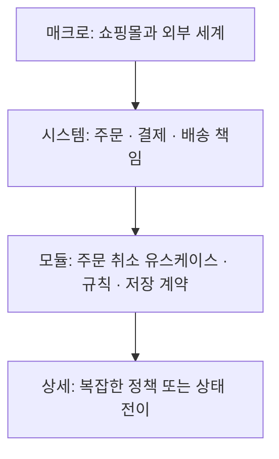

# 계층별 시스템 설계 방법론 Method-R

Method-R은 시스템을 **책임과 계약이 분명한 조각으로 재귀적으로 나누고, 조각들이 서로의 내부 구현을 몰라도 공개 계약으로 협력하게 연결하는 설계 방법론**이다. 각 조각은 자신의 규칙과 상태에 집중한다.

설계 수준에 따라 다음 방식을 선호한다.

* **시스템 수준**: 마이크로서비스 아키텍처(MSA)로 독립적인 서비스를 구성한다. 서비스 간에는 **이벤트·메시지 기반 통신**과 **REST API의 요청·응답**을 활용한다. 메시지 큐에는 **Amazon SQS**, 발행·구독에는 **Amazon SNS**, 이벤트 스트리밍에는 **Apache Kafka**나 **Amazon Kinesis Data Streams**를 사용할 수 있다.
* **모듈·상세 수준**: **오케스트레이터–워커 패턴**을 기본으로 한다. 오케스트레이터는 작업 흐름과 결과를 연결하고, 각 워커는 자기 역할을 수행한다. 모듈의 메시지 처리가 필요하면 **이벤트 버스의 발행·구독**을 함께 사용한다.

이 선호를 바탕으로 시스템 규모와 요구사항에 맞는 구조를 선택한다. 목적은 한 조각과 인접 계약만으로 변경을 판단하여 AI가 읽어야 할 구현 맥락을 줄이는 것이다.

분할·계약·검증의 공통 기준은 [모듈 경계와 최소 맥락 가이드](./module-boundary-guide.md), 조율자의 구현 책임은 [Orchestrator-Worker 가이드](./orchestrator-worker-pattern-guide.md), 다이어그램의 작성·해석·결과 배치는 [Job Flow 가이드](./job-flow-diagram-guide.md)를 따른다. 이 문서는 **어떤 경계를 어느 깊이까지 나누고, 각 경계에 맞는 협력과 통신 방식을 어떻게 선택할지**를 다룬다.

## 1. 네 가지 설계 깊이


```mermaid
flowchart TB
    L1["매크로: 쇼핑몰과 외부 세계"]
    L2["시스템: 주문 · 결제 · 배송 책임"]
    L3["모듈: 주문 취소 유스케이스 · 규칙 · 저장 계약"]
    L4["상세: 복잡한 정책 또는 상태 전이"]
    L1 --> L2
    L2 --> L3
    L3 --> L4
```

위 그림은 Method-R의 확대 관점을 설명하는 보조 그림이다. 실제 협력 시나리오는 `jobflow` 원본으로 작성한다.

| 깊이 | 핵심 질문 | 주된 산출물 | 다음으로 확대할 조건 |
|---|---|---|---|
| 매크로 | 시스템과 외부의 경계는 어디인가? | 외부 입력·결과·성공 조건 | 내부 책임을 나눠야 판단 가능 |
| 시스템 | 어느 조각이 규칙·데이터를 소유하는가? | 책임 지도·공개 계약·협력 흐름 | 특정 책임 내부의 변경 이유가 다름 |
| 모듈 | 한 책임 안에서 무엇을 조율·판정·저장하는가? | 진입점·의존·상태 소유권·검증 | 복잡한 내부 정책/전이를 감춰야 함 |
| 상세 | 남은 불확실성을 어떤 규칙으로 해결하는가? | 알고리즘·불변식·필요한 하위 흐름 | 새 독립 책임이 있을 때만 재귀 분할 |

상위의 조각 하나를 확대하면 그 조각의 **기존 공개 계약이 하위 설계의 외곽 경계**가 된다. 내부 분할 때문에 호출자가 더 많은 세부 정보를 알아야 한다면 경계를 다시 검토한다. 새 조율자가 실제로 필요할 때만 하위에 둔다.

새 시스템은 바깥 경계부터 확인하되, 기존 시스템의 작은 변경에 모든 깊이의 문서를 다시 만들지 않는다. 이미 확인된 상위 경계는 링크하고 대상 조각부터 시작할 수 있다. 부분마다 멈추는 깊이는 달라도 된다.

## 2. 조각의 협력과 서비스 간 통신

2.1·2.2에서는 형제 조각의 연결을 상위 조율자나 메시지 구독 구성에 맡긴다. 각 조각은 협력 상대 대신 자신의 요청·결과나 메시지 계약을 안다. 2.3에서는 별도 프로세스로 실행되는 독립 서비스가 상대의 공개 API를 호출하는 경우를 다룬다. 서비스의 공개 API에 의존하는 것과 상대의 내부 구현에 의존하는 것은 구분한다.

| 방식 | 요청·발행 객체가 아는 것 | 연결을 책임지는 곳 | 결과가 필요할 때 |
|---|---|---|---|
| 상위 객체가 연결 | 자신의 도움 요청과 응답 계약 | 유스케이스의 오케스트레이터 | 상위가 수신 객체의 결과를 요청 콜백의 반환값으로 돌려줌 |
| 메시지로 연결 | 메시지 종류·데이터와 발행/요청 계약 | 버스·구독 구성; 처리는 각 수신자 | 요청 식별자로 응답을 대응시켜 요청 객체에 반환 |

위 두 방식의 적용 범위와 직접 호출의 기준은 [Orchestrator-Worker 가이드](./orchestrator-worker-pattern-guide.md#1-적용-범위)를 따른다.

### 2.1 상위 오케스트레이터가 도움 요청과 결과를 연결한다

복잡한 시스템이나 처리를 책임이 다른 조각으로 나누고, 그 조각들이 분업하도록 연결한다. 여기서는 **WorkerA와 WorkerB를 내부 필드로 가진 Orchestrator가 하나의 독립된 컴포넌트**다. 외부는 Orchestrator에 요청하고, 내부 워커의 구성이나 협력 순서는 알 필요가 없다.

1. Orchestrator가 외부 요청을 받으면 WorkerA의 `ProcessRequest`를 호출한다.
2. WorkerA는 자기 몫을 처리하다가 다른 능력이 필요하면 `OnNeedHelp`로 필요한 데이터를 전달한다. WorkerB를 참조하거나 찾아서 호출하지 않는다.
3. Orchestrator는 생성자에서 연결해 둔 이벤트 구독 또는 요청 콜백을 통해 WorkerB의 `ProvideHelp`를 호출한다. WorkerB는 누가 요청했는지와 결과를 어디에 쓸지 알 필요가 없다.
4. WorkerA에게 결과가 필요하면 Orchestrator가 WorkerB의 반환값을 `OnNeedHelp`의 반환값으로 돌려준다. WorkerA는 그 값을 받아 자기 처리 흐름을 이어간다.

아래는 한 요청의 분업 흐름을 보여 주는 의사코드다. 두 예제는 독립된 경우이며, `OnNeedHelp`의 계약은 각각 결과를 받지 않는 이벤트와 결과를 받는 요청 콜백이다. 두 경우 모두 Orchestrator가 워커를 내부에서 생성하고 생성자에서 와이어링한다. 오류 처리와 구독 해제는 생략한다. 외부 요청 진입점은 다이어그램의 `Orchestrator.ProcessRequest`로만 표시하고, 그 메서드의 구현과 외부 호출 코드는 생략한다.

#### 도움을 요청하고 자기 몫을 끝내는 경우

예를 들어 WorkerA가 본 처리를 마친 뒤 알림 발송을 요청하고, WorkerB가 알림을 보낼 수 있다. WorkerA는 알림 발송 결과로 할 일이 없으므로 요청을 알리는 것으로 자기 몫을 끝낸다.

이 예제의 `event`는 이벤트 선언, `emit`은 발생, `subscribe`는 구독 연결을 뜻하며 이벤트의 반환값은 사용하지 않는다.

```text
class WorkerA {
    event OnNeedHelp

    ProcessRequest(request) {
        data = ... // 자신의 규칙에 따라 본 처리 수행
        OnNeedHelp.emit(data)
    }
}

class WorkerB {
    ProvideHelp(data) {
        ... // 전달받은 데이터로 알림 발송 등 후속 작업 수행
    }
}

class Orchestrator {
    private workerA = new WorkerA()
    private workerB = new WorkerB()

    constructor() {
        workerA.OnNeedHelp.subscribe((data) => {
            workerB.ProvideHelp(data)
        })
    }
}
```

```jobflow
orchestrator: Orchestrator
Object: Orchestrator, WorkerA, WorkerB

Orchestrator.ProcessRequest --> WorkerA.ProcessRequest

WorkerA.OnNeedHelp --> WorkerB.ProvideHelp
```

WorkerA로 돌아오는 결과 화살표가 없다. **WorkerA의 몫은 요청을 알린 뒤 끝나고, WorkerB의 몫은 맡은 후속 작업을 수행하면 끝난다.** WorkerA가 끝났다는 사실만으로 WorkerB의 작업까지 완료됐다는 뜻은 아니다. 여기서 “요청만 하고 끝낸다”는 것은 결과에 따른 후처리가 없다는 뜻이며, 이벤트라는 이유만으로 비동기 실행을 보장하지는 않는다.

#### 도움의 결과를 받아 후처리하는 경우

예를 들어 WorkerA가 보고서에 필요한 데이터를 준비하고, WorkerB가 통계를 계산한 뒤, WorkerA가 그 통계로 보고서를 완성할 수 있다. WorkerA는 `ProcessRequest` 안에서 `OnNeedHelp`의 결과를 기다린 뒤 나머지 처리를 이어간다. 후처리는 WorkerA 내부에 있으므로 Orchestrator가 별도의 후처리 메서드를 알거나 호출할 필요가 없다.

이 예제의 `OnNeedHelp`는 **응답자 하나인 비동기 요청 콜백**이며 `Promise<Result>`를 반환한다. Orchestrator가 생성자에서 콜백을 지정하고, WorkerA가 호출하면 WorkerB의 결과를 돌려준다. 일반 다중 구독 이벤트에서 반환값을 모으는 기능을 가정하지 않는다.

```text
class WorkerA {
    OnNeedHelp: (data) -> Promise<Result>

    async ProcessRequest(request) {
        data = ... // 자신의 규칙에 따라 통계 계산에 필요한 데이터 준비
        result = await OnNeedHelp(data)
        report = ... // 전달받은 통계를 반영해 보고서 완성
        return report
    }
}

class WorkerB {
    async ProvideHelp(data) {
        result = ... // 맡은 통계 계산 수행
        return result
    }
}

class Orchestrator {
    private workerA = new WorkerA()
    private workerB = new WorkerB()

    constructor() {
        workerA.OnNeedHelp = async (data) => {
            return await workerB.ProvideHelp(data)
        }
    }
}
```

```jobflow
orchestrator: Orchestrator
Object: Orchestrator, WorkerA, WorkerB

Orchestrator.ProcessRequest --> WorkerA.ProcessRequest

WorkerA.OnNeedHelp --> WorkerB.ProvideHelp
WorkerB.ProvideHelp.result --> WorkerA.OnNeedHelp.result
```

마지막 화살표는 **Orchestrator가 WorkerB의 결과를 WorkerA의 `OnNeedHelp` 호출에 반환한다**는 뜻이다. `WorkerA.OnNeedHelp.result`는 위에서 정의한 단일 응답 콜백의 반환값이다. WorkerA는 `ProcessRequest` 안의 `await` 다음부터 후처리를 이어가고, 보고서를 완성해 반환하면 자기 몫이 끝난다. 결과를 받아도 `ProcessRequest`를 다시 호출하지 않으며, Orchestrator는 WorkerA 내부의 후처리에 관여하지 않는다.

두 경우 모두 **워커는 서로를 모르고, Orchestrator만 어느 워커의 요청을 누구에게 전달하고 결과를 어디로 보낼지 안다.** 워커는 자신의 처리와 데이터 계약에 집중하고, Orchestrator는 그 공개 계약들을 연결해 외부 요청 하나를 분업으로 처리한다.

### 2.2 메시지를 알리고 각 수신자가 필요한 메시지에 반응한다

발행자는 수신자의 목록과 구현을 모른 채 메시지를 발행한다. 구독 구성에 따라 WorkerA는 EventA, WorkerB는 EventB에 반응하고, SharedEvent에는 둘 다 반응할 수 있다. 여기서 불특정 다수는 발행 시 수신 객체를 지정하지 않는다는 뜻이며, 모든 객체가 모든 메시지를 처리한다는 뜻은 아니다.

| 사용 흐름 | 발행·요청 객체의 동작 | 완료의 의미 |
|---|---|---|
| 전달 후 결과를 기다리지 않음 | `publish` 후 자기 일을 계속함 | 발행 성공·접수 확인과 소비자의 업무 완료를 구분 |
| 비동기로 결과를 나중에 받음 | 요청 후 다른 일을 하고 응답 콜백·메시지에서 후속 처리 | 요청과 응답을 대응시킨 뒤 후속 처리 |
| 결과가 필요한 동기식 사용 흐름 | `requestAndWait` 결과를 받아야 다음 단계로 진행 | 계약에서 정한 응답을 받거나 오류·기한 초과로 종료 |

마지막 행의 “동기식”은 **호출자 흐름이 결과에 의존한다**는 뜻이다. 내부 메시지 전달과 대기는 `await` 등으로 비동기 구현할 수 있으며 스레드 차단을 요구하지 않는다. 반대로 결과를 기다리지 않는 발행도 전송 오류·재처리 책임이 사라진다는 뜻은 아니다.

다음은 네 가지 독립 시나리오다. MessageBus는 메시지 라우팅과 요청·응답 대응을 맡고, 업무 처리는 각 서비스와 Worker가 수행한다.

```jobflow
scope: WorkflowMessageExchange
Object: WorkflowService, MessageBus, WorkerA, WorkerB

WorkflowService.publishEventA --> MessageBus.publishEventA
MessageBus.publishEventA --> WorkerA.onEventA
WorkerA.onEventA --> WorkerA.executeTask

WorkflowService.publishEventB --> MessageBus.publishEventB
MessageBus.publishEventB --> WorkerB.onEventB
WorkerB.onEventB --> WorkerB.executeTask

WorkflowService.publishSharedEvent --> MessageBus.publishSharedEvent
MessageBus.publishSharedEvent --> WorkerA.onSharedEvent
WorkerA.onSharedEvent --> WorkerA.executeTask
MessageBus.publishSharedEvent --> WorkerB.onSharedEvent
WorkerB.onSharedEvent --> WorkerB.executeTask

WorkflowService.loadData --> MessageBus.requestAndWait
MessageBus.requestAndWait --> WorkerA.onDataRequest
WorkerA.onDataRequest --> WorkerA.fetchData
WorkerA.fetchData --> WorkerA.fetchData.result
WorkerA.fetchData.result --> MessageBus.reply
MessageBus.reply --> MessageBus.requestAndWait.result
MessageBus.requestAndWait.result --> WorkflowService.continueWithData
```

* `publishEventA`, `publishEventB`, `publishSharedEvent`는 각각 `publish(EventA)`, `publish(EventB)`, `publish(SharedEvent)`를 그림에서 구별하는 동작명이다. 구현에 세 메서드를 강제하지 않는다.
* `onEventA`·`onSharedEvent`·`onDataRequest`는 각 Worker의 수신 핸들러다.
* `SharedEvent`의 두 전달은 서로를 기다리지 않는다. 그림에서 WorkerA의 처리가 WorkerB의 수신보다 위에 있는 것은 수신자마다 처리까지 이어 썼기 때문이며 실행 순서가 아니다.
* `requestAndWait`의 입력은 `DataRequest`와 `requestId`, `reply`의 입력은 같은 `requestId`와 결과다. `WorkflowService.loadData`가 응답을 받아 자신의 `continueWithData`를 호출한다. 버스가 WorkflowService의 업무 메서드를 직접 호출하거나 `loadData`를 다시 실행하는 흐름이 아니다.

알림용 이벤트는 발생한 사실을, `DataRequest`는 결과가 필요한 요청을 나타낸다. 이 예제의 DataRequest 응답자는 WorkerA 하나다. 완료·응답 대응·실패 처리는 [메시지 계약 기준](./module-boundary-guide.md#메시지-발행과-요청응답)을 따른다.

### 2.3 독립 서비스가 REST API로 요청과 응답을 주고받는다

MSA처럼 독립적으로 실행·배포되는 서비스 사이에서는 **호출 서비스가 제공 서비스의 공개 REST API에 요청하고 응답을 받는 구조**를 기본 예제로 삼는다. 각 서비스는 자신의 데이터와 업무 규칙을 소유하고, 호출자는 필요한 API 계약을 안다. 서비스를 다른 서비스의 내부 Worker로 생성하거나 상위 Orchestrator에 모두 모을 필요는 없다.

이 예제에서는 주문서비스가 주문서 미리보기를 만들기 위해 상품서비스에서 상품 정보를 조회한다. 상품서비스는 상품 정보를 반환하고, 주문서비스는 그 응답을 자기 처리 안에서 사용한다.

```jobflow
scope: 서비스간상품조회
Object: 주문서비스, 상품서비스

주문서비스.상품조회요청 --> 상품서비스.상품조회
상품서비스.상품조회.result --> 주문서비스.상품조회요청.result
```

`상품조회요청`은 `GET /products/{productId}` 호출을 뜻한다. `상품조회`의 성공 응답에는 상품 ID·이름·가격이 담긴다. 이 응답은 상품 조회의 결과이며, 주문 생성이나 결제 완료를 뜻하지 않는다. HTTP 클라이언트와 주소·직렬화 등 서비스 내부 구현의 배치는 [모듈 경계 가이드](./module-boundary-guide.md#4-의존과-제어-흐름)를 따른다.

서비스 간 통신은 결과가 필요한 시점과 수신자 관계에 따라 선택한다. 공개 API 요청·응답과 비동기 메시징의 구분은 [Microsoft의 서비스 간 통신 가이드](https://learn.microsoft.com/en-us/azure/architecture/microservices/design/interservice-communication)를 참고한다.

| 필요한 협력 | 선택할 흐름 | 완료를 판단하는 지점 |
|---|---|---|
| 조회나 짧은 처리를 요청하고 결과가 필요함 | REST 요청·응답 | 응답에 담긴 조회 결과 또는 처리 결과 |
| 오래 걸리는 작업을 요청함 | 접수 응답 뒤 상태 API 조회 또는 완료 콜백 | 접수 이후 확인한 최종 작업 결과 |
| 지정된 서비스에 발생 사실을 알림 | 합의된 HTTP endpoint로 webhook 전달 | endpoint 계약에 따른 접수 또는 처리 완료 |
| 여러 서비스가 같은 사실에 독립적으로 반응함 | 2.2의 메시지 발행·구독 | 각 소비자가 맡은 처리의 완료 |

오래 걸리는 작업은 `202 Accepted`와 상태 조회 URL을 반환하는 [비동기 요청·응답 패턴](https://learn.microsoft.com/en-us/azure/architecture/patterns/asynchronous-request-reply)을 사용할 수 있다. `202`는 접수이며 업무 완료는 아니다. HTTP로 이벤트를 전달하는 webhook도 수신 endpoint를 지정하는 요청이므로, REST 자체가 여러 구독자에게 이벤트를 방송하는 것은 아니다.

**오케스트레이션은 여러 서비스에 걸친 업무의 순서·분기·완료·복구를 한곳에서 관리해야 할 때 검토한다.** 예를 들어 주문·결제·배송의 여러 단계를 조율하는 업무라면 [Saga의 오케스트레이션 방식](https://learn.microsoft.com/en-us/azure/architecture/patterns/saga)이 적합할 수 있다. 이때도 참여 서비스는 독립된 서비스이며, 2.1의 내부 Worker 구성과 같은 배포 구조를 요구하지 않는다.

### 2.4 조율 방식과 전송 방식은 별도로 정한다

* **Orchestration**: 상위 조율자가 참여 조각의 호출·결과를 연결하고 유스케이스의 순서·완료·복구를 책임진다. 이벤트·콜백뿐 아니라 메시지 버스와 REST API로도 구현할 수 있다.
* **Choreography**: 각 소비자가 메시지에 따라 자기 처리를 수행하고 전체 순서를 책임지는 단일 조율자는 없다. 메시지 버스를 쓴다는 사실만으로 이 방식이 되는 것은 아니다.
* **경계 메시지**: 사용자·외부 시스템과의 논리적 입출력이다. HTTP·파일·UI 이벤트·큐 등을 포함하며 반드시 브로커 메시지를 뜻하지 않는다.

분할 깊이, 조율 방식, 같은 프로세스인지 여부, 결과를 기다리는지 여부, 실제 전송 수단을 각각 기록한다. 서비스가 다른 서비스의 REST API를 호출한다는 사실만으로 Orchestration이나 Choreography를 판정하지 않는다.

선택한 경계의 상태·실패 책임은 [모듈 경계 가이드](./module-boundary-guide.md#5-상태데이터와-실패의-소유권)에 따라 계약에 연결한다.

## 3. 매크로 설계: 시스템을 하나의 경계로 보기

사용자가 원하는 결과와 외부 의존부터 확인한다. 시스템 내부에 어떤 클래스가 있을지 추정하지 않는다.

```jobflow
scope: 쇼핑몰시스템
Object: 사용자, 쇼핑몰시스템, 결제사

사용자.On취소요청 --> 쇼핑몰시스템.주문취소
쇼핑몰시스템.주문취소.result --> 사용자.message.취소처리결과
쇼핑몰시스템.On환불요청 --> 결제사.message.환불요청
결제사.On환불상태변경 --> 쇼핑몰시스템.message.환불결과수신
```

외부 환불 결과가 지연될 수 있다면 사용자에게 반환할 결과는 “취소 완료”와 “처리 중”을 구분해야 한다.

산출물은 외부 계약, 성공·실패·대기 결과, 주요 제약이다. UI가 없는 CLI나 작은 변환 도구라면 이 경계와 함수 계약만으로 충분할 수 있다.

## 4. 시스템 설계: 책임·상태 소유권과 협력

이 단계의 “서비스”는 논리적 책임을 뜻하며 독립 배포나 Singleton을 강제하지 않는다. 예를 들어 Orders는 주문 상태, Payments는 환불 요청과 결과, Delivery는 출고 상태를 소유한다. 데이터 접근은 [소유권 기준](./module-boundary-guide.md#5-상태데이터와-실패의-소유권)을 따른다.

### 4.1 Orchestration 예제: 주문 취소

이 예제는 상위가 주문·환불 모듈의 공개 계약을 호출하고 결과를 연결하여, 환불 대상 주문의 **최초 취소 요청**을 처리한다. 주문 모듈이 결제 모듈을 직접 호출하지 않는다. 취소 조율자는 결제사 SDK나 주문 테이블을 모른다. 중복 요청·재시작 경로는 아래 계약과 별도의 복구 검증으로 다룬다.

```jobflow
orchestrator: 취소조율자
Object: 취소조율자, 주문관리, 결제관리

취소조율자.취소 --> 주문관리.취소시작
주문관리.취소시작.거절 --> 취소조율자.거절응답
주문관리.취소시작.진행 --> 결제관리.환불요청
결제관리.환불요청.완료 --> 주문관리.취소완료
결제관리.환불요청.확정실패 --> 주문관리.취소실패기록
결제관리.환불요청.결과불명 --> 취소조율자.복구예약
```

* Orders의 `취소시작`은 취소 가능 판정과 진행 상태 반영을 원자적으로 수행하거나 버전 조건으로 경쟁 변경을 거절한다. 취소 진행 중 출고 같은 경쟁 명령의 허용 여부도 Orders 계약에 둔다.
* Payments는 같은 취소 작업의 중복 환불을 막고 결과 조회를 제공한다. `결과불명`은 “환불되지 않음”과 다르며 같은 식별자로 확인할 수 있어야 한다.
* `복구예약`은 후속 조회가 보장되는 상태를 남긴 뒤 처리 중을 반환한다. 예약 자체의 실패를 성공으로 숨기지 않는다.
* 주문 상태 저장 실패와 프로세스 재시작도 복구 계약으로 다룬다. 위 그림은 주요 업무 분기이며 모든 기술 예외를 나열한 완성 명세는 아니다.

### 4.2 Choreography 예제: 확정된 사실의 독립 소비

취소 확정 뒤 알림과 통계가 독립적으로 반응한다면 두 번째 방식으로 이벤트를 발행한다. 주문관리는 수신자를 지정하지 않으며, 각 소비자는 중앙 업무 조율 없이 자기 구독에 반응한다.

```jobflow
scope: 취소후속처리
Object: 주문관리, MessageBus, 알림관리, 통계관리, 운영알림

주문관리.OnOrderCancelled --> MessageBus.message.OrderCancelled
MessageBus.message.OrderCancelled --> 알림관리.HandleOrderCancelled
MessageBus.message.OrderCancelled --> 통계관리.HandleOrderCancelled
알림관리.OnNotificationFailed --> MessageBus.message.NotificationFailed
MessageBus.message.NotificationFailed --> 운영알림.HandleNotificationFailed
```

알림 실패가 확정된 주문 취소를 되돌리는 것은 아니다. 그런 업무 요구가 있다면 완료 조건과 복구 흐름을 다시 설계한다. 이벤트 이름을 안다는 것은 스키마·의미·발행 시점에 의존한다는 뜻이며 “서로 전혀 모른다”는 뜻은 아니다.

`OrderCancelled`는 취소 저장이 확정된 뒤 발행한다. 저장·발행의 연결과 소비자별 완료·재처리는 [메시지 계약 기준](./module-boundary-guide.md#메시지-발행과-요청응답)을 따른다.

### 4.3 선택 결과 기록

| 판단할 것 | Orchestration을 검토할 경우 | Choreography를 검토할 경우 |
|---|---|---|
| 흐름 소유 | 한 유스케이스가 순서·완료·복구를 소유 | 소비자마다 독립 완료 조건이 있음 |
| 실패 처리 | 중간 실패에 따른 다음 조치를 한곳에서 추적 | 각 소비자가 실패·재처리를 책임짐 |
| 가시성 | 조율 상태와 참여 계약으로 흐름 추적 | 이벤트·구독 지도와 인과 추적 필요 |
| 구조 비용 | 조율자 집중과 복구 상태 관리 비용 | 스키마·구독·전달·운영 비용 |

두 방식은 한 시스템에 공존할 수 있다. 위 취소 요청은 상위가 결과를 연결하고, 후속 알림은 메시지를 구독하여 처리한다. 조율자가 메시지 요청/응답을 이용하는 혼합도 가능하다. 서비스 분리와 REST API 사용 여부는 이 선택과 별도로 기록한다.

## 5. 모듈 설계: 공개 계약 안을 확대하기

시스템 단계의 `주문관리.취소시작` 내부를 확대한다. 외부 호출자는 내부 규칙과 저장소를 모른 채 같은 공개 결과를 받는다.

```jobflow
orchestrator: 취소시작유스케이스
Object: 취소시작유스케이스, 주문저장소, 취소규칙

취소시작유스케이스.실행 --> 주문저장소.조회
주문저장소.조회.없음 --> 취소시작유스케이스.거절응답
주문저장소.조회.찾음 --> 취소규칙.판정
취소규칙.판정.불가 --> 취소시작유스케이스.거절응답
취소규칙.판정.가능 --> 주문저장소.버전조건부취소시작
주문저장소.버전조건부취소시작.충돌 --> 취소시작유스케이스.충돌응답
주문저장소.버전조건부취소시작.저장됨 --> 취소시작유스케이스.진행응답
```

이 하위 그림도 최초 요청을 다룬다. 조회 결과에는 주문 버전이 있고, 조건부 저장은 그 버전이 여전히 같은 경우에만 반영한다. 도메인 규칙은 `취소규칙`이 소유하고, 원자적 비교·쓰기 구현은 저장소가 제공한다. 다른 작업과의 충돌은 상위의 `거절` 결과로 변환하되 재조회가 필요하다는 오류 의미를 보존한다. 같은 취소 ID 재요청은 기존 진행·완료 결과를 반환해야 한다. 중복 처리를 구현할 때는 단순 충돌 거절 대신 기존 결과 조회 경로를 별도로 설계·검증한다.

이 그림의 조건부 저장은 Port이며 SQL 구현을 뜻하지 않는다. `취소규칙`을 별도 조각으로 둘지는 [분할·병합 기준](./orchestrator-worker-pattern-guide.md#5-분할과-병합)에 따라 판단한다.

산출물은 모듈 공개 진입점, 내부 책임, 데이터·오류 계약, 필요한 의존, 해당 경계의 검증이다. 하위의 독립된 조각도 필요하면 2.1·2.2의 방식으로 연결한다. 구현 수단은 [호출·반환·이벤트 선택 기준](./orchestrator-worker-pattern-guide.md#3-호출반환이벤트-선택)을 따른다.

## 6. 상세 설계: 불확실한 부분만 더 확대하기

취소 가능 규칙이 복잡하다면 상태·시각·정책 우선순위 같은 불변식을 먼저 정한다. 이것이 여러 독립 책임으로 나뉠 때만 Sub-Orchestrator를 만든다.

| 내부 상황 | 적절한 산출물 |
|---|---|
| 단순 조건식 몇 개 | 함수 시그니처와 경계값 테스트 |
| 상태와 허용 전이가 핵심 | [State 가이드](./state-diagram-guide.md)에 따른 다이어그램과 전이 불변식 |
| 독립 정책의 순서·결합이 복잡 | [Job Flow 가이드](./job-flow-diagram-guide.md)에 따른 하위 흐름과 정책별 계약 |
| 외부 I/O의 반복·취소가 핵심 | 실행 수명·실패·재시도 계약 |

상세 Job Flow의 노드를 코드 한 줄에 대응시키는 것은 목표가 아니다. 내부 구현을 다 그리면 코드를 중복 관리하게 된다. 상위에 없던 책임·불변식·실패 경계가 드러날 때만 상세를 추가한다.

Sub-Orchestrator를 도입하더라도 상위가 보는 입력·결과·오류 의미는 유지한다. 상세 설계 때문에 공개 계약이 바뀐다면 호출자·소비자를 역방향으로 찾아 시스템 단계의 영향도 함께 갱신한다.

## 7. 흐름 밖에 필요한 계약

각 깊이의 산출물에는 해당 경계의 계약 원본을 연결한다. 계약 항목은 [모듈 계약 양식](./module-boundary-guide.md#모듈-계약-양식), 상태·실패·메시지 전달은 [소유권 기준](./module-boundary-guide.md#5-상태데이터와-실패의-소유권), 조율자와 Worker의 책임은 [Orchestrator-Worker 가이드](./orchestrator-worker-pattern-guide.md)를 참조한다.

## 8. 검증과 분할 종료

각 깊이에서 대표 변경 하나를 따라가며 다음 깊이까지 확대할 필요가 있는지 판단한다. 분할 종료는 [모듈 경계 기준](./module-boundary-guide.md#2-무엇을-한-조각으로-묶는가), 변경 검증과 독립 검토는 [변경과 검증](./module-boundary-guide.md#7-변경과-검증), 평가와 보고는 [품질 평가](./module-boundary-guide.md#8-품질-평가)를 따른다. 각 부분이 멈추는 깊이는 달라도 된다.
