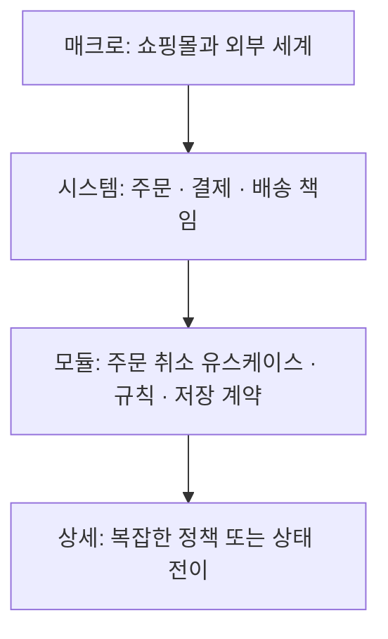

# 계층별 시스템 설계 방법론 Method-R

Method-R은 시스템을 **책임과 계약이 분명한 조각으로 재귀적으로 나누고, 조각들이 서로의 구현과 협력 상대를 몰라도 일하게 연결하는 설계 방법론**이다. 각 조각은 자신의 규칙과 상태에 집중한다. 다른 조각의 도움이 필요하면 상위 객체에 요청을 알리거나, 수신자를 지정하지 않는 메시지를 발행한다.

선호하는 협력 방식은 **상위 오케스트레이터가 이벤트·요청과 결과를 연결하는 방식**, **메시지를 발행하고 각 수신자가 필요한 메시지에 반응하는 방식**이다. REST API는 이 협력을 프로세스 밖으로 전달할 때 사용할 수 있다. 이렇게 나눈 한 조각과 인접 계약만으로 변경을 판단하여 AI가 읽어야 할 구현 맥락을 줄이는 것이 목적이다.

분할·계약의 공통 기준은 [모듈 경계와 최소 맥락 가이드](./module-boundary-guide.md), 조율자의 구현 책임은 [Orchestrator-Worker 가이드](./orchestrator-worker-pattern-guide.md), 다이어그램 문법은 [Job Flow 가이드](./job-flow-diagram-guide.md)를 따른다. 이 문서는 **어떤 경계를 어느 깊이까지 나누고, 나눈 조각을 두 방식으로 어떻게 협력시킬지**를 다룬다.

## 1. 네 가지 설계 깊이


```mermaid
flowchart TB
    L1["매크로: 쇼핑몰과 외부 세계"]
    L2["시스템: 주문 · 결제 · 배송 책임"]
    L3["모듈: 주문 취소 유스케이스 · 규칙 · 저장 계약"]
    L4["상세: 복잡한 정책 또는 상태 전이"]
    L1 --> L2
    L2 --> L3
    L3 --> L4
```

위 그림은 Method-R의 확대 관점을 설명하는 보조 그림이다. 실제 협력 시나리오는 `jobflow` 원본으로 작성한다.

| 깊이 | 핵심 질문 | 주된 산출물 | 다음으로 확대할 조건 |
|---|---|---|---|
| 매크로 | 시스템과 외부의 경계는 어디인가? | 외부 입력·결과·성공 조건 | 내부 책임을 나눠야 판단 가능 |
| 시스템 | 어느 조각이 규칙·데이터를 소유하는가? | 책임 지도·공개 계약·협력 흐름 | 특정 책임 내부의 변경 이유가 다름 |
| 모듈 | 한 책임 안에서 무엇을 조율·판정·저장하는가? | 진입점·의존·상태 소유권·검증 | 복잡한 내부 정책/전이를 감춰야 함 |
| 상세 | 남은 불확실성을 어떤 규칙으로 해결하는가? | 알고리즘·불변식·필요한 하위 흐름 | 새 독립 책임이 있을 때만 재귀 분할 |

상위의 조각 하나를 확대하면 그 조각의 **기존 공개 계약이 하위 설계의 외곽 경계**가 된다. 내부 분할 때문에 호출자가 더 많은 세부 정보를 알아야 한다면 경계를 다시 검토한다. 새 조율자가 실제로 필요할 때만 하위에 둔다.

새 시스템은 바깥 경계부터 확인하되, 기존 시스템의 작은 변경에 모든 깊이의 문서를 다시 만들지 않는다. 이미 확인된 상위 경계는 링크하고 대상 조각부터 시작할 수 있다. 부분마다 멈추는 깊이는 달라도 된다.

## 2. 조각을 연결하는 두 가지 방식

여기서 “서로를 의식하지 않는다”는 것은 **형제 조각의 이름·구체 구현·위치·다음 실행 순서를 각 조각 안에 넣지 않는다**는 뜻이다. 입력·결과·오류나 메시지 의미에 대한 계약은 공유한다. 연결 대상과 경로는 상위 조율자 또는 메시지 구독 구성에서 정한다.

| 방식 | 요청·발행 객체가 아는 것 | 연결을 책임지는 곳 | 결과가 필요할 때 |
|---|---|---|---|
| 상위 객체가 연결 | 자신의 도움 요청과 응답 계약 | 유스케이스의 오케스트레이터 | 상위가 수신 객체의 결과를 받아 요청 객체에 반환 |
| 메시지로 연결 | 메시지 종류·데이터와 발행/요청 계약 | 버스·구독 구성; 처리는 각 수신자 | 요청 식별자로 응답을 대응시켜 요청 객체에 반환 |

두 방식은 독립된 형제 모듈의 협력을 설계할 때 우선 검토한다. 한 모듈 안의 순수 함수 호출이나 응집된 계산까지 이벤트로 바꾸지 않는다. 조율자가 Worker를 호출하고 반환값을 받는 것도 이 원칙에 맞는다. 분할과 직접 호출의 적용 범위는 공통 가이드를 따른다.

### 2.1 상위 오케스트레이터가 도움 요청과 결과를 연결한다

1. A는 자기 일을 하다가 다른 능력이 필요하면 `OnNeedHelp`로 요청을 알린다. A는 B를 참조하거나 찾아서 호출하지 않는다.
2. 상위 오케스트레이터는 A의 요청을 받아 B의 공개 메서드에 전달하도록 연결한다. B는 누가 요청했는지와 결과를 어디에 쓸지 알 필요가 없다.
3. 결과가 필요하면 상위가 B의 비동기 결과를 받아 A에 돌려준다. A는 기다리던 위치에서 자기 처리를 이어간다.

아래 JavaScript의 `OnNeedHelp`는 이름에 `On`이 있지만 **응답자 하나인 비동기 요청 콜백**이다. 일반적인 다중 구독 이벤트의 반환값을 모으는 기능을 가정하지 않는다. 예제의 계산과 데이터는 연결 구조를 보여 주기 위한 것이다.

```javascript
class A {
    OnNeedHelp;

    async Ask(input) {
        const requestHelp = this.OnNeedHelp;
        if (!requestHelp) throw new Error("OnNeedHelp is not connected");
        const result = await requestHelp(input);
        return { value: result.value + 1 };
    }
}

class B {
    async Help(input) {
        return { value: input.value * 2 };
    }
}

class Orchestrator {
    connect(a, b) {
        if (a.OnNeedHelp) throw new Error("OnNeedHelp is already connected");
        const handleNeedHelp = async (request) => {
            const result = await b.Help(request);
            return result;
        };
        a.OnNeedHelp = handleNeedHelp;
        return () => {
            if (a.OnNeedHelp === handleNeedHelp) a.OnNeedHelp = undefined;
        };
    }
}

const a = new A();
const disconnect = new Orchestrator().connect(a, new B());
try {
    console.log(await a.Ask({ value: 3 })); // { value: 7 }
} finally {
    disconnect();
}
```

연결을 담당하는 `Orchestrator`의 관점에서 같은 계약을 다음처럼 표현한다.

```jobflow
orchestrator: Orchestrator
Object: Orchestrator, A, B

A.OnNeedHelp --> B.Help
B.Help.result --> A.OnNeedHelp.result
```

`A.Ask` 내부에서 발생한 요청이 시작점이다. `A.OnNeedHelp.result`는 위에서 정의한 단일 응답 콜백의 반환값이며 일반 이벤트에 반환값을 추가하는 표기가 아니다. A는 `await` 다음부터 계속하므로 결과 화살표를 `A.Ask`로 되돌려 재호출처럼 그리지 않는다.

필수 도움이 연결되지 않으면 명시적으로 실패시킨다. 선택적인 도움이라면 미연결 시 대체 동작을 A의 계약에 둔다. B의 실패는 콜백을 거쳐 A의 실패로 전달하며, 상위가 오류를 변환할 때도 계약의 의미를 보존한다. 연결·해제는 상위의 수명과 함께 관리한다. 예제의 `disconnect`는 새 요청의 연결만 끊으며 이미 시작된 작업을 취소하지는 않는다.

결과가 필요 없는 상태 변화·진행 알림은 일반 이벤트로 발행하고 상위가 구독하여 필요한 객체에 전달할 수 있다. 이때 요청 하나에 결과 하나인 위 콜백 계약과 구분하고, 수신자 실패를 처리할 소유자를 정한다. 콜백 반환을 지원하지 않는 이벤트 도구를 쓴다면 요청 식별자와 응답 전달 경로를 별도로 둔다.

### 2.2 메시지를 알리고 각 수신자가 필요한 메시지에 반응한다

발행자는 수신자의 목록과 구현을 모른 채 메시지를 발행한다. 구독 구성에 따라 WorkerA는 EventA, WorkerB는 EventB에 반응하고, SharedEvent에는 둘 다 반응할 수 있다. 여기서 불특정 다수는 발행 시 수신 객체를 지정하지 않는다는 뜻이며, 모든 객체가 모든 메시지를 처리한다는 뜻은 아니다.

| 사용 흐름 | 발행·요청 객체의 동작 | 완료의 의미 |
|---|---|---|
| 전달 후 결과를 기다리지 않음 | `publish` 후 자기 일을 계속함 | 발행 성공·접수 확인과 소비자의 업무 완료를 구분 |
| 비동기로 결과를 나중에 받음 | 요청 후 다른 일을 하고 응답 콜백·메시지에서 후속 처리 | 요청과 응답을 대응시킨 뒤 후속 처리 |
| 결과가 필요한 동기식 사용 흐름 | `requestAndWait` 결과를 받아야 다음 단계로 진행 | 계약에서 정한 응답을 받거나 오류·기한 초과로 종료 |

마지막 행의 “동기식”은 **호출자 흐름이 결과에 의존한다**는 뜻이다. 내부 메시지 전달과 대기는 `await` 등으로 비동기 구현할 수 있으며 스레드 차단을 요구하지 않는다. 반대로 결과를 기다리지 않는 발행도 전송 오류·재처리 책임이 사라진다는 뜻은 아니다.

다음은 네 가지 독립 시나리오다. `scope`는 메시지 교환을 관찰하는 범위이며, MessageBus는 라우팅과 응답 대응을 맡는다. 버스가 업무의 전체 순서를 정하는 오케스트레이터라는 뜻은 아니다. 메서드 인자를 넣지 않는 기존 jobflow 문법에 맞춰 메시지 종류는 동작명으로 구별하고 데이터 계약은 블록 아래에 적는다.

```jobflow
scope: WorkflowMessageExchange
Object: WorkflowService, MessageBus, WorkerA, WorkerB

WorkflowService.publishEventA --> MessageBus.publishEventA
MessageBus.publishEventA --> WorkerA.onEventA
WorkerA.onEventA --> WorkerA.executeTask

WorkflowService.publishEventB --> MessageBus.publishEventB
MessageBus.publishEventB --> WorkerB.onEventB
WorkerB.onEventB --> WorkerB.executeTask

WorkflowService.publishSharedEvent --> MessageBus.publishSharedEvent
MessageBus.publishSharedEvent --> WorkerA.onSharedEvent
MessageBus.publishSharedEvent --> WorkerB.onSharedEvent
WorkerA.onSharedEvent --> WorkerA.executeTask
WorkerB.onSharedEvent --> WorkerB.executeTask

WorkflowService.loadData --> MessageBus.requestAndWait
MessageBus.requestAndWait --> WorkerA.onDataRequest
WorkerA.onDataRequest --> WorkerA.fetchData
WorkerA.fetchData --> WorkerA.fetchData.result
WorkerA.fetchData.result --> MessageBus.reply
MessageBus.reply --> MessageBus.requestAndWait.result
MessageBus.requestAndWait.result --> WorkflowService.continueWithData
```

* `publishEventA`, `publishEventB`, `publishSharedEvent`는 각각 `publish(EventA)`, `publish(EventB)`, `publish(SharedEvent)`를 그림에서 구별하는 동작명이다. 구현에 세 메서드를 강제하지 않는다.
* `onEventA`·`onSharedEvent`·`onDataRequest`는 수신 핸들러다. 각 Worker 안의 핸들러에서 처리로 가는 화살표는 그 Worker의 호출을 나타낸다. `scope`에 오케스트레이터의 생략 규칙을 적용하지 않는다.
* `requestAndWait`의 입력은 `DataRequest`와 `requestId`, `reply`의 입력은 같은 `requestId`와 결과다. `WorkflowService.loadData`가 응답을 받아 자신의 `continueWithData`를 호출한다. 버스가 WorkflowService의 업무 메서드를 직접 호출하거나 `loadData`를 다시 실행하는 흐름이 아니다.

알림용 이벤트는 발생한 사실을, `DataRequest`는 결과가 필요한 요청을 나타낸다. **발행/구독과 요청/응답은 같은 메시지 수단을 사용해도 완료 계약이 다르다.** 이 예제의 DataRequest 응답자는 WorkerA 하나다. 여러 응답이 필요한 경우에는 기대 응답 수·집계·부분 실패·종료 기한을 별도로 정한다.

버스의 요청/응답 기능은 응답을 기다리는 항목을 전송 전에 등록하고, 요청별 식별자로 동시 요청을 구분해야 한다. 응답자 없음·실패·타임아웃·취소 시 대기를 끝내고 자원을 정리하며, 중복·늦은 응답이 다른 요청을 완료시키지 않게 한다. 사용하는 버스가 이 기능을 제공하는지 확인하고, 없다면 이를 맡는 adapter를 둔다. 전달 보장과 재처리의 공통 기준은 [모듈 경계 가이드](./module-boundary-guide.md)를 따른다.

### 2.3 REST API로 이벤트 메시지와 요청을 전달한다

두 방식의 상대가 다른 프로세스에 있으면 REST API로 전달할 수도 있다. HTTP 호출·주소·직렬화는 Gateway/Adapter가 맡고, A는 기존 도움 요청이나 메시지 계약만 사용한다. 예를 들어 상위가 `OnNeedHelp`를 로컬 B 대신 HelpGateway에 연결하면 A 내부를 바꾸지 않고 원격 도움을 받을 수 있다. 다만 원격 호출의 지연·실패가 기존 계약 안에서 처리 가능한지는 확인해야 한다.

```jobflow
orchestrator: HelpOrchestrator
Object: HelpOrchestrator, A, HelpGateway

A.OnNeedHelp --> HelpGateway.requestHelp
HelpGateway.requestHelp.result --> A.OnNeedHelp.result
```

상위는 HelpGateway의 비동기 결과를 받아 A의 요청 콜백에 반환한다. Gateway가 서버 API에 요청을 보내고 응답을 해석하는 내부 구현은 별도 경계에 둔다.

| 목적 | REST API를 이용하는 흐름 | 구분할 결과 |
|---|---|---|
| 이벤트 알림 | 발행 adapter가 이벤트를 POST하고 수신 endpoint가 내부 버스·핸들러로 전달 | HTTP 접수 확인과 수신자의 처리 완료 |
| 응답 안에 결과 제공 | Gateway가 요청을 보내고 서버의 업무 결과를 받아 상위로 반환 | 업무 성공·거절과 전송 실패 |
| 접수 후 나중에 결과 제공 | 서버가 작업 식별자를 반환하고, Gateway가 상태 조회 또는 콜백 수신으로 최종 결과를 전달 | 접수·처리 중·완료·실패와 대기 기한 |

REST API 자체가 구독자들에게 메시지를 방송하지는 않는다. 다수에게 알려야 하면 수신 경계의 버스나 명시적인 구독 전달 구성이 맡는다. 접수 응답을 최종 업무 결과로 반환하지 않고, HTTP 타임아웃을 상대 작업의 미실행으로 단정하지 않는다. 재전송에 따른 중복 효과와 결과 확인은 요청 식별자·멱등성 계약으로 다룬다.

### 2.4 조율 방식과 전송 방식은 별도로 정한다

* **Orchestration**: 상위 조율자가 참여 조각의 호출·결과를 연결하고 유스케이스의 순서·완료·복구를 책임진다. 이벤트·콜백뿐 아니라 메시지 버스와 REST API로도 구현할 수 있다.
* **Choreography**: 각 소비자가 메시지에 따라 자기 처리를 수행하고 전체 순서를 책임지는 단일 조율자는 없다. 메시지 버스를 쓴다는 사실만으로 이 방식이 되는 것은 아니다.
* **경계 메시지**: 사용자·외부 시스템과의 논리적 입출력이다. HTTP·파일·UI 이벤트·큐 등을 포함하며 반드시 브로커 메시지를 뜻하지 않는다.

분할 깊이, 조율 방식, 같은 프로세스인지 여부, 결과를 기다리는지 여부, 실제 전송 수단을 각각 기록한다. 내부는 반드시 이벤트이고 시스템 단계에서만 통신 방식을 고르는 식으로 고정하지 않는다.

중앙 조율이 있다고 하나의 DB 트랜잭션이 보장되지는 않는다. 이벤트로 나눴다고 결합이나 장애 전파가 사라지지도 않는다. 필요한 원자성, 실패 후 남는 상태, 재시도와 복구 책임은 계약에서 별도로 정한다.

### 2.5 Job Flow를 읽는 기준

* `scope: X`는 보는 범위이며 그 자체로 Choreography를 의미하지 않는다.
* `orchestrator: X`는 실제로 해당 시나리오를 조율하는 객체다.
* 조율자 뷰의 `A.method.result --> B.method`는 **조율자가 A의 결과를 받아 B를 호출**하는 축약이다. A가 B를 직접 호출하는 코드로 옮기지 않는다.
* 일반 이벤트, 요청 콜백, 수신 핸들러는 이름만으로 혼동하지 않고 계약으로 구분한다. `A.OnNeedHelp`는 위에서 정의한 단일 응답 콜백이므로 `.result`를 사용한다. 일반 다중 구독 이벤트에 같은 반환 의미를 가정하지 않는다.
* 내부의 A가 B Port를 호출하는 세부 구현은 A의 하위 뷰에서 표현한다. 상위 조율자가 그 호출을 수행한다고 꾸며 그리지 않는다.
* 문법·분기·반환·렌더러 지원에 관한 세부 기준은 [Job Flow 가이드](./job-flow-diagram-guide.md)를 따른다.

## 3. 매크로 설계: 시스템을 하나의 경계로 보기

사용자가 원하는 결과와 외부 의존부터 확인한다. 시스템 내부에 어떤 클래스가 있을지 추정하지 않는다.

```jobflow
scope: 쇼핑몰시스템
Object: 사용자, 쇼핑몰시스템, 결제사

사용자.On취소요청 --> 쇼핑몰시스템.주문취소
쇼핑몰시스템.주문취소.result --> 사용자.message.취소처리결과
쇼핑몰시스템.On환불요청 --> 결제사.message.환불요청
결제사.On환불상태변경 --> 쇼핑몰시스템.환불결과수신
```

여기서 `scope`는 내부 조율자 유무를 판정하지 않는다. 외부 환불 결과가 지연될 수 있다면 사용자에게 반환할 결과는 “취소 완료”와 “처리 중”을 구분해야 한다. 응답 완료를 업무 완료로 가정하지 않는다.

산출물은 외부 계약, 성공·실패·대기 결과, 주요 제약이다. UI가 없는 CLI나 작은 변환 도구라면 이 경계와 함수 계약만으로 충분할 수 있다.

## 4. 시스템 설계: 책임·상태 소유권과 협력

“서비스”는 논리적 책임을 뜻하며 독립 배포나 Singleton을 강제하지 않는다. 예를 들어 Orders는 주문 상태, Payments는 환불 요청과 결과, Delivery는 출고 상태를 소유한다. 다른 책임의 테이블을 직접 수정하지 않는다.

### 4.1 Orchestration 예제: 주문 취소

이 예제는 상위가 주문·환불 모듈의 공개 계약을 호출하고 결과를 연결하여, 환불 대상 주문의 **최초 취소 요청**을 처리한다. 주문 모듈이 결제 모듈을 직접 호출하지 않는다. 취소 조율자는 결제사 SDK나 주문 테이블을 모른다. 중복 요청·재시작 경로는 아래 계약과 별도의 복구 검증으로 다룬다.

```jobflow
orchestrator: 취소조율자
Object: 취소조율자, 주문관리, 결제관리

취소조율자.취소 --> 주문관리.취소시작
주문관리.취소시작.거절 --> 취소조율자.거절응답
주문관리.취소시작.진행 --> 결제관리.환불요청
결제관리.환불요청.완료 --> 주문관리.취소완료
결제관리.환불요청.확정실패 --> 주문관리.취소실패기록
결제관리.환불요청.결과불명 --> 취소조율자.복구예약
주문관리.취소완료.result --> 취소조율자.취소.result
주문관리.취소실패기록.result --> 취소조율자.취소.result
취소조율자.거절응답.result --> 취소조율자.취소.result
취소조율자.복구예약.result --> 취소조율자.취소.result
```

* Orders의 `취소시작`은 취소 가능 판정과 진행 상태 반영을 원자적으로 수행하거나 버전 조건으로 경쟁 변경을 거절한다. 취소 진행 중 출고 같은 경쟁 명령의 허용 여부도 Orders 계약에 둔다.
* Payments는 같은 취소 작업의 중복 환불을 막고 결과 조회를 제공한다. `결과불명`은 “환불되지 않음”과 다르며 같은 식별자로 확인할 수 있어야 한다.
* `복구예약`은 후속 조회가 보장되는 상태를 남긴 뒤 처리 중을 반환한다. 예약 자체의 실패를 성공으로 숨기지 않는다.
* 주문 상태 저장 실패와 프로세스 재시작도 복구 계약으로 다룬다. 위 그림은 주요 업무 분기이며 모든 기술 예외를 나열한 완성 명세는 아니다.
* 조율자의 워크플로 상태와 모듈의 도메인 상태는 구분한다. 조율자에 주문 취소 가능 규칙을 복제하지 않는다.

### 4.2 Choreography 예제: 확정된 사실의 독립 소비

취소 확정 뒤 알림과 통계가 독립적으로 반응한다면 두 번째 방식으로 이벤트를 발행한다. 주문관리는 수신자를 지정하지 않으며, 각 소비자는 중앙 업무 조율 없이 자기 구독에 반응한다.

```jobflow
scope: 취소후속처리
Object: 주문관리, MessageBus, 알림관리, 통계관리, 운영알림

주문관리.OrderCancelled --> MessageBus.OrderCancelled
MessageBus.OrderCancelled --> 알림관리.HandleOrderCancelled
MessageBus.OrderCancelled --> 통계관리.HandleOrderCancelled
알림관리.NotificationFailed --> MessageBus.NotificationFailed
MessageBus.NotificationFailed --> 운영알림.HandleNotificationFailed
```

알림 실패가 확정된 주문 취소를 되돌리는 것은 아니다. 그런 업무 요구가 있다면 완료 조건과 복구 흐름을 다시 설계한다. 이벤트 이름을 안다는 것은 스키마·의미·발행 시점에 의존한다는 뜻이며 “서로 전혀 모른다”는 뜻은 아니다.

`OrderCancelled`는 취소 저장이 확정된 뒤 발행한다. 저장과 발행 사이 장애로 유실될 수 있다면 outbox 또는 재발행 등 요구에 맞는 복구 방법과 소유자를 정한다. 버스 수신 확인만으로 소비자 처리가 완료되었다고 보지 않는다.

### 4.3 선택 결과 기록

| 판단할 것 | Orchestration을 검토할 경우 | Choreography를 검토할 경우 |
|---|---|---|
| 흐름 소유 | 한 유스케이스가 순서·완료·복구를 소유 | 소비자마다 독립 완료 조건이 있음 |
| 실패 처리 | 중간 실패에 따른 다음 조치를 한곳에서 추적 | 각 소비자가 실패·재처리를 책임짐 |
| 가시성 | 조율 상태와 참여 계약으로 흐름 추적 | 이벤트·구독 지도와 인과 추적 필요 |
| 구조 비용 | 조율자 집중과 복구 상태 관리 비용 | 스키마·구독·전달·운영 비용 |

두 방식은 한 시스템에 공존할 수 있다. 위 취소 요청은 상위가 결과를 연결하고, 후속 알림은 메시지를 구독하여 처리한다. 조율자가 메시지 요청/응답을 이용하는 혼합도 가능하다. 서비스 분리와 REST API 사용 여부는 이 선택과 별도로 기록한다.

## 5. 모듈 설계: 공개 계약 안을 확대하기

시스템 단계의 `주문관리.취소시작` 내부를 확대한다. 외부 호출자는 내부 규칙과 저장소를 모른 채 같은 공개 결과를 받는다.

```jobflow
orchestrator: 취소시작유스케이스
Object: 취소시작유스케이스, 주문저장소, 취소규칙

취소시작유스케이스.실행 --> 주문저장소.조회
주문저장소.조회.없음 --> 취소시작유스케이스.거절응답
주문저장소.조회.찾음 --> 취소규칙.판정
취소규칙.판정.불가 --> 취소시작유스케이스.거절응답
취소규칙.판정.가능 --> 주문저장소.버전조건부취소시작
주문저장소.버전조건부취소시작.충돌 --> 취소시작유스케이스.충돌응답
주문저장소.버전조건부취소시작.저장됨 --> 취소시작유스케이스.진행응답
취소시작유스케이스.거절응답.result --> 취소시작유스케이스.실행.result
취소시작유스케이스.충돌응답.result --> 취소시작유스케이스.실행.result
취소시작유스케이스.진행응답.result --> 취소시작유스케이스.실행.result
```

이 하위 그림도 최초 요청을 다룬다. 조회 결과에는 주문 버전이 있고, 조건부 저장은 그 버전이 여전히 같은 경우에만 반영한다. 도메인 규칙은 `취소규칙`이 소유하고, 원자적 비교·쓰기 구현은 저장소가 제공한다. 다른 작업과의 충돌은 상위의 `거절` 결과로 변환하되 재조회가 필요하다는 오류 의미를 보존한다. 같은 취소 ID 재요청은 기존 진행·완료 결과를 반환해야 한다. 중복 처리를 구현할 때는 단순 충돌 거절 대신 기존 결과 조회 경로를 별도로 설계·검증한다.

이 그림의 조건부 저장은 Port이며 SQL 구현을 뜻하지 않는다. Worker를 조회·변환·검사 같은 한 줄 동작마다 나누지 않는다. 실제 코드가 충분히 단순하면 `취소규칙`은 같은 모듈의 순수 함수로 구현해도 된다.

산출물은 모듈 공개 진입점, 내부 책임, 데이터·오류 계약, 필요한 의존, 해당 경계의 검증이다. 하위의 독립된 조각도 필요하면 같은 두 방식으로 연결한다. 같은 프로세스의 일회성 결과는 호출·요청 콜백의 반환이나 `await`로 받을 수 있고, 진행률·독립 구독은 이벤트로 알린다. 단순한 내부 계산까지 메시지 왕복으로 만들지는 않는다.

## 6. 상세 설계: 불확실한 부분만 더 확대하기

취소 가능 규칙이 복잡하다면 상태·시각·정책 우선순위 같은 불변식을 먼저 정한다. 이것이 여러 독립 책임으로 나뉠 때만 Sub-Orchestrator를 만든다.

| 내부 상황 | 적절한 산출물 |
|---|---|
| 단순 조건식 몇 개 | 함수 시그니처와 경계값 테스트 |
| 상태와 허용 전이가 핵심 | `state` 다이어그램과 전이 불변식 |
| 독립 정책의 순서·결합이 복잡 | 하위 `jobflow`와 정책별 계약 |
| 외부 I/O의 반복·취소가 핵심 | 실행 수명·실패·재시도 계약 |

상세 Job Flow의 노드를 코드 한 줄에 대응시키는 것은 목표가 아니다. 내부 구현을 다 그리면 코드를 중복 관리하게 된다. 상위에 없던 책임·불변식·실패 경계가 드러날 때만 상세를 추가한다.

Sub-Orchestrator를 도입하더라도 상위가 보는 입력·결과·오류 의미는 유지한다. 상세 설계 때문에 공개 계약이 바뀐다면 호출자·소비자를 역방향으로 찾아 시스템 단계의 영향도 함께 갱신한다.

## 7. 흐름 밖에 필요한 계약

공통 [모듈 계약 양식](./module-boundary-guide.md)을 사용한다. 데이터 소유권, 입력·결과, 상태 변경, 오류·취소·부분 성공, 수명·동시성, 호환성, 검증을 그림에 연결한다. 작은 기능은 기존 타입·테스트 링크로 충분하다.

협력 계약에는 다음 질문의 답을 연결한다. 본문을 복제하기보다 실제 콜백 타입·메시지 스키마·Gateway 계약을 원본으로 삼는다.

| 경계 | 확인할 계약 |
|---|---|
| 상위가 받는 도움 요청 | 필수/선택, 응답자 수, 결과·오류, 연결·해제 소유자, 실행 중 취소 |
| 메시지 발행/구독 | 사실의 의미와 발행 시점, 구독 구성, 발행 확인 범위, 소비자별 실패·재처리 |
| 메시지 요청/응답 | 요청 식별자, 응답자·집계 조건, 응답 없음·오류·타임아웃, 중복·늦은 응답 정리 |
| REST 전송 | endpoint의 입력·응답 의미, 접수와 업무 완료, 결과 조회·콜백 경로, 중복 요청·결과 불명 처리 |

메시지를 쓸 때에는 다음처럼 전달 보장과 재시도 정책을 구분한다. 아래 값은 설명용 예시이며 시스템 요구에 맞게 결정한다.

```text
name: OrderCancelled
schemaVersion: 1
producer: Orders
consumers: Notifications, Analytics
payload: eventId, orderId, orderVersion, cancelledAt
publishCondition: 취소 저장 확정; 저장 후 발행 실패는 재발행 가능
delivery: at-least-once
deduplication: consumer별 eventId 처리 기록; 효과와 처리 기록의 원자성 확인
retry: 일시적 오류만; 최대 3회; 전체 30초 이내
failure: 재시도 소진 메시지 격리; 소유자 조사 후 재처리
ordering: 순서 보장 없음; orderVersion으로 오래된 갱신 구분
```

이벤트 중복 방지 기록의 보존 기간은 실제 재전달·수동 재처리 기간과 맞춘다. `orderId`만 멱등 키로 쓰면 같은 주문의 서로 다른 정상 작업까지 합쳐 버릴 수 있으므로 업무 명령 ID와 이벤트 ID를 구분한다.

## 8. 검증과 분할 종료

설계자는 대표 변경 하나로 “어떤 구현을 읽고, 어떤 계약을 바꾸고, 어디를 검증하는가”를 시뮬레이션한다. 독립 검토자는 성공 흐름보다 다음 반례를 확인한다.

1. 한 규칙 변경이 관련 없는 형제 구현까지 읽거나 고치게 하는가?
2. 한 불변식을 여러 모듈이 나눠 쓰거나 조율자에 복제했는가?
3. 반환·이벤트·상태 이름이 상하위 계약에서 같은 의미인가?
4. 타임아웃, 중복, 지연 이벤트, 저장 성공 후 발행 실패를 처리할 소유자가 있는가?
5. 동기·비동기 또는 프로세스 경계를 조율 방식과 혼동했는가?
6. 새 조각의 계약·테스트·탐색 비용이 줄어든 구현 맥락보다 큰가?
7. 도움 요청이 미연결이거나 수신자가 실패해도 A가 정상 결과를 받은 것처럼 계속하지 않는가? 상위가 결과를 빠뜨리지 않고 반환하는가?
8. 동시 요청·중복 응답·타임아웃 뒤 늦은 응답이 다른 실행을 완료시키지 않는가? REST 접수와 최종 결과를 구분하는가?

**책임·불변식·입출력·실패·검증을 외부 구현 없이 이해할 수 있으면 분할을 멈춘다.** 항상 함께 변경되는 조각은 병합을 검토한다. 모든 조각에 같은 깊이를 강제하지 않으며, 위험한 기능 하나를 먼저 구체화한 뒤 얻은 근거로 나머지를 판단한다.

실제 구현 검증에서는 순수 규칙의 반례, 조율의 결과 연결, Gateway의 실제 계약, 경계를 통과하는 핵심 시나리오 중 필요한 계층을 선택한다. 모든 도식마다 E2E를 만들거나 모든 함수를 mock하지 않는다. 문서 리뷰만 수행했다면 실행·성능·토큰 절감까지 검증했다고 보고하지 않는다.
