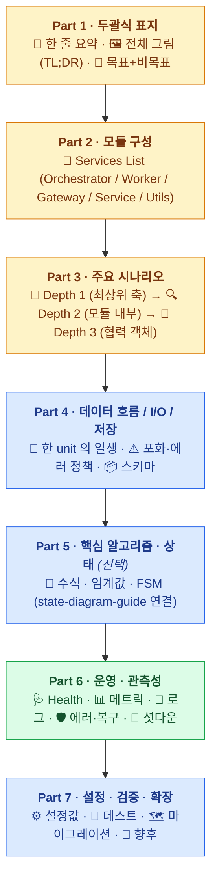
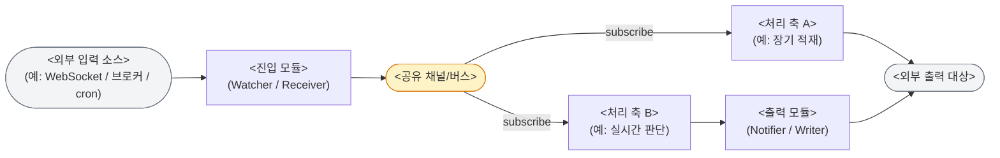
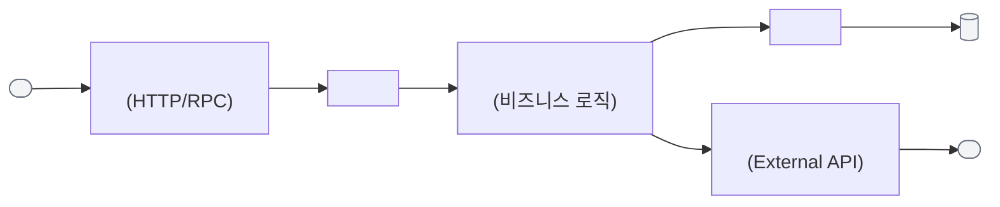
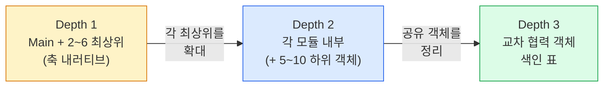
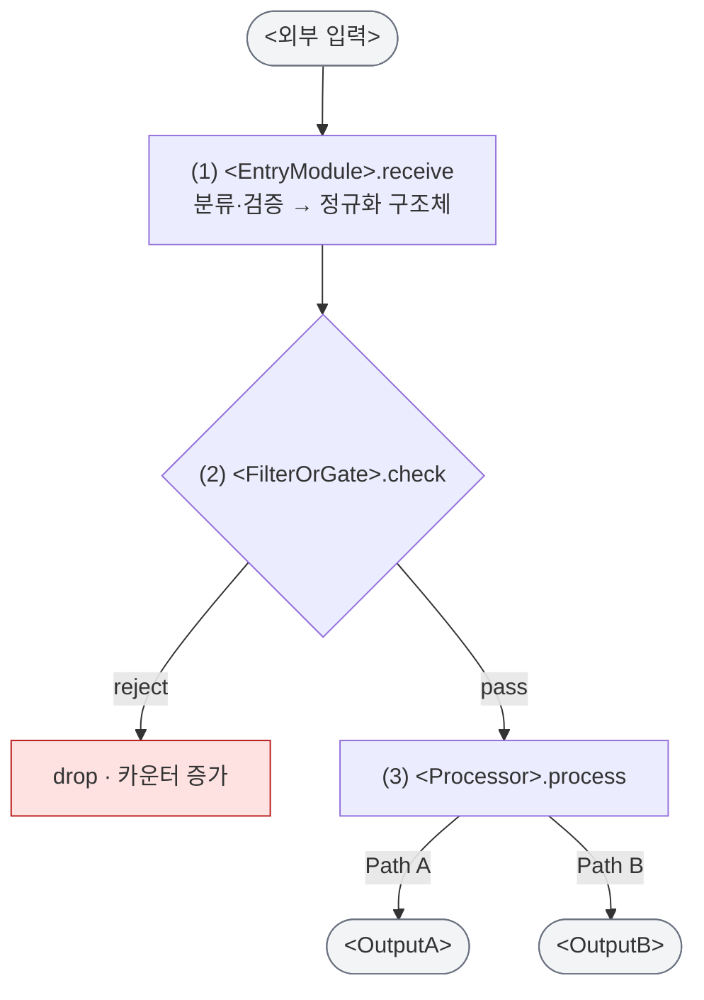
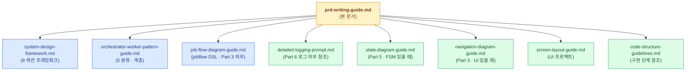

# PRD 작성 가이드

본 가이드는 [`system-design-framework.md`](./system-design-framework.md) · [`orchestrator-worker-pattern-guide.md`](./orchestrator-worker-pattern-guide.md) · [`job-flow-diagram-guide.md`](./job-flow-diagram-guide.md) 를 기반으로 **어떤 프로젝트에도 적용 가능한 범용 PRD 구조** 를 정의한다. 웹 API, 데이터 파이프라인, 실시간 워커, 배치 잡, 모바일 앱, ML 파이프라인 등 **도메인과 무관하게** 쓸 수 있는 탑다운 템플릿이다.

## 한 줄 요약

**PRD 는 7 개 Part 로 구성되며, 앞 3 개 (요약·모듈·시나리오) 만 읽어도 리뷰가 가능하고, 뒤 4 개 (데이터·알고리즘·운영·설정) 는 구현 단계에서 참조한다. 도메인에 맞춰 섹션을 Must/Should/Optional 로 취사선택한다.**

## 전체 그림 (PRD 의 7 파트 스케치)



**읽는 방향**: 위 → 아래. 앞 3 파트(노란색)만 읽어도 **리뷰어는 목적·구조·흐름을 파악** 할 수 있다. 뒤 4 파트(파란/초록)는 **구현자·운영자가 작업 중 참조** 하는 레퍼런스 영역이다.

> 💡 **왜 7 파트인가?** Part 1~3 (요약·모듈·시나리오) 만으로 리뷰가 완결되어야 한다. Part 4~7 은 구현·운영 단계에서 참조한다. 리뷰 단계와 구현 단계의 독자를 분리하는 것이 두괄식의 핵심 목적이다.

## 다이어그램 표기 규칙 (전역 정책)

본 가이드가 정의하는 모든 PRD — 그리고 본 가이드 문서 자체 — 는 다음 다이어그램 정책을 **반드시** 따른다.

1. **텍스트 다이어그램 금지** — 아래 형태의 다이어그램은 PRD 본문과 가이드 문서 모두에서 **사용하지 않는다**.
   - ASCII 박스 아트 (`┌──┐`, `│  │`, `└──┘`)
   - ASCII 트리/화살표 아트 (`├──▶`, `└──▶`, `▲ │ ▼`)
   - 수직 막대와 dash 로 그린 흐름 그림
   - 공백 정렬 기반 레이아웃 다이어그램
2. **모든 다이어그램은 mermaid 로 작성한다**.
   - TL;DR / 아키텍처 개요 → `flowchart LR` 또는 `flowchart TD`
   - 시퀀스/메시지 흐름 → `sequenceDiagram`
   - 상태 기계(FSM) → `stateDiagram-v2`
   - 데이터 흐름 (한 unit 의 일생) → `flowchart TD`
   - 문서 간 관계 · 계층도 → `flowchart TD`
3. **예외 — 구조화 DSL 블록은 텍스트로 허용**
   - `jobflow` 블록 ([`job-flow-diagram-guide.md`](./job-flow-diagram-guide.md)): 이벤트 플로우 전용 DSL. 기계 독해·diff 친화적 구조.
   - `state` 블록 ([`state-diagram-guide.md`](./state-diagram-guide.md)): 간이 FSM DSL. **단, 표현력이 필요하면 mermaid `stateDiagram-v2` 를 우선 쓴다**.
   - `navigation` 블록 ([`navigation-diagram-guide.md`](./navigation-diagram-guide.md)) 도 동일 예외.

   이 세 블록은 "다이어그램을 텍스트로 그린 것" 이 아니라 **표준화된 DSL** 이므로 금지 대상이 아니다.
4. **표기 가독성 원칙**
   - mermaid 노드 라벨에 `<br/>` 으로 줄바꿈, `<b>` 로 강조를 허용.
   - 색상·스타일링은 `classDef` 로 팔레트를 정의해 의미 분류(리뷰 대상 / 구현 대상 / 운영 대상 / 외부 의존 / 장애 경로 등) 를 색깔로 구분.
   - 노드 수는 한 다이어그램당 **3~10 개** 가 적정. 그 이상이면 `subgraph` 로 묶거나 Depth 를 내린다.
5. **금지 → 허용 빠른 치환 가이드**

    | 금지 (AS-IS) | 허용 (TO-BE) |
    | --- | --- |
    | ASCII 박스 다이어그램 (`┌──┐`) | `flowchart LR` 노드 |
    | ASCII 트리 (`├──▶` / `└──▶`) | `flowchart TD` |
    | ASCII 상태 박스 아트 | `stateDiagram-v2` |
    | ASCII 시퀀스 다이어그램 | `sequenceDiagram` |

> ⚠️ **리뷰 반려 사유**: 본 규칙을 위반해 ASCII 박스/트리/박스 아트가 PRD 에 포함되어 있으면 자동 반려. 다이어그램 하나하나가 diff·render·협업 도구에서 작동해야 하므로 예외를 두지 않는다.

## 섹션 체크리스트 (Must / Should / Optional)

| Part | 섹션 | 등급 | 생략 가능 조건 |
| --- | --- | --- | --- |
| 1 | 🧭 한 줄 요약 | **Must** | 없음 |
| 1 | 🖼️ 전체 그림 (TL;DR) | **Must** | 없음 |
| 1 | 🎯 목표 + 비목표 + 성공 기준 | **Must** | 없음 |
| 2 | 🧱 모듈 구성 | **Must** | 없음 |
| 3 | 🔁 주요 시나리오 (Depth 1) | **Must** | 없음 |
| 3 | 🔑 jobflow 직후 **4 요소 세트** (①다이어그램 ②객체 ③이벤트 ④시나리오) | **Must** | 없음 — 모든 jobflow 블록에 의무 |
| 3 | 🔁 주요 시나리오 (Depth 2) | **Should** | 모듈 3 개 이하 + 단순 동기 흐름일 때만 생략 |
| 3 | 🔁 주요 시나리오 (Depth 3) | Optional | Depth 2 에서 충분히 드러나면 생략 |
| 4 | 🔄 데이터 흐름 / I/O 경계 | **Should** | 완전 동기·단일 모듈 CLI 일 때만 생략 |
| 4 | ⚠️ 포화/에러 정책 | **Should** | 비동기 큐·버퍼·재시도가 있을 때 필수 |
| 4 | 📦 저장 경로 · 스키마 | Optional | 영속화가 없을 때 생략 |
| 5 | 🎯 핵심 알고리즘 / 상태 | Optional | CRUD 프록시 성격일 때 생략 |
| 5 | 🔔 복잡 모듈 deep-dive | Optional | §5-5 조건을 2 개 이상 만족할 때만 |
| 6 | 🩺 Health / Readiness | **Should** | 단발성 CLI 툴일 때만 생략 |
| 6 | 📊 메트릭 / KPI | **Should** | 프로덕션 배포 대상이면 필수 |
| 6 | 📝 로그 규약 | **Must** | 없음 — 외부 가이드 참조 의무 |
| 6 | ⏱️ 시간·타임존 규칙 | Optional | 시간 기반 로직이 있을 때 필수 |
| 6 | 🛡️ 자가 복구 / 에러 매트릭스 | **Should** | 외부 의존성이 없을 때 생략 |
| 6 | 🛑 셧다운 시퀀스 | **Should** | 장기 구동 프로세스일 때 필수 |
| 7 | ⚙️ 설정값 (환경변수 등) | **Must** | 없음 |
| 7 | 🧪 검증·테스트 전략 | **Should** | 없음 |
| 7 | 🗺️ 마이그레이션 매트릭스 | Optional | 기존 시스템 대체/리라이트일 때만 |
| 7 | 🚀 향후 확장 (Out of Scope) | Optional | 확장 계획이 있을 때 |
| 7 | 📚 참고 문서 | **Must** | 외부 가이드 경로 필수 기재 |

**Must = 9 개**, **Should = 8 개**, **Optional = 7 개**. 24 개 슬롯 중 **최소 9 개** 만 작성해도 PRD 의 골격은 성립한다.

> 💡 **도메인별 권장 조합**:
>
> | 프로젝트 유형 | 핵심 섹션 조합 |
> | --- | --- |
> | **웹 API 서버** | 1-3 + 4(🔄 요청 일생) + 6(🩺📊📝) + 7(⚙️🧪) |
> | **데이터 파이프라인 (ETL/스트리밍)** | 1-3 + 4 전체 + 5(수식) + 6 전체 + 7(⚙️🧪) |
> | **실시간 워커 (수집·처리)** | 1-4 + 5(상태기계) + 6 전체 + 7(⚙️🧪🛑) |
> | **배치 잡 / 스케줄러** | 1-3 + 4(🔄) + 6(📝🛡️) + 7(⚙️🧪) |
> | **모바일/프론트엔드** | 1-3 + Navigation Diagram + 6(📝) + 7(⚙️) |
> | **ML 학습·추론 파이프라인** | 1-3 + 4 전체 + 5(알고리즘) + 6(📊📝) + 7 전체 |
> | **CLI 툴 / 스크립트** | 1-3(얕게) + 7(⚙️) |

---

## Part 1 — 두괄식 표지 (Depth 0)

### 1-1. 한 줄 요약

**정의**: 이 프로젝트가 **무엇을** · **어떻게** · **왜** 하는지 한 문장에 담는다. 세 요소가 모두 들어가야 한다.

**형식 규칙**:
- **굵게**(`**...**`) 한 줄. 최대 2 문장.
- **구체 동사 + 구체 명사** 사용. 추상 수식어(혁신·최적화·AI 기반·사용자 친화) 금지.
- 기술 스택 이름을 1~2 개 포함해도 좋다.
- **마케팅 카피 금지**.

**좋은 예 (도메인별)**:

| 도메인 | 예시 |
| --- | --- |
| 웹 API | "**사용자 인증·권한 검증·세션 관리를 JWT + Redis 로 처리하는 Node.js 게이트웨이 서버.**" |
| ETL | "**PostgreSQL 의 주문 이벤트를 1 분 배치로 읽어 BigQuery 에 스키마 변환 적재하는 Airflow DAG.**" |
| 실시간 워커 | "**외부 WebSocket 을 구독해 메모리 버퍼에 쌓고, 1 분 단위로 S3 에 JSONL 로 flush 하는 Go 워커.**" |
| ML 추론 | "**사전 학습된 ONNX 분류 모델을 로드해 이미지 업로드 요청에 대해 top-3 레이블을 반환하는 FastAPI 서버.**" |
| 게임 서버 | "**30 인 동시 접속 방을 UDP 로 중계하고 위치·상태를 50ms 주기로 브로드캐스트하는 C++ 릴레이 서버.**" |

**나쁜 예**:
> ❌ "혁신적인 AI 기반 실시간 솔루션"
> ❌ "사용자 친화적인 대시보드로 의사결정을 돕는다"
> ❌ "고성능 서비스"

### 1-2. 전체 그림 (TL;DR)

**정의**: 시스템의 **입력 → 처리 → 출력** 관계를 한 장의 mermaid 다이어그램으로 표현한다.

**형식**: **mermaid `flowchart LR` 또는 `flowchart TD` 만 허용**. (§ 📐 다이어그램 표기 규칙 참조 — ASCII 박스/트리 금지)

**필수 포함 요소**:
1. **외부 의존** (입력 소스): 예) HTTP 요청, 외부 API, 메시지 브로커, DB, 파일, cron 트리거, 사용자 입력
2. **주요 모듈 노드** (3~8 개): Part 2 의 모듈 목록의 subset — **Depth 1 의 "최상위 오브젝트" 와 일치해야 한다** (§3-2-1 참조)
3. **주요 데이터 흐름** (화살표 3~6 개): 레이블은 `publish`, `query`, `emit`, `invoke` 등 동사
4. **출력 대상**: 예) 응답, 저장소, 외부 API 호출, 메시지 발행, UI 렌더
5. 다이어그램 **바로 아래** 에 **"한 줄로 정리하면"** 으로 시작하는 1~2 문장 자연어 요약

**범용 템플릿 — 이벤트 기반 워커** (MarketPulse 스타일, 복수 축):

````markdown

````

**범용 템플릿 — 동기 요청-응답** (웹 API / RPC):

````markdown

````

**"한 줄로 정리하면" 장치** — 다이어그램 직후에 아래 패턴의 한 문단:

> **한 줄로 정리하면**: 《한 프로세스/서비스/함수》가 ① 《입력》 을 받아 ② 《중간 처리》 두 갈래로 흘리고, 그 중 하나만 ③ 《외부 출력》 으로 묶는다. 예외 경로는 《한 줄》.

**노드 수 상한**: TL;DR 다이어그램의 박스(노드)는 **외부 입력·출력 포함 최대 10 개**. 넘어가면 독자가 한눈에 파악 못 한다 — Part 3 Depth 1 로 내려 표현한다.

### 1-3. 목표 · 비목표 · 성공 기준

**정의**: PRD 의 **스코프 경계** 와 **완료 판정 기준** 을 확정한다.

**형식** — 목표·우선순위·성공 기준을 한 표로 압축:

```markdown
| 우선순위 | 목표 | 성공 기준 (관측 지표) |
| --- | --- | --- |
| **P0** | <핵심 목표 1> | `<observable_metric> <비교> <값>` |
| **P0** | <핵심 목표 2> | `<counter> = 0`, `p95 < <값>` 같은 수치 |
| **P1** | <부차 목표> | ... |
| **P2** | <장기 목표> | ... |
```

**우선순위 정의**:
- **P0 = 없으면 프로젝트가 성립하지 않음** (2~4 개 권장. 5 개 이상이면 "우선순위" 라는 말이 무의미)
- **P1 = 있으면 품질이 올라감** (2~4 개)
- **P2 = 향후 확장 후보** (0~2 개)

**관측 가능한 성공 기준이란?**
모든 목표에는 **검증 가능한 수치·boolean fact** 가 있어야 한다. 도메인별 예시:

| 도메인 | 관측 가능한 기준 예시 |
| --- | --- |
| 웹 API | `p95_latency_ms < 200`, `error_rate < 0.01`, `availability ≥ 0.999` |
| ETL | `records_processed_total ≥ input_count`, `duplicate_rate = 0`, `schedule_lag_seconds < 60` |
| 실시간 워커 | `uptime_ratio ≥ 0.99`, `messages_dropped_total = 0`, `ingest_lag_seconds < 5` |
| ML 추론 | `accuracy ≥ 0.92`, `inference_p95_ms < 100`, `cache_hit_rate ≥ 0.8` |
| 모바일 앱 | `cold_start_ms < 1500`, `crash_free_sessions ≥ 0.995`, `DAU/MAU ≥ 0.3` |
| CLI 툴 | `exit_code == 0 on valid input`, `unit_test_coverage ≥ 0.8` |

**금지 표현**: "사용성 향상", "안정적 운영", "만족도 증가", "개선" — 모두 관측 불가능.

**비목표 (Non-Goals)** — 목표 표 바로 아래에 callout:

```markdown
> **명시적 비목표 (Non-Goals)**:
> ① <이번 버전에서 만들지 않는 기능 1>
> ② <이번 버전에서 만들지 않는 기능 2>
> ③ <의도적으로 배제한 사용자/거래/환경/플랫폼>
```

**왜 비목표가 중요한가?** — 스코프 확장을 막는 가장 강한 장치. 리뷰 중 "이것도 넣어주세요" 요청이 오면 "Non-Goals 에 있습니다" 가 재협상 기준이 된다.

---

## Part 2 — 모듈 구성 (Services List)

### 2-1. 모듈 표 템플릿

[`system-design-framework.md §3 Services List`](./system-design-framework.md) 의 확장형.

```markdown
| 모듈 | 책임 | 외부 의존 | 인터페이스 | 분류 |
| --- | --- | --- | --- | --- |
| **`Main`** | 진입점, 의존 조립, 라이프사이클 | — | — | Orchestrator |
| **`Config`** | 설정 로드, 검증 | dotenv / viper / ... | — | Service |
| **`<ModuleX>`** | <비즈니스 로직 한 문장> | <다른 모듈의 인터페이스 이름> | <export 인터페이스> | Worker |
| **`<GatewayY>`** | <외부 시스템 캡슐화> | <SDK/API 이름> | <export 인터페이스> | Gateway |
```

**열 설명**:
- **모듈**: PascalCase · 실제 클래스/패키지 이름과 일치
- **책임**: 한 문장, 동사로 시작. "X 를 Y 한다" 패턴.
- **외부 의존**: 다른 모듈의 **인터페이스 이름** 또는 외부 SDK 이름. **구체 구현체 이름 금지** (DI 가능성 보존)
- **인터페이스**: 이 모듈이 **export** 하는 추상 이름. 다른 모듈이 이걸 import 한다.
- **분류**: `Orchestrator` / `Worker` / `Gateway` / `Service` / `Utils` 중 하나 — [`orchestrator-worker-pattern-guide.md`](./orchestrator-worker-pattern-guide.md) 의 5 분류

**도메인별 모듈 표 예시**:

<details>
<summary>📦 예시 1 — 웹 API 서버 (주문 조회 서비스)</summary>

```markdown
| 모듈 | 책임 | 외부 의존 | 인터페이스 | 분류 |
| --- | --- | --- | --- | --- |
| **`Main`** | 진입점, HTTP 서버 기동 | — | — | Orchestrator |
| **`Config`** | env 로드, 필수 변수 검증 | dotenv | — | Service |
| **`HTTPServer`** | 라우팅, 미들웨어, 요청 파싱 | `OrderUseCase` | — | Orchestrator |
| **`OrderUseCase`** | 주문 조회 비즈니스 로직 | `OrderRepo`, `UserRepo` | `OrderQuery` | Worker |
| **`OrderRepo`** | DB 쿼리 | `DBClient` | `OrderStore` | Gateway |
| **`UserRepo`** | DB 쿼리 | `DBClient` | `UserLookup` | Gateway |
| **`DBClient`** | PostgreSQL 커넥션 풀 | pgx | `SQLExecutor` | Service |
| **`Logger`** | 구조화 로그 | slog | — | Service |
```
</details>

<details>
<summary>🔄 예시 2 — ETL 배치 잡 (일일 집계)</summary>

```markdown
| 모듈 | 책임 | 외부 의존 | 인터페이스 | 분류 |
| --- | --- | --- | --- | --- |
| **`Main`** | 크론/CLI 진입점 | — | — | Orchestrator |
| **`JobRunner`** | 단계별 실행 지휘 | `Extractor`, `Transformer`, `Loader` | — | Orchestrator |
| **`Extractor`** | 원천 DB 에서 날짜 범위 조회 | `SourceDB` | `RecordStream` | Worker |
| **`Transformer`** | 집계·정규화 | — | `AggregatedStream` | Worker |
| **`Loader`** | 대상 DW 에 적재 | `TargetDW` | — | Worker |
| **`SourceDB`** | PostgreSQL read | pgx | `SourceReader` | Gateway |
| **`TargetDW`** | BigQuery insert | bq client | `WarehouseWriter` | Gateway |
| **`StateStore`** | 진행 상태 체크포인트 | 파일시스템 | `Checkpointer` | Service |
```
</details>

<details>
<summary>🎮 예시 3 — 실시간 게임 릴레이 서버</summary>

```markdown
| 모듈 | 책임 | 외부 의존 | 인터페이스 | 분류 |
| --- | --- | --- | --- | --- |
| **`Main`** | 소켓 리스너, 세션 조립 | — | — | Orchestrator |
| **`RoomManager`** | 방 생성·종료, 플레이어 배치 | `Broadcaster` | `RoomLookup` | Worker |
| **`Broadcaster`** | 방 단위 상태 송출 | `UDPTransport` | `StateEmitter` | Worker |
| **`PacketHandler`** | 수신 패킷 디코드·검증 | — | `InboundProcessor` | Worker |
| **`UDPTransport`** | UDP 소켓 I/O | libuv | `DatagramIO` | Gateway |
| **`Clock`** | 틱 타이머 | — | `TickSource` | Service |
```
</details>

### 2-2. 인터페이스 추상화 규칙

**핵심 원칙**: 한 모듈은 **인터페이스에만 의존** 하고 다른 모듈의 구체 타입을 모른다.

```text
나쁜 예 (모듈 표에 명시적으로 금지):
  OrderUseCase.외부의존 = PostgresOrderRepo    ← 구체 클래스
                                                  → 단위 테스트 시 Postgres 전체 모킹 필요

좋은 예:
  OrderUseCase.외부의존 = OrderStore             ← 인터페이스
                                                  → 테스트 시 OrderStore 한 함수만 stub
```

PRD 의 모듈 표에서 **"외부 의존"** 열에 구체 클래스 이름이 아닌 인터페이스 이름을 적는 것이 규칙이다. 인터페이스 이름은 반드시 **"인터페이스" 열에 export 된 것** 중 하나여야 한다 (교차 검증).

### 2-3. orchestrator-worker-pattern-guide 와의 매핑

모든 모듈은 다음 5 분류 중 하나에 **반드시** 속해야 한다. 중간 분류나 새 분류를 만들지 않는다.

| 분류 | 역할 | 예시 (도메인 무관) |
| --- | --- | --- |
| **Orchestrator** | 전체 조율, 하위 Worker 소유, 라이프사이클 지휘 | `Main`, `<Feature>Orchestrator`, `HTTPServer`, `JobRunner`, `RoomManager` |
| **Worker** | 비즈니스 로직, 한 가지 책임 | `OrderUseCase`, `Transformer`, `PacketHandler`, `<도메인>Processor` |
| **Gateway** | 외부 시스템과의 통신 캡슐화 | `OrderRepo`, `SourceDB`, `UDPTransport`, `ExternalAPIClient` |
| **Service** | 싱글톤 공유 자원 | `Logger`, `Cache`, `MetricsRegistry`, `DBClient`, `ConnectionPool`, `Clock` |
| **Utils** | 무상태 stateless 헬퍼 | `datetime`, `parsing`, `validation`, `crypto` |

**분류 판정 질문** (위에서 아래로 순차 적용):

1. "외부 시스템(HTTP, DB, 파일, SDK, 소켓, 메시지 브로커) 과 통신하는가?" → **예** → **Gateway**
2. "하위 객체를 소유하고 흐름을 지휘하는가?" → **예** → **Orchestrator**
3. "전역에서 하나의 인스턴스만 써야 하는가?" → **예** → **Service**
4. "비즈니스 규칙을 판단하거나 데이터를 가공하는가?" → **예** → **Worker**
5. "상태 없이 순수 함수만 제공하는가?" → **예** → **Utils**

---

## Part 3 — 주요 시나리오 (Job Flow, Depth 다단계)

### 3-1. 왜 Depth 다단계인가? — 점진적 상세화 원칙

**단일 Job Flow 다이어그램의 한계**:
- 부팅·정상·장애·셧다운을 한 다이어그램에 넣으면 20~30 줄로 커지고 **축(narrative) 이 실종** 된다.
- 하위 객체(Parser, Filter, Logger, ConnectionPool 등) 까지 한 번에 그리면 리뷰어는 "이 시스템의 핵심 축이 뭐냐?" 라는 가장 기본적인 질문에 답을 얻지 못한다.
- 반대로 너무 축약하면 "실제 장애가 어디서 터지는지" 도 알 수 없다.

**해결 — "점진적 상세화 (Progressive Refinement)"**:

| Depth | 역할 | 등장 객체 수 (권장) | 주 독자 |
| --- | --- | --- | --- |
| **🌲 Depth 1** | **최상위 축** 중심 전체 개관 | `Main` + 2~6 개 | 리뷰어 (첫 접촉) |
| **🔍 Depth 2** | 모듈별 내부 (기동·정상·장애·중지) | 각 섹션 5~10 개 하위 객체 | 리뷰어 + 구현자 |
| **📌 Depth 3** | 교차 참조 관심 객체 색인 | 필요한 만큼 | 구현자 |

**진화 방향**: Depth 1 에서 의도적으로 감춘 하위 객체가 Depth 2 에서 드러나고, Depth 2 에서 여러 모듈이 공유하는 교차 객체가 Depth 3 에서 색인된다. **"같은 시스템을 서로 다른 해상도로 반복" 하는 것** 이 이 구조의 핵심이다.



> 💡 **핵심**: Depth 1 에 들어가지 못한 객체는 "중요하지 않아서" 가 아니라 "이 해상도에서는 노이즈" 라는 뜻이다. 반드시 Depth 2 또는 3 에서 드러나야 하며, 그렇지 않다면 누락.

### 3-1.5. jobflow 직후 **필수 4 요소** (황금 규칙)

**어떤 Depth 의 jobflow 블록이든, 다이어그램만 두고 끝내면 안 된다.** jobflow 는 기계 독해용 압축 표기이고, 사람 독해를 위해서는 **4 요소 세트** 가 다이어그램 직후에 반드시 따라와야 한다.

#### 4 요소 세트

1. **① 다이어그램** — `jobflow` 블록 자체
2. **② 오브젝트 설명** — jobflow `Object:` 에 등장한 **각 객체가 무엇이고 어떤 책임인지** 를 1~2 줄로 표로 정리 (그 섹션에서 처음 등장하는 객체에 한정)
3. **③ 주요 이벤트 설명** — jobflow 에 등장한 `OnXxx` / `On<State>` 이벤트가 **언제 발사되고 누가 수신하는지** 의 목록. 발사 조건, 페이로드 힌트, 수신자를 명시
4. **④ 주요 시나리오 설명 (내러티브)** — "**어떤 이벤트가 발생했을 때, 이런 경로로 시작해서 저런 상태로 끝난다**" 형태의 자연어 흐름 설명. 1~3 개의 대표 시나리오를 각각 한 문단으로.

#### 각 요소의 템플릿

````markdown
```jobflow
master: ...
Object: ...
...
```

**② 오브젝트 설명**:

| 객체 | 역할 |
| --- | --- |
| **`ObjA`** | (이 섹션 맥락에서 ObjA 가 하는 일. 1~2 줄.) |
| **`ObjB`** | ... |

**③ 주요 이벤트 설명**:

| 이벤트 | 발사 조건 | 페이로드 / 힌트 | 수신자 |
| --- | --- | --- | --- |
| `ObjA.OnXxx` | (어떤 상황에서 발사되나) | (핵심 필드 이름 1~3 개) | `ObjB` / (상위) / (외부 알림) |
| `ObjA.OnError` | (장애 발사 조건) | `error_code`, `retry_count` | (상위) |

**④ 주요 시나리오 설명**:

**시나리오 1 — (대표 시나리오 이름)**:
(Trigger 이벤트) 가 발생하면 `ObjA.Receive` 가 호출되고,
`ObjA` 는 내부에서 `Step1` → `Step2` 를 거친 후
`ObjB` 에 결과를 전달한다. `ObjB` 는 (후속 동작) 을 수행해
최종적으로 `OutEvent` 를 발사하며, 이 이벤트는 (누가 받아서 무엇을 하는지).

**시나리오 2 — (장애 경로 이름)**:
`Dep.OnFailure` 가 발사되면 `ObjA` 는 (복구 액션) 을 시도하고,
실패 횟수가 (임계) 를 넘으면 (최종 동작) 으로 종결된다.
````

#### 왜 4 요소가 필요한가?

| 요소 없이 생기는 문제 | 해결 |
| --- | --- |
| **① 만 있을 때**: jobflow 는 `-->` 화살표 나열이라, 처음 보는 독자는 객체의 정체를 모른다 | ② 오브젝트 설명 |
| **① + ② 만 있을 때**: `OnXxx` 이벤트가 언제 발사되는지 코드를 안 본 사람은 알 수 없다 | ③ 이벤트 설명 |
| **① + ② + ③ 만 있을 때**: 요소들은 다 알지만 "실제로 하나의 요청이 들어오면 어떻게 흘러가지?" 답이 안 나온다 | ④ 시나리오 내러티브 |

**jobflow = 어휘집, 4 요소 = 문장**. jobflow 만으로는 문법만 있고 문장이 없다.

#### 4 요소가 이미 다른 섹션에 있는 경우 (DRY 예외)

- **객체 설명**: Part 2 🧱 모듈 구성 표에 이미 해당 객체가 있으면 **링크로 대체** 가능. 단, Depth 2 에서 처음 등장하는 **하위 객체**(`Parser`, `Filter` 등)는 Part 2 에 없을 가능성이 크므로 반드시 ② 표에 작성.
- **이벤트 설명**: Depth 2 하단의 "핵심 이벤트" 목록이 ③ 역할을 겸한다. 단, **발사 조건·수신자** 가 누락되지 않도록 주의.

#### Depth 별 적용 강도

| Depth | ① 다이어그램 | ② 객체 설명 | ③ 이벤트 설명 | ④ 시나리오 내러티브 |
| --- | --- | --- | --- | --- |
| **Depth 1** | 필수 | **필수** (축 테이블이 일부 대체 가능) | 필수 (주요 `OnXxx` 위주) | **필수** — 2~3 개 대표 시나리오 |
| **Depth 2** | 필수 | **필수** (하위 협력 객체 포함) | **필수** | **필수** — 기동·정상·장애 각 1 개 |
| **Depth 3** | 없음 (표로 대체) | 표가 ② 역할 | 해당 없음 | 해당 없음 |

### 3-2. Depth 1 — Main 시나리오

**목적**: 시스템의 **축(axis) 2~4 개** 를 먼저 드러낸 뒤, 축 별로 jobflow 섹션을 구분한다.

#### 3-2-1. 핵심 원칙 — "Depth 1 Object 는 최상위만"

**Depth 1 의 `Object:` 목록은 반드시 "최상위(top-level) 오브젝트" 만 포함한다.** 이것이 이 가이드에서 가장 자주 깨지는 규칙이다.

**"최상위" 의 정의** (세 가지 중 하나):
1. 시스템의 **축(axis) 을 직접 담당** 하는 Worker 또는 Orchestrator
2. 모든 축을 소유·조립·생명주기 관장하는 **최상위 오케스트레이터** (`Main` 등)
3. 축과 축 사이를 잇는 **1 급 공유 채널 / 1 급 Gateway** — 여러 축이 알아야만 하는 경계물 (생략 가능)

**Depth 1 에 넣지 말 것** (반드시 Depth 2 또는 Depth 3 로 내린다):

| 종류 | 예시 |
| --- | --- |
| 모듈 내부 서브 컴포넌트 | `Parser`, `Filter`, `Validator`, `Formatter`, `Normalizer`, `Classifier` |
| 외부 연결 구체 객체 | `WSConnection`, `HttpClient`, `DBConnection`, `Subscription`, `SocketPool` |
| 공유 인프라 서비스 | `Logger`, `Config`, `MetricsRegistry`, `Clock`, `UUIDGen`, `Tracer` |
| 정책·유틸 객체 | `RetryPolicy`, `RateLimiter`, `CircuitBreaker`, `BackoffStrategy`, `CooldownRegistry` |
| 모듈 내부 자료구조 | `PriorityQueue`, `RingBuffer`, `SpillStore`, `LRU`, `IndexTable` |
| 토큰/세션/보조 Gateway | `TokenManager`, `KeyRotator`, `SessionStore`, `Credentials` |

**판별 질문 (순차)**:

1. "이 객체 없이도 다른 축이 각자 살아서 돌아가는가?" — **아니오** → 최상위 아님, Depth 2 로
2. "이 객체의 라이프사이클이 다른 최상위 객체에 종속되는가?" — **예** → Depth 2 로
3. "이 객체는 여러 최상위 객체가 공유하는 인프라 헬퍼인가?" — **예** → Depth 3 로
4. "이 객체가 한 문장으로 외부 입력·출력 경계를 설명하는가?" — **예** → 최상위 후보

**노드 수 상한**: Depth 1 jobflow 의 `Object:` 에는 **`Main` 을 포함해 최대 7 개**. 넘어가면 축 정의를 다시 하거나 일부를 Depth 2 로 내린다. 7 개를 넘지 않는 것이 Depth 1 이 "한눈에 읽히는" 조건.

**reference 예시 — MarketPulse (한 프로세스 시세·시그널·알림 워커)**:

| Depth | 등장 객체 | 수 |
| --- | --- | --- |
| **Depth 1** | `Main`, `MarketWatcher`, `ParquetSink`, `PrevCloseCache`, `PremarketDIP`, `NotificationHub` | **6** |
| Depth 2-A (`MarketWatcher` 내부) | `KISClient`, `WSConnection`, `Subscription`, `Parser`, `WatchlistFilter`, `TickBus`, `MetricsRegistry` | +7 |
| Depth 2-B (`PrevCloseCache` 내부) | `DailyScheduler`, `RetryPolicy`, `Store` (+ `KISClient`) | +3 |
| Depth 2-C (`NotificationHub` 내부) | `PriorityQueue`, `CooldownRegistry`, `Formatter`, `TelegramClient`, `SpillStore` | +5 |
| Depth 3 (교차 참조 색인) | `TickBus`, `DailyScheduler`, `KISClient`, `MetricsRegistry`, `RetryPolicy`, ... | 표로 정리 |

> 💡 **시그니처 비교**: `MarketWatcher` 는 Depth 1 에 등장(축), 하지만 그 내부의 `Parser` / `WatchlistFilter` / `WSConnection` 은 Depth 2 에서만 등장. `KISClient` 는 여러 최상위 객체(`MarketWatcher`, `PrevCloseCache`) 가 공유하므로 Depth 3 의 공유 Gateway 로 색인. 이 **"Depth 1 은 최상위, Depth 2 는 내부, Depth 3 는 공유"** 구조가 점진적 상세화의 표본.

#### 3-2-2. 축(axis) 정의

**축(axis) 이란?** — 시스템에서 **독립적으로 실행되며 서로 다른 수명주기를 갖는** 주요 흐름.

**도메인별 축 예시**:

| 도메인 | 축 1 | 축 2 | 축 3 |
| --- | --- | --- | --- |
| 웹 API | 요청 처리 (요청당) | 백그라운드 잡 (주기적) | 캐시 워밍 (부팅 1 회) |
| ETL | 추출 (배치) | 변환 | 적재 |
| 실시간 워커 | 수집 (상시) | 처리·분석 (이벤트) | 알림·출력 (시그널) |
| 모바일 앱 | UI 렌더링 | 로컬 상태 동기화 | 푸시 수신 |
| ML 파이프라인 | 특성 추출 | 학습 | 검증·배포 |
| 게임 서버 | 입력 수신 | 시뮬레이션 틱 | 상태 브로드캐스트 |

**축 테이블 (필수)**:

```markdown
### Depth 1 — Main 시나리오

**N 개의 축으로 시스템 이해하기**:

| 축 | 역할 | 활성 시점 |
| --- | --- | --- |
| **`AxisA`** | (한 줄 책임) | **상시 / 이벤트 기반 / 주기 / 단발 중 택1** |
| **`AxisB`** | ... | ... |
| **`AxisC`** | ... | ... |
```

**축 기반 jobflow 블록** (도메인 무관 템플릿, **최상위 객체만** 등장):

```jobflow
master: Main
Object: Main, AxisA, AxisB, AxisC, AxisD, AxisE

Main.OnStart          --> AxisD.Start
Main.OnStart          --> AxisB.Start
Main.OnStart          --> AxisA.Start

AxisA.OnEvent         --> AxisB.Feed
AxisA.OnEvent         --> AxisC.Feed

AxisC.OnSignal        --> AxisD.Emit

Main.OnWallClockTick  --> AxisE.RunOnce

Main.OnSignalStop     --> AxisA.Stop
AxisA.OnStopped       --> AxisB.FlushAll
AxisA.OnStopped       --> AxisC.Stop
AxisC.OnStopped       --> AxisD.Drain
```

> ℹ️ 위 `AxisA` ~ `AxisE` 는 **placeholder identifier** 다. 실제 PRD 에서는 도메인에 맞는 이름(예: `MarketStream`, `TickStore`, `AlertEngine`)으로 치환한다. 자세한 제약은 바로 아래 "jobflow 표기 규칙" 단락 참조.

**시나리오 구역 (위 블록의 읽는 순서 설명, prose)**:

- **부팅**: `Main.OnStart` 라인 3 개 — 출구(`AxisD`) → 저장(`AxisB`) → 입력(`AxisA`) 순서로 열어, 입력을 마지막에 여는 것으로 부팅 중 드롭을 방지.
- **입력 → 공유 fan-out**: `AxisA.OnEvent` 가 저장 축과 실시간 판단 축 두 곳으로 동시에 흐른다.
- **판단 → 출력**: `AxisC.OnSignal` 이 출구 축을 트리거.
- **주기·단발**: `Main.OnWallClockTick` 은 wall-clock 경계마다 발사되는 이벤트 (구체 시각은 블록 밖 설명에 명시).
- **셧다운**: `Main.OnSignalStop` (SIGTERM 수신) → 상류 차단 → 각 축이 OnStopped 를 통해 하류를 순차 드레인.

**jobflow 표기 규칙** — DSL 의 구성 요소(`master:` / `Object:` / `-->`), 허용 표기(순차 호출 · 이벤트 구독 · 반환값 / 불리언 / enum 분기 · 생성자), 금지 사항(파라미터, 객체 내부 프로세스, 주석 등), 그리고 모든 표현 패턴은 [`job-flow-diagram-guide.md`](./job-flow-diagram-guide.md) 가 단일 출처(SSOT)다. **본 가이드는 그 규칙을 다시 적지 않는다** — 의문이 생기면 그 문서를 본다.

본 PRD 가이드가 jobflow 위에 추가로 두는 제약은 다음 두 가지뿐이다.

1. **Depth 1 의 `Object:` 에는 최상위 객체만 등장** (앞 §3-2-1 참조). Parser / Filter / Logger / MetricsRegistry 같은 하위 객체는 Depth 2 에서 처음 선언한다.
2. **꺾쇠 placeholder 금지** — `Object: <AxisA>, <AxisB>` 처럼 식별자를 `< >` 로 감싸면 jobflow 렌더러가 HTML 태그로 해석해 **객체 컬럼이 통째로 사라진다**. 템플릿 placeholder 라도 plain identifier(`AxisA`, `Module`, `Dep1`) 만 쓰고, "이건 placeholder 다" 라는 설명은 블록 밖 prose 에 둔다.

**권장 섹션 순서** (prose 에서 설명): 부팅 → 축별 정상 흐름 → 셧다운. jobflow 블록 내부에는 구역 경계를 표시하지 않는다 — 관련 라인을 **빈 줄** 로 구분하고, "이 부분은 부팅이다" 같은 설명은 블록 밖 prose 의 소제목·bullet 로 옮긴다.

**Depth 1 jobflow 직후 — 필수 4 요소 (§3-1.5 참조)**:

Depth 1 다이어그램 직후에는 **객체 설명 표 → 이벤트 설명 표 → 시나리오 내러티브** 순으로 4 요소를 반드시 작성한다.

````markdown
**② 오브젝트 설명** (Depth 1 에서 처음 등장한 객체 기준):

| 객체 | 역할 |
| --- | --- |
| **`Main`** | 진입점. Config → Logger → 각 축의 Start 를 순서대로 호출하고, SIGTERM 수신 시 역순 셧다운을 지휘. |
| **`AxisA`** | (한 줄 책임). Part 2 모듈 표에 이미 상세가 있으면 "Part 2 참조" 로 축약 가능. |
| **`SharedChannel`** | 모든 축이 공유하는 in-proc / 프로세스 간 채널. |
| ... | ... |

**③ 주요 이벤트 설명**:

| 이벤트 | 발사 조건 | 페이로드 / 힌트 | 수신자 |
| --- | --- | --- | --- |
| `Main.OnStart` | 프로세스 진입 | — | 자기 자신 (조립 지휘) |
| `AxisA.OnEvent` | 입력 수신 시 | 핵심 필드 1~3 개 | `SharedChannel` |
| `AnyModule.OnSignal` | 시그널 조건 만족 시 | priority, payload (본문 참조) | `AxisC` |
| `Main.OnSignalStop` | OS SIGTERM 수신 | — | 각 축 (역순) |

> ⚠️ 이벤트 이름 열에는 `Event(param)` 같은 괄호 표기를 쓰지 않는다. 괄호는 jobflow DSL 에도 없고, prose 테이블에서도 jobflow 와 이름이 1:1 매칭되어야 한다. 파라미터·페이로드는 **"페이로드 / 힌트" 열** 에 별도로 기재한다.

**④ 주요 시나리오 설명**:

**시나리오 1 — 부팅 & 정상 가동**:
프로세스 시작 시 `Main.OnStart` 가 Config·Logger 를 먼저 초기화한 뒤
세 축(`AxisA`, `AxisB`, `AxisC`)을 의존 순서대로 기동한다.
기동이 완료되면 `AxisA` 가 외부 입력을 수신하기 시작해
`SharedChannel` 로 publish 하고, 두 하류 축이 이를 각각 소비한다.

**시나리오 2 — 대표 비즈니스 이벤트 흐름**:
외부 트리거 이벤트가 들어오면 `AxisA.OnEvent` 가 발사되고,
`SharedChannel` 을 거쳐 `AxisB.Feed` 가 호출된다. `AxisB` 는
처리 로직 후 `AxisB.OnSignal` 을 발사하고, `AxisC` 는 이를
받아 `OutputGateway` 를 통해 외부로 내보낸다. 전체 latency 는 p95 < SLO 목표.

**시나리오 3 — 셧다운**:
`SIGTERM` 수신 시 `Main` 은 상류부터 차례로 `Stop` 을 호출한다.
`AxisA` 가 신규 입력을 중단하고, `SharedChannel` 이 close 신호를
전파하면 `AxisB` / `AxisC` 는 잔여 작업을 drain 한 뒤 종료.
총 drain timeout 은 N 초.
````

### 3-3. Depth 2 — 모듈별 세부 시나리오

**목적**: Depth 1 에서 드러난 축 별로, **각 모듈의 내부 상태 전이와 장애 경로** 를 jobflow 로 정밀하게 기술한다.

**필수 구성 요소** (각 Depth 2 섹션마다):
1. **책임 한 줄** — "이 모듈이 무엇을 책임지는가"
2. **`jobflow` 블록** — master 가 해당 모듈로 바뀜
3. **4 개 경로 섹션** — `기동`, `정상 흐름`, `장애·자가복구`, `중지`
4. **핵심 이벤트 목록** — 상위 모듈이 수신해야 할 이벤트 이름
5. **정책 박스** (선택) — 부분 성공 / 우선순위 / 쿨다운 / 큐 포화 정책 등

**Depth 2 템플릿**:

````markdown
### Depth 2-A — ModuleName 세부 시나리오

**책임**: (모듈의 책임을 1~2 문장으로).

```jobflow
master: ModuleName
Object: ModuleName, Dep1, Dep2, Parser, Filter, MetricsRegistry

ModuleName.Start           --> Dep1.Init
Dep1.OnInit                --> Dep2.Connect
Dep2.OnConnected           --> ModuleName.MarkRunning

Dep2.OnEvent               --> Parser.Process
Parser.OnProcessed         --> Filter.Check
Filter.OnPass              --> ModuleName.Publish

Dep2.OnClose               --> ModuleName.ReconnectWithBackoff
Dep1.OnCredExpiring        --> Dep1.Refresh
Filter.OnDrop              --> MetricsRegistry.IncDropped

ModuleName.Stop            --> Dep2.Disconnect
Dep2.OnDisconnected        --> ModuleName.OnStopped
```

> ℹ️ `ModuleName`, `Dep1`, `Dep2`, `Parser`, `Filter` 는 **placeholder identifier** 다. 실제 PRD 에서는 도메인 이름(예: `MarketStream`, `AuthClient`, `WSConnection`, `TickParser`, `SymbolFilter`)으로 치환한다. 표기 제약은 [`job-flow-diagram-guide.md`](./job-flow-diagram-guide.md) 단일 출처 + 본 가이드 §3-2 "jobflow 표기 규칙" 단락의 PRD 추가 제약 2 개 항목 참조.

**시나리오 구역 (위 블록의 읽는 순서 설명, prose)**:

- **기동**: `Start` → `Dep1.Init` → `Dep2.Connect` → `MarkRunning` (상태 진입 메서드).
- **정상 흐름**: `Dep2.OnEvent` 를 받아 `Parser.Process` → `Filter.Check` → 통과 시 `Publish`, 드랍 시 `MetricsRegistry.IncDropped`.
- **자가 복구**: `Dep2.OnClose` / `Dep1.OnCredExpiring` 감지 시 재연결·크레덴셜 갱신.
- **중지**: `Stop` → `Dep2.Disconnect` → `OnStopped` 이벤트로 상위 보고.

**② 오브젝트 설명** (이 섹션에서 처음 등장하는 하위 객체 기준):

| 객체 | 역할 |
| --- | --- |
| **`ModuleName`** | 이 모듈 자체의 책임을 상세히. Part 2 의 한 줄 책임을 2~3 줄로 확장. |
| **`Parser`** | 입력을 정규화 구조체로 변환. |
| **`Filter`** | 관심 대상이 아닌 항목 drop + 통계 누적. |
| **`Dep1`** | 외부 의존성 X. 예: 인증·크레덴셜 관리 담당. |
| **`Dep2`** | 외부 의존성 Y. 예: 네트워크 연결 담당. |

**③ 주요 이벤트 설명**:

| 이벤트 | 발사 조건 | 페이로드 / 힌트 | 수신자 |
| --- | --- | --- | --- |
| `Dep2.OnEvent` | 외부 입력 수신 | 핵심 필드 | `Parser` |
| `Parser.OnProcessed` | 정규화 성공 | 정규화 구조체 | `Filter` |
| `Filter.OnPass` / `OnDrop` | 조건 판정 결과 | 통과/드랍 이유 | `ModuleName.Publish` / `MetricsRegistry` |
| `ModuleName.OnStopped` | 셧다운 완료 | — | 상위 Orchestrator |
| `ModuleName.OnError` | 복구 불가 에러 | `error_code`, `cause` | 상위 + 메트릭 |
| `ModuleName.OnReconnecting` | 자가 복구 시작 | `attempt`, `backoff_sec` | 메트릭 |

**④ 주요 시나리오 설명**:

**시나리오 1 — 기동**:
`ModuleName.Start` 호출 시 `Dep1` 을 먼저 초기화해 크레덴셜·자원을
확보하고, 그 후 `Dep2.Connect` 로 외부 연결을 수립한다. `Dep2` 가
`OnConnected` 를 발사하면 `ModuleName` 의 상태가 `RUNNING` 으로 바뀌고
정상 흐름에 진입한다.

**시나리오 2 — 정상 처리 한 건의 일생**:
외부 입력 1 건이 `Dep2` 를 통해 수신되면 `Parser.Process` 가 호출되어
정규화 구조체가 만들어진다. `Filter.Check` 가 관심 대상 여부를 판단해,
통과하면 `ModuleName.Publish` 로 상위 채널에 전달되고, 드랍되면
`MetricsRegistry.dropped_total` 카운터가 증가한다.

**시나리오 3 — 장애 & 자가 복구**:
`Dep2.OnClose` (외부 연결 끊김) 이 발사되면 `ModuleName` 은
`ReconnectWithBackoff` 를 시작해 1s → 60s 지수 백오프로 재연결을 시도한다.
동시에 `Dep1` 의 크레덴셜 만료가 원인일 수 있으므로 `Refresh` 도 병행
트리거된다. 재연결 성공 시 `Dep2.OnConnected` 가 다시 발사되어 정상
흐름으로 복귀.

**시나리오 4 — 중지**:
`ModuleName.Stop` 호출 시 먼저 `Dep2.Disconnect` 로 외부 연결을 끊어
신규 입력을 차단하고, in-flight 처리를 완료한 뒤 `ModuleName.OnStopped`
를 발사해 상위 Orchestrator 에 보고한다.

**정책 박스** (선택):
> 💡 **부분 성공 정책**: (판정 규칙). (실패한 대상 처리 방법).
````

**Critic 규칙**:
- Depth 2 섹션이 Depth 1 을 **중복** 하지 말 것. Depth 2 는 **장애·자가복구 경로를 반드시 포함** 해야 한다. 장애 경로가 없다면 Depth 2 를 작성할 필요가 없다.
- 모듈 하나당 한 섹션. 2-A / 2-B / 2-C 로 문자 꼬리표.
- 2~5 개 섹션이 권장. 그 이상이면 모듈을 너무 잘게 쪼갠 것.

### 3-4. Depth 3 — 관심 오브젝트 보강

**목적**: Main 시나리오와 Depth 2 에 표면화되지 않는 **협력 오브젝트** (스케줄러, 재시도 정책, 메트릭 레지스트리, 스필 저장소 등) 를 한 표로 명시한다.

**왜 필요한가?** — Depth 2 에서 "토큰 갱신 실패" 나 "외부 API rate limit" 같은 구체 장애 경로를 기술하려면 **책임을 가진 객체 이름이 선결 조건** 이다. Depth 1 에서 일부러 감춰둔 디테일을 Depth 3 에서 드러내는 구조.

**템플릿**:

```markdown
### Depth 3 — 추가 관심 오브젝트

Main 시나리오에 요약만 나타나지만 실제로는 별도 오브젝트로 존재하는 것들:

| 오브젝트 | 소속 | 역할 |
| --- | --- | --- |
| **<Scheduler>** | (top-level) | <wall-clock 트리거 발행, 중복 실행 방지> |
| **<RetryPolicy>** | (shared util) | <rate-limit + transient backoff 정책 제공> |
| **<MetricsRegistry>** | (shared service) | <Prometheus 카운터/게이지 허브> |
| **<SpillStore>** | <ModuleX> 하위 | <유실 금지 항목의 파일 기반 보존> |
| **<ConnectionPool>** | (shared service) | <DB/HTTP 커넥션 재사용> |
| **<RateLimiter>** | (shared util) | <토큰 버킷/leaky bucket 제어> |
| **<Parser>** | <ModuleY> 하위 | <바이너리/텍스트 포맷 디코드> |
| **<Validator>** | <ModuleY> 하위 | <입력 검증, 스키마 체크> |
```

**"소속"** 열은 `(top-level)` / `(shared service)` / `(shared util)` / `<상위 모듈> 하위` 중 하나.

---

## Part 4 — 데이터 흐름 / I/O 경계 / 저장

### 4-1. 한 요청/메시지/이벤트의 일생

**목적**: 입력 1 건이 어떤 경로로 변환·분기·저장되는지 **번호 매긴 단계** 로 설명한다.

**도메인별 "unit" 예시**:

| 도메인 | "한 <unit> 의 일생" 에서 unit 이 뜻하는 것 |
| --- | --- |
| 웹 API | **한 HTTP 요청** |
| ETL | **한 레코드** (또는 한 배치) |
| 메시지 워커 | **한 메시지** (Kafka, SQS, AMQP 등) |
| 실시간 수집 | **한 프레임 / 한 tick** |
| ML 추론 | **한 예측 요청** |
| 게임 서버 | **한 패킷 / 한 틱** |

**템플릿**: mermaid `flowchart TD` 로 그린다. §📐 다이어그램 표기 규칙에 따라 트리 ASCII 는 금지.

````markdown
### 한 unit 의 일생


````

**규칙**:

- 번호 `(1)`, `(2)`, `(3)` … 단계마다 **한 책임** 만. 노드 라벨 앞에 번호를 붙여 prose 와 1:1 매칭.
- 분기는 `mermaid` diamond (`{ ... }`) 노드로. 분기 라벨은 `-->|pass|` / `-->|reject|` 같이 화살표 라벨로.
- 드랍·폐기 경로는 별도 색깔 classDef (`drop`) 로 시각 구분.
- 두 경로가 독립적이라는 점은 다이어그램 **아래 prose** 에 한 줄로 명시 ("두 경로는 독립적, 한쪽 지연이 다른 쪽을 막지 않음").

### 4-2. 포화 / 에러 정책 (필수 조건부)

**필요 조건**: 다음 중 하나라도 해당하면 반드시 이 섹션 작성.
- 비동기 큐·버퍼·채널이 있다
- 재시도 로직이 있다
- 외부 API rate limit 이 있다
- 백그라운드 작업과 온라인 작업이 같은 리소스를 공유한다

**템플릿**:

```markdown
### 포화 / 에러 정책

| 층 | 한계 | 가득/오류 시 |
| --- | --- | --- |
| <Channel A> | `<ENV_VAR_A>=10000` | 신규 메시지 drop, `drop_total{layer="a"}` 증가 |
| <Channel B> | `<ENV_VAR_B>=5000`  | drop + 상위에 **보류 알람** 발사 |
| <Buffer>    | `50000 행 또는 50MB` | 즉시 강제 flush (시간 경계 무시) |
| <Queue>     | `<QUEUE_SIZE>=1000` | LOW 부터 drop, HIGH/URGENT 는 **persistent spill** |
| <외부 호출> | rate limit 응답 | 60s 대기 × 최대 3 회, 이후 caller 에 에러 |
| <외부 호출> | 5xx / 타임아웃 | exp backoff (2s→4s→8s) × 3 회 |
```

**각 행의 규칙**:
- **층** = 메모리·채널·버퍼·큐·외부 호출 중 하나. 구체 이름으로.
- **한계** = 환경변수 이름 또는 하드 상수. 숫자만 있고 이름이 없으면 금지.
- **가득/오류 시** = `drop` / `block` / `spill` / `force-flush` / `retry` / `fail-fast` 중 하나. **동사형 한 줄**.

### 4-3. 저장 경로 / 스키마 (있는 경우)

저장이 있는 프로젝트는 다음 5 가지를 명시:

1. **파티션 전략** — 디렉터리 구조, Hive 스타일 `key=value` 선호
2. **스키마 표** — 컬럼명 / 타입 / 예시값 / 설명
3. **버퍼링·flush 조건** — "N 분 주기 또는 M 행 중 먼저 도달"
4. **타임존 정책** — 저장은 UTC, 파티션 키만 로컬 타임존 허용 등
5. **리플레이·호환성** — "이 스키마 = 메모리 구조체 = 입력 구조체" 의 동치성

**도메인 무관 예시**:

```text
# 파티션 전략
s3://bucket/<table>/dt=YYYY-MM-DD/hh=HH/part-000N.parquet
```

```markdown
# 스키마 표

| 컬럼 | 타입 | 예시 | 설명 |
| --- | --- | --- | --- |
| `event_id` | string | "uuid-..." | 고유 식별자 |
| `occurred_at_utc` | timestamp | 2026-01-01T00:00:00Z | UTC 이벤트 시각 |
| `kind` | string | "click" / "purchase" | 이벤트 종류 |
| `payload` | json | {...} | 세부 페이로드 |
```

---

## Part 5 — 핵심 알고리즘 / 상태 (선택)

### 5-1. 작성 기준

**반드시 Part 5 가 필요한 경우**:
- 상태 기계(FSM) 가 있는 모듈이 있을 때
- 임계값·시간 창·수식 기반 판단 규칙이 있을 때
- 여러 개발자가 같은 알고리즘을 서로 다르게 구현할 위험이 있을 때
- 비즈니스 규칙이 "시간에 따라 다르게 동작" 할 때

**필요 없는 경우**:
- 단순 CRUD, 프록시, 단발 스크립트
- 비즈니스 규칙이 없는 게이트웨이/라우터

### 5-2. 수식 작성 규칙

**자연어 금지**. 모든 조건은 **기호·비교 연산자·단위** 로 써야 한다.

**나쁜 예**:
> ❌ "사용량이 많고 최근 활동이 활발하면 VIP 등급으로 올린다"

**좋은 예**:
> ✅
> ```text
> condition_vip_promote :=
>     (monthly_spend_usd >= VIP_SPEND_THRESHOLD)
>   ∧ (last_login_days_ago <= VIP_RECENT_WINDOW_DAYS)
>   ∧ (account_age_days >= VIP_MIN_AGE_DAYS)
> ```
> 단, `VIP_SPEND_THRESHOLD=500`, `VIP_RECENT_WINDOW_DAYS=14`, `VIP_MIN_AGE_DAYS=90`.

**수식 요소**:
- 좌변: 판정 이름 (`condition_*`, `metric_*`, `score_*`)
- 연산자: `∧` (AND), `∨` (OR), `¬` (NOT), `≤` `≥` `=` `<` `>` `≠`
- 변수: `snake_case` 로 쓰고, 직후 문장에서 **환경변수/상수 이름** 과 매핑
- 단위: `_usd`, `_days`, `_sec`, `_pct`, `_bytes` 같은 접미사로 모호성 제거

### 5-3. 상태 기계는 state-diagram-guide 사용

상태 기계가 있으면 [`state-diagram-guide.md`](./state-diagram-guide.md) 의 표기법을 그대로 적용.

**도메인 무관 예시** (이메일 발송 워크플로우):

```state
<s> --> (PENDING)
(PENDING) --> (QUEUED) : user_confirmed
(QUEUED) --> (SENDING) : worker_picked
(SENDING) --> (DELIVERED) : smtp_ok
(SENDING) --> (BOUNCED) : smtp_reject
(BOUNCED) --> (QUEUED) : retry_allowed
(BOUNCED) --> (FAILED) : max_retries_reached
(DELIVERED) --> <e>
(FAILED) --> <e>
```

PRD 에 state 블록을 그대로 박고, 직후에 **"전이 조건 풀이"** 로 자연어 한 줄씩 해설한다.

```markdown
**전이 조건 풀이**:
- `PENDING → QUEUED`: 사용자 확인 액션 (이메일 확인 링크 클릭)
- `QUEUED → SENDING`: 워커가 큐에서 픽업
- `SENDING → DELIVERED`: SMTP 2xx 응답
- `SENDING → BOUNCED`: SMTP 4xx/5xx 응답
- `BOUNCED → QUEUED`: `retries_left > 0` 이면 재큐
- `BOUNCED → FAILED`: `retries_left = 0` 이면 최종 실패
```

### 5-4. 배경 지식 박스 (도메인 특수)

알고리즘이 도메인 지식에 기반하면, **"왜 그렇게 생겼는지"** 를 박스로 남긴다. 나중에 수정할 사람이 배경을 모르고 상수만 건드리는 실수를 방지.

```markdown
> 💡 **<도메인 가정>**: <알고리즘을 결정한 도메인 배경을 2~3 문장>.
> <대안을 거부한 이유>.
```

### 5-5. 복잡 모듈의 Deep-Dive 섹션 (선택)

**Part 2 의 모듈 표** 로는 담을 수 없는 **복잡한 단일 모듈** 이 있을 때, Part 5 와 Part 6 사이에 **전용 deep-dive 섹션** 을 추가할 수 있다. 예: 복잡한 알림 허브, 우선순위 큐잉 시스템, 결제 게이트웨이 어댑터 등.

**deep-dive 섹션 템플릿**:

```markdown
## <ModuleName> (세부 스펙)

### 책임
- <이 모듈이 담당하는 것 3~5 항목>

### 인터페이스
​```text
<export 인터페이스 이름>.<메서드> : <시그니처>
<export 이벤트>: <언제 발사>
​```

### 핵심 정책 / 규칙
- **우선순위**: <LOW/NORMAL/HIGH/URGENT 분류 규칙>
- **쿨다운/중복 억제**: <키·TTL·정책>
- **Fan-out / Drop / Drain**: <큐 포화 대응·셧다운 drain 정책>

### 외부 계약 (다른 모듈이 보는 관점)
- <이 모듈의 API 를 쓰는 쪽이 알아야 할 보장 사항>
```

**언제 deep-dive 를 만드는가?** — 다음 중 **2 개 이상** 해당할 때:
- 이 모듈의 책임이 Part 2 모듈 표의 한 줄로 압축 불가능
- 여러 외부 모듈이 이 모듈의 API 를 호출
- 운영 중 가장 먼저 장애가 발생할 가능성이 높은 모듈
- 정책(우선순위·쿨다운·retry) 이 자체 하위 언어를 가짐

**주의**: deep-dive 섹션은 Part 3 의 Depth 2 와 **역할이 겹친다**. 구분:
- **Depth 2** = 시간 축의 흐름 (기동·정상·장애·중지)
- **deep-dive** = 정책·인터페이스·외부 계약 (시간과 무관한 정적 사양)

두 섹션을 모두 두지 말고, 해당 모듈이 **정적 사양 쪽이 무겁다면 deep-dive**, **동작 흐름 쪽이 무겁다면 Depth 2** 를 선택한다. 둘 다 무겁다면 둘 다 작성해도 되지만 **중복을 피해** 각 섹션의 역할을 명확히 분리한다.

---

## Part 6 — 운영 / 관측성

### 6-1. Health / Readiness 엔드포인트

```markdown
### Health 엔드포인트 (port `<HEALTH_PORT>=8001`)

| 경로 | 용도 | 응답 |
| --- | --- | --- |
| `GET /health`  | 가벼운 **liveness** — 프로세스가 살아있는가 | `{status:"ok", uptime}` |
| `GET /ready`   | **readiness** — 트래픽 받을 준비가 되었는가 | `{ready:true, deps:{...}}` |
| `GET /metrics` | Prometheus scrape | `text/plain` |
```

**liveness vs readiness 구분**:
- **liveness** 가 실패 = 프로세스 재시작 필요
- **readiness** 가 실패 = 트래픽 일시 차단 (복구 시도 중)
- 두 개를 섞으면 롤링 배포 중 무중단이 깨진다.

### 6-2. 메트릭 / KPI (이름으로 명시)

```markdown
### 핵심 메트릭 (Prometheus 스타일)

| 이름 | 타입 | 라벨 | 의미 |
| --- | --- | --- | --- |
| `<app>_requests_total` | counter | `method`, `status` | 총 요청 수 |
| `<app>_request_duration_seconds` | histogram | `method` | 요청 지연 분포 |
| `<app>_<axis>_events_total` | counter | `<axis>`, `result` | 축별 이벤트 수 |
| `<app>_<dependency>_errors_total` | counter | `code` | 외부 의존성 에러 수 |
```

**규칙**:
- 이름은 `<app>_` 프리픽스 + snake_case + 단위 suffix (`_total`, `_seconds`, `_bytes`)
- 라벨은 **3 개 이하** (카디널리티 폭발 방지). 고카디널리티 필드(`user_id`, `ticker`, `trace_id`)는 라벨로 금지.
- **p95/p99 SLO** 는 histogram 으로 명시 (P0 목표와 연결)
- 각 메트릭은 **Part 1 의 성공 기준** 에서 참조되는 것이어야 한다 (교차 검증)

### 6-3. 로그 규약 — 외부 가이드 참조 의무

```markdown
### 로그

> ⚠️ **개발 기준 문서**: 로그 설계·구현은 반드시
> [`/Users/ryu/projects/project-guides/detailed-logging-prompt.md`](../prompts/detailed-logging-prompt.md)
> 를 따른다. 본 PRD 의 로그 섹션은 해당 문서를 **대체하지 않으며**, 모듈별 이벤트
> 명명·필드 규약·레벨 정책·상관관계 ID(`trace_id`, `correlation_id`) 전파·PII 마스킹 등
> 상세 규칙은 전부 그 문서를 1차 소스로 삼는다. 충돌 시 가이드 문서가 우선한다.

- 구조화 로그 (JSON 라인). 필드: `ts_utc`, `level`, `module`, `event`, `trace_id?`, `extra`.
- 레벨: `LOG_LEVEL=info` 기본, `debug` 로 세부까지.
```

**핵심**: PRD 는 로그 규약을 **전부 적지 않는다**. 대신 **전용 가이드 문서 경로와 충돌 시 우선순위** 를 명시한다. 이것이 중복 문서화를 막고 일관성을 유지하는 장치다.

### 6-4. 시간·타임존 규칙 (시간 기반 로직이 있을 때)

시간 기반 로직이 있는 시스템의 **가장 흔한 버그** 는 NTP slew · 재기동 후 시계 점프 · 타임존 혼동 · 일광절약시간(DST) 경계 판정 오류.

**필수 표**:

```markdown
### 시간 관리 규칙

| 용도 | 시계 | 비고 |
| --- | --- | --- |
| 타임아웃 / 윈도우 통계 | **monotonic** | NTP slew 영향 없음 |
| `deadline = start + TIMEOUT_SEC` | **monotonic** | 타임아웃 판정 |
| 비즈니스 "날짜" 판정 (청구·세션 경계) | **wall-clock (로컬 TZ)** | 달력성 판정 |
| 저장·로그·API 응답 | **wall-clock UTC** | 표시 · 영속화 |
| 파티션 디렉터리 / 사용자 표시 | **wall-clock (로컬 TZ)** | 표시 편의 |
```

**규칙 문장** (표 직후):
> 💡 두 시계를 혼합할 때는 **항상 monotonic 으로 타임아웃/윈도우를 잡고, 경계 도달 시점에만
> wall-clock 을 한 번 확인** 하여 게이트를 토글한다. 윈도우 내부 계산은 wall-clock 을 절대 참조하지 않는다.
>
> 저장·API 응답은 **항상 UTC (ISO 8601, offset 포함)** 로. 로컬 타임존으로 저장하면 DST 경계에서 레코드가 손실/중복된다.

### 6-5. 자가 복구 / 에러 매트릭스

외부 의존성이 있는 시스템의 **장애 시나리오 × 복구 전략** 을 한 표에 정리.

```markdown
### 자가 복구 매트릭스

| 장애 | 감지 | 복구 | 관측 |
| --- | --- | --- | --- |
| 외부 API 5xx | HTTP status | exp backoff (2s→4s→8s) × 3 회 | `<dep>_5xx_total` |
| 외부 API rate limit | 429 / 에러 코드 | 고정 대기 × 3 회, 이후 caller 에 에러 | `<dep>_rate_limit_total` |
| DB 연결 끊김 | connection error | 재연결 풀 + 서킷 브레이커 | `db_reconnect_total` |
| 큐 consumer 지연 | lag 메트릭 | 워커 스케일 업 알람 | `<queue>_lag_seconds` |
| 파일 쓰기 실패 | IOException | 로컬 spill, 다음 flush 에 재시도 | `write_spill_total` |
| 크레덴셜 만료 임박 | TTL - 60s 이벤트 | Lock + 재발급 + 캐시 | `cred_refresh_total` |
```

**교차 검증**: 각 행의 관측 이름은 Part 6-2 메트릭 표에 있어야 한다.

### 6-6. 셧다운 시퀀스

**상류 → 하류** 순서로 차단해 인플라이트 데이터를 보존.

```markdown
### SIGTERM 시퀀스 (상류 → 하류)

1. `<EntryModule>.Stop` — 신규 요청/메시지 수신 중단
2. `<SharedChannel>.Close` — 채널 close (drain 신호)
3. `<BufferModule>.FlushAll` — 잔여 버퍼 flush + spill
4. `<WorkerX>.Stop` — 마지막 처리 후 상태 저장
5. `<OutputModule>.Drain` — 큐 드레인, 못 보낸 건 spill (timeout=5s)
6. `Health.Stop` — 마지막으로 프로세스 종료

**총 timeout**: <N> 초. 초과 시 `SIGKILL` 은 오케스트레이터(docker/k8s/systemd) 에 위임.
```

**도메인별 적용**:
- **웹 서버**: LB 에서 빼기 → 인플라이트 요청 완료 대기 → 커넥션 닫기
- **메시지 컨슈머**: poll 중지 → 현재 메시지 처리 완료 → offset commit → 브로커 연결 종료
- **배치 잡**: 체크포인트 저장 → 임시 파일 정리 → 종료

---

## Part 7 — 설정 · 검증 · 확장

### 7-1. 설정값 (환경 변수 / config 파일)

**규칙**:
- `필수` / `일반` / `모듈별` 3 개 소섹션으로 분리
- 각 섹션은 **표** 로 작성. 열: `변수`, `기본값`, `설명`
- **값 금지**: `API_KEY=abc123` 같은 실제 값 금지. 항상 **이름과 기본값** 만.
- 비밀값은 `—` 또는 `(필수)` 로 표기

**도메인 무관 템플릿**:

```markdown
### 필수

| 변수 | 기본값 | 설명 |
| --- | --- | --- |
| `<APP>_AUTH_SECRET` | — | 인증 시크릿 (비밀값) |
| `DATABASE_URL` | — | 주 DB 연결 문자열 |

### 일반

| 변수 | 기본값 | 설명 |
| --- | --- | --- |
| `LOG_LEVEL` | `info` | 로그 레벨 |
| `HEALTH_PORT` | `8001` | Health 엔드포인트 포트 |

### <ModuleName>

| 변수 | 기본값 | 설명 |
| --- | --- | --- |
| `<MODULE>_<PARAM>` | `<default>` | <설명> |
```

**교차 검증**: 환경변수 표의 이름은 **Part 4 포화 정책 / Part 5 수식 / Part 6 메트릭** 에서 언급된 이름과 정확히 일치해야 한다.

### 7-2. 검증·테스트 전략

**권장 4 층 (모든 도메인 공통)**:

| 층 | 대상 | 스텁/도구 | CI 단계 |
| --- | --- | --- | --- |
| **단위 테스트** | 개별 Worker 의 순수 로직 | 인터페이스 stub (Mock) | PR 마다 |
| **통합 테스트** | Worker + Gateway 실호출 | 실제 DB/API 또는 testcontainers | PR 마다 (느리면 nightly) |
| **E2E / 스모크** | 전체 프로세스 | 실환경 유사 (staging) | merge 후 |
| **회귀/리플레이** (도메인별) | 데이터 재생 | 저장된 fixture / replay | nightly |

**명시 항목**:
- 각 테스트 층이 어떤 모듈을 커버하는가
- 어떤 스텁을 사용하는가 (인터페이스 이름으로 지칭)
- CI 에서 어떤 단계가 자동 실행되는가

**리플레이 테스트 (해당 시)**:
- ETL / 스트리밍 워커 / ML 파이프라인 등 **데이터 재생 가능** 한 프로젝트에서는 리플레이 테스트가 회귀 검증의 핵심.
- 저장된 원본 데이터 → 동일 코드 → 동일 출력의 **결정성** 을 확보.

### 7-3. 마이그레이션 매트릭스 (기존 시스템 대체 시)

기존 시스템의 각 기능이 **새 시스템의 어디로 이동** 하는지 1:1 매핑.

```markdown
### 마이그레이션 매트릭스

| 기존 (구 버전) | 새 위치 | 변경 사항 |
| --- | --- | --- |
| `<legacy/module/fileA>` | `<NewModule>` | <핵심 변경점> |
| `<legacy DB table X>` | `<NewStore Y>` | <스키마 변경> |
| `<external service Z>` | 제거 / 대체 | <이유> |
| `<legacy config KEY>` | `<NEW_KEY>` | <기본값 변경> |
```

**활용**: 리라이트/리팩터링에서 **놓친 기능** 을 발견하는 데 가장 유용. 리뷰어가 "기존 A 기능은 어디로 갔냐?" 물을 때 답하는 문서.

### 7-4. 향후 확장 (Out of Scope)

**비목표와의 차이**:
- **비목표** = "영원히 안 만든다"
- **향후 확장** = "지금은 안 만들지만 길을 열어둔다"

```markdown
### 향후 확장

- **<FeatureName>**: <한 줄 설명>. <확장 지점: 어떤 인터페이스 뒤로 분기할 수 있는가>.
- **<AdapterName>**: <기존 Gateway 를 인터페이스로 추상화하면 추가 가능>.
- **<ScaleOutPlan>**: <단일 프로세스 → 분산으로 가는 경로>.
```

### 7-5. 참고 문서

```markdown
### 참고

**설계 가이드 (프로젝트 공통)**:
- [`/Users/ryu/projects/project-guides/system-design-framework.md`](...)
- [`/Users/ryu/projects/project-guides/orchestrator-worker-pattern-guide.md`](...)
- [`/Users/ryu/projects/project-guides/job-flow-diagram-guide.md`](...)
- [`/Users/ryu/projects/project-guides/detailed-logging-prompt.md`](...)

**도메인/기술 문서**:
- <외부 API 공식 문서>
- <사용 프레임워크/라이브러리 문서>
- <관련 RFC / 스펙>

**기존 자산**:
- <기존 프로젝트 README / FEATURES 문서>
```

---

## 최종 체크리스트

PRD 머지 전 **반드시 확인** 해야 할 항목.

### 전역 다이어그램 정책

- [ ] 🚫 **ASCII 박스/트리 다이어그램이 문서 어디에도 없다** (`┌─┐ └─┘`, `├──▶`, `└──▶` 금지)
- [ ] 📐 모든 비-DSL 다이어그램이 **mermaid** 로 작성되어 있다 (flowchart / sequenceDiagram / stateDiagram-v2 등)
- [ ] 🧩 **jobflow / state / navigation 블록**이 각각 [`job-flow-diagram-guide.md`](./job-flow-diagram-guide.md) · [`state-diagram-guide.md`](./state-diagram-guide.md) · [`navigation-diagram-guide.md`](./navigation-diagram-guide.md) 의 문법만 사용한다 — 가이드 외 표기 0 건
- [ ] 🧩 jobflow 블록의 식별자에 꺾쇠(`<X>`) placeholder 가 없다 (HTML 태그로 해석되어 객체 컬럼이 사라짐)

### Part 1 — 두괄식 표지

- [ ] 🧭 한 줄 요약에 구체 동사·구체 명사가 포함되어 있다 (마케팅 카피 아님)
- [ ] 🖼️ TL;DR 다이어그램이 **mermaid** 로 작성되어 있다 (ASCII 금지)
- [ ] 🖼️ 전체 그림에 외부 입력·주요 모듈·출력이 모두 표시되어 있다
- [ ] 🖼️ 다이어그램 직후에 "한 줄로 정리하면" 자연어 요약이 있다
- [ ] 🎯 목표 표에 P0/P1/P2 우선순위가 매겨져 있다
- [ ] 🎯 모든 목표에 **관측 가능한 성공 기준** 이 있다 (추상 표현 없음)
- [ ] 🎯 비목표(Non-Goals) 가 명시되어 있다

### Part 2 — 모듈 구성

- [ ] 🧱 모든 모듈이 Orchestrator/Worker/Gateway/Service/Utils 5 분류 중 하나이다
- [ ] 🧱 외부 의존 열이 구체 클래스가 아닌 인터페이스 이름으로 작성되었다

### Part 3 — 주요 시나리오

- [ ] 🌲 Depth 1 에 "축(axis) 테이블" 이 있고 주요 축이 2~4 개 식별되었다
- [ ] 🔑 **Depth 1 jobflow 의 `Object:` 에 최상위 객체만 등장한다** (Parser / Filter / Logger / MetricsRegistry / Queue 등 하위 객체 없음). `Main` 포함 최대 7 개
- [ ] 🌲 Depth 1 jobflow 가 [`job-flow-diagram-guide.md`](./job-flow-diagram-guide.md) 규칙을 엄격히 따른다
- [ ] 🔑 **Depth 1 jobflow 직후에 4 요소(①다이어그램 ②객체설명 ③이벤트설명 ④시나리오내러티브) 가 모두 있다**
- [ ] 🔑 **Depth 1 시나리오 내러티브가 2~3 개 (부팅·정상·셧다운 또는 장애) 있다**
- [ ] 🔍 Depth 2 는 **Depth 1 의 각 최상위 객체를 확대**한 섹션으로 구성 (점진적 상세화)
- [ ] 🔍 Depth 2 섹션마다 기동·정상·장애·중지 4 경로가 모두 있다 (각 경로별 jobflow 블록 분리 권장)
- [ ] 🔍 Depth 2 가 Depth 1 의 중복이 아니다 (장애 경로가 추가되어 있다)
- [ ] 🔑 **Depth 2 섹션마다 4 요소가 모두 있다** (객체 설명·이벤트 설명·시나리오 내러티브 포함)
- [ ] 🔑 **Depth 2 시나리오 내러티브가 기동·정상·장애·중지 각 1 개 이상 있다**
- [ ] 📌 Depth 3 는 **Depth 2 에서 여러 모듈이 공유하는 교차 객체**만 표로 색인 (신규 객체 정의 금지)

### Part 4 — 데이터 흐름
- [ ] 🔄 한 unit 의 일생이 번호 매긴 단계로 표현되어 있다
- [ ] ⚠️ 포화/에러 정책 표의 "한계" 가 환경변수 이름으로 표기되어 있다 (비동기 시스템)

### Part 5 — 알고리즘 (있는 경우)
- [ ] 🎯 자연어 조건이 아닌 **수식** 으로 작성되어 있다
- [ ] 🎯 수식의 변수가 환경변수/상수 이름과 매핑되어 있다

### Part 6 — 운영 / 관측성
- [ ] 📝 로그 섹션에 `detailed-logging-prompt.md` 참조 경고 박스가 있다
- [ ] 📊 메트릭 이름이 Part 1 성공 기준과 교차 일치한다
- [ ] ⏱️ 시간 규칙 표에 monotonic vs wall-clock 구분이 있다 (시간 기반 로직이 있다면)

### Part 7 — 설정
- [ ] ⚙️ 환경변수 표에 실제 비밀값이 없다 (이름과 기본값만)
- [ ] ⚙️ 환경변수 이름이 Part 4~6 에서 쓰인 이름과 교차 일치한다
- [ ] 📚 참고 문서에 사용한 모든 외부 가이드 경로가 있다

---

## 피해야 할 함정 (Anti-Patterns)

실제 PRD 작성 시 관찰된 실패 패턴. **하나라도 해당하면 리뷰 반려**.

| # | 안티 패턴 | 증상 | 대응 |
| --- | --- | --- | --- |
| 1 | **마케팅 카피 요약** | "혁신적인 …" | 구체 동사·구체 명사로 재작성 |
| 2 | **ASCII / 텍스트 박스 다이어그램 사용** | `┌─┐ └─┘`, `├──▶` 등으로 그린 그림 | §📐 다이어그램 표기 규칙 — 모든 다이어그램은 **mermaid** 로. jobflow / state / navigation DSL 블록만 예외 |
| 3 | **추상적 성공 기준** | "사용성 향상" | 관측 가능 지표로 대체 (카운터·비율·p95) |
| 4 | **비목표 누락** | 스코프 무한 확장 | Non-Goals 섹션 필수화 |
| 5 | **Depth 1 무의미 요약** | "Start → Init → Start → Stop" | 축 중심 내러티브 표 추가 |
| 6 | **Depth 1 에 하위 객체 노출** | `Object:` 에 Parser / Filter / Logger / RetryPolicy / Queue 등 | §3-2-1 — 최상위(축) 만 Depth 1, 하위 객체는 Depth 2 / 3 로 |
| 7 | **점진적 상세화 위반** | 모든 Depth 가 같은 해상도 or Depth 1 이 장황 | Depth 1 (최상위) → Depth 2 (내부) → Depth 3 (교차) 해상도 단계화 |
| 8 | **Depth 2 = Depth 1 중복** | 장애 경로 없음 | Depth 2 는 장애 경로 필수 |
| 9 | **환경변수에 실제 값** | `API_KEY=abc123` | 이름과 기본값만, 값은 `—` |
| 10 | **외부 API 제약 누락** | rate limit·인증 만료 언급 없음 | 자가 복구 매트릭스에 명시 |
| 11 | **자연어 알고리즘** | "크게 증가하면" | 기호·수식·시간 창으로 재작성 |
| 12 | **테스트 전략 누락** | 검증 불가 | Part 7 에 4 층 전략 필수 |
| 13 | **역피라미드 붕괴** | 두괄식으로 시작 후 배경 설명 끼어듦 | 배경 설명은 해당 Part 내부 💡 박스로 |
| 14 | **jobflow 만 두고 끝** | 객체 설명·이벤트 설명·내러티브 없음 | §3-1.5 **4 요소 세트** 의무 준수 |
| 15 | **시나리오 내러티브 없음** | 리뷰어가 "실제로 한 건이 들어오면 어떻게 흐르냐" 질문에 답 못 함 | 대표 시나리오 2~3 개를 문단으로 작성 |
| 16 | **이벤트 설명 표 없음** | `OnXxx` 가 jobflow 에만 나오고 의미 설명 없음 | 발사 조건·페이로드·수신자 3 열 표 의무 |
| 17 | **jobflow 가이드 외 표기** | 파라미터·주석·제어문(`forEach`/`sleep`)·상태 대입(`.state=`)·외부 함수 호출(`emit(...)`)·타입 주석(`master: Main(Orchestrator)`)·꺾쇠 placeholder(`<AxisA>`) 등 | [`job-flow-diagram-guide.md`](./job-flow-diagram-guide.md) 의 표기 규칙만 사용. PRD 추가 제약(Depth 1 최상위만 / 꺾쇠 금지)은 본 가이드 §3-2 "jobflow 표기 규칙" 단락 |
| 18 | **state / navigation 블록 가이드 외 표기** | 괄호 속 설명, 파라미터, 주석 등 | 각 전용 가이드 문법만 사용 — [`state-diagram-guide.md`](./state-diagram-guide.md) · [`navigation-diagram-guide.md`](./navigation-diagram-guide.md) |

---

## 부록 — 템플릿 스켈레톤 (복사해서 사용)

````markdown
# PRD - <프로젝트명>

## 한 줄 요약

**<무엇을 · 어떻게 · 왜 하는지 한 문장. 구체 동사+구체 명사. 마케팅 금지.>**

## 전체 그림 (TL;DR)


**한 줄로 정리하면**: <1~2 문장 자연어 요약>.

## 목표 (Goals)

| 우선순위 | 목표 | 성공 기준 |
| --- | --- | --- |
| **P0** | <핵심 1> | `<metric_name> <비교> <값>` |
| **P0** | <핵심 2> | ... |
| **P1** | <부차> | ... |

> **명시적 비목표 (Non-Goals)**: ① ... ② ... ③ ...

## 모듈 구성

| 모듈 | 책임 | 외부 의존 | 인터페이스 | 분류 |
| --- | --- | --- | --- | --- |
| **`Main`** | 진입점, 조립 | — | — | Orchestrator |
| ... | ... | ... | ... | ... |

## 주요 시나리오 (Job Flow)

본 섹션은 **depth 별 다단계** 로 구성된다.

### Depth 1 — Main 시나리오

| 축 | 역할 | 활성 시점 |
| --- | --- | --- |
| **`AxisA`** | ... | **상시** |
| **`AxisB`** | ... | **주기 / 단발** |
| **`AxisC`** | ... | **이벤트 기반** |

```jobflow
master: Main
Object: Main, AxisA, AxisB, AxisC

Main.OnStart              --> AxisC.Start
Main.OnStart              --> AxisB.Start
Main.OnStart              --> AxisA.Start

AxisA.OnEvent             --> AxisB.Feed
AxisA.OnEvent             --> AxisC.Feed

AxisC.OnSignal            --> AxisC.Emit

Main.OnSignalStop         --> AxisA.Stop
AxisA.OnStopped           --> AxisB.FlushAll
AxisA.OnStopped           --> AxisC.Stop
```

**② 오브젝트 설명**:

| 객체 | 역할 |
| --- | --- |
| **`Main`** | ... |
| **`AxisA`** | ... |

**③ 주요 이벤트 설명**:

| 이벤트 | 발사 조건 | 페이로드 / 힌트 | 수신자 |
| --- | --- | --- | --- |
| `Main.OnStart` | 프로세스 진입 | — | 자기 자신 |
| `AxisA.OnEvent` | ... | ... | ... |

**④ 주요 시나리오 설명**:

**시나리오 1 — 부팅 & 정상 가동**: (한 문단).

**시나리오 2 — 대표 비즈니스 이벤트 흐름**: (한 문단).

**시나리오 3 — 셧다운**: (한 문단).

### Depth 2-A — Module 세부 시나리오

**책임**: (한 문장).

```jobflow
master: Module
Object: Module, Dep1, Dep2, Parser, Filter

Module.Start              --> Dep1.Init
Dep1.OnInit               --> Dep2.Connect
Dep2.OnConnected          --> Module.MarkRunning

Dep2.OnEvent              --> Parser.Process
Parser.OnProcessed        --> Filter.Check
Filter.OnPass             --> Module.Publish

Dep2.OnClose              --> Module.ReconnectWithBackoff

Module.Stop               --> Dep2.Disconnect
Dep2.OnDisconnected       --> Module.OnStopped
```

**② 오브젝트 설명**:

| 객체 | 역할 |
| --- | --- |
| **`Module`** | ... |
| **`Parser`** | ... |
| **`Dep1`** | ... |

**③ 주요 이벤트 설명**:

| 이벤트 | 발사 조건 | 페이로드 / 힌트 | 수신자 |
| --- | --- | --- | --- |
| `Dep1.OnEvent` | ... | ... | ... |
| `Module.OnStopped` | 셧다운 완료 | — | 상위 |

**④ 주요 시나리오 설명**:

**시나리오 1 — 기동**: (한 문단).

**시나리오 2 — 정상 처리 한 건의 일생**: (한 문단).

**시나리오 3 — 장애 & 자가 복구**: (한 문단).

**시나리오 4 — 중지**: (한 문단).

> ℹ️ `Module`, `Dep1`, `Parser` 등은 가이드의 **placeholder identifier** 다. 실제 PRD 에서는 도메인 이름(예: `MarketStream`, `WSConnection`, `TickParser`)으로 치환한다. **꺾쇠 (`<...>`) 를 두르지 말 것** — jobflow 렌더러가 HTML 태그로 해석해 객체 컬럼이 사라진다.

### Depth 3 — 추가 관심 오브젝트

| 오브젝트 | 소속 | 역할 |
| --- | --- | --- |
| **`X`** | (top-level) | ... |

## 데이터 흐름 / I/O 경계

### 한 <unit> 의 일생
### 포화/에러 정책

## 저장 (선택)

## 핵심 알고리즘 / 상태 (선택)

## 운영 / 관측성

### Health 엔드포인트
### 핵심 메트릭
### 로그

> ⚠️ **개발 기준 문서**: `detailed-logging-prompt.md` 참조.

### 시간·타임존 규칙
### 자가 복구 매트릭스
### SIGTERM 시퀀스

## 설정값

### 필수
### 일반
### <모듈별>

## 검증·테스트 전략

## 마이그레이션 매트릭스 (선택)

## 향후 확장

## 참고
````

---

## 교차 참조 관계도



**교차 참조 원칙**: 본 가이드는 각 설계 요소를 **완전히 정의하지 않고**, 해당 요소의 전용 가이드 문서를 **참조하도록 강제** 한다. 이것이 중복 문서화를 막고 일관성을 유지하는 장치다.

**DSL 블록의 표기법은 전용 가이드가 1차 소스**: PRD 에 `jobflow` / `state` / `navigation` 블록을 쓸 때는 반드시 해당 전용 가이드에 **정의된 문법만** 사용한다. 가이드에 없는 주석(`#`), 파라미터(`(arg)`), 제어 구조(`forEach`, `sleep()`), 상태 대입(`.state=X`) 등은 파서가 인식하지 못해 **다이어그램이 깨진다**. 이는 본 가이드의 §📐 다이어그램 표기 규칙 항목과 §🚫 안티 패턴 18~23 에 명시되어 있다.

---

## 이 가이드가 적용되지 **않는** 경우

아래 프로젝트 유형은 본 가이드의 전면 적용이 과할 수 있다. Part 1 + Part 7 정도만 쓰고 나머지는 생략해도 된다.

- **1 회성 스크립트 / 데이터 정제 ad-hoc 잡**: 수명이 짧아 설계 투자 대비 효과 낮음
- **프로토타입 / 스파이크 코드**: 폐기 전제, Part 1 요약만으로 충분
- **단 한 개 파일 / 순수 라이브러리 수준**: 모듈 분해가 무의미
- **공식 스펙이 이미 있는 프로토콜 구현**: PRD 가 아니라 "어느 버전의 스펙을 따르는가" 만 명시

위 조건에 해당하지 않는 **모든** 소프트웨어 프로젝트 — 웹/모바일/백엔드/데이터 파이프라인/머신러닝/게임/임베디드/CLI — 에 본 가이드는 그대로 적용된다.
