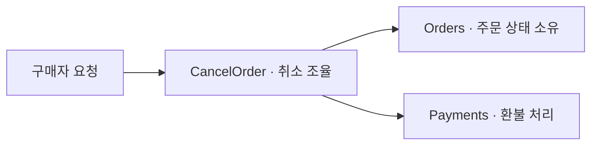

# PRD 작성 가이드

PRD는 사용자 문제·범위·성공 기준과 설계·검증을 연결한다. **앞의 3개 Part로 목적과 주요 경계를 이해하고, 데이터·정책·운영의 상세 내용은 필요한 위치로 찾아가게 한다.** 중요한 미결정·실패 위험은 상세 문서에만 숨기지 않는다.

공통 경계 기준은 [모듈 경계 가이드](module-boundary-guide.md)를 따른다. [시스템 설계 프레임워크](system-design-framework.md)의 8개 관점은 입력 자료이고, 이 문서의 7개 Part는 결과를 전달하는 구조다. 양쪽 목차를 모두 채우거나 같은 내용을 복제할 필요는 없다.

## 1. 작성 범위 선택

먼저 사용자·문제·대상 기능·기존 근거를 확인한다. 설계 요청에는 설계서를 만들고, 구현까지 요청된 경우에만 코드를 수정한다. 알 수 없는 요구사항은 가정·미결정으로 표시하며 실제 구현처럼 서술하지 않는다.

| 작업 | 기본 산출물 | 상세화 조건 |
| --- | --- | --- |
| 작은 기능 변경 | 목표·비목표, 변경 계약, 대표 시나리오, 수용 기준 | 상태·외부 의존·이전 위험이 있으면 관련 Part 추가 |
| 신규 시스템 / 큰 기능 | Part 1~3과 적용 가능한 Part 4~7 | 모듈 내부 정책이 독립적으로 복잡하면 해당 모듈 문서 링크 |
| 프로토타입 / 단발 도구 | 문제·가정·실행/검증 기준 | 운영·분산·UI가 실제로 필요한 경우에만 추가 |

**Must**는 해당 작업의 완료에 반드시 필요한 내용, **조건부**는 아래 조건이 있으면 필요한 내용, **선택**은 독자의 판단에 도움이 될 때만 쓰는 내용이다. 작은 변경의 적용하지 않는 Part는 한 줄로 묶어 이유를 남길 수 있다.

| Part | 내용 | 적용 기준 |
| --- | --- | --- |
| 1 | 요약, 대상 사용자·문제, 목표·비목표, 수용 기준 | Must |
| 2 | 변경 책임 모듈, 공개 계약, 상태 소유자, 의존 | Must; 단일 함수면 문장으로 충분 |
| 3 | 대표 정상·실패 시나리오와 검증 연결 | Must; 도식이 설명을 개선할 때만 다이어그램 |
| 4 | 데이터·I/O·스키마·포화·재시도 | 해당 경계나 동작이 있거나 바뀔 때 |
| 5 | 알고리즘·상태 전이·도메인 정책 | 해석 차이로 구현 결과가 달라질 때 |
| 6 | 로그·메트릭·복구·종료 | 운영 대상이거나 관측·복구 동작이 바뀔 때 |
| 7 | 설정·검증·이전·참고 근거 | 검증과 근거는 Must; 나머지는 해당 시 |

## 2. 다이어그램 정책

- 객체 간 호출·이벤트는 [`jobflow`](job-flow-diagram-guide.md), 화면 이동과 그 판단에 필요한 API·처리는 [`navigation`](navigation-diagram-guide.md), 상태 전이는 [`state`](state-diagram-guide.md), 화면 구조는 [`layout`](screen-layout-guide.md)를 사용한다.
- 시스템 경계·배포·데이터 관계 등 별도 관점은 Mermaid로 보완한다. 지정된 DSL을 Mermaid로 대체하지 않는다. DSL에 없는 의미는 인접한 표·본문으로 설명한다.
- ASCII 박스·공백 정렬 그림은 사용하지 않는다. 경로 목록·코드·표는 사용할 수 있다.
- DSL 문법의 기준은 각 전용 가이드다. PRD에서 새 헤더·주석·인자·제어문 문법을 발명하지 않는다. 예제 식별자는 실제 도메인 이름으로 치환한다.
- 한 그림에는 한 질문과 한 수준의 경계만 담는다. 작은 그림부터 시작하고 필요한 부분만 확대한다. 노드 개수를 맞추기 위해 모듈을 새로 만들지 않는다.
- 파서와 렌더러가 없는 환경에서는 문서 규칙에 대한 정적 검토만 보고한다. 실행·렌더링 성공을 추정하지 않는다.

## Part 1 — 요약·목표·범위

첫 문단에 누가 어떤 상황에서 겪는 문제를 어떻게 바꾸는지 쓴다. 기존 동작과 제안 동작을 구분하고, 조사한 코드·요구사항의 기준 버전이나 시점을 남긴다.

```markdown
# PRD — 주문 취소

- 대상 사용자 / 문제: 출고 전 주문을 취소하려는 구매자
- 변경: 취소 가능한 주문에 환불을 요청하고 결과를 확인할 수 있게 한다
- 비목표: 출고 후 반품, 부분 취소 (이번 범위에서 제외)
- 근거: 요구사항·기존 계약·코드의 실제 위치
- 미결정: 환불 결과 불명 시 운영 확인 절차

| ID | 우선순위 | 요구사항 | 수용 기준 |
| --- | --- | --- | --- |
| FR-01 | Must | 출고 전 주문 취소 | 허용 상태에서 취소 요청을 접수하고 상태를 기록한다 |
| FR-02 | Must | 중복 환불 방지 | 같은 취소 요청을 반복해도 환불 부작용은 한 번만 발생한다 |
| FR-03 | Must | 취소 불가 상태 안내 | 출고 완료 주문은 사유와 함께 거절하고 환불하지 않는다 |
```

예시는 정책을 강제하는 것이 아니다. 수용 기준은 테스트 가능한 행동·불변조건·측정 조건으로 작성한다. 지연시간·가용성 목표가 필요하면 부하·기간·측정 환경도 명시하며, 근거 없는 숫자를 목표처럼 만들지 않는다. 비목표는 **이번 범위에서 제외한다는 뜻**이고 영구 금지가 아니다.

전체 그림이 도움이 되면 외부 입력·주요 책임 모듈·출력만 표현한다. 화살표가 호출·데이터 전달·정적 의존 중 무엇인지 밝힌다. 예를 들어 다음은 런타임 호출 방향이며, 소스 import 구조나 배포 구성을 뜻하지 않는다.


```mermaid
flowchart LR
    Client["구매자 요청"] --> Cancel["CancelOrder · 취소 조율"]
    Cancel --> Orders["Orders · 주문 상태 소유"]
    Cancel --> Payments["Payments · 환불 처리"]
```

## Part 2 — 모듈 구성과 공개 계약

파일 목록보다 **책임·불변조건·쓰기 소유자·공개 경계**를 먼저 정한다. 모듈 이름은 프로젝트 관례에 맞추며 클래스·서비스를 만들기 위한 분류표로 사용하지 않는다.

| 모듈 | 책임·비책임 | 공개 계약 / 원본 | 소유 상태 | 소비하는 계약 |
| --- | --- | --- | --- | --- |
| Orders | 취소 가능 판정·상태 변경; 환불 실행은 제외 | CancelRequest, CompleteCancellation / 실제 정의 링크 | 주문·취소 상태 | 해당 없음 또는 실제 의존 |
| Payments | 환불 요청·결과 조회 | RefundRequest, RefundStatus / 실제 정의 링크 | 환불 기록·멱등 키 | 결제사 adapter 계약 |
| CancelOrder | 순서·분기·복구 조율 | CancelOrder / 실제 정의 링크 | 필요한 조율 상태가 있다면 명시 | Orders, Payments의 공개 계약 |

각 계약의 입력·결과·오류·부작용·동시성·호환성은 [모듈 계약 양식](module-boundary-guide.md#3-상대에게-무엇을-알려주는가)으로 확인한다. 기존 타입·스키마·테스트가 정의를 소유하면 링크하고 PRD에는 결정과 변경점만 쓴다.

Orchestrator / Worker / Gateway / Service / Utils는 역할 설명에 쓸 수 있다. 모든 모듈을 이 분류에 끼워 맞추거나 각각의 폴더를 만들 필요는 없다. 공유 자원은 수명·접근 범위·조립 책임을 밝혀야 하며 Service라는 이름이 전역 싱글톤을 뜻하지 않는다. 구체 역할은 [Orchestrator–Worker 가이드](orchestrator-worker-pattern-guide.md)를 참조한다.

## Part 3 — 주요 시나리오와 점진적 상세화

| 수준 | 설명할 질문 | 멈추는 조건 |
| --- | --- | --- |
| Depth 1 | 외부 입력이 어느 책임 경계를 거쳐 어떤 결과가 되는가 | 모듈 계약과 대표 흐름만으로 범위를 검토할 수 있다 |
| Depth 2 | 특정 모듈 내부의 중요한 분기·실패를 어떻게 처리하는가 | 해당 구현자의 결정에 필요한 정보가 충분하다 |
| Depth 3 | 추가 하위 책임이나 공유 계약을 어디서 찾는가 | 코드·계약 문서 링크로 충분하면 새 도식을 만들지 않는다 |

모든 모듈을 모든 Depth로 확장하지 않는다. 기동·중지·복구는 해당 수명주기나 실패 경로가 있을 때 설명한다. 기능 흐름과 런타임 실행 축은 다를 수 있으므로 하나로 취급하지 않는다.

### jobflow의 네 가지 설명 요소

기존의 **다이어그램·객체·이벤트·시나리오** 관점은 유지한다. 내용은 한 번만 정의하고 가까운 링크로 찾아갈 수 있게 한다.

1. **다이어그램**: 해당 수준의 공개 객체와 실제 연결을 표현한다.
2. **객체 설명**: 책임과 소유자를 적거나 Part 2의 해당 항목을 링크한다.
3. **이벤트·결과 계약**: 이벤트가 있으면 발행 조건·페이로드·구독 연결 책임·소비자를 적는다. 동기 반환만 있으면 결과·오류 계약을 설명하며 빈 이벤트 표는 만들지 않는다.
4. **시나리오**: 트리거·전제조건·결과·핵심 실패를 서술한다. 같은 내용을 블록마다 복제하지 않는다.

다음은 저장 요청의 동기 반환 분기 예시다. 실제 데이터·오류 형식은 블록 밖 계약에 둔다.

```jobflow
orchestrator: SaveOrder
Object: SaveOrder, Validator, OrderStore

SaveOrder.Run --> Validator.Check
Validator.Check.valid --> OrderStore.Save
Validator.Check.invalid --> SaveOrder.Reject
OrderStore.Save.result --> SaveOrder.Complete
```

- **객체**: SaveOrder가 흐름을 조율하고, Validator는 입력 판정, OrderStore는 저장 경계를 맡는다. Validator와 OrderStore는 다음 단계를 선택하지 않는다.
- **결과**: `Check`는 `valid` 또는 `invalid`를 반환한다. `Save.result`는 성공 결과이며 저장 오류와 중복 처리 계약은 별도 정의한다. `Complete`와 `Reject`는 `Run` 호출자의 성공·거절 결과를 구성한다. 이 예제에는 이벤트가 없다.
- **시나리오**: 유효한 입력이면 저장 후 완료한다. 입력이 유효하지 않으면 저장하지 않고 거절한다. 저장 실패 시의 외부 오류·재시도 정책은 실제 PRD에서 빠뜨리지 않는다.

이벤트가 있는 시스템에서는 다음 계약 표를 사용한다. 이벤트 전달 보장은 사용하는 구현의 확인된 능력에 근거해야 한다.

| 이벤트 | 발행 조건·시점 | 페이로드 원본 | 연결 소유자·소비자 | 전달·중복·실패 정책 |
| --- | --- | --- | --- | --- |
| 실제 이벤트 이름 | 저장 전/후 등 | 스키마 링크·버전 | 구독을 연결하는 곳과 수신 계약 | 순서·재전달·재처리 책임 |

## Part 4 — 데이터·I/O·실패 정책

입력 한 건이 검증·변환·저장·발행되는 경로에서 각 단계의 소유자와 성공 판정 시점을 설명한다. Part 3과 같은 흐름이면 링크하고, 데이터 표현·원자성 등 추가 정보만 쓴다.

- **저장**: 스키마 원본·쓰기 소유자·조회 인터페이스·키·제약·보존·삭제·이전을 정의한다. 메모리 타입, 저장 스키마, 외부 payload를 무조건 같은 구조로 만들지 않는다.
- **원자성**: 함께 성공해야 하는 상태 변경과 외부 부작용을 식별한다. DB 저장 성공이 이벤트 발행이나 외부 환불 성공을 뜻하지 않는다.
- **재시도·중복**: 일시적 실패·영구 실패·결과 불명을 구분하고, 부작용 중복 방지와 재처리 소유자를 정한다.
- **부하·포화**: 큐·버퍼·외부 제한이 있을 때 한계와 초과 동작을 명시한다. 유실 허용 여부를 먼저 정하고 drop·block·보관·거절 중 동작을 선택한다.

| 경계 | 한계·설정 원본 | 실패 시 결과 | 복구 책임·상한 | 검증 |
| --- | --- | --- | --- | --- |
| 외부 요청 | 전체 deadline·시도 제한 | 성공/확정 실패/결과 불명 구분 | 지정 계층, 안전한 오류만 재시도 | timeout·중복 부작용 |
| 비동기 큐 | 용량·허용 지연 | 거절/보관/유실 중 명시 | 소비자·재처리 책임 | 포화·중복·순서 역전 |
| 데이터 저장 | 트랜잭션·동시성 조건 | 상태 유지/일부 변경 명시 | 쓰기 소유자 | 충돌·부분 실패 |

값이 미정이면 미정이라고 쓰고 결정에 필요한 부하·정책 정보를 적는다. 다른 프로젝트의 예시 수치를 기본 정책으로 복사하지 않는다.

## Part 5 — 알고리즘·상태·정책

- 판단이 모호해질 수 있는 조건에는 단위·경계값·시간 기준·우선순위를 쓴다. 자연어·결정표·수식 중 가장 명확한 표현을 선택하고 대표 입력/출력과 반례를 덧붙인다.
- FSM이 있으면 `state`와 전이 표를 사용한다. 상태 소유자, 허용/금지 전이, 실패·취소·재진입, 동시 요청을 정의한다.
- 상태 전이는 외부 성공을 관측한 범위만 표현한다. 예를 들어 외부 서비스의 접수 응답을 최종 사용자 전달 완료로 단정하지 않는다.
- 처리시간 timeout에는 해당 런타임의 monotonic clock을, 업무 날짜·영속 시각에는 타임존이 명시된 wall-clock을 쓴다. 이벤트 시간 창은 이벤트 시각·지연 도착 정책을 별도로 정한다.
- 복잡한 모듈의 정책 문서가 이미 있으면 해당 절을 링크한다. Part 3의 흐름과 동일한 내용을 다시 설명하지 않는다.

## Part 6 — 운영·관측·복구

운영 대상과 바뀌는 경계에 필요한 항목만 작성한다.

| 항목 | 결정할 내용 |
| --- | --- |
| 상태 확인 | 준비 상태와 생존 상태의 의미, 의존 장애 시 동작 |
| 메트릭 | 수용 기준·운영 질문, 이름·단위·라벨 값 범위; 높은 카디널리티 제한 |
| 로그 | 사건·결과·소유 모듈·상관 ID, 비밀값 제거·크기 제한·보존·접근 |
| 복구 | 감지→자동 조치→최종 실패/운영 개입, 담당과 시간 상한 |
| 종료 | 신규 입력 차단→진행 작업 처리→상태 보존→자원 정리, 전체 deadline |

기존 프로젝트의 로깅 방식을 먼저 확인한다. 2계층 상세 로깅이 필요한 경우 [상세 로깅 프롬프트](../prompts/detailed-logging-prompt.md)를 참조한다. 모든 PRD에 새 로깅 시스템 구현을 포함하지 않는다. 실제 로그를 쓰지 않는 도구는 그 이유를 적으면 된다.

## Part 7 — 설정·검증·이전·근거

### 설정

변경에 필요한 설정만 이름·타입·기본값·필수 여부·영향 범위·검증 위치로 정리한다. 비밀값은 적지 않는다. 코드·설정 스키마가 원본이면 링크하며 본문에 등장한 설정 이름과 일치시킨다.

### 요구사항 추적과 검증

| 요구사항 | 책임 모듈·계약 | 시나리오 | 검증 위치/방법 | 상태 |
| --- | --- | --- | --- | --- |
| FR-01, FR-03 | Orders 취소 계약 | 허용/금지 상태에서 요청 | 상태 전이·동시 요청 테스트 | 계획/실행 결과 |
| FR-02 | Payments 멱등 계약·취소 조율 | 응답 유실 뒤 재요청 | adapter 통합·중복 요청 테스트 | 계획/실행 결과 |

요구사항과 설계 요소는 **다대다 관계**가 가능하다. 모든 요구사항에 근거와 검증이 연결되는지, 모든 추가 구조가 요구사항이나 필수 제약으로 설명되는지 양방향으로 확인한다.

테스트는 순수 정책·모듈 계약·adapter 통합·핵심 사용자 시나리오 중 실제 위험을 검증하는 수준을 선택한다. 모든 계층의 테스트나 임의의 커버리지 수치를 의무화하지 않는다. 구현 전 문서에서는 계획과 수용 기준을, 구현 후 보고에서는 실행 명령·환경·결과·미실행 범위를 구분한다.

### 이전·호환성

계약·스키마·설정 변경이 있으면 알려진 소비자, 혼용 가능한 버전, 적용 순서, 롤백 가능 범위, 되돌릴 수 없는 데이터 변경을 적는다. 기존 기능을 어디에 유지·이전·제거하는지 매핑한다. 향후 확장은 별도 후보로 기록하며 이번 구현의 추상화를 늘리는 근거로 자동 사용하지 않는다.

### 참고 근거

실제 읽은 요구사항·코드·계약·관련 가이드·공식 문서를 상대 경로나 안정된 링크로 남긴다. 개인 컴퓨터의 절대 경로나 존재하지 않는 링크를 템플릿에 넣지 않는다. 외부 기술 사양이 결정 근거라면 버전과 확인 시점을 기록한다.

## 검토·수정·종료

작성자와 다른 검토자가 다음 질문에 근거로 답한다. 의견 차이는 선호가 아니라 수용 기준과 반례로 정리한다.

- 목표·비목표·미결정이 구별되고 수용 기준으로 완료를 판단할 수 있는가?
- 모듈의 책임·계약·쓰기 소유권이 명확하며 상대 구현을 읽지 않고 사용할 수 있는가?
- 정상·실패·부분 성공·동시성 중 해당하는 경로가 정의되어 있는가?
- 상위 설명에서 하위 구현을 과도하게 펼치거나 문서를 중복하지 않았는가?
- DSL·코드·계약·표의 이름과 의미가 일치하며 실제 검증과 미검증을 구분했는가?
- 요구사항→설계→검증 연결과 계약 변경의 소비자 영향이 확인되는가?

필수 결함은 수정 후 해당 항목과 영향을 받은 항목을 재검토한다. 더 이상의 근거 있는 필수 지적이 없고 수용 기준·범위가 충족되면 종료한다. 미결정이 구현 정확성을 막으면 이를 명시하고 해당 결정을 요청한다. 단순 문체 선호를 이유로 무한 리뷰하지 않는다.

## 복사해서 시작하는 최소 양식

```markdown
# PRD — 기능명

## Part 1. 문제·목표·비목표
- 기준 버전·근거:
- 확인된 사실 / 가정 / 미결정:
- 요구사항 ID와 수용 기준:

## Part 2. 책임 모듈과 변경 계약
- 공개 진입점 / 상태 소유자 / 의존 / 계약 원본:

## Part 3. 대표 시나리오
- 전제조건·트리거·정상 결과·핵심 실패:
- 필요한 다이어그램과 객체·이벤트/결과 설명 또는 링크:

## Part 4~6. 적용되는 상세 정책
- 데이터·I/O·알고리즘·상태·관측·복구 중 필요한 항목:
- 생략한 중요 항목과 이유:

## Part 7. 검증·이전·근거
- 요구사항 → 계약 → 시나리오 → 검증:
- 설정·호환성·적용/롤백 순서 (해당 시):
- 필수 검토 지적과 해결 근거:
```
