# State Diagram Guide

## 목적

* 객체의 상태(State) 변화와 흐름을 단순한 스크립트로 작성한다.
* 작성된 스크립트는 내부적으로 **Mermaid `graph LR**` 문법으로 변환되어 시각화된다.

## 구성 요소

| 요소 | 입력 문법 | Mermaid 변환 결과 | 시각적 표현 |
| --- | --- | --- | --- |
| **Start Node** | `<s>` | `ID(( ))` + `style ID fill:#fff` | **흰색 원** (테두리 있음) |
| **State** | `(Name)` | `ID(Name)` | **둥근 사각형** |
| **Action (Process)** | `Name` (괄호 없음) | `ID[Name]` | **직사각형** |
| **End Node** | `<s>` | `ID(( ))` + `style ID fill:#000` | **검은색 원** |

## 작성 규칙

1. **Start → State**
* 라이프사이클의 시작
* 예: `<s> --> (Ready)`

2. **State → State**
* 상태 전이
* 예: `(Ready) --> (Running)`

3. **State → End**
* 라이프사이클의 종료
* 예: `(Done) --> <e>`

## 분기 (Condition)

* `: Text` 형식으로 전이 조건을 명시한다.
* Mermaid 변환 시 화살표 중간에 라벨로 표시된다. (`-->|"Text"|`)

## 변환 로직 (Mermaid Spec)

입력된 스크립트는 아래 규칙에 따라 Mermaid 코드로 변환된다.

1. **그래프 방향**: `graph LR` (좌우 방향)을 기본으로 한다.
2. **Node ID 생성**: 각 노드는 고유한 알파벳 ID(A, B, C...)를 자동으로 부여받는다.
3. **스타일 적용**:
* **Start Node**: `fill:#fff`, `stroke:#000`, `stroke-width:2px` (흰색 채움)
* **End Node**: `fill:#000`, `stroke:#000`, `stroke-width:2px` (검은색 채움)

### 변환 예시

#### 입력 스크립트

```state
<s> --> (StateA)
(StateA) --> (StateB)
(StateB) --> (StateA) : Error
(StateB) --> (StateC)
(StateC) --> <e>
```

#### 변환된 Mermaid 코드

```mermaid
graph LR
    A(( ))
    B(StateA)
    C(StateB)
    D(StateC)
    E(( ))

    A --> B
    B --> C
    C -->|"Error"| B
    C --> D
    D --> E

    style A fill:#fff,stroke:#000,stroke-width:2px
    style E fill:#000,stroke:#000,stroke-width:2px
```



## Entry Action & Exit Action

상태 전환 시 수행되어야 할 액션이나 프로세스는 괄호가 없는 텍스트 노드로 명시합니다. 이는 일반적인 상태(State)와 시각적으로 구분되도록 직사각형으로 렌더링됩니다.

```state
<s> --> (StateA)
(StateA) --> (StateB)
(StateB) --> Save Log : Error
Save Log --> (StateA)
(StateB) --> (StateC)
(StateC) --> <e>
```
