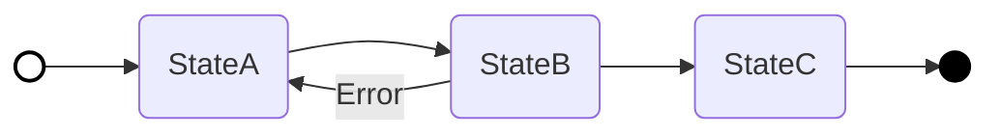

# State Diagram Guide

## 목적

* 객체의 상태(State) 변화와 흐름을 단순한 스크립트로 작성한다.
* 작성된 스크립트는 내부적으로 **Mermaid `graph LR`** 문법으로 변환되어 시각화된다.

## 범위와 상태 소유권

한 객체/모듈이 소유하는 하나의 상태 기계를 기본 단위로 한다. UI의 로딩 상태와 서버의 주문 상태처럼 소유자·생명주기가 다르면 분리하고, 공개 이벤트/결과 계약으로 연결한다. 하나의 수정 때문에 모든 화면의 상태를 나열하거나 여러 독립 상태를 곱해 거대한 상태도로 만들지 않는다. 경계 기준은 [module-boundary-guide.md](module-boundary-guide.md)를 따른다.

다이어그램 옆에 상태 소유자, 초기화 조건, 전이를 일으키는 입력, 불변조건을 적는다. 전이를 실행하는 객체 간 협력은 [job-flow-diagram-guide.md](job-flow-diagram-guide.md), 화면 이동은 [navigation-diagram-guide.md](navigation-diagram-guide.md)로 분리한다.

## 구성 요소

| 요소 | 입력 문법 | Mermaid 변환 결과 | 시각적 표현 |
| --- | --- | --- | --- |
| **Start Node** | `<s>` | `ID(( ))` + `style ID fill:#fff` | **흰색 원** (테두리 있음) |
| **State** | `(Name)` | `ID(Name)` | **둥근 사각형** |
| **Action (Process)** | `Name` (괄호 없음) | `ID[Name]` | **직사각형** |
| **Event / Message** | `<Name>` (`s`, `e` 제외) | 다이아몬드 | **이벤트/메시지 노드** |
| **End Node** | `<e>` / `.` | `ID(( ))` + `style ID fill:#000` | **검은색 원** |

## 작성 규칙

1. **Start → State**
* 라이프사이클의 시작
* 예: `<s> --> (Ready)`

2. **State → State**
* 상태 전이
* 예: `(Ready) --> (Running)`

3. **State → End**
* 관찰하는 객체/작업의 실제 라이프사이클 종료를 설명할 때 사용한다.
* 예: `(Done) --> <e>`
* 계속 실행하는 화면·서비스·구독에는 존재하지 않는 업무 종료를 만들지 않는다. 관찰 범위를 본문에 밝히고, 실제 종료가 없으면 `<e>`로 억지로 연결하지 않는다. 화면 해제·구독 해제처럼 수명이 끝나는 경우만 해당 종료 조건을 적는다.

## 분기 (Condition)

* `From --> To : Text`처럼 ` : ` 양쪽에 공백을 두고 전이 입력/조건을 명시한다. 복잡한 guard 식이나 실행 코드는 계약 표에 적고 새 DSL 문법을 추가하지 않는다.
* 같은 상태에서 나가는 분기의 조건이 겹치는지, 입력을 무시하거나 거부하는 조건이 무엇인지 확인한다. 실제 취소·timeout·실패가 있는 작업이면 그 전이도 설명한다.
* Mermaid 변환 시 화살표 중간에 라벨로 표시된다. (`-->|"Text"|`)

## 변환 로직 (Mermaid Spec)

아래는 기존 레퍼런스의 변환 의미를 설명하는 예시다. 실제 Node ID, SVG 스타일, Mermaid 버전별 동작은 대상 렌더러에서 확인한다. 이 저장소만으로 렌더링 결과를 보장하지 않는다.

1. **그래프 방향**: `graph LR` (좌우 방향)을 기본으로 한다.
2. **Node ID 생성**: 각 노드는 고유한 알파벳 ID(A, B, C...)를 자동으로 부여받는다.
3. **스타일 적용**:
* **Start Node**: `fill:#fff`, `stroke:#000`, `stroke-width:2px` (흰색 채움)
* **End Node**: `fill:#000`, `stroke:#000`, `stroke-width:2px` (검은색 채움)

### 변환 예시

#### 입력 스크립트

```state
<s> --> (StateA)
(StateA) --> (StateB)
(StateB) --> (StateA) : Error
(StateB) --> (StateC)
(StateC) --> <e>
```

#### 변환된 Mermaid 코드


```mermaid
graph LR
    A(( ))
    B(StateA)
    C(StateB)
    D(StateC)
    E(( ))

    A --> B
    B --> C
    C -->|"Error"| B
    C --> D
    D --> E

    style A fill:#fff,stroke:#000,stroke-width:2px
    style E fill:#000,stroke:#000,stroke-width:2px
```

## Entry Action & Exit Action

상태 전환에 필요한 액션은 괄호 없는 텍스트 노드로 명시해 상태와 시각적으로 구분한다. 이 DSL의 액션 노드 자체가 상태 기계의 모든 진입/이탈 시 자동 실행되는 entry/exit 훅을 뜻하지는 않는다. 특정 전이에서만 실행하는지 모든 진입/이탈에 실행하는지 본문이나 계약에 명시한다.

```state
<s> --> (StateA)
(StateA) --> (StateB)
(StateB) --> Save Log : Error
Save Log --> (StateA)
(StateB) --> (StateC)
(StateC) --> <e>
```

## 검토와 확인

- 관련 상태마다 도달 경로와 허용 전이가 있으며, 종료/재시도/무시 입력의 의미가 명확한가?
- 하나의 입력이 여러 전이를 일으킬 수 있다면 우선순위·동시성 정책이 정의됐는가?
- 상태를 바꾸는 단일 소유자가 있고, 다른 모듈은 내부 상태에 직접 쓰지 않는가?
- 이벤트 이름이 같은 navigation/jobflow와 조건·결과가 일치하는가?

성공 경로와 관련 실패/금지 전이를 상태 전이 표 또는 해당 코드 검증으로 대조한다. 문서 정적 검토와 tools.camp에서의 실제 렌더링 검증을 구분해 기록한다. 문법 레퍼런스는 [tools-camp-markdown-guide.md](tools-camp-markdown-guide.md)를 참고한다.
