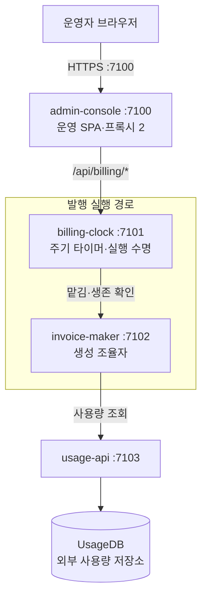

# 시스템 설계 문서 양식 — AS-IS·TO-BE 공통

시스템 수준의 AS-IS 분석 문서와 TO-BE 설계 문서가 쓰는 **파일 배치·절 번호·제목·표 열·그림 규칙·ID·검증**의 원본이다. 무엇을 조사하고 어떻게 판단하는지는 [AS-IS 프롬프트](../prompts/system-design-as-is-prompt.md)와 [TO-BE 프롬프트](../prompts/system-design-to-be-prompt.md)가 정하고, 이 가이드는 그 결과를 남기는 모양을 정한다. 두 문서가 같은 번호·표 열·그림 규칙을 쓰므로 AS-IS의 한 절을 TO-BE의 같은 절과 바로 대조할 수 있다.

**읽기 지도** — 할 일에 맞는 절만 읽는다.

| 할 일 | 읽을 절 |
|---|---|
| 산출물 폴더·파일과 분석 크기를 정한다 | [§2](#2-산출물-배치)·[큰 분석과 작은 분석](#큰-분석과-작은-분석) |
| 핵심 문서를 쓴다 | [§3](#3-핵심-문서-골격) — 번호표 3.1, 머리 블록 3.2, 절별 규칙 3.3(신규 설계는 [빼는 것](#신규-설계에서-빼는-것)) |
| 핵심 §5의 흐름 그림을 그린다 | [§4](#4-흐름-절--경계-수준-jobflow) |
| 경계별 상세와 내부 Job Flow를 쓴다 | [§5](#5-상세-문서-골격)·[§6](#6-경계-내부-job-flow-드릴다운) |
| ID를 매기고 근거 브리프를 쓴다 | [§7](#7-id와-교차-참조)·[§8](#8-근거-브리프) |
| 여러 작성자에게 나눠 맡긴다 | [§9](#9-작성-순서와-병렬화) |
| 다 쓴 문서를 검사한다 | [§10](#10-검증) — 끝의 작성 체크리스트 |

- 적용 범위: 시스템 수준의 AS-IS·TO-BE 문서. [기능 설계](../prompts/feature-design-prompt.md)·[사이트 설계](../prompts/site-design-prompt.md)는 이 골격을 쓰지 않고 [§4](#4-흐름-절--경계-수준-jobflow)·[§6](#6-경계-내부-job-flow-드릴다운)의 그림 규칙만 참조한다.
- 표기: 아래에서 `§n`은 핵심 문서의 절, `상세 §n`은 경계별 상세 문서의 절, `브리프 §n`은 근거 브리프의 절이다. 이 가이드의 절은 링크로 가리킨다.
- 예시: [§11](#11-예시-산출물)의 가상 예시 문서. 따를 것은 절 번호·제목·표 열·그림 규칙이고, 이름·포트·수치는 예시 값이다. **예시와 이 양식이 다르면 양식이 먼저다.**

## 1. 적용 범위와 원본 관계

이 가이드가 정하는 것과 다른 원본이 정하는 것을 가른다. 다른 문서는 여기 규칙을 다시 쓰지 않고 이 가이드의 절을 링크한다.

| 주제 | 원본 | 이 가이드에서 |
|---|---|---|
| 조사 범위·판단·대안 비교·검토 절차 | AS-IS 프롬프트·TO-BE 프롬프트 | 결과를 담는 위치와 모양 |
| 설계 관점 8개와 생략 규칙 | [시스템 설계 프레임워크](system-design-framework.md) | 각 관점이 들어가는 절(아래 표) |
| 경계 판단·공개 계약 필드·분해 중단 | [모듈 경계 가이드](module-boundary-guide.md) | 상세 문서의 표 열([§5](#5-상세-문서-골격))·드릴다운 중단([§6.2](#62-깊이와-분해-중단)) |
| 설계 깊이 | [Method-R 1장](method-R.md#1-네-가지-설계-깊이) | 드릴다운 깊이([§6.2](#62-깊이와-분해-중단)) |
| `jobflow` 문법과 의미 — 헤더, 결과 배치, round-trip, 화살표 없는 단독 줄, 출발점, 합류와 합류 뒤 값 분기, 렌더러 특성과 줄 순서·`Object:` 순서 | [Job Flow 가이드](job-flow-diagram-guide.md) | 경계 수준 그림([§4](#4-흐름-절--경계-수준-jobflow))과 드릴다운([§6](#6-경계-내부-job-flow-드릴다운))에 적용하는 법 |
| `state`·`navigation`·`layout` 문법 | [State](state-diagram-guide.md)·[Navigation](navigation-diagram-guide.md)·[Layout](screen-layout-guide.md) | 어느 절에 두는가 |
| 설명용 시스템 흐름 문서 | [시스템 흐름 문서 가이드](system-flow-document-guide.md) | 다루지 않는다. 함께 만들면 흐름 그림의 원본을 한쪽에 두고 다른 쪽은 링크한다 |
| 파일 배치·절 번호·제목·표 열·ID·근거 브리프·작성 순서·검증·Mermaid 라벨 | 이 가이드 | 전부 |

**설계 프레임워크 8관점이 들어가는 절**

| 관점 | 핵심 문서 | 상세 문서 |
|---|---|---|
| 1. Input Data | §6.1 입력 | 상세 §4 소유 상태·데이터 |
| 2. Key Events | §5 시나리오 목록의 트리거·완료 사실 | 상세 §3 그림 아래 불릿의 트리거·완료 사실 |
| 3. Services List | §3 구조, §4 경계별 기능 목록 | 상세 §1 책임, §2 공개 계약, §5 의존 |
| 4. PBS | §2 기능 트리 단락 | — |
| 5. Job Flow | §5 흐름 — 경계 사이 | 상세 §3 내부 Job Flow — 경계 안 |
| 6. Navigation | §7 화면 | 화면을 가진 경계의 상세 |
| 7. State | §5 교차 사실 소절 — 한 작업의 상태를 여러 경계가 나눠 가질 때 | 상세 §4의 `state` — 소유자 문서 한 곳 |
| 8. Screen Layout | §7 화면 | 배치가 판단에 필요한 화면만, 화면을 가진 경계의 상세 |

- 이 표는 빠진 관점을 찾는 목록이다. 관점마다 파일을 따로 만들지 않는다([§2](#2-산출물-배치)).
- 관점이 해당하지 않으면 절을 지우지 않고 `해당 없음 — <이유>` 한 줄을 둔다. 프레임워크의 [이유 한 줄 생략](system-design-framework.md#적용-방법과-산출물-선택)과 같은 규칙이다.

## 2. 산출물 배치

한 분석의 산출물은 `docs/design/{DATE}/` 한 폴더에 둔다 — 근거 브리프, 핵심 문서, 경계별 상세다.

```text
docs/design/{DATE}/
  _evidence-brief.md            # 큰 분석: 기준선·경계 목록·이슈 색인·검증 기록·검토 반영·한계
  as-is/system-design-as-is.md  # 핵심
  as-is/details/<boundary>.md   # 경계별 상세
  to-be/_evidence-brief.md      # 큰 TO-BE 설계의 브리프 — 같은 DATE에 AS-IS 브리프가 있을 때
  to-be/system-design-to-be.md
  to-be/details/<boundary>.md
```

- 상세는 **경계 단위** 파일이다. 경계는 독립 프로세스·모듈·패키지 묶음이다. 파일 이름은 경계 이름을 소문자와 하이픈으로 쓴다(예: `billing-clock.md`). 설계 프레임워크 8관점별로 파일을 나누지 않는다 — 8관점은 [§1](#1-적용-범위와-원본-관계) 대응표의 절에 들어간다.
- 작고 밀접한 두 경계는 한 파일에 `# A.` / `# B.` 두 부분으로 담을 수 있다. 절 번호는 `A.1`…, ID 번호대는 나눈다([§7](#7-id와-교차-참조)).
- `{DATE}`를 정하는 법과 AS-IS·TO-BE의 날짜 관계는 각 프롬프트가 정한다. 기존 문서 위치나 사용자 지정이 있으면 그것이 우선이다.
- 큰 TO-BE 설계의 브리프는 자리가 둘이다. 같은 `{DATE}` 폴더에 AS-IS 브리프가 있으면 그 파일을 고치지 않고 `to-be/_evidence-brief.md`를 따로 둔다. TO-BE가 새 `{DATE}` 폴더를 쓰면 `{DATE}/_evidence-brief.md`에 둔다([§8](#8-근거-브리프)).
- 검증 산출물(SVG·PNG)은 문서 폴더에 넣지 않는다([§10](#10-검증)).

#### 큰 분석과 작은 분석

경계가 둘 이상이고 경계 사이 계약이 분석 대상이면 **큰 분석**이다 — 경계별 상세와 근거 브리프를 둔다. 경계가 하나이거나 사용자가 핵심 문서만 요청하면 **작은 분석**이다 — 핵심 문서 하나로 끝내고, 절 번호표는 그대로 둔다. TO-BE의 큰 설계와 작은 설계도 같은 기준으로 가른다.

작은 분석에서는 상세·브리프가 맡던 것을 핵심 문서의 아래 자리에 둔다.

| 큰 분석의 자리 | 작은 분석의 자리 |
|---|---|
| 상세 「8. 이슈」 표 `ID \| 분류 \| 내용 \| 근거 \| 영향` | 핵심 §9가 원본이다. 접두 → 근거 표 매핑은 뺀다 |
| 브리프 §2의 조사 ID(경계마다 정하는 대문자 한 글자 — [§7](#7-id와-교차-참조)) | 핵심 §3 경계 표의 첫 열 `조사 ID` |
| 상세 §2 공개 계약, §4~§7 소유 상태·의존·실패 경계·검증 경계 | 필요한 것만 핵심 §4 표와 §6에 둔다. 둘 곳이 없거나 다루지 않은 것은 §8.1에 확인 범위 밖이라고 적는다 |
| 상세 §3 드릴다운 | 경계가 하나면 §5의 마지막 소절(5.N) 안에 `#### JF-1 <무엇> — <진입 심볼>` 소절로 두고 [§6](#6-경계-내부-job-flow-드릴다운) 규칙을 따른다 — 제목 수준만 한 단계 내린다. 사용자가 핵심 문서만 요청했으면 두지 않고, 5.N과 §8에 `해당 없음 — 상세 문서 없음`을 쓴다 |
| 상세·브리프의 근거 | 핵심 §8 표 아래의 근거 표 `관찰 항목 \| 경로·심볼 \| 확인한 동작 \| 사실·추론·미확인` |
| 브리프 §1 기준선·§7 한계 | 핵심 머리 블록과 §8.1 |
| 브리프 §5 검증 기록·§6 검토 반영 | 최종 보고 |
| TO-BE 상세 §7 검증 계획, §8 위험·미확정 | 핵심 9.2, 9.5 |

- **부분 상세**(큰 분석인데 일부 경계에만 상세를 두는 것)는 사용자가 분석 범위를 좁혔을 때만 허용한다. 그 이유를 브리프 §1.1, 핵심 §8, §5의 드릴다운 색인(5.N)에 쓴다.
- TO-BE 상세는 신규·변경 경계마다 하나다. 예외는 위와 같다 — 사용자가 범위를 좁혔을 때만 일부를 뺀다.

## 3. 핵심 문서 골격

핵심 문서는 머리 블록과 번호가 고정된 §0~§9로 이뤄진다. 3.1은 번호와 제목, 3.2는 머리 블록, 3.3은 절마다 쓰는 법이다.

### 3.1 절 번호표

AS-IS와 TO-BE가 같은 절 번호를 쓴다. 첫 표는 절마다 담는 것이고, 둘째 표는 글자 그대로 쓰는 고정 제목이다.

| § | AS-IS | TO-BE |
|---|---|---|
| 머리 | 머리 블록 — DATE·기준 커밋·범위·근거·표기·원칙·공통 한계([§3.2](#32-머리-블록)) | 같은 머리 블록 + 설계 유형(신규 / 개선 / 혼합)·입력 근거(AS-IS 경로·커밋) |
| 0 | 한눈에 보기 — 토폴로지 Mermaid + 범례 + 요지 3~4줄 | 같음 — 목표 토폴로지(신규·변경·제거 구분), 요지 = 문제 → 해법 → 효과·남은 위험 |
| 1 | 핵심 용어 `용어 \| 뜻 \| 원본` | 같음 — 새 용어만 두고 AS-IS §1 링크 |
| 2 | 기능 — `사용자·업무 결과 \| 트리거 \| 책임 경계` + 기능 트리(PBS) 한 단락 | 기능·요구 — 2.1 사용자·업무 결과(`요구`·`AS-IS 대비` 열 추가), 2.2 요구 `R-ID`, 2.3 설계 항목 `C-ID`(`AS-IS 대비`·`상태` 열), 2.4 주요 결정 `D-ID`(대안·선택·근거·AS-IS 대비) |
| 3 | 구조 — 경계 표 `경계 \| 포트·형태 \| 한 줄 책임 \| 공개 진입점 \| 소유 상태 \| 나가는 의존` + 3.1 | 같은 표 + `AS-IS 대비` 열(신규·변경·유지·제거와 이유) |
| 4 | 경계별 기능 목록 — §3 행마다 `### 4.n`, `기능 \| 내용 \| 진입점` | 같음 + `AS-IS 대비`·`C-ID` 열 |
| 5 | 흐름 — 경계 수준 `scope:` jobflow([§4](#4-흐름-절--경계-수준-jobflow)) | 같음 — 목표 계약, 시나리오 목록·노드 표에 `AS-IS 대비` 열, 대표 실패 흐름 포함, 같은 시나리오는 AS-IS와 **같은 소절 번호** |
| 6 | 데이터 — 6.1 입력, 6.2 권위 소유자와 생명주기, 6.3 트랜잭션 경계 | 같음 — 목표 소유자, 이행 중 권위 |
| 7 | 화면 `화면 \| 주소 \| 핵심 상호작용 \| 서버 계약` | 같음 |
| 8 | 상세·근거 인덱스와 한계 `상세 문서 \| 경계 \| 이슈 ID` + 8.1 | 같음 — ID 열은 `R`·`C`·`D`, 마지막 행은 입력 AS-IS 핵심·브리프 한 행(ID 칸은 물려받는 AS-IS ID) |
| 9 | 이슈 — 주제별 교차 뷰(전수 아님, 접두 → 근거 표 매핑 + 주제 소절) | 구현·검증·이행 — 9.1~9.5 |

TO-BE의 `AS-IS 대비` 열은 변화 종류이고, `상태` 열은 2.3에만 있는 설계 반영 여부다([§2 기능](#2-기능)). 신규 설계는 `AS-IS 대비` 열·불릿을 모두 뺀다 — [신규 설계에서 빼는 것](#신규-설계에서-빼는-것).

**고정 제목** — 글자 그대로 쓴다. 다른 문서가 이 앵커로 링크한다. §0은 요지가 문서마다 다르므로 링크 대상으로 쓰지 않는다.

| § | AS-IS 제목 | TO-BE 제목 |
|---|---|---|
| 0 | `## 0. 한눈에 보기 — <그 시스템의 한 줄 요지>` | 같음 |
| 1 | `## 1. 핵심 용어` | 같음 |
| 2 | `## 2. 기능 — 무엇을 해주나` | `## 2. 기능·요구 — 무엇을 해주고 왜 바꾸나`, `### 2.1 사용자·업무 결과`, `### 2.2 요구`, `### 2.3 설계 항목`, `### 2.4 주요 결정` |
| 3 | `## 3. 구조 — 무엇으로 이뤄져 있나`, `### 3.1 의존 방향에서 드러나는 사실` | 같음 |
| 4 | `## 4. 경계별 기능 목록 — 각 경계가 무엇을 하나`, `### 4.n <경계> :<포트>`(포트가 없으면 `### 4.n <경계> (<형태>)`) | 같음 |
| 5 | `## 5. 흐름 — 경계끼리 어떻게 소통하나`, `### 5.0 표기`, `### 5.1 전체 한 장`, `### 5.2 <시나리오 이름>` …, 마지막 `### 5.N 경계 내부 Job Flow 드릴다운 색인` | 같음 |
| 6 | `## 6. 데이터 — 무엇이 들어오고 남나`, `### 6.1 입력`, `### 6.2 권위 소유자와 생명주기`, `### 6.3 트랜잭션 경계` | 같음 |
| 7 | `## 7. 화면 — 사용자는 어디를 오가나` | 같음 |
| 8 | `## 8. 상세·근거 인덱스와 한계`, `### 8.1 확인하지 못한 범위` | 같음 |
| 9 | `## 9. 이슈 — 주제별 교차 뷰`, `### 9.n <주제>` | `## 9. 구현·검증·이행`, `### 9.1 독립 작업 순서`, `### 9.2 검증`, `### 9.3 이행·롤백`, `### 9.4 물려받는 이슈 처분`, `### 9.5 미확정·필요 입력` |

**공통 규칙**

- **번호는 고정한다.** 해당 없는 절도 제목은 남기고 본문에 `해당 없음 — <이유>` 한 줄을 쓴다(프레임워크의 이유 한 줄 생략과 같은 규칙). 그래야 앵커가 문서마다 같다.
- 고정 제목 뒤에 ` — <보충>`을 붙이지 않는다. 개수 같은 보충은 본문 첫 줄에 쓴다. 이름이 문서마다 다른 곳은 §0 요지, `4.n` 경계, `5.n` 시나리오와 선택 소절, AS-IS `9.n` 주제, TO-BE 2.4의 결정 주제다.
- **결론 줄**: §2~§5·§7과 TO-BE §9는 `**결론**:` 한 줄로 시작하고 → 표·도표 → 필요한 설명 순으로 쓴다. §6은 바로 아래에 결론을 두지 않고 6.1~6.3이 각자 결론으로 시작한다. AS-IS §9는 `**결론**: 이 절은 전수 목록이 아니다 — <원본 위치>`로 시작한다(작은 분석의 AS-IS §9는 `**결론**: 이 절이 이슈 원본이다 — …` — [§3.3](#33-절별-작성-규칙)). 교차 사실 같은 선택 소절도 결론 한 줄로 시작한다. §0은 요지가, §1·§8은 표가 그 역할을 하고, §5의 시나리오 소절은 그림으로 시작한다([§4.3](#43-시나리오-절-구성)).
- 분량 목표(줄 수)는 두지 않는다. 경계 **사이**의 사실은 핵심, 경계 **안**의 사실은 상세에 쓴다. 같은 사실을 두 곳에 쓰지 않는다 — 상세가 원본이고 핵심은 요약과 링크다.
- 이슈·근거는 문장 끝에 ID로 인용한다(`B-01`). 실행으로 확인한 것만 문장이나 표 칸 끝에 (`사실·실행`)을 붙이고, 돌린 명령과 결과를 함께 적는다. 그 밖의 런타임 서술은 "코드상 예상"이다.
- 처음 쓰는 전문용어는 §1에 넣거나 그 자리에서 풀어 쓴다.
- 산출 문서에는 작성한 컴퓨터에서만 유효한 경로·링크를 남기지 않는다. 가이드를 가리키는 법은 [§3.2](#32-머리-블록)의 가이드 링크 규칙을 따른다.

### 3.2 머리 블록

핵심 문서 제목은 `# <시스템 이름> — AS-IS 시스템 설계서`(TO-BE는 `— TO-BE 시스템 설계서`)이고, 제목 다음에 blockquote 한 덩어리를 둔다. 아래는 [§11](#11-예시-산출물) 예시 시스템의 이름·DATE·커밋을 넣은 모양이다.

```markdown
# 월별 청구서 발행 시스템 — AS-IS 시스템 설계서

> **DATE** 2026.03.02 · **기준 커밋** `5e6f7a8`(<커밋 시각>·<브랜치·머지 맥락>), 작업 트리 clean
> **범위** <분석한 트리 — 경계 5개 + 공유 디렉터리>. <제외한 것>은 제외([근거 브리프 §1.2](../_evidence-brief.md))
> **근거** <방법 — 소스 역추출·경계별 병렬 조사·문서 대조> → [`_evidence-brief.md`](../_evidence-brief.md), 경계별 상세는 [§8](#8-상세근거-인덱스와-한계)
> **표기** 구조·의존은 Mermaid `flowchart`, 협력 흐름은 `jobflow`(`job-flow-diagram-guide.md`), 상태 전이는 `state`(`state-diagram-guide.md`), 화면 이동은 `navigation`(`navigation-diagram-guide.md`)
> **원칙** AS-IS는 현 코드를 있는 그대로 적는다. 찾은 결함은 고치지 않고 ID로 드러낸다([§9](#9-이슈--주제별-교차-뷰) — TO-BE 입력).
> **공통 한계** <띄우지 않은 프로세스·접속하지 않은 외부>. 런타임 동작은 코드상 예상이며, 실행으로 확인한 것만 (`사실·실행`)으로 표시한다.
```

TO-BE는 같은 블록에 두 줄을 더한다.

```markdown
> **설계 유형** 기존 시스템 개선 — <근거>. 혼합이면 영역별로 적는다
> **입력 근거** 요구 <원문 위치>, AS-IS [`../as-is/system-design-as-is.md`](../as-is/system-design-as-is.md)(DATE 2026.03.02·커밋 `5e6f7a8`)
```

| 줄 | AS-IS | TO-BE | 쓰는 것 |
|---|---|---|---|
| DATE·기준 커밋 | 필수 | 필수 | DATE, 짧은 해시와 커밋 시각, 작업 트리 상태. 코드가 없는 신규 설계는 설계 기준 날짜만 |
| 범위 | 필수 | 필수 | 분석·설계한 범위와 제외한 것(TO-BE는 범위 밖 포함). 제외 근거는 브리프 §1.2 |
| 근거 | 필수 | 필수 | 관찰·설계 방법 + 브리프 링크 + §8 링크 |
| 표기 | 필수 | 필수 | 쓰는 DSL과 각 가이드 — 가리키는 법은 아래 가이드 링크 규칙 |
| 원칙 | 필수 | 필수 | AS-IS: 있는 그대로 적고 결함은 ID로. TO-BE: 확인된 사실·제안·가정·미확인의 표시법, 2.3의 `상태`가 구현 완료가 아니라 설계 반영 여부라는 것 |
| 공통 한계 | 필수 | 필수 | 실행·접속하지 못한 범위 |
| 설계 유형 | — | 필수 | 신규 / 개선 / 혼합과 그 근거 |
| 입력 근거 | — | 필수 | 요구 원문, AS-IS 문서의 경로·DATE·기준 커밋. AS-IS 문서가 없으면 요구·제약·외부 계약의 출처 |

- 머리 블록의 기준 커밋·범위는 브리프 §1과 같아야 한다.
- 머리 줄의 ` · `(양옆을 띄운 가운뎃점)은 굵은 필드 사이에만 쓴다. 한 필드 안에서는 낱말과 괄호 안 하위 항목을 `·`로 붙여 쓰고(`(<커밋 시각>·<브랜치·머지 맥락>)`), 구절을 늘어놓을 때는 쉼표로 잇는다. 상세 문서의 머리([§5](#5-상세-문서-골격))도 같다.
- **가이드 링크 규칙**: 가이드 사본이 산출 문서와 같은 저장소 안에 있을 때만 상대 링크를 건다(`[jobflow](<저장소 안 사본까지의 상대 경로>)`). 사본이 그 저장소에 없으면(개인 설치 사본 등) 링크하지 않고 가이드 파일 이름과 절 제목을 적는다(예: `job-flow-diagram-guide.md` 「scope 그림의 출발점은 실제 요청자다」). 저장소 루트를 넘는 `../` 링크는 다른 컴퓨터에서 깨진다 — [§10](#10-검증)의 `LINK-OUTSIDE` 경고가 이것을 잡는다.

### 3.3 절별 작성 규칙

절마다 무엇을 어떤 순서로 쓰는지 정한다. §5는 [§4](#4-흐름-절--경계-수준-jobflow)가 따로 정한다.

#### §0 한눈에 보기

- 순서: Mermaid `flowchart` 토폴로지 1장 → `**범례**` 한 줄 → `**요지**` 불릿 3~4개 → (선택) "정적 → 동적 순으로 전개한다" 한 줄.
- 토폴로지: 경계 = 노드(이름·포트·한 줄 역할), 같은 역할의 묶음 = `subgraph`, 외부 시스템 = 실린더 노드. 관계 종류(런타임 호출·기동 시 1회 등)가 둘 이상이면 선 모양을 달리하고 범례에 적는다. 경계 내부는 그리지 않는다.
- AS-IS 요지: 전체 그림, 핵심 책임, 구조의 성격, 가장 큰 약점. 각 줄 끝에 근거 ID를 단다.
- TO-BE: 신규·변경·제거를 `classDef`로 구분해 범례에 적는다(신규 설계는 [빼는 것](#신규-설계에서-빼는-것)). 요지는 문제 → 해법 → 효과·남은 위험이다.

#### Mermaid 라벨 안전 규칙

핵심·상세의 모든 Mermaid 블록에 적용한다. 문법을 바꾸는 규칙이 아니라 렌더러마다 다른 파싱 오류를 피하는 작성 규칙이다. `erDiagram`은 관계 라벨을 큰따옴표로 감싸고 2~4를 지킨다.

1. `flowchart`의 노드·엣지·`subgraph` 라벨은 큰따옴표로 감싼다 — `A["라벨"]`, `DB[("UsageDB")]`, `-->|"라벨"|`, `subgraph X["제목"]`.
2. 라벨 안에 괄호 `(` `)`를 쓰지 않는다. `·`이나 ` — `로 바꾼다.
3. 줄바꿈은 `<br/>`로 쓴다(`<br>` 금지).
4. 라벨에 예약어 `end`·`subgraph`나 연산자 `-->`·`==>`·`---`·`;`를 넣지 않는다.
5. Mermaid 렌더 도구가 있으면 그려 본다. 없으면 [§10](#10-검증)의 `MERMAID` 검사와 위 규칙 대조까지만 하고 정적 검토라고 적는다.



#### §1 핵심 용어

- 표 `용어 | 뜻 | 원본`. 원본은 정의가 있는 코드·문서 경로나 상세 절 링크다. 본문에서 정의 없이 먼저 나오는 약어·도메인 용어를 빠뜨리지 않는다.
- TO-BE §1은 새 용어만 두고 AS-IS §1을 링크한다. AS-IS 문서가 없으면 필요한 용어를 모두 둔다.

#### §2 기능

- AS-IS: 결론 → 표 `사용자·업무 결과 | 트리거 | 책임 경계`(행 하나 = 사용자가 얻는 결과 하나) → `**기능 트리와 소유 모듈**(PBS 관점):` 한 단락. 기능 트리는 묶음과 소유 경계를 적는다(예: `청구서 = {생성·보관·발송}`).
- TO-BE 소절과 표 열:

| 소절 | 표 열과 쓰는 법 |
|---|---|
| 2.1 사용자·업무 결과 | `사용자·업무 결과 \| 트리거 \| 책임 경계 \| 요구 \| AS-IS 대비` |
| 2.2 요구 | `R-ID \| 필요한 기능/해결할 문제 \| 근거 \| 성공 기준 \| 우선순위` |
| 2.3 설계 항목 | `C-ID \| AS-IS 대비 \| 무엇을 설계하나 \| 근거 요구·이슈 \| 소유 경계 \| 상태 \| 상세` |
| 2.4 주요 결정 | 결정마다 `#### D-01 <결정 주제>` → 표 `대안 \| 장점 \| 단점 \| 판단` → `선택`(목표 경계·계약)·`근거`(대안이 갈린 비교 기준)·`AS-IS 대비` 불릿. 장점·단점 칸은 앞머리에 비교 기준 이름(응집·의존 방향·작업 맥락·검증·이행/운영 비용)을 쓴다. 비교 기준의 원본은 TO-BE 프롬프트다 |

- **열 이름 하나에 뜻 하나**: `AS-IS 대비`는 변화 종류다 — 2.1·§3·§4·§5에서는 `신규`·`변경`·`유지`·`제거`, 2.3에서는 `신규`·`변경`. `상태`는 2.3에만 두고 설계 반영 여부 `반영`·`부분`·`보류`·`잠정`을 쓴다(구현 완료가 아니다).

#### 신규 설계에서 빼는 것

신규 설계(견줄 현재 시스템이 없는 설계)는 AS-IS와 견주는 열·불릿·표시를 모두 뺀다. 이 목록이 원본이고, 프롬프트와 이 가이드의 다른 절은 여기를 링크한다.

| 자리 | 빼는 것 | 대신 |
|---|---|---|
| §0 | 신규·변경·제거를 가르는 `classDef`와 그 범례 | 목표 토폴로지만 |
| 2.1·2.3·§3·§4 | `AS-IS 대비` 열 | —(2.3의 `상태` 열은 남긴다) |
| 2.4 | `AS-IS 대비` 불릿 | — |
| §5 | 시나리오 목록 표·노드 표의 `AS-IS 대비` 열 | 시나리오 번호는 `5.2`부터 |
| 9.4 | 처분 표 | `해당 없음 — 신규 설계` 한 줄 |
| 브리프 §2 | `AS-IS 대비` 열 | — |

- 머리 블록의 입력 근거는 요구·제약·외부 계약의 출처로 채운다([§3.2](#32-머리-블록)).
- 혼합 설계는 이 열들을 두고, 신규 영역의 행에 `신규`를 쓴다.

#### §3 구조

- 결론 → 경계 표 → `### 3.1 의존 방향에서 드러나는 사실` 불릿 3~5개.
- `경계` 칸은 상세 문서 링크다(A/B 부분 문서는 그 부분의 앵커). 공유 패키지·조립 지점도 행으로 두고 `포트·형태` 칸에 형태나 `—`를 쓴다.
- `소유 상태`는 그 경계가 쓰기를 통제하는 파일·표·캐시다. `나가는 의존`은 실제로 부르는 경계·외부이며, 없으면 `0개`로 적는다.
- 3.1 불릿: 누가 흐름을 조율하는가, 예상 밖의 직접 호출, 깊은 결합, 의존이 없거나 문서 주장과 다른 경계. 각 불릿에 근거 ID.
- §3의 모든 행은 조사 ID 하나에 속한다(큰 분석은 브리프 §2, 작은 분석은 이 표의 첫 열 `조사 ID`). A/B 부분 문서는 두 행이 한 ID다.
- TO-BE의 `AS-IS 대비` 열에는 `신규`·`변경`·`유지`·`제거`와 이유를 쓴다. 없어지는 경계도 `제거` 행으로 남긴다. AS-IS 문서가 있으면 AS-IS의 행 순서를 그대로 두고 신규 경계는 표 끝에 더한다 — 그래야 같은 경계가 AS-IS와 같은 `4.n` 번호를 쓴다.

#### §4 경계별 기능 목록

- 결론 → §3 행 순서대로 `### 4.n <경계> :<포트>`(포트가 없으면 `(<형태>)`) → 표 `기능 | 내용 | 진입점`.
- 행 하나가 경계 안에서 코드가 실제로 하는 일 하나다. `진입점`은 라우트·메시지 소비자·타이머·부팅·CLI 같은 실제 시작점이다.
- 이 절에는 기능과 진입점만 둔다. 입력·오류·줄 번호 같은 계약 세부는 상세 §2가 원본이다.
- 진입점이 없는 묶음(공유 패키지·조립 지점)은 `패키지 | 기능`이나 `구성 | 기능` 2열로 쓸 수 있다.
- TO-BE 표는 `기능 | 내용 | 진입점 | AS-IS 대비 | C-ID`다. 유지 경계의 소절은 AS-IS 링크 한 줄로 대신할 수 있다(AS-IS 문서가 없으면 필요한 현재 맥락을 요약한다).
- TO-BE §3의 `제거` 행도 번호를 비우지 않는다. `### 4.n <경계> :<포트>` 아래에 `해당 없음 — 제거·<D-ID 또는 이유>` 한 줄을 쓴다 — §5의 없어진 시나리오와 같은 방식이다([§4.2](#42-전체-한-장과-시나리오-분할)).

#### §6 데이터

| 소절 | 표 열 | 쓰는 법 |
|---|---|---|
| 6.1 입력 | `입력 \| 출처·신뢰 경계 \| 형식·단위 \| 검증·누락 처리 \| 소유` | 프레임워크 [Input Data](system-design-framework.md#1-input-data) 표의 열을 따른다. 경계 단위라 마지막 칸은 `소유`이고, 그 입력의 소유 경계를 쓴다 |
| 6.2 권위 소유자와 생명주기 | `데이터 \| 권위 소유자 \| 저장 \| 보존 \| 일관성·실패 책임` | 쓰기 주체가 둘 이상이면 소유자 칸에 그 사실을 쓴다(예: `없음 — 쓰기 주체 둘`) |
| 6.3 트랜잭션 경계 | 표 없음 | 원자적인 구간과, 중간에 실패하면 남는 상태의 목록. 원본이 상세에 있으면 요약 + 링크 |

- 6.1~6.3은 각자 `**결론**:` 한 줄로 시작한다. `## 6.` 바로 아래에는 결론을 두지 않는다.
- TO-BE는 목표 소유자를 쓰고, 이행 중에 어느 쪽이 권위인지(이중 쓰기 기간 포함) 적는다.

#### §7 화면

- 결론 → 표 `화면 | 주소 | 핵심 상호작용 | 서버 계약` → 화면 사이의 교차 사실(직접 진입·고정 되돌림·편집 동시성 등).
- `navigation` 이동 다이어그램과 화면 상태 전수는 화면을 가진 경계의 상세에 원본을 두고 링크한다. `layout`은 배치가 설계 판단에 필요한 화면만 상세에 둔다.
- UI가 없으면 `해당 없음 — <이유>`.

#### §8 상세·근거 인덱스와 한계

- 표 `상세 문서 | 경계 | 이슈 ID`(ID 범위). 마지막 행은 근거 브리프다. 상세를 두지 않은 경계도 행을 남기고 이유를 쓴다 — 큰 분석에서 상세를 빼는 것은 사용자가 범위를 좁혔을 때뿐이다([큰 분석과 작은 분석](#큰-분석과-작은-분석)).
- TO-BE는 마지막 열을 `ID`로 두고 그 상세가 다루는 `R`·`C`·`D`를 쓴다. 끝 행은 TO-BE 브리프(있을 때)와, 입력 AS-IS 핵심·브리프를 함께 가리키는 한 행(AS-IS 문서가 있을 때)이다. 그 AS-IS 행의 ID 칸에는 물려받는 AS-IS 이슈 ID를 쓴다(처분은 9.4).
- 작은 분석은 표 아래에 근거 표 `관찰 항목 | 경로·심볼 | 확인한 동작 | 사실·추론·미확인`을 둔다.
- `### 8.1 확인하지 못한 범위` — 번호 목록. 런타임·테스트 실행·원본 대조·외부 소비자처럼 확인하지 못한 것과 이유를 적는다.

#### §9 이슈 / 구현·검증·이행

AS-IS는 세 부분을 차례로 쓴다.

1. 첫 줄 `**결론**: 이 절은 전수 목록이 아니다 — 원본은 상세 「8. 이슈」 표와 브리프 §3이다`.
2. `접두 → 근거 표` 매핑. 접두마다 상세 이슈 절을 링크한다.
3. `### 9.n <주제>` 소절. 표 `ID | 한 줄`이나 ID 나열로 쓴다. 주제는 여러 경계에 영향이 겹치는 이슈 묶음이다(예: 조용한 열화, 중복과 정합성, 절반만 닫히는 중지, 문서와 코드의 불일치).

- AS-IS 작은 분석은 §9가 이슈 원본이다. `**결론**: 이 절이 이슈 원본이다 — <주제 요약>`으로 시작하고, 매핑 대신 이슈 표 `ID | 분류 | 내용 | 근거 | 영향`을 둔 뒤 주제 소절을 둔다.
- TO-BE: `**결론**:` 한 줄(무엇을 어떤 순서로 만들고 어떻게 확인하는가) → 아래 소절.

| 소절 | 쓰는 법 |
|---|---|
| 9.1 독립 작업 순서 | 표 `순서 \| 작업(C-ID) \| 쓰기 소유 \| 완료 기준 \| 검증`. 서로 기다리지 않는 작업은 같은 순서 번호로 둔다. 쓰기 소유가 겹치면 순서와 함께 밝힌다 |
| 9.2 검증 | 이미 실행한 검사와 구현 후 실행할 검증을 나눈다. 구현 후 검증 표는 상세 §7과 같은 `검증 \| 대상 계약·시나리오 \| 방법·명령 \| 시점`이다. 경계 안의 검증은 상세 §7이 원본이고, 여기는 경계를 넘는 것만 |
| 9.3 이행·롤백 | 배포 순서, 데이터 이전, 되돌릴 수 있는 범위, 되돌릴 수 없는 시점. 이행 대상이 없으면 `해당 없음 — <이유>` |
| 9.4 물려받는 이슈 처분 | 표 `AS-IS ID \| 처분 \| 근거` — 처분은 `C-n`·`D-n`·`보류`·`비대상`. AS-IS 문서 없이 개선하면 조사에서 찾은 결함을 행으로 두고 ID 칸에 출처를 쓴다. 신규 설계는 `해당 없음 — 신규 설계`([빼는 것](#신규-설계에서-빼는-것)) |
| 9.5 미확정·필요 입력 | 표 `항목 \| 잠정안 \| 영향 \| 필요 입력`. 경계 안의 미확정은 상세 §8이 원본 |

## 4. 흐름 절 — 경계 수준 jobflow

핵심 §5는 경계끼리의 요청·응답·이벤트만 `scope:` jobflow로 그린다. 경계 안의 협력은 상세 §3에서 연다([§6](#6-경계-내부-job-flow-드릴다운)). 문법과 일반 의미는 [Job Flow 가이드](job-flow-diagram-guide.md)가 원본이고, 이 절은 그 규칙을 경계 수준 그림에 적용하는 방법만 정한다.

- §5 첫머리: `**결론**:` 한 줄(협력이 몇 갈래인가, 조율자는 누구인가, 응답이 접수 확인인가 업무 완료인가) → "이 절의 그림에는 경계 사이의 요청·응답만 그렸고, 경계 안은 드릴다운 색인으로 연다"는 한 문장.
- 소절 순서: `5.0 표기` → `5.1 전체 한 장`(끝에 시나리오 목록 표) → `5.2`… 시나리오 → (선택) 트리거 비교·교차 사실 → 마지막 `5.N 경계 내부 Job Flow 드릴다운 색인`.

### 4.1 표기 약속

`### 5.0 표기`에는 아래 약속 중 그 문서에 해당하는 것을 불릿으로 쓰고, 객체 ↔ 경계 범례 표(`객체 | 경계 | 객체 | 경계` 2열 쌍)를 둔다.

| 약속 | 경계 수준 그림에 적용하는 법 | 원본 |
|---|---|---|
| 헤더 | 모든 그림이 `scope:`다. 경계 안을 그리지 않으므로, 조율자가 하나뿐인 흐름도 `orchestrator:`로 쓰지 않는다 | [헤더 키워드](job-flow-diagram-guide.md#헤더-키워드--orchestrator-vs-scope) |
| 노드 | `경계객체.공개계약`. 계약은 HTTP 라우트·메시지 소비자·타이머·부팅·CLI를 뜻이 보이는 이름으로 쓴다(`Clock.issueNow` = `POST /api/plans/:planId/issue`). 원문 경로는 그림 아래 표에 둔다. 사용자 동작으로 시작하는 흐름은 화면 객체의 동작에서 출발한다(`Browser.saveForm` — 무엇인지는 시나리오 목록 표의 트리거 열이 말한다) | [시나리오의 시작점](job-flow-diagram-guide.md#시나리오의-시작점) |
| 실행 노드 | 응답(202 등)을 돌려준 뒤 따로 도는 실행 단위가 하류를 부르면 `<경계객체>.<실행>` 한 칸으로 둔다(`Maker.work` — 202 뒤의 백그라운드 실행). 응답 전에 하류를 부르는 계약 처리기는 그 계약 노드가 출발점이라 실행 노드가 없다. 실행 단위마다 한 칸이고, 종결 입구와 달리 경계마다 하나로 제한하지 않는다. 같은 경계 안에서 별도 스레드로 넘긴 일은 넘긴 노드에서 출발시켜도 된다(`Clock.finishRun.issued --> Mailer.send`). 실행 안의 단계와 결과 갈래(중지 확인 등)는 그리지 않고 상세 드릴다운에서 연다 | [출발점은 실제 요청자](job-flow-diagram-guide.md#scope-그림의-출발점은-실제-요청자다) |
| 종결 입구 노드 | 여러 트리거(회신·생존 확인·마감)가 모이는 단일 종결 입구는 한 칸으로 둔다(`Clock.finishRun`). 경계마다 하나까지다. 같은 경계 안 화살표(`Clock.acceptReply --> Clock.finishRun`)는 종결 입구로 들어가는 길을 보일 때만 쓴다 | [합류와 재호출 구분](job-flow-diagram-guide.md#합류와-재호출-구분) |
| 다음 동작 노드 | 응답을 받은 원 요청자의 다음 동작(화면 표시·다음 요청)은 요청자 객체의 한 칸으로 둔다(`Browser.showInvoice`) | [출발점은 실제 요청자](job-flow-diagram-guide.md#scope-그림의-출발점은-실제-요청자다) |
| 묶음 노드(5.1 전용) | 5.1에서는 같은 요청자 → 제공자 사이의 여러 계약을 한 칸으로 묶을 수 있다(`Clock.operate` = 계획·실행 운영 API). 묶은 계약은 5.1의 읽는 법 불릿에 적고, 시나리오 그림에서는 실제 계약 노드로 연다 | — |
| 객체 이름 | ASCII 낙타 표기(`UsageApi`). 공백·`.`·하이픈을 쓰지 않는다 — 렌더러가 첫 `.`으로 객체와 액션을 가른다 | [렌더러 배치 특성](job-flow-diagram-guide.md#렌더러-배치-특성) |
| 액션 이름 | 이벤트는 `OnXxx`다. 이벤트가 아닌 액션은 `on`·`On`으로 시작하지 않는다 — 렌더러가 대소문자와 상관없이 이벤트 모양으로 그리고 앞 두 글자를 지운다 | 같음 |
| `Object:` 순서 | 줄 순서가 그림에서도 시간 순서로 보이게 객체 순서를 정한다. 규칙은 원본을 따른다(트리거가 여럿인 5.1은 [§4.2](#42-전체-한-장과-시나리오-분할)) | 같음 |
| 그릴 객체 | 실제 홉이면 관통 프록시도 그린다(`Console.proxyBilling`). 여러 경계가 직접 읽고 쓰는 디렉터리는 객체로(`FormDir`), 외부 시스템도 객체로 둔다(`UsageDB`·`Mailer`). 프로세스 안에 링크되는 공유 라이브러리는 경계 사이에서 주고받는 것이 없어 그리지 않는다 | — |
| 프록시를 지나는 응답 | 응답 화살표는 프록시 칸을 생략하고 원 요청자에게 바로 잇는다 — 요청자의 다음 동작 노드로(`Archive.open.result --> Browser.showInvoice`). 응답이 같은 프록시를 지나 돌아간다는 것은 5.0 불릿에 한 줄로 적는다 | [출발점은 실제 요청자](job-flow-diagram-guide.md#scope-그림의-출발점은-실제-요청자다) |
| `.result` | 흐름을 잇는 응답만 그린다(202 접수, `runId`, `invoiceId`). 그 응답이 접수 확인인지 업무 완료인지 표나 불릿에 적는다 | [표시할 결과 선택](job-flow-diagram-guide.md#표시할-결과-선택) |
| 출발점 | 화살표 왼쪽은 실제 요청자다. `A.m.result --> C.n`은 A가 C를 부르는 것으로 읽힌다. B가 A의 응답을 받아 C를 부르면 B의 실행 노드에서 `B.run --> C.n`처럼 줄 순서대로 쓰고, 경계 안의 가공은 표·불릿에 적는다 | [출발점은 실제 요청자](job-flow-diagram-guide.md#scope-그림의-출발점은-실제-요청자다) |
| 시간 | 줄 순서가 시간 순서다. 줄 순서는 깊이 우선이다 — 하류 요청은 그 호출 바로 다음 줄에 쓰고, 같은 출발점의 다음 요청은 그 뒤에 쓴다. 그래야 렌더러가 출발 노드를 끊지 않고 앞 칸에서 이어 그린다. 출발점 열로 돌아오는 콜백·결과 줄의 자리는 원본 규칙을 따른다. 깊이 우선이 실제 시간과 다르면(비동기 하류가 다음 요청보다 늦게 일어나는 등) 실제 순서를 불릿에 적고, 그 순서가 설계에 중요하면 블록을 나눈다. 타깃으로 다시 나온 노드는 새 칸에 그려지지만 이름이 같으면 같은 계약이다 | [줄 순서 규칙](job-flow-diagram-guide.md#줄-순서-규칙)·[렌더러 배치 특성](job-flow-diagram-guide.md#렌더러-배치-특성) |
| 한 노드로 모이는 화살표 | 합류인지 재호출인지와, 두 번째 진입을 막는 가드를 불릿에 적는다. 합류 뒤 후속이 일부 결과에만 해당하면 줄 순서로 뜻을 만들지 않고 합류 노드의 값 분기로 잇는다(`Clock.finishRun.issued --> Mailer.send`) | [합류와 재호출 구분](job-flow-diagram-guide.md#합류와-재호출-구분) |
| 후속 없는 분기 | 기본은 그리지 않는다. 그 분기의 끝이 설계 정보(보류·새 오류 응답 등)이면 화살표 없는 단독 줄로 둔다(`Maker.peek.unreachable`). 단독 줄의 뜻과 적는 법은 원본을 따른다 | [무시 분기 표기](job-flow-diagram-guide.md#무시-분기-표기-화살표-없는-단독-줄) |

**예외 노드** — 실행 노드·종결 입구 노드·다음 동작 노드·묶음 노드를 이렇게 부른다. §5 그림에서 위 노드 행의 꼴(공개 계약 하나, 또는 사용자 동작 출발점)을 벗어나는 칸은 이 넷뿐이다. 노드 표에 공개 계약이 아니라는 것과 그 역할을 적고, 묶음 노드는 5.1의 읽는 법 불릿에 묶은 계약을 적는다.

### 4.2 전체 한 장과 시나리오 분할

`### 5.1 전체 한 장`은 모든 경계 간 소통을 한 그림에 담는다.

- 기동처럼 시간대가 다른 흐름은 빼서 시나리오로만 둘 수 있다. 뺐으면 "읽는 법"에 적는다.
- 그림 다음 순서: `**읽는 법**` 한 단락(그림이 몇 덩어리이고 각 덩어리가 어느 트리거로 시작하는가, `Object:` 순서를 손으로 골랐으면 그 순서와 이유) → 불릿 2~4개(묶음 노드가 묶은 계약, 조율하지 않는 경계, 화살표가 몰리거나 없는 경계, HTTP가 아닌 접점) → 시나리오 목록 표 `§ | 시나리오 | 트리거 | 완료 사실`(§ 칸은 소절 링크, TO-BE는 `AS-IS 대비` 열 추가).
- **분할 기준**: 트리거·조율자·완료 사실 중 하나라도 서로 다른 흐름이 둘 이상이면 시나리오로 나눈다. 큐 메시지·콜백·완료 이벤트처럼 경계를 넘는 비동기 이음에서 조율자가 바뀌면 다른 트리거로 센다. 트리거는 사용자 동작·타이머·기동·외부 이벤트·실패 회수 같은 것이다.
- 흐름이 하나뿐이면(트리거·조율자·완료 사실이 모두 같으면) 전체 한 장으로 끝낸다 — 시나리오 목록 표와 시나리오 소절 없이 `5.0`·`5.1`·`5.2 경계 내부 Job Flow 드릴다운 색인`만 둔다. 같은 트리거의 작은 변형은 한 시나리오의 불릿으로 둔다.
- 객체 수는 보조 기준이다. 시나리오 그림 하나의 객체가 대략 8개를 넘으면(예시 기준, 강제 수치 아님) 그 그림을 단계로 더 나눌지 본다. 5.1 전체 한 장은 이 기준으로도, 렌더 배치 때문에도 나누지 않는다. 트리거가 여럿이라 배치가 흐트러지면 [`Object:` 순서 규칙](job-flow-diagram-guide.md#렌더러-배치-특성)을 출발점으로 순서를 손으로 고르고, 읽는 법에 그 이유를 적는다.
- 시나리오 소절 제목은 `### 5.n <시나리오 이름>`이다.

**TO-BE**

- AS-IS 문서가 있으면 같은 시나리오는 AS-IS와 같은 소절 번호를 쓰고, 유지되는 계약은 AS-IS와 같은 노드 이름을 쓴다. AS-IS의 선택 소절(교차 사실 등)도 번호를 유지한다. 바뀌지 않는 시나리오는 그림 대신 `유지 — <AS-IS 소절 링크>` 한 줄로 둘 수 있다.
- AS-IS 문서가 없으면 시나리오 번호는 `5.2`부터 매기고, 바뀌는 흐름의 현재 모습은 필요한 만큼 불릿으로 요약한다.
- 없어진 시나리오는 제목을 남기고 `해당 없음 — 제거·<D-ID 또는 이유>`를 쓴다.
- 새 시나리오는 AS-IS 번호를 다시 쓰지 않고 드릴다운 색인 바로 앞 번호를 받는다. 그래서 새 시나리오가 AS-IS 선택 소절 뒤에 와도 된다 — 같은 시나리오와 선택 소절의 번호를 지키는 것이 먼저다. 드릴다운 색인은 항상 마지막이라 번호가 그만큼 밀린다.
- 대표 실패 흐름(타임아웃·부분 실패·회수 중 하나 이상)을 그림이나 불릿으로 보인다.
- 신규 설계는 [신규 설계에서 빼는 것](#신규-설계에서-빼는-것)을 따른다.

### 4.3 시나리오 절 구성

시나리오 소절은 **그림 → `노드 | 실제 계약` 표 → 불릿 2~4개** 순서다.

- 원문 계약에는 메서드·경로·응답 코드·접수/완료 구분·타임아웃처럼 흐름을 판단하는 데 필요한 것만 쓴다. 여러 노드를 한 행에 묶을 때는 `·`로 잇는다. 그림에 넣지 않은 관련 계약은 `(그림 밖)` 행으로 둔다.
- [§4.1](#41-표기-약속)의 예외 노드는 계약 칸에 공개 계약이 아니라는 것과 그 역할을 쓴다.
- 불릿은 트리거·완료 사실·실패 분기·주의할 사실이고, 끝에 이슈 ID를 단다.
- 실패가 여러 단계에 걸치면 불릿 대신 짧은 단락으로 쓸 수 있다(어느 단계 실패가 흐름을 끊고, 어느 단계는 부분 실패를 안고 끝나는가). 단계 전수는 상세에 원본을 둔다.
- TO-BE 표는 같은 열에 `AS-IS 대비`를 더한 `노드 | 실제 계약 | AS-IS 대비`다. 계약 칸은 유지면 AS-IS 원문, 신규·변경이면 목표 계약에 `(제안)`을 붙인다.

아래는 [§11](#11-예시-산출물) 예시 시스템 이름으로 줄인 모양이다.

```jobflow
scope: 정기 청구서 1건 생성
Object: Maker, FormDir, UsageApi, Archive, Clock
Clock.OnTick --> Maker.make
Maker.work --> FormDir.read
Maker.work --> UsageApi.fetch
Maker.work --> Archive.file
Maker.work --> Clock.acceptReply
```

| 노드 | 실제 계약 |
|---|---|
| `Clock.OnTick` → `Maker.make` | 20초 틱의 발행일 도래 → `POST /api/makes` → **202** `{runId, alreadyRunning}` — 접수 확인 |
| `Maker.work` | 202 뒤의 백그라운드 실행(공개 계약 아님). 아래 요청을 줄 순서대로 보낸다 |
| `FormDir.read` | 서식 `.md` 파일을 직접 읽는다 — HTTP가 아니고 프로세스 간 잠금이 없다 |
| `UsageApi.fetch`·`Archive.file`·`Clock.acceptReply` | `POST /api/usage`(질의당 30s), `POST /api/invoices`(`dedupKey` upsert), `POST /api/replies`(회신 — 업무 완료 통지) |

- 하류를 부르는 요청자는 `Maker.work`다. 앞 응답(사용량)으로 다음 요청(보관할 청구서)을 만드는 가공은 경계 안이라 그리지 않는다.
- 트리거 객체 `Clock`이 마지막에 회신을 받으므로 `Object:` 맨 오른쪽에 뒀다. 순서 규칙의 원본은 [렌더러 배치 특성](job-flow-diagram-guide.md#렌더러-배치-특성)이다.

**선택 소절** — 시나리오 뒤, 드릴다운 색인 앞에 둔다.

| 소절 | 언제 | 모양 |
|---|---|---|
| 트리거 비교 | 같은 결과에 이르는 길이 여럿이고 주체가 갈릴 때 | 표 `흐름 \| 조율자 \| <비교할 주체> … \| 보관` — 열은 비교 대상에 맞춘다 |
| 교차 사실 | 한 작업의 상태를 두 경계가 따로 소유하는 것처럼 경계를 넘는 사실 | 결론 한 줄 + 비대칭 표 + 소유자별 상세 링크. `state` 블록은 소유자 상세에만 둔다 |

### 4.4 드릴다운 색인

`### 5.N 경계 내부 Job Flow 드릴다운 색인`은 항상 §5의 마지막 소절이다.

- 첫 문장: 위 그림의 각 노드는 상세의 내부 Job Flow 절에서 열리고, 상위 노드의 입력·출력·실패 의미는 하위 그림의 진입점과 같다.
- 표 `경계 | 내부 Job Flow 절 | 그림 수 | 상위 노드 → 대표 하위 그림`. 절 칸은 상세 §3 앵커 링크([§7](#7-id와-교차-참조)의 고정 앵커), 그림 수는 그 절의 jobflow 블록 수, 대표 칸은 `상위 노드 → JF-n → JF-n.m` 꼴의 경로 1~3개다. 경로는 상위 노드 이름으로 시작한다.
- 표 다음에 `**드릴다운에서 드러난, 상위 그림을 읽을 때 알아야 할 사실**` 불릿 2~4개를 둔다. 예: 상위의 두 노드가 경계 안에서 한 함수로 합류한다, 상위 노드에 대응하는 코드가 그 경계에 없다(호출자가 라우트를 조합한 이름), 접수 응답이 업무 완료보다 먼저 온다.
- 상세가 없는 경계도 행을 두고 절 칸에 `—`, 대표 칸에 이유를 쓴다([큰 분석과 작은 분석](#큰-분석과-작은-분석)).
- 경계가 하나인 작은 분석은 이 소절 안에 드릴다운 소절(`#### JF-1 …`)을 두고, 절 칸은 그 소절 링크다([큰 분석과 작은 분석](#큰-분석과-작은-분석)).

## 5. 상세 문서 골격

경계 하나를 고치는 사람이 읽는 상세 문서의 머리와 고정 절이다. 경계 1개 = 파일 1개다(A/B 부분 문서는 [§2](#2-산출물-배치)). 머리는 제목과 blockquote다.

```markdown
# billing-clock (:7101) — AS-IS 상세

> **대상**: `<대상 경로>/**`(소스 N파일·M줄) · **기준**: 커밋 `5e6f7a8`·2026.03.02, 작업 트리 clean
> **근거 색인**: [`../../_evidence-brief.md`](../../_evidence-brief.md) · **상위**: [`../system-design-as-is.md`](../system-design-as-is.md) · **짝**: [`<짝 문서>.md`](<짝 문서>.md)
> **표기**: <이 상세에서 처음 쓰는 DSL — 있을 때만>
> **범위 한정**: <다루지 않는 영역과 이유 — 있을 때만>
> **본문의 베어 경로 해석**: <대상 루트가 여럿일 때만 — §A는 `a/` 기준, §B는 `b/` 기준>
> **관찰 방법**: <핵심 문서의 공통 한계와 다를 때만>
```

- 제목: TO-BE는 `— TO-BE 상세`. 포트가 없는 경계는 `(<형태>)`(예: `(정적 SPA)`), 두 경계를 담은 파일은 `# <A> (:<포트>)·<B> (:<포트>) — AS-IS 상세`.
- `짝`은 함께 읽어야 하는 다른 상세가 있을 때만 쓴다. 파일 구성(파일별 줄 수와 역할)을 짧은 코드 블록으로 머리 아래에 둘 수 있다.
- TO-BE 상세의 머리는 같은 줄을 TO-BE의 뜻으로 쓴다 — **대상**은 바뀌는 범위와 그 `C-ID`, **기준**은 입력 AS-IS의 커밋·DATE, **표기**는 `(제안)` 표시법이다. 짝은 같은 경계의 AS-IS 상세다(있을 때).

```markdown
# invoice-maker (:7102) — TO-BE 상세

> **대상**: <바뀌는 범위>(`C-01`·`C-03`·`C-04`) · **기준**: 입력 AS-IS 커밋 `5e6f7a8`·2026.03.02
> **표기**: `(제안)` = 새 계약·제안 심볼 · **짝**: [`../../as-is/details/invoice-maker.md`](../../as-is/details/invoice-maker.md)
```

- TO-BE 상세는 신규·변경 경계마다 하나다(예외는 [큰 분석과 작은 분석](#큰-분석과-작은-분석)). 유지 경계는 상세를 새로 쓰지 않고 AS-IS 상세를 링크한다. AS-IS 문서가 없으면 그 경계의 필요한 현재 맥락을 핵심 §4 소절에 요약한다.

| § | 고정 제목 | 담는 것 — AS-IS | TO-BE |
|---|---|---|---|
| 1 | `## 1. 책임 / 비책임` | 책임, 비책임, 아무도 하지 않는 것 — 세 항목 이름을 글자 그대로 쓴다 | 같음 |
| 2 | `## 2. 공개 계약` | 전수 표 `메서드·경로 \| 입력 \| 출력 \| 오류 \| 구현`(구현 = `파일:줄`). 첫 줄에 전수 개수와 선언 위치. 라우트가 아닌 계약(export·CLI·메시지 소비자·해시 라우트)도 같은 열. 불변조건·부작용·재시도·호환성은 필요한 것만 표 아래 불릿([모듈 계약 양식](module-boundary-guide.md#모듈-계약-양식)) | 신규·변경 계약은 전수로 두고, 유지 계약은 개수와 AS-IS 상세 §2 링크 한 줄로 대신한다(AS-IS 문서가 없으면 전수). 새 계약은 `(제안)` |
| 3 | `## 3. 내부 Job Flow — 드릴다운` | [§6](#6-경계-내부-job-flow-드릴다운) | 같음. 노드는 제안 심볼, 근거 열은 [§6.3](#63-그림-아래-근거) |
| 4 | `## 4. 소유 상태·데이터` | 권위 상태 전수. DB는 `표 \| 주요 열 \| 비고`, 파일·레코드는 `데이터 \| 경로 \| 쓰기 주체 \| 생명주기·보존 \| 원자성`. `state` 상태 기계는 소유자 문서 한 곳에만 | 같음 |
| 5 | `## 5. 의존 — 나가는 방향` | `상대 \| 쓰는 계약 \| 배선·설정 \| 타임아웃 \| 결합` | 같음 |
| 6 | `## 6. 실패 경계` | `항목 \| 기본값 \| 설정 키 \| 위치`(타임아웃·재시도·동시성 한도) + 인증·동시성·최후 방어 불릿 | 같음 |
| 7 | `## 7. 검증 경계`, TO-BE `## 7. 검증 계획` | `테스트 \| 무엇을 보장하나 \| 실행 결과`(실행한 것만 `사실·실행`) | `검증 \| 대상 계약·시나리오 \| 방법·명령 \| 시점` |
| 8 | `## 8. 이슈`, TO-BE `## 8. 위험·미확정` | `ID \| 분류 \| 내용 \| 근거 \| 영향` — 이슈의 유일한 원본(분류 어휘는 아래) | `관련 ID \| 분류 \| 내용 \| 근거 \| 영향·대응` — 분류는 `위험`·`미확정`, 관련 ID는 `R`·`C`·`D` |
| 9 | `## 9. 미확인·한계` | 번호 목록 — 확인하지 못한 것과 이유 | 같음 |

- 제목 뒤에 ` — <보충>`을 붙이지 않는다(앵커 고정). "라우트 전수 12개" 같은 보충은 본문 첫 줄에 쓴다.
- A/B 부분 문서는 `# A. <경계> (:<포트>)` 아래에 `## A.1 책임 / 비책임` … `## A.9 미확인·한계`를 두고 이어서 `# B.`를 둔다. 한쪽에만 해당하는 절은 다른 쪽에 `해당 없음 — <이유>`를 쓴다.
- **이슈 `분류`의 기본 어휘**: `정합성`·`계약공백`·`문서불일치`·`중복`·`숨은결합`·`죽은코드`·`무인증`·`복수쓰기`. 맞는 말이 없으면 새 낱말을 쓰고 핵심 §1에 정의한다.
- **경계 고유 주제**(단계 전수·틱 단계·집계·검색 등)는 가장 가까운 절의 소절로 둔다 — 화면 이동·화면 상태는 `2.x`, 단계 표는 `3.x`, 상태 기계·보존·색인은 `4.x`, 외부 발송 채널은 `5.x`, 동시성은 `6.x`. 새 최상위 번호를 끼우지 않는다. 그래야 `#8-이슈`가 모든 상세에서 같다. §3의 주제 소절은 JF 소절들 뒤에 `### 3.1 <주제>`로 둔다. 소절 번호는 점으로 쓴다(`2.1`).
- `state` 블록 옆에는 상태 소유자·초기화·불변조건([범위와 상태 소유권](state-diagram-guide.md#범위와-상태-소유권))과 기호 범례 한 줄([구성 요소](state-diagram-guide.md#구성-요소))을 둔다. 데이터 관계를 코드로만 맺으면(FK 없음 등) §4에 `erDiagram`을 둘 수 있다 — [Mermaid 라벨 규칙](#mermaid-라벨-안전-규칙)을 지킨다.

**레트로핏 예외** — 다른 문서가 이미 링크하고 있는 기존 상세에 드릴다운을 덧붙일 때만, 번호를 다시 매기지 않고 번호 없는 `## 내부 Job Flow — <경계> 드릴다운`을 공개 계약 절 바로 뒤에 넣는다. 앵커는 `#내부-job-flow--<경계>-드릴다운`이다. 새로 쓰는 상세는 항상 위 번호 골격을 쓴다.

## 6. 경계 내부 Job Flow 드릴다운

상세 §3은 상위 §5의 노드를 경계 안에서 재귀적으로 연다(`JF-1` → `JF-1.1` → `JF-1.1.1`). 상위 노드가 하위 그림의 시작점이고, 하위의 입력·출력·실패 의미는 상위 계약과 같다([재귀적 세분화](job-flow-diagram-guide.md#재귀적-세분화)).

- **L1**은 상위 §5 노드를 처음 연 그림(`JF-n`)이고, **L2 이하**는 그 안의 협력자를 다시 연 그림(`JF-n.m`…)이다. L은 단계(level)다.
- 줄 순서(깊이 우선)와 `Object:` 순서는 §5 그림과 같다 — [§4.1](#41-표기-약속)의 「시간」·「`Object:` 순서」 행.

**절 첫머리 순서**

1. `**결론**:` 한 줄 — 이 경계의 실제 조율자(클래스·함수·없음)와 바깥으로 나가는 클라이언트 객체.
2. 상위 링크 문장 — "상위 §5의 노드가 아래 그림의 시작점이다. 입력·출력·실패 의미가 같다."
3. `**드릴다운 지도**` 표([§6.1](#61-드릴다운-지도)).
4. (필요할 때) 상위의 바깥 노드 ↔ 이 경계의 클라이언트 객체 대응 — 한 줄이나 표(예: 상위 `Maker.make` = `MakerClient.make`).
5. `**표기**` — 객체 이름 규칙, 줄 번호의 기준 커밋, 렌더 확인 범위 한 줄. 실제 심볼이 `on…`으로 시작하면(`onTick` 같은 핸들러 메서드) 이름을 바꾸지 않고, 렌더러가 이벤트 모양으로 그린다는 것을 여기 적는다. 클래스가 없는 모듈은 구획 표 `객체 | 코드 범위 | 담는 심볼`을 둔다.
6. (선택) 단계 표와 그림의 관계, 합류를 읽는 법 한 단락. 열지 않은 것 한 줄.

### 6.1 드릴다운 지도

상위 §5 노드가 이 경계의 어느 그림에서 열리는지 보이는 표다.

- 표 `상위 §5 노드 | L1 그림 | L2 이하`. 그림 칸은 그 JF 소절 링크다.
- 상위 §5에 나오는 이 경계의 노드는 전부 한 행 이상에 나온다. 여러 노드를 한 행에 묶어도 된다.
- 행 순서는 5.1 전체 한 장의 줄 순서다 — 행에 든 노드 가운데 5.1에 가장 먼저 나오는 것의 자리를 따른다. 5.1의 묶음 노드에 든 계약은 그 묶음 노드의 자리이고, 5.1에 없는 노드는 처음 나오는 시나리오 소절 순서로 그 뒤에 둔다. JF 번호도 이 순서를 따른다([§6.2](#62-깊이와-분해-중단)).
- 상위 노드에 대응하는 코드가 이 경계에 없으면(호출자가 라우트를 조합한 이름 등) 그 사실을 행에 쓴다.
- §5 노드가 없는 진입점(부팅·내부 타이머)도 그림이 있으면 표 끝에 행을 두고, 상위 칸에 `(§5 노드 없음)`이나 가장 가까운 노드를 쓴다.
- 열지 않은 협력자(단순 워커·순수 함수)는 표 아래 한 줄로 밝힌다.

### 6.2 깊이와 분해 중단

그림을 몇 단계까지 열지와 단계별 번호·제목·크기를 정한다.

| 항목 | 규칙 |
|---|---|
| 번호 | `JF-1` → `JF-1.1` → `JF-1.1.1` — 깊이가 번호에 보인다. 번호는 드릴다운 지도의 행 순서(5.1 전체 한 장의 줄 순서 — [§6.1](#61-드릴다운-지도))를 따르고, §5 노드가 없는 부팅·내부 타이머는 끝에 둔다. A/B 부분 문서는 `JF-A1`·`JF-B1.2` |
| 제목 | `### JF-n <무엇> — <진입 심볼>`. ①② 같은 기호를 넣지 않는다(앵커가 깨진다) |
| L1 | 상위 §5 진입점(또는 그 묶음)마다 그 경계의 최상위 조율자 그림. 실제 단일 조율자가 있으면 `orchestrator:`, 없으면(전역 함수로 이뤄진 SPA, 서로 모르는 타이머 둘 등) `scope:`를 쓰고 이유를 한 줄 적는다 |
| L2 이하 | 복잡한 협력자(하위 조율자)만 다시 연다. 단순 워커·순수 함수는 열지 않는다. 보통 깊이 2~3이다(예시 기준). 멈추는 기준은 [모듈 경계 가이드](module-boundary-guide.md#2-무엇을-한-조각으로-묶는가)와 [Method-R의 검증과 분할 종료](method-R.md#8-검증과-분할-종료) |
| 노드 | 실제 코드 심볼 — `Class.method`·`module.function`·`OnXxx`. 확인하지 못한 심볼은 그리지 않고 "미확인"으로 적는다. 실제 심볼이 `on…`이어도 이름을 바꾸지 않는다(절 첫머리의 표기 줄에 적는다) |
| TO-BE | 노드는 제안 심볼(`(제안)` 표시)이다. 신규·변경 부분만 판단에 필요한 깊이까지 열고, 유지 부분은 AS-IS 드릴다운을 링크한다. AS-IS 문서가 없으면 유지 부분의 필요한 현재 맥락을 요약한다 |
| 다른 경계 | 이 경계 쪽 클라이언트·게이트웨이 객체로만 그린다(`MakerClient`·`ArchiveClient`). 원격 경계의 내부를 그리지 않는다 |
| 크기 | 한 그림의 Object는 대략 8개 이하(예시 기준). 넘치거나 상한 가까이에서 분기 칸이 몰리면 단계 묶음 `#### JF-nA <묶음 이름>`·`#### JF-nB <묶음 이름>`으로 나눈다. 진입 심볼은 상위 `JF-n` 제목에 있다. 묶음 사이 관계(같은 메서드의 연속인지, 예외 출구인지)를 한 단락으로 적는다 |
| 단계 표 | 단계 표가 따로 있으면 그림이 표를 대체하지 않는다. 근거 표에 `단계 #` 열을 둬 대응시킨다 |

L1 그림의 모양 — 상위 `Clock.OnTick` → `Maker.make`를 billing-clock 안에서 연 것이다([예시 상세 `JF-1`](./examples/system-design/as-is/details/billing-clock.md#jf-1-틱-1단계-도래맡김--billingclockstartdueruns)을 줄였다). invoice-maker는 이 경계 쪽 클라이언트로만 나오고(`MakerClient.make` = 상위 `Maker.make`), `.error` 분기는 L2 `JF-1.1`로 이어진다. `Ticker.OnTick`은 타이머 발화 이벤트다 — 예시 상세는 이것을 표기 줄에 적는다.

```jobflow
orchestrator: BillingClock
Object: Ticker, BillingClock, PlanStore, RunStore, MakerClient
Ticker.OnTick --> BillingClock.startDueRuns
BillingClock.startDueRuns --> PlanStore.listDue
PlanStore.listDue.result --> RunStore.create
BillingClock.startDueRuns --> RunStore.listReady
RunStore.listReady.result --> BillingClock.handOff
BillingClock.handOff --> MakerClient.make
MakerClient.make.error --> BillingClock.planRetry
```

### 6.3 그림 아래 근거

그림마다 아래 둘을 붙인다.

1. 근거 표 `노드 | 코드 | 비고`. 코드는 `파일:줄`(대상 루트 기준 베어 경로)이고 기준 커밋은 머리 블록에 있다. 필요하면 `상위 §5`·`단계 #` 열을 더한다. TO-BE는 `노드 | 근거 | 비고`다. 신규·변경 노드의 근거는 `R`·`C`·`D` ID다. 유지 노드의 근거는 AS-IS 상세의 해당 JF 소절 링크이고(그 표에 `파일:줄`이 있다), AS-IS 문서가 없으면 현재 코드의 `파일:줄`이다.
2. 불릿 — 트리거·완료 사실·실패 분기·관련 이슈 ID. 그림에서 뺀 분기·가드도 줄 번호와 함께 여기 적는다.

- 같은 노드로 화살표가 여럿 들어오면 합류인지 재호출인지와, 두 번째 진입을 막는 가드를 불릿에 쓴다([합류와 재호출 구분](job-flow-diagram-guide.md#합류와-재호출-구분)). [§10](#10-검증) 검사의 `JF-RETURN` 경고는 이 불릿이 있는지 보라는 신호다.
- 화살표 없는 단독 줄은 그 분기가 무엇으로 끝나는지 표의 비고에 적는다([무시 분기 표기](job-flow-diagram-guide.md#무시-분기-표기-화살표-없는-단독-줄)).
- 상위 노드에 대응하는 코드가 이 경계에 없으면(호출자가 라우트를 조합) 그렇게 적는다.
- 상위 §5와 코드가 다르면 상위를 고치지 않고 통합 담당에게 보고한다([§9](#9-작성-순서와-병렬화)).

## 7. ID와 교차 참조

ID는 조사 단계에 한 번 정하고 다시 매기지 않는다. 아래 표가 ID의 형식과 정하는 곳이다.

| 대상 | 형식 | 정하는 곳 |
|---|---|---|
| 경계(조사 ID) | 대문자 한 글자 `A`·`B`·… | 브리프 §2(작은 분석은 §3 표의 첫 열 `조사 ID`) |
| 이슈 | `<접두>-<두 자리>`(`B-01`). 접두 = 조사 ID. A/B 부분 문서는 번호대를 나눈다(`E-01`~ / `E-20`~) | 상세 이슈 표(작은 분석은 §9 이슈 표) |
| TO-BE 요구·설계 항목·결정 | `R-01`·`C-01`·`D-01` | TO-BE §2 |
| 드릴다운 그림 | `JF-1`·`JF-1.1`·`JF-A1` | 상세 §3 |

- 조사 단계의 ID를 그대로 최종 ID로 쓴다. 번호를 다시 매기지 않고, 비는 번호는 브리프 §3에 이유를 적는다.
- 문장과 표에서 ID는 모두 코드 표기로 쓴다(`B-01`·`R-01`·`C-01`·`D-01`·`JF-1.1`). AS-IS 이슈와 TO-BE의 R·C·D를 다른 표기로 나누지 않는다.
- 이슈의 내용·근거·영향은 상세 「8. 이슈」 표 **한 곳**에만 쓴다(작은 분석은 §9). 핵심 §9는 주제별 교차 뷰이고(중복 정의가 아니다), 브리프 §3은 접두 → 근거 표 위치를 매핑한다.
- 인용은 문장 끝에 ID로 단다. TO-BE는 AS-IS ID를 그대로 인용하고 처분을 TO-BE §9.4에 쓴다. TO-BE 상세의 위험·미확정은 새 ID를 만들지 않고 관련 `R`·`C`·`D`로 단다.
- AS-IS 이슈 접두가 `R`·`C`·`D`와 겹치면 TO-BE 문서에서는 `AS-IS C-03`처럼 앞에 붙여 TO-BE의 `C-03`과 구분한다.
- `JF-n`은 상세 문서 안에서만 유일하다. 다른 문서에서 가리킬 때는 문서 이름과 함께 쓴다(예: "billing-clock 상세 `JF-1.1`").

**고정 앵커** — 링크 대상 제목이 고정이므로 앵커도 문서마다 같다(GitHub 방식 슬러그). 링크 대상 제목에 ①② 같은 기호나 이모지를 넣지 않고, 한 문서 안에서 같은 제목을 두 번 쓰지 않는다(슬러그에 `-1`이 붙는다).

| 대상 | AS-IS | TO-BE |
|---|---|---|
| 핵심 §5 | `#5-흐름--경계끼리-어떻게-소통하나` | 같음 |
| 핵심 §8 | `#8-상세근거-인덱스와-한계` | 같음 |
| 핵심 §9 | `#9-이슈--주제별-교차-뷰` | `#9-구현검증이행` |
| 상세 공개 계약 | `#2-공개-계약`, A/B는 `#a2-공개-계약` | 같음 |
| 상세 드릴다운 | `#3-내부-job-flow--드릴다운`, A/B는 `#a3-내부-job-flow--드릴다운`, 레트로핏은 `#내부-job-flow--<경계>-드릴다운` | 같음 |
| 상세 이슈 | `#8-이슈`, A/B는 `#a8-이슈` | `#8-위험미확정` |
| 브리프 이슈 색인 | `#3-이슈-색인` | 같음 |

## 8. 근거 브리프

`_evidence-brief.md`는 원본을 찾는 색인이다. 요약으로 원본 검증을 대신하지 않는다 — 머리 blockquote에 이 문장을 둔다. 제목은 `# 근거 브리프 — <DATE> AS-IS 역추출`이고, TO-BE는 `# 근거 브리프 — <DATE> TO-BE 설계`다.

AS-IS 브리프가 있으면 그 경계 목록·이슈 ID·기준선이 TO-BE의 입력이다. 없어도 TO-BE를 시작할 수 있고, 그때는 설계에 필요한 현재 맥락을 TO-BE 브리프 §1에 요약한다.

| 절 | 내용 |
|---|---|
| `## 1. 기준선` | 표 `항목 \| 값` — DATE·기준 커밋·브랜치·작업 트리·관찰 시점·관찰 방법 |
| `### 1.1 분석 범위` | 대상 트리와 그 근거 명령(예: 추적 파일 분포). 사용자가 범위를 좁혔으면 그 지정과, 상세를 두지 않은 경계 |
| `### 1.2 제외한 것과 이유` | 표 `경로 \| 이유 \| 근거` — 근거는 다시 돌릴 수 있는 명령 |
| `### 1.3 문서 대조 기준선` | 표 `문서 \| 이 브리프에서의 지위` — 검증 대상인지, 근거로 쓰지 않는 문서인지 |
| `## 2. 경계 목록과 조사 산출물` | 표 `조사 ID \| 경계 \| 포트 \| 상세 문서` — 병렬 작업의 공유 계약 |
| `## 3. 이슈 색인` | 표 `접두 \| 범위 \| 건수 \| 근거 표가 있는 곳`(링크) + 번호 공백의 이유 |
| `## 4. 재확인 명령` | 표 `목적 \| 명령` |
| `## 5. 검증 기록` | 정적·렌더링·의미 세 묶음. **실제로 돌린 것만** 다시 돌릴 수 있게 쓰고, 돌리지 못한 것은 "실행하지 못함"과 이유 |
| `## 6. 검토 반영` | 필수 결함(표 `지적 \| 조치`), 표현 교정, 보강, 고치지 않고 남긴 것과 이유 |
| `## 7. 한계` | 전체 공통 한계 |

- 브리프 §4·§5의 명령은 다른 컴퓨터에서도 다시 돌릴 수 있게 쓴다. 저장소 밖의 도구·렌더러·출력 폴더는 `<가이드 사본>`·`<렌더러>`·`<임시 폴더>` 같은 자리표시자로 적고, 작성한 컴퓨터의 절대 경로를 남기지 않는다.
- TO-BE도 큰 설계면 같은 골격을 쓴다. §1에 설계 유형과 입력 근거, §2에 목표 경계(표 `ID | 목표 경계 | 포트 | 상세 문서 | AS-IS 대비`), §3에 `R`·`C`·`D` 범위와 물려받는 AS-IS 접두를 쓴다.
- 작은 분석은 브리프를 두지 않는다. 각 항목의 자리는 [큰 분석과 작은 분석](#큰-분석과-작은-분석)에 있다.

## 9. 작성 순서와 병렬화

여러 작성자가 나눠 쓸 때의 순서다. 공유 계약(경계 목록·ID 번호대·§5 노드 이름)을 먼저 정하고, 경계별로 나눠 맡긴 뒤 통합 담당이 합친다. 병렬 실행이 안 되는 환경이나 작은 분석은 같은 순서를 한 사람이 차례로 따른다.

**AS-IS**

| 단계 | 담당 | 산출물·끝나는 조건 |
|---|---|---|
| 1. 기준선 확정 | 통합 담당 | 브리프 §1·§2 — 경계 목록·조사 ID·ID 번호대(공유 계약) |
| 2. 경계별 조사·상세 | 경계별 작성자(상세 1개 = 1명), 병렬 | 상세 §1·§2·§4~§9 초안과 이슈 ID |
| 3. 핵심 확정 | 통합 담당 | 핵심 §0~§4, §5의 경계 수준 그림과 노드·계약명 |
| 4. 드릴다운 | 경계별 작성자, 병렬 | 상세 §3. 시작점은 단계 3에서 확정한 §5 노드다. 상위 불일치는 고치지 않고 보고한다 |
| 5. 통합 | 통합 담당 | 보고를 코드로 재확인해 상위를 고치고, 이미 끝난 하위 문서에 남은 옛 이름도 정정 |
| 6. 검증·검토 | 검증 담당 + 작성자와 다른 검토자 | [§10](#10-검증) 검사 → 사실·구조 검토 → 필수 결함 수정 → 영향 부분 재검증 → 브리프 §5·§6 기록 |

**TO-BE** — 단계 1·2·4가 다르다. 3·6은 AS-IS와 같고, 5는 대조할 근거만 다르다.

| 단계 | 담당 | 산출물·끝나는 조건 |
|---|---|---|
| 1. 기준선·요구 | 통합 담당 | 설계 유형·입력 근거·`DATE`와 요구 `R`. 큰 설계는 브리프 §1·§2도 이때 시작한다 |
| 2. 결정과 공유 계약 | 통합 담당(대안 조사는 병렬 가능) | 대안 비교 → 결정 `D`·설계 항목 `C` → 목표 경계 목록·경계 간 계약명(공유 계약) |
| 3. 핵심 확정 | 통합 담당 | 핵심 §0~§4, §5의 경계 수준 그림과 노드·계약명 |
| 4. 상세 | 경계별 작성자, 병렬 | 신규·변경 경계의 상세 §1~§9(드릴다운 포함). 시작점은 단계 3의 §5 노드다. 상위·계약과 어긋난 점은 고치지 않고 보고한다 |
| 5. 통합 | 통합 담당 | 보고를 근거(`R`·`C`·`D`와 AS-IS 코드)로 재확인해 핵심과 `C`·`D` 표를 고치고, 이미 끝난 상세에 남은 옛 이름도 정정 |
| 6. 검증·검토 | AS-IS와 같음 | AS-IS와 같음 |

- 위임할 때 주는 것: 공유 계약(경계 목록·ID 번호대·§5 노드 이름·이 가이드 링크), 소유 파일, 읽을 범위, 보고 형식. 상위 불일치는 `상위 노드 | 코드 근거 | 제안 이름`으로 보고받는다. 패킷 형식은 [작업 맥락 패킷](module-boundary-guide.md#6-ai에-전달할-작업-맥락), 역할과 검토 반복은 [멀티 에이전트 프롬프트](../prompts/multi-agent-task-prompt.md)를 따른다.
- 한 파일은 한 작성자만 쓴다. 다른 작성자의 파일에서 고칠 것을 찾으면 보고한다.
- 단계 3 전에 단계 4를 시작하지 않는다 — 상위 노드 이름이 바뀌면 하위를 다시 고쳐야 한다.

## 10. 검증

산출 문서를 넘기기 전의 확인이다. 정적 검사, 렌더링 확인, 의미 검토를 나눠 하고 실제로 돌린 것만 기록한다.

**정적 검사** — [`design-doc-check.mjs`](./tools/design-doc-check.mjs)(의존성 없는 Node 18+ 단일 파일). 폴더를 주면 `*.md`를 재귀로 모은다.

```bash
node guides/tools/design-doc-check.mjs [--renderer <path>] [--out <dir>] [--strict] <file-or-dir>...
```

- 위 경로는 가이드 묶음의 루트(`guides/`가 있는 폴더)에서 부를 때다. 다른 프로젝트에서는 스크립트를 가이드 사본 경로로 부르고, 문서 폴더는 그 프로젝트 기준으로 준다 — `node <가이드 사본>/guides/tools/design-doc-check.mjs docs/design/<DATE>`.
- 출력은 `LEVEL CODE file:line 메시지` 줄이고, 끝에 파일·jobflow 블록·FAIL·WARN 수를 세는 집계(`files=… blocks=… fail=… warn=…`)가 나온다.
- exit 0 = FAIL 없음, 1 = FAIL 있음, 2 = 사용법 오류. `--strict`는 WARN도 실패로 센다.

**요약 — 판정 조건 전체는 `--help`와 도구 머리 주석**

| 코드 | 수준 | 잡는 것 |
|---|---|---|
| `FENCE` | FAIL | 줄 맨 앞 펜스의 짝 불일치 |
| `JF-HEADER` | FAIL | 첫 줄이 `orchestrator:`·`scope:`가 아님(`master:`와, `Object:`에 없는 orchestrator 이름은 WARN) |
| `JF-OBJECT` | FAIL | `Object:` 줄 없음, 화살표 양끝이나 단독 분기 줄의 객체 미선언 |
| `JF-LABEL` | FAIL | 화살표 줄·단독 분기 줄의 `:` 라벨(` : ` 꼴 포함, `::`만 제외) |
| `JF-UNUSED` | WARN | 선언했지만 쓰지 않은 객체 |
| `JF-NAME` | WARN | 객체 이름의 공백·점, 빈 이름, 중복 선언 |
| `JF-ONNAME` | WARN | 이벤트 꼴이 아닌 `on…` 액션 |
| `JF-RETURN` | WARN | `orchestrator: X` 그림에서 `--> X.<method>` 타깃이 2회 이상(round-trip 의심) |
| `JF-REDRAW` | WARN | 앞에서 그린 노드를 출발점으로 이어 쓰지 못하고 새 칸에 다시 그리는 줄 — 그 칸 아래 같은 열에 다른 칸이 먼저 생겼다([줄 순서 규칙](job-flow-diagram-guide.md#줄-순서-규칙)) |
| `LINK` | FAIL | 상대 링크의 대상 파일 없음 |
| `ANCHOR` | FAIL | `#조각`이 대상 제목의 슬러그에 없음 |
| `LINK-OUTSIDE` | WARN | 상대 링크가 문서가 속한 git 저장소 루트를 넘음 — 대상이 루트 밖이거나, 루트 위로 나갔다가 돌아오는 경로(git 루트를 못 찾으면 검사하지 않는다) |
| `MERMAID` | WARN | self-closing이 아닌 `<br>`, 따옴표 없는 노드·엣지 라벨 |
| `RENDER` | FAIL | `--renderer`로 그릴 때 예외 |

- **합격 기준**은 FAIL 0과, 남은 WARN마다 본문에 적은 이유(합류·재호출 등)다. 단 `LINK-OUTSIDE`는 이유를 적어 남기지 않고 고친다 — 다른 컴퓨터에서 깨지는 링크라서다([§3.2](#32-머리-블록)의 가이드 링크 규칙). `JF-REDRAW`는 줄 순서를 고쳐 0으로 만드는 것이 먼저고, 남기면 그 줄과 이유를 그림 아래 불릿에 적는다. 이유를 적고 남긴 WARN이 있으면 `--strict`는 실패하므로 합격 판정에 쓰지 않는다 — WARN을 모두 없애기로 한 문서에서만 쓴다.
- 앵커를 다른 방법으로 검사할 때 코드펜스는 **줄 맨 앞 펜스만** 지운다. 본문 속 인라인 코드의 백틱 세 개(예: ```` ```yaml ````)를 펜스로 오인하면 그 뒤의 제목이 전부 사라진다.

**렌더링 확인** — jobflow 렌더러가 있으면 `--renderer <렌더러 모듈>`로 블록마다 SVG를 만들고, PNG로 바꿔(예: `rsvg-convert -b white -z 0.6 in.svg -o out.png`) 눈으로 본다.

- 렌더러 모듈은 `generateSVG(jobflow 원문)` → SVG 문자열을, default export 객체의 메서드나 이름 있는 export로 내야 한다.
- SVG는 `<out>/<문서 basename>-NN.svg`로 생긴다(NN = 그 문서 안 jobflow 블록 순번). basename이 같은 문서가 여럿이면 공통 상위 폴더부터의 경로를 `__`로 이어 이름으로 쓴다(`as-is__details__billing-clock-01.svg`).
- 기본 출력 폴더 `./.design-doc-check`는 현재 폴더에 생긴다. 대상 저장소에서 돌릴 때는 `--out`에 그 저장소에 속하지 않는 임시 폴더를 준다(예: `mktemp -d`로 만든 폴더).
- 눈으로 볼 것:
  - 흐름이 한 줄로 이어지는가 — 앞에서 그린 노드에서 다시 나가는 화살표가 그 칸에서 나가고, 같은 이름 칸이 끊겨 새로 그려지지 않았는가(`JF-REDRAW`가 같은 곳을 잡는다).
  - 결과·분기 칸이 그 호출 바로 아래에 있는가.
  - 화살표 출발점이 실제 요청자로 읽히는가.
  - 왼쪽으로 가는 화살표가 앞 행의 빈칸에 끼어들어 시간 순서가 흐트러지지 않는가.
  - 화살표 머리가 의도한 칸에 닿고, 타깃 칸이 빠지지 않았는가. 렌더러는 합류 뒤 화살표를 같은 이름의 마지막 칸에 붙인다 — 합류 뒤 후속이 일부 결과에만 해당하면 줄 순서가 아니라 합류 노드의 값 분기(`Clock.finishRun.issued --> Mailer.send`)로 썼는지 본다([합류와 재호출 구분](job-flow-diagram-guide.md#합류와-재호출-구분)). 앞 행에 끼어든 칸을 다음 줄의 출발점으로 쓰면 다른 칸에 붙을 수 있다.
- 끊겨 다시 그려지면 [줄 순서 규칙](job-flow-diagram-guide.md#줄-순서-규칙)대로 줄을 옮긴다. 다른 계약이 한 노드 이름을 쓰고 있으면 이름을 나눈다. 그 밖에 흐트러지면 [렌더러 배치 특성](job-flow-diagram-guide.md#렌더러-배치-특성)의 `Object:` 순서 규칙을 따르고, 그래도 안 되면 블록을 나눈다(5.1 제외 — [§4.2](#42-전체-한-장과-시나리오-분할)대로 순서를 손으로 고르고 읽는 법에 적는다). 렌더러가 없으면 정적 검토라고 쓴다. SVG 생성 성공을 화면 표시 성공으로 쓰지 않는다.

**의미 검토** — 작성자와 다른 검토자가 사실(수치·경로·단정)과 구조(이 양식·DSL 의미)를 나눠 본다. 필수 결함을 고친 뒤 영향 부분만 다시 검증한다([비판 → 개선 → 평가](../prompts/multi-agent-task-prompt.md#비판--개선--평가)·[교차 검증과 종료](system-design-framework.md#교차-검증과-종료)).

- 상위 §5 노드와 하위 진입점이 이름과 의미까지 같은가(드릴다운 지도 대조).
- 핵심이 인용한 ID가 모두 상세 이슈 표에 있고, 브리프 §3의 범위·건수와 맞는가.
- 처음 보는 검토자가 대표 버그 1~2건의 수정 시작점을 핵심 → 상세 → 코드 경로로 찾아가는가.

**기록** — 브리프 §5에 실제로 돌린 것만 정적·렌더링·의미로 나눠 쓴다(작은 분석은 최종 보고). 확인 범위에서 뺀 것도 적는다. 저장소 밖의 도구·렌더러·출력 폴더는 [§8](#8-근거-브리프)대로 자리표시자로 쓴다.

**작성 체크리스트**

- [ ] 머리 블록(AS-IS 6줄·TO-BE 8줄)의 기준 커밋·범위가 브리프 §1과 같다.
- [ ] 핵심 §0~§9와 상세 §1~§9 제목이 고정 제목과 글자까지 같고, 해당 없는 절은 `해당 없음 — <이유>` 한 줄이다.
- [ ] §2~§5·§7과 TO-BE §9가 `**결론**:` 한 줄로 시작하고, §6은 6.1~6.3이 각자 결론으로, AS-IS §9는 `**결론**: 이 절은 전수 목록이 아니다 — …`로 시작한다(작은 분석의 AS-IS §9는 `**결론**: 이 절이 이슈 원본이다 — …` — [§3.3](#33-절별-작성-규칙)).
- [ ] §3의 모든 행이 §4 소절·§8 행·조사 ID와 대응한다.
- [ ] §5 그림은 전부 `scope:`이고 경계 내부가 없다 — 예외는 [§4.1](#41-표기-약속)의 예외 노드뿐이다. 노드마다 `노드 | 실제 계약` 표에 원문 계약이나 그 역할이 있다(5.1 묶음 노드는 읽는 법 불릿).
- [ ] 화살표 출발점이 실제 요청자이고, 접수 확인과 업무 완료를 구분해 적었다.
- [ ] 렌더 결과에서 합류 뒤 화살표가 의도한 칸에 붙는다 — 합류 뒤 후속이 일부 결과에만 해당하면 합류 노드의 값 분기로 썼다([합류와 재호출 구분](job-flow-diagram-guide.md#합류와-재호출-구분)).
- [ ] §5 마지막 소절이 드릴다운 색인이고, 상위 노드마다 하위 진입점이 있다.
- [ ] 드릴다운 노드가 실제 심볼(TO-BE는 제안 심볼)이고, 그림마다 근거 표와 불릿이 있다.
- [ ] 한 노드로 모이는 여러 화살표마다 합류인지 재호출인지 적었다.
- [ ] 이슈 내용은 상세 이슈 표 한 곳(작은 분석은 §9)에만 있고, 핵심이 인용한 ID가 모두 실존한다.
- [ ] TO-BE는 변화 종류를 `AS-IS 대비` 열에, 설계 반영 여부를 2.3의 `상태` 열에만 썼고, 신규 설계는 [빼는 것](#신규-설계에서-빼는-것)을 뺐다.
- [ ] TO-BE는 같은 시나리오에 AS-IS와 같은 소절 번호를 쓰고, 물려받은 이슈마다 §9.4 처분이 있다.
- [ ] Mermaid 라벨이 [라벨 안전 규칙](#mermaid-라벨-안전-규칙)을 지킨다.
- [ ] 산출 문서에 작성한 컴퓨터에서만 유효한 경로·링크가 없다([가이드 링크 규칙](#32-머리-블록)).
- [ ] `design-doc-check` FAIL 0이고, 남은 WARN마다 본문에 이유가 있다(`LINK-OUTSIDE`는 남기지 않는다, `--strict`는 합격 판정에 쓰지 않는다).
- [ ] 다시 그리기 경고(`JF-REDRAW`)가 0이다. 남긴 것은 그 줄과 이유를 그림 아래 불릿에 적었다.
- [ ] 렌더러가 있으면 PNG로 봤고 없으면 정적 검토라고 적었으며, 브리프 §5·§6에는 실제로 돌린 것만 적었다.

## 11. 예시 산출물

`examples/system-design/` 아래 일곱 파일이 이 양식으로 쓴 「월별 청구서 발행 시스템」 문서다. 운영자가 청구 계획(고객군·요금제·발행일)을 등록하면 발행일마다 사용량을 조회해 청구서를 만들고, 보관하고, 고객에게 메일로 보내는 **가상의 시스템**이다. 경로·줄 번호·수치는 형식 예시다. 따를 것은 절 번호·제목·표 열·그림 규칙이고, **예시와 이 양식이 다르면 양식이 먼저다**.

- AS-IS 예시는 사용자가 분석 범위를 「발행 실행 경로」로 좁힌 경우라 상세를 billing-clock·invoice-maker 두 경계에만 둔다([부분 상세](#큰-분석과-작은-분석) 예외). TO-BE 예시는 변경 경계 둘 모두에 상세를 둔다.
- TO-BE 예시는 분량 때문에 TO-BE 브리프를 두지 않았다. 실제 큰 TO-BE 설계는 [§8](#8-근거-브리프)대로 브리프를 둔다.
- 예시는 이 가이드와 같은 저장소 안에 있어서 가이드·프롬프트·도구를 상대 링크로 건다. 사용자 프로젝트의 산출 문서는 [§3.2](#32-머리-블록)의 가이드 링크 규칙을 따른다.

| 파일 | 보여 주는 것 |
|---|---|
| [`_evidence-brief.md`](./examples/system-design/_evidence-brief.md) | 브리프 골격([§8](#8-근거-브리프)) — 기준선, 사용자가 좁힌 분석 범위, 경계 목록과 조사 ID, 이슈 색인, 검증 기록 |
| [`as-is/system-design-as-is.md`](./examples/system-design/as-is/system-design-as-is.md) | AS-IS 핵심 §0~§9 — 경계 표, 경계별 기능 목록, §5 전체 한 장과 트리거별 시나리오(5.2~5.6), 두 상태 기계의 교차 사실, 드릴다운 색인, 주제별 이슈 |
| [`as-is/details/billing-clock.md`](./examples/system-design/as-is/details/billing-clock.md) | 단일 조율자(`orchestrator: BillingClock`) 경계의 드릴다운 — 틱 단계(`JF-1`·`JF-2`), 재시도 판정 L2(`JF-1.1`), 종결과 발송 통지(`JF-3`·`JF-3.1`), 운영 API(`JF-4`), 보류 분기의 단독 줄 |
| [`as-is/details/invoice-maker.md`](./examples/system-design/as-is/details/invoice-maker.md) | 칸이 몰리는 L1을 단계 묶음(`JF-2A`·`JF-2B`)으로 나눈 드릴다운, 바깥 경계 클라이언트 객체, §5 노드가 없는 부팅 정리, 조용한 열화 이슈 |
| [`to-be/system-design-to-be.md`](./examples/system-design/to-be/system-design-to-be.md) | 개선 설계 TO-BE 핵심 — `R`·`C`·`D` 표와 대안 비교, AS-IS와 같은 §5 소절 번호와 `AS-IS 대비` 열, §9.1~§9.5 이행과 이슈 처분 |
| [`to-be/details/billing-clock.md`](./examples/system-design/to-be/details/billing-clock.md) | 변경 경계의 TO-BE 상세 — 중지 전파·맡김 멱등·보류 발송의 `(제안)` 계약, 제안 심볼 드릴다운, 근거 열 `R`·`C`·`D` |
| [`to-be/details/invoice-maker.md`](./examples/system-design/to-be/details/invoice-maker.md) | 변경 경계의 TO-BE 상세 — 중지 라우트·중지 확인 지점·회신 재시도·`needs-check` 표시, §7 검증 계획, §8 위험·미확정, 유지 영역의 AS-IS 링크 |
