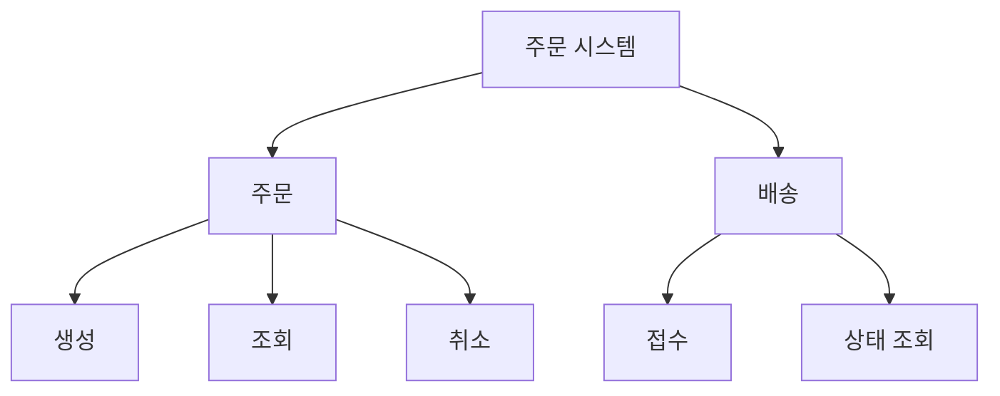

# System Design Framework

요구사항을 **책임 경계, 계약, 흐름, 검증 가능한 설계**로 바꾸는 프레임워크다. 문서의 개수보다 기능 하나를 구현하거나 바꿀 때 필요한 맥락이 명확한지를 확인한다. 경계와 계약의 공통 기준은 [모듈 경계 가이드](./module-boundary-guide.md), 확대할 깊이는 [Method-R](./method-R.md)을 따른다.

## 적용 방법과 산출물 선택

설계 문서의 첫 부분에 대상 기능, 해결할 문제, 성공 조건, 범위 밖 항목을 적는다. 기존 시스템이면 코드·테스트·운영 제약의 근거를 링크하고, **확인된 사실 / 제안 / 가정 / 미확인**을 구분한다. 요구에 없는 내부 구조를 현황처럼 단정하지 않는다.

아래 8개 항목은 필요한 설계 관점이다. 모든 프로젝트에 8개 문서나 다이어그램을 만들 필요는 없다. UI가 없는 시스템의 화면 항목처럼 해당하지 않는 것은 이유를 한 줄 남기고 생략한다. 기존 문서와 동일한 내용은 링크로 연결한다.

| 항목 | 해결할 질문 | 기본 산출물 |
|---|---|---|
| 1. Input Data | 무엇이 들어오며 누가 소유하는가? | 입력·검증·소유권 표 |
| 2. Key Events | 언제 시작되고 무엇이 완료된 사실인가? | 트리거와 결과 계약 |
| 3. Services List | 어느 조각이 어떤 책임을 갖는가? | 모듈 지도와 계약 링크 |
| 4. PBS | 요구 기능이 빠지지 않았는가? | 기능 트리와 소유 모듈 대응 |
| 5. Job Flow | 조각들이 어떤 결과를 연결하는가? | 대표 성공·실패 흐름 |
| 6. Navigation | 화면을 어떻게 이동하고 어떤 API·판단이 필요한가? | 사용자 흐름 |
| 7. State | 어떤 상태가 어떤 조건으로 바뀌는가? | 상태·전이·불변식 |
| 8. Screen Layout | 사용자에게 무엇을 어떻게 배치하는가? | 화면 구성·상호작용 |

공개 계약·상태 소유권·실패 정책은 관련 모듈의 기준 문서 한 곳에 정의하고, 위 항목에서 참조한다. AI 작업에 넘길 때는 이 전체 프레임워크를 매번 복사하지 않고 공통 가이드의 작업 맥락 묶음을 구성한다.

## 다이어그램의 문법 기준

독자 DSL을 원본으로 유지한다. `jobflow`를 Mermaid sequence/flowchart로 대체하거나 각 문서에서 문법을 재정의하지 않는다. Mermaid 보조 그림은 추가할 수 있으나 원본 DSL과 의미가 같아야 한다. 렌더러 지원 여부는 해당 가이드의 확인 절차를 따른다.

| 관점 | 표기 | 기준 가이드 |
|---|---|---|
| 협력 흐름 | `jobflow` | [Job Flow](./job-flow-diagram-guide.md) |
| 화면·처리 이동 | `navigation` | [Navigation](./navigation-diagram-guide.md) |
| 상태 전이 | `state` | [State](./state-diagram-guide.md) |
| 화면 배치 | `layout` | [Screen Layout](./screen-layout-guide.md) |

## 1. Input Data

시스템의 입력과 검증 경계를 정한다. 원천 데이터와 계산 결과, 기본값과 사용자 설정을 구분한다.

| 입력 | 출처·신뢰 경계 | 형식·단위 | 검증·누락 처리 | 소유 모듈 |
|---|---|---|---|---|
| 주문 요청 | 사용자 API | 상품 ID, 수량(정수) | 빈 항목·0 이하 수량 거절 | 주문 |
| 가격 조회 결과 | 가격 모듈의 공개 조회 | 금액·통화·기준 시점 | 유효기간과 재조회 정책 | 가격 |

수집 주기·규모·보존·민감도는 설계에 영향을 주는 항목만 추가한다. 외부 데이터 형식을 내부 모델 전체로 퍼뜨리지 않고 경계에서 변환한다.

## 2. Key Events

실행 요청인 Command, 이미 일어난 사실인 Event, 값을 읽는 Query를 구분한다. 이름만 나열하지 않고 발생 조건, 처리 책임, 입력 또는 payload, 완료 조건을 연결한다.

* `CancelOrder`: 주문 취소 요청. 주문 모듈이 현재 상태와 권한을 확인한 뒤 결과를 반환한다.
* `OrderCancelled`: 취소가 확정된 사실. 필요한 소비자만 구독한다. 취소 저장이 확정된 뒤 발행하며, 저장 성공과 발행 실패 사이의 복구 책임을 계약에 명시한다.
* 타이머·웹훅·재전송은 중복 실행될 수 있는지 확인한다. 이벤트가 없는 순차 기능을 억지로 이벤트화하지 않는다.

## 3. Services List

여기서 Service는 **논리적 책임 단위**이며 독립 배포 서비스나 Singleton을 뜻하지 않는다. `Manager`, `Collector` 같은 역할명만으로 나누기 전에 함께 변하는 도메인 책임을 찾는다.

각 모듈의 책임·비책임, 공개 진입점, 데이터 쓰기 소유권, 허용 의존, 코드 위치, 계약·테스트 링크를 모듈 지도에 둔다. 상세 필드는 [모듈 경계 가이드](./module-boundary-guide.md)를 재사용한다.

분리안을 선택할 때 기존 구조 유지, 함수 추출, 같은 프로세스의 모듈 분리부터 검토한다. 독립 배포·보안·규모 요구가 있을 때 서비스 분리를 검토하고, 운영·일관성 비용을 함께 적는다.

## 4. PBS (Process Breakdown Structure)

할 일 목록이 아니라 시스템이 제공하는 기능을 계층화한다.

기능마다 요구사항과 소유 모듈을 연결한다. PBS의 가지 하나를 파일·Worker·배포 서비스 하나로 기계적으로 변환하지 않는다. 서로 다른 기능도 같은 불변식을 지키면 하나의 모듈에 응집될 수 있다.

## 5. Job Flow Diagram

진입부터 사용자나 호출자에게 결과가 전달될 때까지의 대표 시나리오를 그린다. 해당 시나리오의 조율자가 있으면 `orchestrator:`, 경계만 보여 주면 `scope:`를 쓴다.

성공 경로와 함께 설계 판단이 필요한 거절·타임아웃·부분 실패를 표현한다. 파라미터·데이터 스키마는 DSL에 덧붙이지 않고 계약 문서에서 연결한다. 상세 흐름은 상위에 없는 책임·분기·실패 경계를 드러낼 때만 추가한다.

## 6. Navigation Diagram

화면 이동과 그 판단에 필요한 API·처리의 사용자 흐름을 그린다. 시작 조건, 권한, 성공·실패 결과가 어디에 표시되는지 연결한다. 복잡한 업무 알고리즘은 Job Flow나 모듈 계약으로 내려 보낸다.

## 7. State Diagram

상태를 바꾸는 주체를 정하고 전이 조건, 거절 조건, 종료·취소·복구 상태를 연결한다. 영속된 업무 상태, UI 표시 상태, 일시적 요청 상태를 구분한다. 여러 모듈이 같은 상태를 각자 쓰거나 서버 상태를 UI 저장소에서 임의로 확정하지 않게 한다.

## 8. Screen Layout

각 화면의 배치와 입력·출력·상호작용을 정한다. 데이터 출처와 변경 명령을 모듈 계약에 연결하고 로딩·빈 결과·오류·권한 상태를 필요한 범위에서 포함한다. 화면 배치가 도메인 소유권을 결정하지는 않는다.

## 교차 검증과 종료

1. 요구사항 → 소유 모듈 → 공개 계약 → 대표 흐름 → 검증 방법이 연결되는가?
2. 데이터의 쓰기 주체, 상태 전이 조건, 실패 후 남는 상태가 문서 사이에서 일치하는가?
3. 대표적인 내부 변경은 해당 모듈 안에서 끝나며, 계약 변경은 호출자·구독자까지 영향이 추적되는가?
4. 분리로 줄어든 구현 맥락보다 새 계약·조율·운영 비용이 더 커지지 않는가?
5. 독립 검토자가 반례를 제시하고 수정 후 재검토했는가? 사실 오류·계약 충돌·필수 요구 누락은 해결하거나 미해결 사유를 명시한다.

완료 보고에는 변경한 설계, 근거, 수행한 검증, 남은 가정을 적는다. 줄 수·도표 수·자가 점수만으로 완료를 판정하지 않는다.
