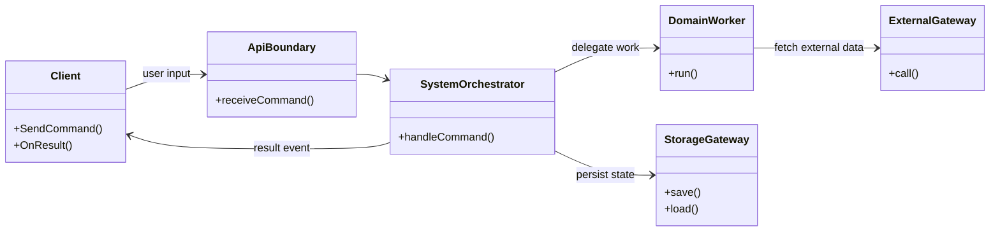

# System Flow Document Guide

## 목적

시스템을 설계하거나 설명할 때, 독자가 시스템 전체를 빠르게 이해할 수 있도록 문서를 작성하는 가이드다.
핵심은 **시스템을 이해하는 데 필요한 최소한의 조각**에서 시작해, 그 조각들이 어떻게 협력하는지
동적 흐름과 정적 구성을 함께 보여주는 것이다.

이 문서는 특정 백엔드 서비스 문서에만 한정하지 않는다. 프론트엔드, 백엔드, 워커, 외부 시스템,
저장소, 배치, 사용자 인터페이스가 섞인 모든 시스템 설명 문서에 적용한다.

이 문서는 다음 가이드를 함께 사용한다.

- [job-flow-diagram-guide.md](job-flow-diagram-guide.md): 객체/모듈 간 메서드 호출·이벤트 흐름
- [navigation-diagram-guide.md](navigation-diagram-guide.md): 화면/API/프로세스 흐름
- [orchestrator-worker-pattern-guide.md](orchestrator-worker-pattern-guide.md): orchestrator, worker, gateway 역할 분리

## 언제 쓰는가

- 새 시스템을 설계하면서 전체 구조와 주요 동작을 함께 설명해야 할 때
- 이미 구현된 시스템을 신규 구성원이나 리뷰어에게 설명해야 할 때
- 코드, API 목록, 화면 목록만으로는 시스템의 의미가 잘 보이지 않을 때
- 여러 컴포넌트가 협력하는 시나리오를 최소 단위부터 재귀적으로 펼쳐야 할 때
- PRD 보다 구현에 가깝고, README 보다 흐름 설명이 깊은 문서가 필요할 때

## 핵심 관점

### 1. 최소 조각에서 시작한다

처음부터 모든 파일, 클래스, API 를 나열하지 않는다.
먼저 시스템을 이해하는 데 꼭 필요한 최소 조각을 찾는다.

최소 조각은 보통 다음 중 하나다.

- 사용자 또는 외부 actor
- 시스템의 첫 진입점
- 핵심 도메인 orchestrator
- 중요한 저장소 또는 상태
- 외부 시스템 gateway
- 최종 산출물 또는 사용자에게 보이는 결과

예:

```text
Client, ChatServer, ReportDataApi, ReportGenerator, ReportRenderer
```

이 정도만으로 최상위 흐름이 설명되면, 처음 그림에는 DB, private method, 상세 worker 를 넣지 않는다.
세부사항은 다음 섹션에서 필요한 만큼만 펼친다.

### 2. 동적 흐름과 정적 구성을 함께 쓴다

시스템 이해에는 두 종류의 정보가 필요하다.

| 관점 | 질문 | 권장 표현 |
|---|---|---|
| 동적 흐름 | 요청이 들어오면 어떤 순서로 일이 일어나는가? | `jobflow`, `navigation` |
| 정적 구성 | 어떤 조각들이 있고 누가 누구를 소유/호출하는가? | Mermaid `classDiagram`, 책임 표 |

동적 흐름만 있으면 구조가 안 보이고, 정적 구성만 있으면 실제 사용 시나리오가 안 보인다.
항상 둘을 함께 제공한다.

### 3. 전체에서 부분으로 재귀적으로 내려간다

문서는 다음 순서로 읽히게 만든다.

1. 시스템 전체를 이루는 최소 조각
2. 최소 조각 사이의 대표 흐름
3. 전체 구성 다이어그램
4. 사용자/API/navigation 흐름
5. 각 조각 내부의 orchestrator/worker/gateway 흐름
6. 상태, 저장소, 외부 시스템, 운영 경계
7. 책임 소유 표

각 섹션은 앞 섹션의 한 조각을 더 자세히 여는 방식이어야 한다.
새로운 세부사항이 등장하면 "왜 이 조각을 알아야 하는지"가 흐름 안에서 설명되어야 한다.

### 4. 현재 설명인지, 설계안인지 구분한다

현재 구현을 설명하는 문서와 TO-BE 설계 문서는 독자가 다르게 읽는다.
한 문서 안에 둘 다 필요하면 반드시 구분한다.

- 현재 구현: "현재 주 흐름", "현재 남아 있는 호환 경계"
- 설계안: "TO-BE", "제안 흐름", "변경 후 책임"
- 문제 분석: "현재 문제", "병목", "중복 책임"

## 문서 이름

기본 파일명은 시스템 범위에 따라 정한다.

```text
SYSTEM_FLOW.md
docs/SYSTEM_FLOW.md
backend/SYSTEM_FLOW.md
frontend/SYSTEM_FLOW.md
```

특정 서비스 묶음만 설명한다면 더 좁은 이름을 써도 된다.

```text
SERVICE_FLOW.md
REPORT_FLOW.md
AUTH_FLOW.md
```

설계안이나 문제 분석은 별도 파일로 분리한다.

```text
SYSTEM_FLOW-tobe.md
SYSTEM_FLOW-problems.md
```

## 표준 목차

아래 목차를 기본으로 사용한다.

```markdown
# System Flow — <시스템 요약>

> 객체 협력은 [job-flow-diagram-guide.md](...) 를 따른다.
> 화면/API 흐름은 [navigation-diagram-guide.md](...) 를 따른다.
> jobflow 에서는 Object.Method / Object.OnEvent 를 기본으로 표기하고 HTTP 경로·파라미터는 쓰지 않는다.
> jobflow 헤더는 흐름을 조율하는 단일 객체가 있으면 orchestrator: X, 경계·Choreography 면 scope: X 로 쓴다 (method-R · master: 미사용).
> HTTP/API 이름은 navigation 블록에서만 표기한다.
> Client 입력은 Client.Send...Message, Client 내부 반응은 Client.On... 으로 표기한다.

## 0. 시스템을 이해하는 최소 조각

### 0-1. 전체 시스템 구성 다이어그램
### 0-2. 대표 시나리오 요약

## 1. 동적 흐름

### 1-1. 최상위 jobflow
### 1-2. 화면/API/navigation 흐름
### 1-3. 주요 이벤트/비동기 흐름

## 2. 정적 구성

### 2-1. 컴포넌트 책임
### 2-2. 소유/호출 관계
### 2-3. 저장소/외부 시스템 경계

## 3. 내부 흐름 상세

### 3-1. <component-a> 내부 흐름
### 3-2. <component-b> 내부 흐름
### 3-3. <worker-or-pipeline> 내부 흐름

## 4. 상태와 데이터

## 5. 런타임/운영 경계

## 6. 책임 소유 표
```

프로젝트가 작으면 섹션 수를 줄여도 되지만 다음 네 가지는 유지한다.

- 최소 조각
- 동적 흐름
- 정적 구성
- 책임 소유 표

## 작성 전 조사 체크리스트

현재 시스템을 설명하는 경우, 문서 작성 전에 다음을 확인한다.

- 사용자/외부 actor 와 첫 진입점
- 핵심 use case 2~5개
- 화면, API, queue, event, scheduler 같은 입력 경계
- orchestrator/sub-orchestrator 또는 흐름 제어 객체
- worker, domain service, utility 같은 작업 객체
- gateway/repository 같은 외부 접근 객체
- 저장소와 주요 상태
- 외부 시스템/API
- SSE, WebSocket, message queue, batch, timeout/cancel 같은 비동기 경계
- legacy/public compatibility 경계

새 시스템을 설계하는 경우에는 같은 항목을 "현재 코드" 대신 "제안 구성"으로 채운다.

## 섹션별 작성법

### 0. 시스템을 이해하는 최소 조각

처음에는 시스템 전체를 이루는 가장 작은 설명 단위를 표로 쓴다.

```markdown
| 조각 | 종류 | 한 줄 책임 | 받는 입력 | 보내는 출력 |
|---|---|---|---|---|
| **Client** | Actor/UI | 사용자 입력과 결과 표시 | 사용자 행동 | API 요청 |
| **ApiServer** | Component | 사용자 요청 진입점과 흐름 제어 | Client 요청 | Worker 요청 |
| **Worker** | Component | 장기 작업 실행 | 내부 작업 요청 | 작업 결과 |
| **Storage** | State | 작업 결과 저장 | 저장/조회 | 상태 snapshot |
```

좋은 최소 조각은 다음 조건을 만족한다.

- 독자가 이 표만 보고 시스템의 주요 역할을 말할 수 있다.
- 조각 수가 너무 많지 않다. 보통 4~8개가 적당하다.
- 파일명이나 private class 보다 책임이 먼저 보인다.
- 상세 구현을 몰라도 대표 시나리오를 따라갈 수 있다.

### 0-1. 전체 시스템 구성 다이어그램

Mermaid `classDiagram` 으로 전체 구성을 보여준다.
여기서 class 는 반드시 실제 OOP 클래스일 필요는 없다. 시스템 이해에 필요한 구성 단위면 된다.



구성 다이어그램에는 다음만 넣는다.

- 주요 actor
- boundary: 화면, API route, queue consumer, scheduler
- 흐름 제어자: orchestrator, coordinator, controller
- 작업자: worker, domain service, pipeline step
- 상태/저장소: DB gateway, repository, cache
- 외부 시스템 gateway

private helper, DTO, config constant, 단순 formatter 는 넣지 않는다.

### 0-2. 대표 시나리오 요약

다이어그램 전에 짧은 문장으로 대표 흐름을 적는다.

```markdown
시나리오:

- 사용자가 요청을 보내면 `ApiServer` 가 받는다.
- `ApiServer` 는 작업 맥락을 만들고 `Worker` 에 위임한다.
- `Worker` 는 외부 데이터를 조회하고 결과를 만든다.
- `ApiServer` 는 결과를 저장한 뒤 `Client` 에 이벤트로 돌려준다.
```

이 요약은 이후 jobflow 를 읽는 색인 역할을 한다.

### 1. 동적 흐름

동적 흐름은 "시간 순서"를 설명한다.
가장 먼저 최상위 jobflow 를 쓰고, 그 다음 필요한 시나리오를 세분화한다.

```jobflow
orchestrator: ApiServer
Object: Client, ApiServer, Worker, Storage, ExternalSystem

Client.SendCommand --> ApiServer.HandleCommand
ApiServer.HandleCommand --> Worker.Run
Worker.Run --> ExternalSystem.FetchData
ExternalSystem.FetchData.result --> Worker.Run.result
Worker.Run.result --> Storage.SaveResult
Storage.SaveResult.result --> ApiServer.HandleCommand.result
ApiServer.HandleCommand.result --> Client.OnResult
```

최상위 jobflow 규칙:

- 최소 조각만 사용한다.
- HTTP path, payload, DB table, private method 를 넣지 않는다.
- `A.result --> B` 는 orchestrator(ApiServer) 가 A 결과를 받아 B 로 넘긴다는 뜻이다.
- 복잡한 내부 과정은 다음 섹션에서 새 jobflow 로 연다.

### 1-2. 화면/API/navigation 흐름

사용자 화면, API, 내부 API, queue topic 등 입출력 경계를 보여줄 때는 `navigation` 을 쓴다.

```navigation
Dashboard --> (/reports/render)
(/reports/render) --> Dashboard : progress
(/reports/render) --> Dashboard : result
(/reports/render) --> Dashboard : error

ApiServer --> (/internal/jobs/run)
(/internal/jobs/run) --> ApiServer : done
(/internal/jobs/run) --> ApiServer : error
```

실제 endpoint 를 설명해야 하면 표를 붙인다.

```markdown
| 입력 경계 | 소유 조각 | 역할 |
|---|---|---|
| `POST /reports/:id/render` | `ApiServer` | 사용자 렌더 요청 |
| `POST /internal/jobs/run` | `Worker` | 내부 작업 실행 |
| `report.completed` topic | `ApiServer` | 비동기 완료 이벤트 |
```

### 1-3. 주요 이벤트/비동기 흐름

SSE, WebSocket, queue, scheduler, timeout/cancel 은 별도 섹션으로 분리한다.

브로커/큐로 중개되는 비동기는 method-R 상 Choreography 이므로 `scope:` 로 선언하고 `MessageBus` 채널을 명시한다(중앙 조율자 없음).

```jobflow
scope: ReportSystem
Object: Client, ApiServer, Worker, MessageBus
Client.SendStartMessage --> ApiServer.HandleStart
ApiServer.HandleStart --> MessageBus.JobRequested
MessageBus.JobRequested --> Worker.HandleJob
Worker.HandleJob --> MessageBus.JobCompleted
MessageBus.JobCompleted --> ApiServer.HandleJobCompleted
ApiServer.HandleJobCompleted --> Client.OnCompleted
```

비동기 흐름에서는 다음을 명시한다.

- 누가 연결을 열고 닫는가
- progress/result/error event 이름
- cancel/timeout/shutdown 때 persist 여부
- 중복 처리나 재시도 정책

### 2. 정적 구성

정적 구성은 "누가 무엇을 소유하고 누구에게 의존하는가"를 설명한다.

```markdown
| 구성 단위 | 소유 책임 | 주요 협력 대상 |
|---|---|---|
| `ApiServer` | 사용자 입력 검증, 작업 맥락 생성, 응답 스트림 | `WorkerGateway`, `StorageGateway` |
| `Worker` | 장기 작업 실행, 중간 progress 생성 | `ExternalGateway` |
| `StorageGateway` | 상태 저장/조회 캡슐화 | DB |
```

의존 방향이 중요하면 Mermaid `classDiagram` 또는 `flowchart` 를 한 번 더 사용할 수 있다.
단, 이미 0-1 전체 구성 다이어그램에 충분히 보이면 반복하지 않는다.

### 3. 내부 흐름 상세

최상위 조각 중 이해에 필요한 것만 내부로 내려간다.

```jobflow
orchestrator: SystemOrchestrator
Object: ApiBoundary, SystemOrchestrator, Validator, ContextBuilder, DomainWorker, StorageGateway
ApiBoundary.HandleCommand --> SystemOrchestrator.HandleCommand
SystemOrchestrator.HandleCommand --> Validator.Validate
Validator.Validate.result --> ContextBuilder.Build
ContextBuilder.Build.result --> DomainWorker.Run
DomainWorker.Run.result --> StorageGateway.Save
StorageGateway.Save.result --> SystemOrchestrator.HandleCommand.result
```

내부 흐름을 쓸지 말지 판단하는 기준:

- 장애가 자주 나는 구간인가?
- 책임 경계가 헷갈리는 구간인가?
- 외부 시스템이나 저장소와 만나는가?
- 진행률, 취소, 재시도 같은 운영 규칙이 있는가?
- 신규 개발자가 코드를 읽을 때 진입점으로 삼아야 하는가?

모든 클래스 내부를 다 펼치지 않는다.
설명 가치가 있는 경계만 연다.

### 4. 상태와 데이터

시스템 이해에 필요한 상태만 적는다.

```markdown
| 상태/데이터 | 소유 조각 | 생성 시점 | 소비 시점 |
|---|---|---|---|
| `JobContext` | `ApiServer` | 사용자 요청 수신 | Worker 실행 |
| `JobResult` | `Worker` | 작업 완료 | Client 결과 표시 |
| `SavedReport` | `Storage` | 저장 요청 | 렌더/편집/조회 |
```

데이터베이스 전체 ERD 를 넣으려 하지 않는다.
흐름을 이해하는 데 필요한 상태와 생명주기만 적는다.

### 5. 런타임/운영 경계

시스템이 실제로 운영될 때 중요한 경계를 정리한다.

```jobflow
orchestrator: Runtime
Object: Runtime, Auth, Metrics, DisconnectWatcher, RouteHandler
Runtime.Start --> Auth.Install
Auth.Install.result --> Metrics.Install
Metrics.Install.result --> RouteHandler.Mount
DisconnectWatcher.OnClose --> RouteHandler.AbortWork
```

포함할 수 있는 항목:

- 인증/인가
- metrics/logging/tracing
- graceful shutdown
- client disconnect
- timeout/cancel
- retry/idempotency
- rate limit
- feature flag/degraded mode

### 6. 책임 소유 표

마지막에는 책임 소유를 표로 닫는다.

```markdown
| 책임 | 소유 조각 | 내부 orchestrator |
|---|---|---|
| 사용자 입력 진입점 | `ApiServer` | `SystemOrchestrator` |
| 장기 작업 실행 | `Worker` | `PipelineWorker` |
| 상태 저장/조회 | `Storage` | `StorageGateway` |
| 외부 데이터 조회 | `ExternalSystem` 접근은 `ExternalGateway` 가 캡슐화 | `ExternalGateway` |
```

이 표는 문서의 결론이다.
"누가 책임지는가"가 모호하면 시스템 설명은 끝난 것이 아니다.

## 표기 규칙

### 다이어그램 선택

| 상황 | 사용 |
|---|---|
| 전체 구성, 소유/호출 관계 | Mermaid `classDiagram` |
| 객체/모듈 간 실행 순서 | `jobflow` |
| 화면/API/queue/topic 등 경계 흐름 | `navigation` |
| 상태 전이 | `state` 또는 Mermaid `stateDiagram-v2` |

### jobflow 규칙

- 헤더는 method-R 표기를 따른다 — 흐름을 조율하는 단일 객체가 있으면 `orchestrator: X`, 외부 경계나 Choreography 처럼 조율자가 없으면 `scope: X` 로 선언한다. (과거 `master:` 표기는 method-R 로 통일했으므로 쓰지 않는다.)
- `Object.Method` / `Object.OnEvent` 형식을 사용한다.
- HTTP path, parameter, JSON payload 는 쓰지 않는다.
- Client 입력은 `Client.Send...Message` 로 쓴다.
- Client 반응은 `Client.On...` 으로 쓴다.
- 반환값은 `.result` 로 쓴다.
- 조건 분기는 `.true`, `.false`, `.value` 를 쓴다.

잘못된 예:

```jobflow
Client.POST /orders/:id/pay --> PaymentAPI.charge(cardNo)
```

올바른 예:

```jobflow
Client.SendPaymentMessage --> OrderServer.HandlePayment
OrderServer.HandlePayment --> PaymentGateway.Charge
PaymentGateway.Charge.result --> Client.OnPaymentCompleted
```

### 이름 규칙

- Actor/UI: `Client`, `AdminPage`, `Dashboard`
- Boundary: `ApiRoutes`, `QueueConsumer`, `Scheduler`
- Orchestrator: `SystemOrchestrator`, `ReportSubOrch`
- Worker: `PipelineWorker`, `RendererWorker`
- Gateway: `PaymentGateway`, `StorageGateway`, `ExternalGateway`
- State/Store: `Mysql`, `Redis`, `ObjectStorage`, `SessionStore`

실제 코드 이름이 있으면 코드 이름을 우선 사용한다.
설계 문서라 아직 코드가 없으면 역할이 드러나는 이름을 사용한다.

## 작성 체크리스트

- [ ] 시스템을 이해하는 최소 조각이 4~8개 수준으로 정리됐다.
- [ ] 최소 조각 표만 보고도 시스템의 주요 책임을 설명할 수 있다.
- [ ] 전체 구성 다이어그램이 있다.
- [ ] 대표 시나리오 요약이 있다.
- [ ] 최상위 jobflow 는 최소 조각 사이의 동적 흐름만 보여준다.
- [ ] 화면/API/queue/topic 흐름은 navigation 으로 분리했다.
- [ ] 내부 상세 흐름은 필요한 조각만 재귀적으로 펼쳤다.
- [ ] 정적 구성과 책임 관계를 표로 정리했다.
- [ ] 상태와 데이터는 흐름 이해에 필요한 것만 적었다.
- [ ] 런타임/운영 경계가 있다.
- [ ] 마지막에 책임 소유 표가 있다.
- [ ] 현재 구현과 TO-BE 설계를 섞어 쓰지 않았다.
- [ ] jobflow 에 HTTP path, parameter, JSON payload 를 쓰지 않았다.

## 검증 방법

문서 작성 후 다음을 확인한다.

```bash
rg -n "TODO|미정|나중에|임시" SYSTEM_FLOW.md
rg -n "직접 호출|legacy|compatibility|internal|TO-BE|현재" SYSTEM_FLOW.md
git diff --check -- SYSTEM_FLOW.md
```

현재 코드 기준 문서라면 구성 단위 이름과 public method 이름을 코드에서 확인한다.
설계 문서라면 각 조각이 실제 구현 가능한 책임 단위인지 확인한다.

## 안티패턴

### 1. 모든 것을 첫 그림에 넣기

처음부터 모든 클래스, API, DB table 을 넣으면 시스템이 더 이해하기 어려워진다.
첫 그림은 최소 조각만 사용하고, 세부사항은 재귀적으로 연다.

### 2. 정적 구성만 쓰기

컴포넌트 목록만 있으면 실제 요청이 어떻게 처리되는지 알 수 없다.
반드시 대표 jobflow 를 함께 쓴다.

### 3. 동적 흐름만 쓰기

시나리오만 있으면 누가 무엇을 소유하는지 흐려진다.
반드시 전체 구성 다이어그램과 책임 표를 함께 쓴다.

### 4. route 를 객체처럼 쓰기

`(/reports/render)` 는 navigation 에서만 쓴다.
jobflow 에서는 `ReportDataApi.HandleRenderSavedReport` 처럼 객체와 메서드로 쓴다.

### 5. 구현 디테일을 이해 조각으로 착각하기

private helper, DTO, 단순 mapper, config constant 는 보통 시스템 이해의 최소 조각이 아니다.
그 조각이 없으면 대표 흐름을 설명할 수 없는 경우에만 포함한다.

### 6. 책임 소유를 끝까지 확정하지 않기

문서 마지막에 "누가 무엇을 책임지는가"가 남아야 한다.
책임 소유 표가 모호하면 다이어그램을 다시 줄이고 경계를 다시 잡는다.
