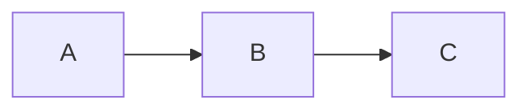

# tools.camp 마크다운 문법 가이드

`tools.camp` 마크다운 에디터(`MdEditPage`)는 표준 마크다운(GFM)에 더해 두 갈래의 확장 문법을 지원한다.

- **텍스트 레벨 SmartMD 확장** — 콜아웃·Figure·표 사양·정렬·변수·이미지 속성·프런트매터. 전처리기(`smartmd.js`)가 원본 텍스트를 변환한다.
- **코드펜스 기반 확장** — 코드 문법 강조, Mermaid, 자체 미니 문법 다이어그램(`state`/`navigation`/`jobflow`/`layout`), 페이지 분할.

이 문서는 기존 tools.camp 구현(`src/lib`)의 변환·표시 동작을 설명한다. **이 가이드 모음에는 파서/렌더러 소스와 실행 환경이 없다.** 아래 함수·옵션·규칙은 현재 제품의 지원을 보장하지 않으므로 적용할 버전에서 확인한다. 확인할 수 없으면 정적 검토와 렌더링 미검증을 구분한다.

AI 작업에는 이 레퍼런스 전체를 기본 첨부하지 않는다. 필요한 다이어그램 가이드와 해당 문법 절만 읽고, 기존 토큰을 조합한다. 설명에 필요한 책임·계약·검증 메타데이터는 코드펜스 밖 산문/표에 쓰며 지원 확인 없이 새 DSL 문법을 만들지 않는다.

> 다이어그램의 **작성 문법과 의미는 전용 가이드가 원본**이다. 이 문서의 구현 수용 범위를 새 작성 문법으로 해석하지 않는다.
> - [`job-flow-diagram-guide.md`](job-flow-diagram-guide.md)
> - [`navigation-diagram-guide.md`](navigation-diagram-guide.md)
> - [`state-diagram-guide.md`](state-diagram-guide.md)
> - [`screen-layout-guide.md`](screen-layout-guide.md)

---

## 확인한 구현 스냅샷

2026-09-05에 `tools.camp` 구현의 clean commit `d12f23014e6fed86db8012f007637a0709d61eaf`에서 `src/lib/jobflow.js`, `navigation.js`, `state.js`, `layout.js`를 읽고 Node `v22.19.0`으로 임시 복사본을 실행했다. 아래 결과는 이 스냅샷에 한정하며 운영 배포본이나 다른 버전의 지원을 보장하지 않는다.

| 항목 | 확인한 동작 | 작성 시 의미 |
|---|---|---|
| jobflow `master:` | `masterObject`로 파싱하지만 SVG 생성에는 사용하지 않음 | 이 헤더만으로 조율 의미가 시각적으로 드러나지 않음 |
| jobflow `orchestrator:` / `scope:` | 전용 헤더로 인식하지 않음; 단순 이름 예시에서는 무시되고 관계는 생성됨 | 기존 문서 의미는 유지하고 `Object:` 및 블록 밖 설명으로 조율자/경계를 밝힘 |
| jobflow ` : 라벨` | 전이 라벨로 분리하지 않고 대상 액션 문자열에 포함 | 분기는 `.true`/`.false`/값 경로, 상세 조건은 본문에 작성 |
| navigation/state ` : 라벨` | 양쪽 공백이 있는 마지막 구분자를 기준으로 분리 | jobflow와 구분해 사용 |
| layout ` V ` / ` > ` | 각각 세로/가로 방향으로 파싱, `H` 연산자는 없음 | `>`를 단순 포함 관계라고 재정의하지 않음 |
| layout 크기 | 가로는 `flex` 배분 값, 세로는 입력 수치를 사용하지 않음 | 정밀한 픽셀/비율은 제품 화면에서 별도 확인 |

기존 `jobflow-result-line.test.mjs` 69개와 `jobflow-xss.test.mjs` 32개 단언이 통과했고, 가이드의 구체 예시 48개에서 변환/문자열 생성을 확인했다(jobflow 30, navigation 12, state 3, layout 3). 이는 **파서·변환·SVG/HTML 문자열 생성 검사**다. 브라우저에서의 Mermaid/SVG 표시, 모든 의미적 올바름, UI의 시각적 품질은 확인하지 않았다. 임시 복사본은 검사 뒤 제거했고 원본 구현은 변경하지 않았다.

`orchestrator:`/`scope:`처럼 인식되지 않는 줄이 항상 안전하게 무시된다고 일반화하지 않는다. 이 파서는 점을 포함한 알 수 없는 줄을 독립 노드로 해석할 수도 있다. 문서 헤더의 의미, 파서 입력 수용, 시각적 표현은 각각 확인한다.

---

## 목차

1. [렌더링 파이프라인](#1-렌더링-파이프라인)
2. [코드 블록 & 문법 강조](#2-코드-블록--문법-강조)
3. [Mermaid 다이어그램](#3-mermaid-다이어그램)
4. [State 다이어그램](#4-state-다이어그램)
5. [Navigation 다이어그램](#5-navigation-다이어그램)
6. [JobFlow 다이어그램](#6-jobflow-다이어그램)
7. [Layout 다이어그램](#7-layout-다이어그램)
8. [콜아웃 (Callout)](#8-콜아웃-callout--)
9. [Figure (그림/캡션)](#9-figure-그림캡션)
10. [SmartMD 표](#10-smartmd-표--table-)
11. [변수 플레이스홀더](#11-변수-플레이스홀더--name)
12. [이미지 속성 접미사](#12-이미지-속성-접미사)
13. [프런트매터](#13-프런트매터)
14. [페이지 분할](#14-페이지-분할)
15. [요약표](#15-요약표)

---

## 1. 렌더링 파이프라인

1. **SmartMD 전처리**(`preprocessSmartMd`) — 프런트매터 배너 치환 → 이미지 속성 접미사 제거 → `{...}` 속성 블록 처리(표 사양·정렬·캡션 마커) → `{{변수}}` 강조 → `:::` 콜아웃/Figure 를 HTML 블록으로 변환.
2. **블록 분할**(`parseMarkdownToBlocks`) — 본문을 heading/paragraph/code/list/table 등 블록 단위로 나눈다(증분 렌더링용).
3. **마크다운 렌더**(`marked`) — 블록별로 렌더. 코드펜스 언어가 `mermaid`/`state`/`navigation`/`jobflow`/`layout`이면 각 변환기로 처리한다.
4. **후처리**(`applySmartTableSpecs`, `processDiagramsInBlock`) — 표 사양 적용, 다이어그램 SVG/HTML 생성, 코드 하이라이트·줄 번호·복사 버튼 부착.

> **CJK 강조 보정**: 코드펜스를 제외한 블록에는 `fixCjkEmphasis`가 적용된다. `**(전이)**를`, `**기계(Machine)**는` 처럼 강조 구분자가 문장부호·한글과 인접해 강조가 깨지는 경우, 보이지 않는 ZWSP(U+200B)를 끼워 표준 파서가 강조를 정상 인식하게 한다. 결과물에는 보이지 않는다.

---

## 2. 코드 블록 & 문법 강조

표준 펜스 코드 블록은 highlight.js로 문법 강조된다.

````markdown
```javascript
console.log('Hello, world!');
```
````

**규칙**
- 여는 펜스(```` ``` ```` 또는 `~~~`, 3개 이상) 뒤에 언어 식별자를 적는다.
- 등록된 언어: `javascript`, `typescript`, `python`, `bash`, `json`, `css`, `xml`(HTML), `java`, `cpp`. (highlight.js가 정의한 별칭 `js`/`ts`/`py`/`sh`/`html` 등도 인식된다.)
- **언어를 명시하지 않거나 미등록 언어**면 자동 탐지 없이 일반 텍스트로 출력된다.
- 다이어그램 펜스(아래 항목)를 제외한 코드 블록에는 **줄 번호**와 **복사 버튼**이 붙는다. (다이어그램 펜스에는 복사 버튼만 붙는다.)

---

## 3. Mermaid 다이어그램

표준 Mermaid 문법을 그대로 사용한다.

````markdown

```mermaid
graph LR
A --> B
B --> C
```
````

**규칙**
- 내용은 가공 없이(`&`/`<`/`>`만 이스케이프) `<div class="mermaid">`에 담겨 Mermaid.js로 클라이언트 렌더링된다.
- 초기화 옵션: `securityLevel: 'loose'`, `theme: 'default'`.
- 아래 `state`/`navigation` 다이어그램은 자체 미니 문법을 Mermaid(`graph LR`)로 변환해 렌더링하는 확장이다.

---

## 4. State 다이어그램

`state` 펜스. 상태 전이 다이어그램을 미니 문법으로 작성하면 Mermaid(`graph LR`)로 변환된다.

````markdown
```state
<s> --> (StateA)
(StateA) --> (StateB) : ConditionA
(StateB) --> (StateC) : ConditionB
(StateC) --> <e> : ConditionC
```
````

노드·전이 작성은 [State 구성 요소](state-diagram-guide.md#구성-요소)와 [분기](state-diagram-guide.md#분기-condition)를 따른다. 확인한 구현의 변환 특성은 다음과 같다.

- 시작/종료는 라벨 없는 흰색/검은색 원, 이벤트·메시지는 연두 다이아몬드다. 괄호 없는 노드는 사각형이며, 작성 의미는 액션이다.
- 전이 라벨은 양쪽 공백이 있는 마지막 ` : `로 분리한다.
- 노드 이름의 `"`, `@`, `()`, `[]`, `{}`를 Mermaid 엔티티로 바꾼다. 전이 라벨은 `"`, `@`, `()`만 변환한다.

---

## 5. Navigation 다이어그램

`navigation` 펜스. 화면/페이지 이동 흐름을 표현한다. 역시 Mermaid(`graph LR`)로 변환된다.

````markdown
```navigation
Start --> (/action)
(/action) --> Start : error
(/action) --> End : ok
```
````

작성 문법은 [Navigation 구성 요소](navigation-diagram-guide.md#구성-요소)·[분기](navigation-diagram-guide.md#분기)를 따른다. 아래는 **구현의 입력 수용·표시** 기록이다. `<이름>`·`/이름` 수용을 전용 가이드의 노드 종류 확장으로 해석하지 않는다.

**구현의 노드 변환**

| 작성           | 의미            | 렌더링 모양                    |
|----------------|-----------------|--------------------------------|
| `` `이름` ``   | 메시지          | `fr-rect` (노란 배경 `#fff7d6`)|
| `<이름>`       | 이벤트/요소     | 다이아몬드 `{{ }}` (연두)      |
| `(이름)`       | 둥근 노드       | 둥근 사각형                    |
| `/이름`        | 둥근 노드(대체) | 둥근 사각형                    |
| `이름`         | 일반(화면)      | 사각형 (파란 배경 `#bbf`)      |

전이 라벨 분리와 특수 문자 변환은 [State 구현](#4-state-다이어그램)과 같다.

> `` `백틱` ``(메시지), `<꺾쇠>`(이벤트), `(괄호)`·`/슬래시`(둥근) 접두/감싸기만 특별 처리된다. 그 외 문자열은 대괄호를 포함해 **있는 그대로** 사각형 라벨이 된다.

---

## 6. JobFlow 다이어그램

`jobflow` 펜스. 객체 간 메서드 호출 흐름을 컬럼 기반 다이어그램으로 그린다. 자체 SVG 렌더러를 사용한다.

````markdown
```jobflow
master: ClassC
Object: ClassC, ClassA, ClassB
ClassC.Start --> ClassA.Show
ClassC.Start --> ClassB.GetList
ClassB.GetList.result --> ClassC.AddList
```
````

**선언부**

이 절은 기존 구현 레퍼런스의 `master:`를 기술한다. `orchestrator:`와 `scope:`의 선택·의미는 [Job Flow 가이드](job-flow-diagram-guide.md#헤더-키워드--orchestrator-vs-scope)가 소유한다. 위 [구현 확인 기록](#확인한-구현-스냅샷)의 스냅샷은 두 헤더의 제어 의미를 해석하지 않는다. 세 헤더를 의미가 같은 별칭으로 간주하거나 일괄 치환하지 말고 대상 버전의 지원을 확인한다.

- `master: 이름` — 기존 주(主) 객체 선언(선택). 확인한 스냅샷에서는 파싱 결과에만 저장되며 SVG에 반영되지 않는다.
- `Object: 이름1, 이름2, ...` — 객체(컬럼) 선언. 콤마로 구분하며 여러 줄이 필요하면 각 줄에 `Object:`를 반복한다. 확인한 스냅샷은 `master:`/`object:`의 대소문자를 구분하지 않지만 헤더 앞 들여쓰기는 제거하지 않으므로 줄 시작에 쓴다.
- 관계식에 등장한 객체는 자동으로 컬럼에 추가되므로, `Object:` 선언은 **컬럼 순서를 고정**하는 용도다.
- 다른 `JobFlowToSVG` 사본은 `Object:`의 객체만 열로 만든다 — 객체를 모두 선언한다([렌더러 배치 특성](job-flow-diagram-guide.md#렌더러-배치-특성)).

호출·결과·단독 줄은 [Job Flow 구성 요소](job-flow-diagram-guide.md#구성-요소)를 따른다. 실제 호출자는 [헤더 관점](job-flow-diagram-guide.md#헤더-키워드--orchestrator-vs-scope)으로 판별하며, 점 경로의 중첩·화살표만으로 객체 소유권이나 직접 의존을 추정하지 않는다.

**노드 모양(액션 이름으로 자동 결정)** — `getShapeType` 기준
- 액션의 **마지막 세그먼트가 `on`으로 시작**(대소문자 무관, 예: `onSuccess`) → 이벤트 모양(연두, 둥근 모서리).
- 액션 경로에 **점이 포함**(예: `GetList.result`, `state.value`) → 데이터/결과 모양(노랑, 양쪽 세로선).
- 그 외 일반 액션 → 사각형(파랑).

**결과(result) 경로**
- 입력 전체에서 `.result.`(중간 세그먼트)는 내부적으로 `.data.`로 치환된다.
- `ClassB.GetList.result` 처럼 끝에 오는 `.result`는 점이 포함된 경로이므로 위 규칙에 따라 **데이터 모양(노랑)**으로 그려진다.

실행 의미와 [이벤트 반환값](job-flow-diagram-guide.md#이벤트가-반환값을-갖는-경우), [결과 선택](job-flow-diagram-guide.md#표시할-결과-선택)·[배치](job-flow-diagram-guide.md#메서드와-결과의-배치)는 전용 가이드를 따른다. 위 모양·경로 처리는 해당 스냅샷의 동작이다. 세부 지원은 대상 구현에서 확인하고, 미확인 표기는 코드펜스 밖에 설명한다.

---

## 7. Layout 다이어그램

`layout` 펜스. 화면 레이아웃(컨테이너 트리)을 표현한다. Flexbox 기반 미리보기로 렌더링된다.

````markdown
```layout
Screen V Header, Main, Footer
Header > Logo, Search, UserMenu
Main > Left Sidebar : 20, Content
Left Sidebar V ProjectPicker, SavedFilters, TagFilter
Content V Breadcrumbs, TitleBar, DetailBody, Activity, Pager
TitleBar > IssueTitle, Actions
Footer > Status, Version
```
````

방향·트리·배분 문법은 [Layout 기본 구조](screen-layout-guide.md#기본-구조)·[문법](screen-layout-guide.md#문법), 작성 한계는 [제한 사항](screen-layout-guide.md#제한-사항)을 따른다.

확인한 구현은 가로 숫자를 정수 flex 가중치로 사용하므로 gap·padding을 포함한 정확한 픽셀 백분율을 보장하지 않는다. 세로 입력 숫자는 무시하며 말단·하위 트리 구조의 flex 가중치와 내용 높이를 사용한다.

---

## 8. 콜아웃 (Callout) — `:::`

강조 박스를 만드는 컨테이너 블록 문법(표준 마크다운에는 없음).

### 문법

```
:::<타입> [title="제목"]
내용 (마크다운 사용 가능)
:::
```

### 예시

```markdown
:::success title="결론"
주문 처리 목표 충족, 실패 0건.
:::

:::warning
결제 대기열이 한도에 가까워지고 있습니다.
:::
```

### 규칙

- 여는 줄 `:::타입`, 닫는 줄 `:::`은 각각 **자체 줄**에 있어야 한다.
- `title="..."` 속성(선택)을 주면 박스 상단에 굵은 제목(`smart-callout-title`)이 표시된다.
- 박스 내부 내용은 마크다운으로 먼저 렌더링된 뒤 박스로 감싸진다.

### 지원 타입

| 타입       | 적용 클래스               | 용도          |
|------------|---------------------------|---------------|
| `success`  | `smart-callout success`   | 성공 / 결론   |
| `warning`  | `smart-callout warning`   | 경고          |
| `danger`   | `smart-callout danger`    | 위험 / 오류   |
| `info`     | `smart-callout info`      | 정보          |
| `note`     | `smart-callout info`      | `info`로 렌더 |
| `tip`      | `smart-callout info`      | `info`로 렌더 |

- 위 표에 없는 타입명을 쓰면 `info` 박스로 렌더링되고, 타입명이 제목 위치에 표시된다(`title`을 함께 주면 `타입명 — 제목` 형태).

---

## 9. Figure (그림/캡션)

```markdown
:::figure caption="그림 1. 시스템 구성도"

:::
```

- `caption="..."`으로 그림 하단 캡션을 지정한다.
- `<div class="smart-figure">` + `<div class="smart-figure-caption">`로 렌더링된다.

---

## 10. SmartMD 표 — `{table ...}`

표준 마크다운 표(GFM)에는 열별 정렬·너비·헤더 텍스트를 세밀하게 지정할 수 없다. SmartMD는 표 **바로 위**에 사양 블록을 두어 이를 제어한다.

### 문법

```
{table [caption="캡션 {n}"]
 columns=[
   {name=키, title="헤더", align=정렬, width=너비},
   ...
 ]}

| ... 표준 마크다운 표 ... |
```

### 예시

```markdown
{table caption="표 {n}. 서비스별 처리 결과"
 columns=[
   {name=service,  title="서비스",  align=left,   width=40%},
   {name=success,  title="성공률",  align=right,  width=30%},
   {name=failures, title="실패",    align=center, width=30%}
 ]}

| service  | success | failures |
|----------|---------|----------|
| orders   | 99.9%   | 1        |
| payments | 99.7%   | 3        |
```

### 규칙

- 블록은 **줄 시작 위치**에서 `{`로 시작해야 한다(중괄호 균형·문자열 리터럴을 인식해 파싱).
- `columns=[ {…}, {…} ]` 배열의 각 항목이 표의 **열과 순서대로 1:1 대응**된다.
- 바로 다음에 오는 표에 사양이 적용된다(렌더링 후 DOM의 `<th>`/`<td>`에 스타일·텍스트 반영).

### 열(column) 속성

| 속성     | 허용 값                          | 동작 |
|----------|----------------------------------|------|
| `align`  | `left` / `right` / `center`      | 해당 열 전체(`th`+`td`)의 `text-align` |
| `width`  | 숫자 또는 백분율 (`40%`, `120`)  | 헤더(`th`)의 `width` |
| `title`  | 따옴표 문자열 `"..."`            | 해당 열의 **헤더 텍스트를 교체** |
| `name`   | 식별 키                          | 파싱되지 않음(문서화·가독성 용도) |

### `caption` 속성

- `{table caption="..."}`처럼 캡션을 주면 표 위에 캡션 div(`smart-caption`)가 생성된다.
- 캡션 내 `{n}` 토큰(및 뒤따르는 `.`·공백)은 자동으로 제거된다(자동 번호 자리 표시 용도).

### 간이 정렬 블록 — `{align=...}`

열별 사양 없이 표 전체를 한 방향으로 정렬할 때 사용한다.

```markdown
{align=center}

| A | B | C |
|---|---|---|
| 1 | 2 | 3 |
```

- 허용 값: `left` / `right` / `center` — 다음 표의 모든 셀에 적용된다.

---

## 11. 변수 플레이스홀더 — `{{name}}`

```markdown
사용자: {{user.name}}, 키: {{api-key}}, 부정: {{!enabled}}
```

- 패턴: `{{name}}` / `{{!name}}` (앞에 `!` 부정 접두사 허용).
- 이름에 영문/숫자/`_`/`.`/`-` 사용 가능.
- `<code>{{...}}</code>` 인라인 코드로 강조된다.

---

## 12. 이미지 속성 접미사

```markdown
{width=500px}
```

- Pandoc 스타일 속성 접미사를 허용하되, 렌더링 시 `{...}` 부분은 **제거**된다(호환 처리, 실제 스타일 적용은 없음).

---

## 13. 프런트매터

```markdown
---
title: Markdown Editor
author: tools.camp
date: 2026-05-08
---
```

- 문서 **첫 줄**부터 시작하는 `---` … `---` 블록만 인식한다.
- 인식 키: `title`, `subtitle`, `author`, `date`, `locale`, `style` (최상위 스칼라 키만).
- 메타데이터 배너(`smart-frontmatter`)로 렌더링된다.
- 첫머리 `---` 블록은 프런트매터로 우선 처리되어, 페이지 분할 구분선으로 취급되지 않는다.

---

## 14. 페이지 분할

에디터의 **"페이지 나누기"** 옵션이 켜져 있으면, 본문을 `---` 구분선 기준으로 여러 페이지로 나눠 미리보기/PDF로 출력한다.

```markdown
첫 페이지 내용

---

둘째 페이지 내용

---

셋째 페이지 내용
```

**규칙**
- 구분선은 자체 줄에 `---`(하이픈 3개)만 있는 줄이다.
- 문서 맨 앞의 프런트매터(`---` 블록)는 페이지 구분선으로 취급되지 않는다.
- 코드 펜스(```` ``` ````, `~~~`) 내부의 `---`는 분할 대상에서 제외된다.
- 페이지 미리보기에서는 좌/우 화살표 키로 페이지를 이동할 수 있다.
- PDF 출력 시 페이지 나누기 옵션이 페이지 분할(page break)로 반영된다.

---

## 15. 요약표

### 코드펜스 기반 확장

| 기능        | 마커/펜스         | 핵심 문법 |
|-------------|-------------------|-----------|
| 코드 강조   | ` ```lang `       | js/ts/py/bash/json/css/xml/java/cpp · 줄번호+복사 |
| Mermaid     | ` ```mermaid `    | 표준 Mermaid |
| State       | ` ```state `      | `<s>`/`<e>`/`<event>`/`(round)`, `-->`, ` : 라벨` |
| Navigation  | ` ```navigation ` | `` `msg` ``/`<event>`/`(round)`/`/round`, `-->`, ` : 라벨` |
| JobFlow     | ` ```jobflow `    | `master:`, `Object:`, `A.m --> B.n`, `on*`→이벤트, `a.b`→데이터 |
| Layout      | ` ```layout `     | ` V `(세로)/` > `(가로), `자식 : percent`(가로만) |
| 페이지 분할 | `---` (자체 줄)   | 코드펜스/프런트매터 제외 |

### 텍스트 레벨 SmartMD 확장

| 표현식        | 마커                        | 핵심 |
|---------------|-----------------------------|------|
| 콜아웃        | `:::type … :::`             | `success`/`warning`/`danger`/`info`/`note`/`tip` + `title="..."` |
| Figure        | `:::figure … :::`           | `caption="..."` (그림 하단 캡션) |
| SmartMD 표    | `{table columns=[…]}`       | 열별 `title`/`align`/`width`, `caption`(`{n}` 제거) |
| 표 전체 정렬  | `{align=…}`                 | `left`/`right`/`center` |
| 변수          | `{{name}}`                  | `{{!name}}`, `{{a.b-c}}` |
| 이미지 속성   | `{…}`                 | 속성 제거(호환) |
| 프런트매터    | `---` … `---` (문서 첫머리) | `title`/`subtitle`/`author`/`date`/`locale`/`style` |

## 문법 변경과 검증 기록

기존 예시와 맞는지 확인하는 문서 검토, 대상 파서의 입력 수용 확인, 실제 화면의 렌더링 확인은 서로 다른 검증이다. 링크·펜스 균형·표기 일관성 검사를 통과해도 파서/렌더링 성공을 주장하지 않는다. 대상 실행 환경이 없으면 확인한 파일과 미확인 항목만 남긴다.

파서 변경이 필요한 문법 확장은 이 가이드 편집만으로 완료되지 않는다. 대상 구현에서 지원을 추가하고 예시를 실제로 표시한 근거가 있을 때 문법 레퍼런스를 함께 갱신한다. 기존 Method-R 의미 표기와 구현 지원 사이의 차이는 숨기지 않는다.
