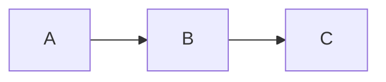

# 마크다운 에디터 확장 문법 가이드

`tools.camp` 마크다운 에디터(`MdEditPage`)는 표준 마크다운(GFM)에 더해 여러 확장 문법을 지원합니다. 이 문서는 **다이어그램 펜스·코드 블록·페이지 분할** 등 에디터 고유의 확장 문법을 정리한 레퍼런스입니다.

> 콜아웃·Figure·SmartMD 표·정렬 블록·변수 플레이스홀더·이미지 속성·프런트매터 등 텍스트 레벨 SmartMD 확장 문법은 `smartmd-syntax-guide.md`를 참고하세요.

> 다이어그램(JobFlow / Navigation / State / Layout)의 상세 작성법은 이 저장소의 개별 가이드 문서를 함께 참고하세요.
> - `job-flow-diagram-guide.md`
> - `navigation-diagram-guide.md`
> - `state-diagram-guide.md`
> - `screen-layout-guide.md`

---

## 목차

1. [코드 블록 & 문법 강조](#1-코드-블록--문법-강조)
2. [Mermaid 다이어그램](#2-mermaid-다이어그램)
3. [State 다이어그램](#3-state-다이어그램)
4. [Navigation 다이어그램](#4-navigation-다이어그램)
5. [JobFlow 다이어그램](#5-jobflow-다이어그램)
6. [Layout 다이어그램](#6-layout-다이어그램)
7. [페이지 분할](#7-페이지-분할)

---

## 1. 코드 블록 & 문법 강조

표준 펜스 코드 블록은 highlight.js로 문법 강조됩니다.

````markdown
```javascript
console.log('Hello, world!');
```
````

**규칙**
- 여는 펜스 뒤에 언어 식별자를 적습니다.
- 사전 등록된 언어: `javascript`, `typescript`, `python`, `bash`, `json`, `css`, `xml`(HTML), `java`, `cpp`.
- 다이어그램 펜스(아래 항목)를 제외한 코드 블록에는 줄 번호와 복사 버튼이 추가됩니다.

---

## 2. Mermaid 다이어그램

표준 Mermaid 문법을 그대로 사용합니다.

````markdown

````

**규칙**
- 내용은 가공 없이 `<div class="mermaid">`에 담겨 Mermaid.js로 클라이언트 렌더링됩니다.
- 아래의 `state` / `navigation` 다이어그램은 자체 미니 문법을 Mermaid로 변환해 렌더링하는 확장입니다.

---

## 3. State 다이어그램

`state` 펜스. 상태 전이 다이어그램을 간결한 미니 문법으로 작성하면 Mermaid(`graph LR`)로 변환됩니다.

````markdown
```state
<s> --> (StateA)
(StateA) --> (StateB) : ConditionA
(StateB) --> (StateC) : ConditionB
(StateC) --> <e> : ConditionC
```
````

**노드 종류**

| 작성        | 의미        | 렌더링 모양        |
|-------------|-------------|--------------------|
| `<s>` / `()`| 시작        | 흰 원 `(( ))`      |
| `<e>` / `.` | 종료        | 검은 원 `(( ))`    |
| `<이름>`    | 이벤트/메시지| 다이아몬드 `{{ }}` (연두) |
| `(이름)`    | 둥근 상태   | 둥근 사각형        |
| `이름`      | 일반 상태   | 사각형             |

**엣지(전이) 문법**
- `From --> To` — 전이
- `From --> To : 라벨` — 라벨 있는 전이 (라벨 구분자는 ` : ` — 양쪽 공백 포함)

> 노드/라벨 내 `"`, `@`, `()`, `[]`, `{}` 문자는 Mermaid 충돌을 피하기 위해 HTML 엔티티로 자동 이스케이프됩니다.

---

## 4. Navigation 다이어그램

`navigation` 펜스. 화면/페이지 이동 흐름을 표현합니다. 역시 Mermaid(`graph LR`)로 변환됩니다.

````markdown
```navigation
Start --> (/action)
(/action) --> Start : error
(/action) --> End : ok
```
````

**노드 종류**

| 작성              | 의미          | 렌더링 모양              |
|-------------------|---------------|--------------------------|
| `` `이름` ``      | 메시지        | `fr-rect`(노란 배경)     |
| `<이름>`          | 이벤트/요소   | 다이아몬드 `{{ }}` (연두)|
| `(이름)`          | 둥근 노드     | 둥근 사각형              |
| `/이름`           | 둥근 노드(대체)| 둥근 사각형             |
| `이름` / `[이름]` | 일반(화면)    | 사각형(파랑 배경)        |

**엣지 문법**
- `From --> To`, `From --> To : 라벨` (라벨 구분자 ` : `)
- 특수 문자 이스케이프 규칙은 State와 동일합니다.

---

## 5. JobFlow 다이어그램

`jobflow` 펜스. 객체 간 메서드 호출 흐름(시퀀스/콜 플로우)을 컬럼 기반 다이어그램으로 그립니다. 자체 SVG 렌더러를 사용합니다.

````markdown
```jobflow
master: Example
Object: ClassA, ClassB, ClassC
ClassC.Start --> ClassA.Show
ClassC.Start --> ClassB.GetList
ClassB.GetList.result --> ClassC.AddList
```
````

**선언부**
- `master: 이름` — 주(主) 객체 선언 (선택)
- `Object: 이름1, 이름2, ...` — 객체(컬럼) 선언. 콤마로 구분하며 여러 줄로 나눠 써도 됩니다. (대소문자 구분 없이 `object:`도 허용)

**호출/액션 문법**
- `객체.액션` — 점 표기로 객체의 메서드/속성을 가리킵니다. (`객체.속성.하위` 처럼 중첩 가능)
- `Source.액션 --> Target.액션` — 호출 흐름
- `Source --> Target : 라벨` — 라벨 있는 화살표
- `객체.액션` 단독 줄 — 독립 노드(standalone shape)

**결과(result) 노드**
- 액션 경로에 `.result` 가 포함되면 내부적으로 `.data`(결과/데이터 노드)로 치환됩니다.
  예: `ClassB.GetList.result --> ClassC.AddList` → `GetList`의 결과를 `ClassC.AddList`로 전달.

**노드 모양(액션 이름으로 자동 결정)**
- `on`으로 시작하는 액션(예: `onSuccess`) → 이벤트 모양(연두)
- 점이 포함된 데이터/결과 경로 → 데이터 모양(노랑)
- 일반 액션 → 사각형(파랑)

> 부모–자식(점 표기 계층) 관계는 점선 세로선으로 자동 연결됩니다. 상세 규칙은 `job-flow-diagram-guide.md`를 참고하세요.

---

## 6. Layout 다이어그램

`layout` 펜스. 화면 레이아웃(컨테이너 트리)을 표현합니다. Flexbox 기반 미리보기로 렌더링됩니다.

````markdown
```layout
Screen V Header, Main, Footer
Header > Logo, Search, UserMenu
Main > Left Sidebar : 20, Content
Left Sidebar V ProjectPicker, SavedFilters, TagFilter
Content V Breadcrumbs, TitleBar, DetailBody, Activity, Pager
TitleBar > IssueTitle, Actions
DetailBody V Summary, Meta, Description
Activity V Tabs, Timeline
Footer > Status, Version
```
````

**문법**
- 한 줄에 컨테이너 하나: `컨테이너명 <연산자> 자식1, 자식2, ...`
- 연산자(양옆 공백 필수):
  - ` V ` — 세로 배치(컬럼/스택)
  - ` > ` — 가로 배치(로우)
- 자식 크기 지정: `자식명 : 숫자` → 부모 대비 백분율(예: `Left Sidebar : 20`).
  - 크기를 지정하지 않은 자식들은 남는 공간을 균등 분할합니다.
- 처음 정의된 컨테이너가 **루트**가 됩니다.
- 자식 이름이 다른 줄에서 다시 컨테이너명으로 등장하면 하위 트리로 연결됩니다.

> 컴포넌트 최소 높이·간격·여백 등 렌더링 세부는 `screen-layout-guide.md`를 참고하세요.

---

## 7. 페이지 분할

에디터의 **"페이지 나누기"** 옵션이 켜져 있으면, 본문을 `---` 구분선 기준으로 여러 페이지로 나눠 미리보기/PDF로 출력합니다.

```markdown
첫 페이지 내용

---

둘째 페이지 내용

---

셋째 페이지 내용
```

**규칙**
- 구분선은 자체 줄에 `---`(하이픈 3개)만 있는 줄입니다.
- 문서 맨 앞의 프런트매터(`---` 블록)는 페이지 구분선으로 취급되지 않습니다.
- 코드 펜스(```` ``` ````, `~~~`) 내부의 `---`는 분할 대상에서 제외됩니다.
- 페이지 미리보기에서는 좌/우 화살표 키로 페이지를 이동할 수 있습니다.
- PDF 출력 시 페이지 나누기 옵션이 페이지 분할(page break)로 반영됩니다.

---

## 부록: 확장 문법 요약표

| 기능            | 마커/펜스            | 핵심 문법 |
|-----------------|----------------------|-----------|
| 코드 강조       | ` ```lang `          | js/ts/py/bash/json/css/xml/java/cpp |
| Mermaid         | ` ```mermaid `       | 표준 Mermaid |
| State           | ` ```state `         | `<s>`/`<e>`/`<event>`/`(round)`, `-->`, ` : 라벨` |
| Navigation      | ` ```navigation `    | `` `msg` ``/`<event>`/`(round)`/`/round`/`[rect]`, `-->` |
| JobFlow         | ` ```jobflow `       | `master:`, `Object:`, `A.m --> B.n`, `.result` |
| Layout          | ` ```layout `        | ` V `(세로)/` > `(가로), `자식:percent` |
| 페이지 분할     | `---` (자체 줄)      | 코드펜스/프런트매터 제외 |

> 콜아웃·Figure·SmartMD 표·정렬 블록·변수·이미지 속성·프런트매터 문법은 `smartmd-syntax-guide.md`의 요약표를 참고하세요.
