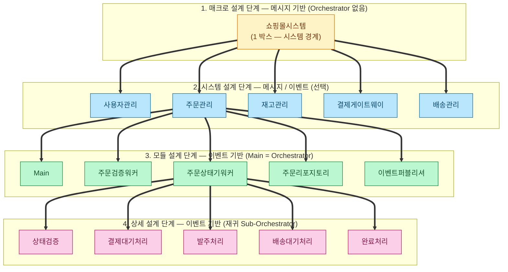
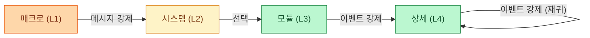

# 계층별 시스템 설계 방법론 Method R



> 위 다이어그램은 한 시스템(쇼핑몰)이 단계마다 한 단계씩 더 깊이 들어가는 **점진적 구체화** 의 모습이다. 강조된 박스는 다음 단계에서 zoom-in 되는 대상이며, 그 박스 하나가 다음 층의 새로운 객체들로 풀린다. 같은 분할 규칙이 단계마다 똑같이 반복된다는 점이 Method-R 의 핵심이다.

Method-R 은 내가 만든 이름이며 위 그림과 같이 시스템을 작은 조각으로 **재귀적으로 분할** 하여 설계하는 방법론이다.
시스템을 작은 조각으로 나누고 서로 연관관계를 최소화하여 시스템을 단순하게 유지한다.
모든 조각은 자신 이외의 조각의 구체적인 동작에 대해서는 몰라야 한다. **언제 도움을 요청할 지만 결정** 한다.

조각들이 협력하는 방식은 단계에 따라 **두 가지** 로 나뉜다.

- **메시지 기반 (Message-based)**: 독립 프로세스(또는 그에 준하는 단위)끼리 메시지 큐 / 이벤트 버스로 비동기 통신. **중앙 오케스트레이터가 존재할 수 없다** — 발신자는 수신자를 모르고, 수신자는 발신자를 모른다.
- **이벤트 기반 (Event-based)**: 같은 프로세스 내 객체 간 이벤트 구독/발행. Worker 가 이벤트를 올리면 **Master(Orchestrator)** 가 구독해서 다음 Worker 를 호출한다. 흐름 조율의 중심에 마스터가 있다.

단계별로 어느 방식을 쓰는지가 정해져 있다.

| 단계 | 핵심 질문 | 통신 방식 | 마스터의 역할 | 분할 단위 | 산출물 |
|---|---|---|---|---|---|
| 1. **매크로 설계 단계** | "우리가 만드는 시스템과 외부 세계의 경계는 어디인가?" | **메시지 기반 (강제)** | 시스템 경계 박스 (오케스트레이터 아님) | 시스템 vs 외부 행위자 | 시스템 박스 + 외부 의존 Job Flow |
| 2. **시스템 설계 단계** | "시스템 내부를 어떤 서비스로 나누고 어떻게 연동할 것인가?" | 메시지 또는 이벤트 (**선택**) | 메시지 모드: 시스템 경계 / 이벤트 모드: 새 오케스트레이터 등장 | 서비스 / 마이크로 서비스 | 서비스 목록 + 모드별 연동 시나리오 |
| 3. **모듈 설계 단계** | "한 서비스 안에서 책임을 어떻게 쪼갤 것인가?" | **이벤트 기반 (강제)** | 서비스의 Main = 오케스트레이터 | Worker / Gateway / Service / Utils | 모듈 구조 + 모듈 간 Job Flow |
| 4. **상세 설계 단계** | "복잡한 Worker 를 더 작은 조각으로 어떻게 나눌 것인가?" | **이벤트 기반 (강제, 재귀)** | Worker 가 Sub-Orchestrator 로 승격 | 서브워커 / 상태기 / 가공기 | 재귀적 Sub-Orchestrator Job Flow → 코드 매핑 가능한 시그니처 |

상위 단계는 하위 단계의 입력이 된다. 각 단계의 마스터(오케스트레이터) 는 다음 단계로 내려갈 때 새로운 객체로 교체된다 — **마스터 역할은 계층마다 한 번씩 다시 정의** 된다.

## 핵심 원칙

- **재귀적 분할**: 같은 분할 규칙(마스터·조각·통신)을 단계마다 똑같이 적용한다. 시스템 → 서비스 → 모듈 → 서브워커가 모두 동일한 패턴으로 그려진다.
- **조각 간 무지(無知)**: 어떤 조각도 형제 조각의 내부 동작을 알지 못한다. 자신이 언제 도움을 요청할지(=메시지를 보낼지, 이벤트를 올릴지) 만 결정한다.
- **단방향 호출 + 이벤트 보고 (이벤트 기반 한정)**: 마스터는 조각을 직접 호출(`Master --> A.Method`)하고, 조각은 결과를 이벤트(`A.OnDone --> Master.Handler`)로 보고한다. 조각 간 직접 호출은 금지.
- **결과 연결은 마스터의 책임 (이벤트 기반 한정)**: `A.Method.result --> B.Method` 같은 화살표는 "마스터가 A 의 결과를 받아 B 에 넘긴다" 는 뜻. A 와 B 는 서로 모른다.
- **메시지 기반에는 마스터의 결과 연결이 없다**: 발신자가 이벤트/메시지를 발행하면 누가 어떻게 받을지는 메시지 인프라(브로커, 토픽, 라우팅 키)의 구독 설정으로 결정된다. jobflow 에는 와이어링 결과만 보인다.
- **오케스트레이터 승격 가능**: 조각 하나가 복잡해지면 그 조각이 다음 계층의 새 마스터가 된다. 계층을 한 단계 더 파고들 뿐, 규칙은 같다.

---

## 1. 매크로 설계 단계 (메시지 기반 — 강제)

* 개발하려는 시스템을 큰 덩어리로 취급한다.
* 단순한 시스템은 하나의 덩어리로 표현한다.
* 시스템이 복잡하면 여러 덩어리로 조각내서 표현한다.
* 우리가 개발하는 시스템과 사용자 · 외부 시스템 등과의 의존 관계를 설계하는 과정이다.
* 이 단계는 **언제나 메시지 기반** 이다. 외부 행위자(사용자·관리자·택배·결제사) 와 시스템 사이는 본질적으로 서로 다른 프로세스 / 다른 조직 / 다른 시스템이므로 코드로 직접 연결될 수 없다.
* **마스터가 오케스트레이터 역할을 하지 않는다** — `master:` 자리에 시스템 박스가 오지만 시스템 경계 표시일 뿐 흐름을 능동적으로 만들지 않는다.

아래는 쇼핑몰 시스템 설계를 극도로 단순화하여 예시를 들고 있는 것이다.
Job Flow 를 통해서 어떻게 설계를 표현하는 지에 유의.

```jobflow
master: 쇼핑몰시스템
Object: 사용자, 쇼핑몰시스템, 관리자, 택배

사용자.On주문요청 --> 쇼핑몰시스템.주문처리
쇼핑몰시스템.주문처리 --> 사용자.message.주문처리 결과
쇼핑몰시스템.On주문처리완료 --> 관리자.message.주문알림
쇼핑몰시스템.On재고부족 --> 관리자.message.재고부족알림

관리자.On일일마감 --> 쇼핑몰시스템.마감처리
쇼핑몰시스템.마감처리 --> 관리자.마감처리.마감처리 결과
관리자.마감처리.마감처리 결과 --> 택배.message.송장목록
```

* "사용자.On주문요청 --> 쇼핑몰시스템.주문처리":
  * 사용자가 주문 요청 이벤트를 발생 시킨다.
  * 쇼핑몰시스템의 주문처리 기능을 수행한다.
* "쇼핑몰시스템.주문처리 --> 사용자.message.주문처리 결과":
  * 주문처리 결과는 사용자에게 전달된다.
  * 사용자에게 결과는 어떠한 형태로든 메시지로 전송됨을 표현하고 있다.
  * 사용자의 요청도 시스템에게는 메시지가 될 수는 있지만, 시스템의 기능이 최종 목표가되기 때문에 메시지를 중복해서 그리지 않았다.
    ```
    master: 쇼핑몰시스템
    Object: 사용자, 쇼핑몰시스템, 관리자, 택배
    // 논리적인 흐름 표현
    사용자.On주문요청 --> 쇼핑몰시스템.message.주문요청
    쇼핑몰시스템.message.주문요청 --> 쇼핑몰시스템.주문처리
    쇼핑몰시스템.주문처리 --> 사용자.message.주문처리 결과
    // 단순화한 표현
    사용자.On주문요청 --> 쇼핑몰시스템.주문처리
    쇼핑몰시스템.주문처리 --> 사용자.message.주문처리 결과
    ```

이 단계의 산출물은 **시스템과 외부 세계의 의존선** 한 장이다. 시스템 내부는 의도적으로 블랙박스로 두며, 외부 행위자가 시스템에 어떤 메시지를 주고 받는지만 정한다. 이 단계가 끝나야 다음 시스템 설계 단계로 들어갈 자격이 생긴다.

---

## 2. 시스템 설계 단계 (메시지 / 이벤트 — 선택)

* 매크로 단계에서 한 덩어리였던 시스템을 **여러 서비스 조각** 으로 분할한다.
* 마이크로 서비스로 구성할 수도 있고, 모놀리식 안의 논리적 서비스 경계로 둘 수도 있다.
* 이 단계는 **연동 방식에 따라 두 모드** 가 있다. 마스터의 성격이 모드에 따라 갈린다.
  * **메시지 기반 (Orchestrator 없음, Choreography)**: 서비스가 독립 프로세스로 동작하면서 메시지 큐 / 이벤트 버스를 통해 비동기로 협력. **중앙 오케스트레이터가 존재하지 않는다**. 마스터는 매크로 단계처럼 시스템 경계 박스일 뿐 흐름을 능동적으로 만들지 않는다.
  * **이벤트 기반 (Orchestrator 있음, Orchestration)**: 서비스가 같은 프로세스에 있거나 RPC/HTTP 로 코드 수준에서 직접 연결되는 경우. **별도의 오케스트레이터 객체** 가 등장해 서비스의 이벤트를 구독하고 다음 서비스를 호출한다.
* 외부 시스템(예: 결제 PG, 배송사 API) 도 이 단계에서 별도 조각으로 등장한다.
* 두 모드는 **한 시스템 안에 공존할 수 있다**. 동기 사용자 요청 흐름은 이벤트 기반으로, 비동기 알림은 메시지 기반으로 처리하는 식.

### 2-1. 이벤트 기반 모드 (Orchestrator 있음)

매크로 단계의 시스템 박스(쇼핑몰시스템) 가 책임지던 일을 새 객체(**주문오케스트레이터**) 가 실제로 수행한다. 이름이 바뀌었음에 주목 — 마스터 역할이 계층마다 다시 정의된다는 원칙의 첫 시각적 증거.

```jobflow
master: 주문오케스트레이터
Object: 사용자, 주문오케스트레이터, 사용자관리, 재고관리, 결제게이트웨이, 주문관리, 배송관리

사용자.On주문요청 --> 주문오케스트레이터.주문처리
주문오케스트레이터.주문처리 --> 사용자관리.본인확인
사용자관리.On본인확인완료 --> 주문오케스트레이터.재고확인
사용자관리.On본인확인실패 --> 사용자.message.인증실패
주문오케스트레이터.재고확인 --> 재고관리.재고차감
재고관리.On재고차감완료 --> 주문오케스트레이터.결제요청
재고관리.On재고부족 --> 사용자.message.재고부족
주문오케스트레이터.결제요청 --> 결제게이트웨이.결제승인
결제게이트웨이.On결제승인완료 --> 주문오케스트레이터.주문확정요청
결제게이트웨이.On결제실패 --> 사용자.message.결제실패
주문오케스트레이터.주문확정요청 --> 주문관리.주문확정
주문관리.On주문확정완료 --> 주문오케스트레이터.배송요청
주문오케스트레이터.배송요청 --> 배송관리.배송접수
배송관리.On배송접수완료 --> 사용자.message.주문처리 결과
```

* "사용자관리.On본인확인완료 --> 주문오케스트레이터.재고확인":
  * 사용자관리는 본인확인이 끝나면 `On본인확인완료` 이벤트를 올릴 뿐, 재고관리가 무엇인지 모른다.
  * 마스터(주문오케스트레이터) 가 그 이벤트를 구독해 자신의 다음 메서드(`재고확인`) 로 이어 받고, 거기서 재고관리를 호출한다.
* "결제게이트웨이.On결제승인완료 --> 주문오케스트레이터.주문확정요청" / "결제게이트웨이.On결제실패 --> 사용자.message.결제실패":
  * 결제게이트웨이는 외부 PG 와 통신하는 책임만 가지며 결과를 두 이벤트 (`On결제승인완료` / `On결제실패`) 중 하나로 발행한다.
  * 어느 이벤트에 어떤 후속 동작을 붙일지는 마스터가 결정한다 — 성공은 마스터의 다음 메서드, 실패는 사용자 메시지.
* 모든 분기와 결과 연결을 **마스터가 중앙에서 통제** 하는 것이 이 모드의 특징. 워커는 이벤트만 올리고, 다음 워커를 직접 부르지 않는다.

### 2-2. 메시지 기반 모드 (Orchestrator 없음, Choreography)

서비스가 독립 프로세스로 동작하며 메시지 큐 / 이벤트 버스로 연동되는 경우다. **중앙 오케스트레이터가 존재하지 않고**, 각 서비스는 자신이 끝낸 일을 이벤트로 발행할 뿐 다음 흐름을 결정하지 않는다. 마스터(쇼핑몰시스템) 는 시스템 경계 표시일 뿐 — 매크로 단계와 동일한 패턴.

```jobflow
master: 쇼핑몰시스템   # 시스템 경계 (오케스트레이터 아님)
Object: 사용자, 사용자관리, 재고관리, 결제게이트웨이, 주문관리, 배송관리, 관리자

사용자.On주문요청 --> 사용자관리.message.OrderRequested
사용자관리.message.UserVerified --> 재고관리.message.UserVerified
재고관리.message.StockReserved --> 결제게이트웨이.message.StockReserved
결제게이트웨이.message.PaymentApproved --> 주문관리.message.PaymentApproved
주문관리.message.OrderConfirmed --> 배송관리.message.OrderConfirmed
배송관리.message.OrderDelivered --> 사용자.message.주문완료

사용자관리.message.UserVerificationFailed --> 사용자.message.인증실패
재고관리.message.StockShortage --> 사용자.message.재고부족
재고관리.message.StockShortage --> 관리자.message.재고부족알림
결제게이트웨이.message.PaymentFailed --> 사용자.message.결제실패
```

* "사용자관리.message.UserVerified --> 재고관리.message.UserVerified":
  * 사용자관리는 본인확인이 끝나면 `UserVerified` 메시지를 토픽에 발행할 뿐, **누가 듣는지 모른다**.
  * 재고관리는 같은 토픽을 구독하므로 메시지가 도착하면 자기 일을 시작한다. 송신자가 누구인지 알 필요 없다.
  * 이 매핑은 jobflow 에 한 줄로 보이지만 실제로는 메시지 버스의 구독 설정(예: Kafka 토픽, RabbitMQ 라우팅 키) 에 있다.
  * 이벤트 기반에서 쓰던 `On...` 표기는 **메서드 호출의 보고용 이벤트** 라는 의미이므로 메시지 기반에는 어울리지 않는다. 여기서는 발행과 구독 모두 `message.` 로 통일한다.
* "재고관리.message.StockShortage":
  * 한 메시지가 두 줄로 분기 (`사용자.message.재고부족`, `관리자.message.재고부족알림`) — 메시지 fan-out. 발행자는 구독자 수와 무관하게 같은 메시지만 발행한다.
* **결과 연결을 만드는 마스터가 없다**:
  * 이벤트 기반 모드에는 `결제승인.success --> 주문확정` 같이 결과의 분기를 마스터가 결정한다. 메시지 기반에는 그 결정이 없다 — 결제게이트웨이는 항상 `On결제승인완료` 와 `On결제실패` 둘 중 하나를 발행하고, 다음에 무엇이 일어날지는 구독자들의 자율이다.
* **트랜잭션 / 보상 정책의 차이**:
  * 이벤트 기반은 마스터가 실패를 즉시 인지해 롤백을 지시할 수 있다.
  * 메시지 기반은 **Saga 패턴** 같은 보상 이벤트를 각 서비스가 별도로 발행/구독해 풀어야 한다. 예: `결제실패 → 재고복구 메시지 발행 → 재고관리가 복구`.

### 2-3. 모드 선택 기준

| 관점 | 이벤트 기반 (Orchestrator) | 메시지 기반 (Choreography) |
|---|---|---|
| **결합도** | 마스터가 모든 서비스를 안다 — 중앙에 모인다 | 서비스끼리 서로 모른다 — 가장 느슨 |
| **트랜잭션** | 마스터가 흐름을 잡고 보상 호출 가능 | Saga / 이벤트 기반 보상 필요 |
| **응답성** | 동기 흐름이라 사용자에게 즉시 결과 가능 | 비동기라 최종 일관성 (eventual consistency) |
| **운영 복잡도** | 마스터의 SPOF / 병목 위험 | 메시지 인프라(브로커, 큐) 운영 비용 |
| **장애 격리** | 한 서비스 장애가 마스터를 통해 즉시 전파 | 메시지 큐가 흡수해 격리 가능 |
| **흐름 가시성** | jobflow 한 장에 명시적 — 디버깅 쉬움 | 토폴로지가 구독 설정에 분산 — 추적/관측 인프라 필요 |
| **권장 사용처** | 응답성·일관성이 중요한 사용자 요청 흐름 | 알림·이벤트 배포·시스템 간 비동기 통신 |

이 단계의 산출물은 **서비스 목록 + 모드별 연동 시나리오** 다. 각 서비스가 어떤 책임을 갖고, 어떤 모드로 다른 서비스와 통신하는지가 정해진다. 다음 단계는 이 서비스 하나하나(=이벤트 기반으로 묶인 서비스) 를 다시 zoom-in 한다.

---

## 3. 모듈 설계 단계 (이벤트 기반 — 강제)
> "인터페이스 설계" 라는 표현은 Java/Go 의 `interface` 키워드, 혹은 SDK 의 공개 API 와 혼동되기 쉬워 **모듈 설계 단계** 로 자연스러운 이름으로 수정. 다른 후보로는 "구성 요소 설계 단계", "조립 설계 단계" 가 있다.

* 시스템 설계 단계에서 정의한 한 서비스를 **여러 모듈 조각** 으로 나누고, 모듈끼리의 의존성을 설계한다.
* 같은 프로세스 안의 객체끼리 협력하므로 **언제나 이벤트 기반** 이다. 메시지 인프라(브로커) 없이 코드 안에서 이벤트 구독/발행으로 결합된다.
* 코드로 직접 연동되는 수준의 설계지만, **알고리즘이 아니라 모듈끼리의 소통 규약** 을 정하는 단계다. 구체적인 알고리즘은 다음 상세 단계에서.
* Orchestrator-Worker 패턴이 본격 적용된다. 한 서비스의 `Main` 이 그 서비스의 오케스트레이터가 된다.
* 모듈 종류는 보통 다음과 같이 분류된다.
  * **Main (Orchestrator)**: 서비스의 시나리오 흐름 제어. Worker 들의 이벤트를 구독하고 다음 Worker 를 호출한다.
  * **core (Worker)**: 자신의 임무만 수행. 형제·상위를 모름. 결과를 이벤트로 발행할 뿐.
  * **gateways**: 외부 시스템(DB, 메시지큐, 외부 API) 과의 통신 캡슐화.
  * **service**: 전역 공유 자원 (싱글톤 — AuthService, LogService 등).
  * **utils**: 무상태 함수 모음.

시스템 단계의 "주문관리" 서비스를 한 계단 zoom-in 하면 다음과 같다.

```jobflow
master: 주문관리Main
Object: 주문오케스트레이터, 주문관리Main, 주문검증워커, 주문상태기워커, 주문리포지토리, 이벤트퍼블리셔, AuthService

주문오케스트레이터.message.주문확정 --> 주문관리Main.On주문확정요청
주문관리Main.On주문확정요청 --> AuthService.토큰검증
AuthService.토큰검증.result --> 주문관리Main.On주문확정요청
주문관리Main.On주문확정요청 --> 주문검증워커.검증
주문검증워커.검증.result --> 주문상태기워커.전이
주문상태기워커.전이.result --> 주문리포지토리.저장
주문리포지토리.저장.result --> 이벤트퍼블리셔.주문확정이벤트발행
이벤트퍼블리셔.주문확정이벤트발행.result --> 주문관리Main.On주문확정요청.result
주문관리Main.On주문확정요청.result --> 주문오케스트레이터.message.주문확정완료

주문검증워커.검증.false --> 주문관리Main.On주문확정요청.result
주문리포지토리.On예외 --> 주문관리Main.저장실패처리
주문관리Main.저장실패처리 --> 이벤트퍼블리셔.보상이벤트발행
```

* "주문오케스트레이터.message.주문확정 --> 주문관리Main.On주문확정요청":
  * 시스템 단계에서 정의한 (상위 오케스트레이터의) 메시지가 이 서비스의 진입점이 된다.
  * 두 단계의 흐름이 자연스럽게 이어진다 — 서비스 경계까지는 메시지, 서비스 내부는 이벤트.
* "주문검증워커.검증.result --> 주문상태기워커.전이":
  * 두 워커가 직접 통신하지 않음을 다시 강조. 마스터(주문관리Main) 가 `result` 를 받아 다음 워커에게 넘긴다.
  * 코드 상으로는 `Main` 의 한 메서드 안에서 `const r = await validator.verify(); await stateMachine.transit(r);` 형태가 된다.
* "AuthService.토큰검증.result --> 주문관리Main.On주문확정요청":
  * 반환값을 호출자 컨텍스트로 되돌리는 패턴 — 같은 메서드의 흐름이 이어진다.
  * AuthService 는 싱글톤이라 상태가 공유되지만, 호출 흐름 자체는 일반 워커와 동일하게 마스터를 통한다.
* "주문리포지토리.On예외 --> 주문관리Main.저장실패처리":
  * Gateway 의 예외도 마스터의 별도 메서드로 위임된다. 워커가 직접 보상 트랜잭션을 만들지 않는다.

이 단계의 산출물은 **서비스 내부 모듈 구조 + 모듈 간 이벤트 구독·호출 규약** 이다. 각 모듈의 메서드 시그니처와 이벤트가 거의 코드 수준으로 정의된다. 워커 중 어느 하나가 더 이상 단일 책임으로 그릴 수 없을 정도로 복잡하면 다음 상세 단계로 내려간다.

---

## 4. 상세 설계 단계 (이벤트 기반 — 강제, 재귀)
> "구현 레벨 설계" 는 "코딩을 시작한다" 는 인상을 주지만, 이 단계도 여전히 **설계** 다 — 다만 재귀 분할의 가장 깊은 층에서 코드 시그니처에 1:1 로 매핑되는 작은 단위를 다룬다. **상세 설계 단계** 가 자연스럽다. 다른 후보로는 "세부 설계 단계", "재귀 상세 단계" 가 있다.

* 모듈 설계 단계의 조각(워커·게이트웨이) 중 내부가 복잡한 것은 다시 한 단계 zoom-in 한다.
* **복잡한 워커가 새 Sub-Orchestrator 로 승격** 된다 — 그 워커가 다음 계층의 마스터가 되고, 내부에 더 작은 워커들을 갖는다.
* 모듈 단계와 마찬가지로 **이벤트 기반** 이다. Sub-Orchestrator 가 자신의 서브워커들을 호출하고, 서브워커가 이벤트로 결과를 보고한다.
* 이 분할을 계속 재귀적으로 이어갈 수 있다. **언제 멈출지** 는 다음 기준 중 하나가 충족될 때다.
  * 한 워커가 하는 일이 더 이상 의미 있게 쪼개지지 않는다 (단일 책임 원칙 충족).
  * 메서드 시그니처가 코드와 1:1 매핑된다 (Job Flow 노드 = 함수 하나).
  * 분할로 인한 가독성 증가보다 객체 수 증가의 인지 비용이 더 크다.
* 이 단계의 jobflow 는 종종 상태 다이어그램(`state-diagram`) 이나 시퀀스 다이어그램으로 보조될 수 있다.

모듈 단계의 "주문상태기워커" 가 내부가 복잡해져 Sub-Orchestrator 로 승격된 모습이다.

```jobflow
master: 주문상태기워커
Object: 주문상태기워커, 상태검증, 결제대기처리, 발주처리, 배송대기처리, 완료처리, 상태저장소

주문상태기워커.전이 --> 상태검증.가능여부확인
상태검증.가능여부확인.false --> 주문상태기워커.전이.result
상태검증.가능여부확인.true --> 주문상태기워커.전이수행

주문상태기워커.전이수행.결제대기 --> 결제대기처리.진입
주문상태기워커.전이수행.발주 --> 발주처리.진입
주문상태기워커.전이수행.배송대기 --> 배송대기처리.진입
주문상태기워커.전이수행.완료 --> 완료처리.진입

결제대기처리.진입.result --> 상태저장소.기록
발주처리.진입.result --> 상태저장소.기록
배송대기처리.진입.result --> 상태저장소.기록
완료처리.진입.result --> 상태저장소.기록

상태저장소.기록.result --> 주문상태기워커.전이.result
```

* "주문상태기워커.전이 --> 상태검증.가능여부확인":
  * 모듈 단계에서는 "전이" 가 단일 워커의 메서드 하나였다. 상세 단계에서는 그 한 메서드의 내부가 다시 여러 조각의 협력으로 풀린다.
* "상태검증.가능여부확인.true --> 주문상태기워커.전이수행":
  * **같은 객체의 다른 메서드로 위임** 하는 패턴. 마스터(=주문상태기워커) 가 검증 결과를 받아 자신의 별도 메서드(`전이수행`) 로 넘긴다.
  * `전이` 는 "외부에서 보는 진입 메서드" 고, `전이수행` 은 "내부에서만 부르는 분기 메서드" 라는 책임 분리.
* "주문상태기워커.전이수행.결제대기 --> 결제대기처리.진입":
  * 반환값에 따른 분기 표기 (`.결제대기` 는 enum-like 값). 각 상태별 진입 처리기는 자기 일만 한다.
* "상태저장소.기록.result --> 주문상태기워커.전이.result":
  * 마지막 산출물이 마스터 메서드의 반환값으로 그대로 흘러나간다 — 호출자(모듈 단계의 `주문관리Main`) 가 받아서 다음 흐름으로 이어간다.

이 단계의 산출물은 **코드 작성 직전의 가장 작은 단위 설계** 다. Job Flow 노드 하나가 함수 한 줄에 거의 1:1 로 대응될 만큼 작아진다. 더 이상 쪼갤 가치가 없는 지점이 오면 그 노드를 실제 코드로 옮기는 것이 자연스러운 다음 행동이다.

---

## 마무리 — 어디서 멈출 것인가

Method-R 은 재귀적으로 분할하는 도구이지만, 분할 자체가 목적은 아니다. 다음 휴리스틱으로 **각 단계에서 멈출 시점** 을 판단한다.

* **매크로 설계 단계에서 멈춤**: 시스템이 정말로 단순해 내부 분할이 가치가 없을 때 (예: 단일 CLI 도구). 한 박스만 그리고 외부 의존만 정의해도 충분하다.
* **시스템 설계 단계에서 멈춤**: 각 서비스가 충분히 작아 모듈 구조를 따로 그리지 않아도 1-2 명이 한 눈에 이해 가능할 때. 마이크로 서비스 경계 정의로 끝.
* **모듈 설계 단계에서 멈춤**: 각 워커의 책임이 한 줄로 표현 가능하고, 구현이 일직선으로 풀릴 때. 상태 기계 같은 복잡 워커가 없을 때.
* **상세 설계 단계에서 멈춤**: Job Flow 노드 하나가 함수 한 줄로 코드화 가능할 때. 더 이상 그리면 코드 사본이 된다.

**같은 시스템이라도 부분마다 멈추는 깊이가 다를 수 있다.** 결제처럼 복잡한 도메인은 상세 설계 단계까지 깊이 들어가고, 단순 로그 출력 워커는 모듈 단계에서 멈춰도 된다. 모든 조각을 같은 깊이로 강제로 끌고 가지 않는 것이 이 방법론을 가볍게 유지하는 비결이다.

또한 **한 번에 모든 단계를 끝낼 필요는 없다**. 매크로 → 시스템 단계까지 그린 뒤 가장 위험한 서비스 하나를 골라 모듈 → 상세까지 먼저 파고, 나머지는 구현이 시작된 뒤 필요할 때 깊이 들어가는 것이 일반적인 운영 패턴이다.

마지막으로 통신 방식과 분할 단계의 관계를 정리하면 다음과 같다.



- 외부 경계(L1)는 메시지로 강제되고, 내부(L3/L4)는 이벤트로 강제된다.
- 그 중간(L2)이 유일하게 선택 지점 — 서비스를 독립 프로세스로 가져갈지(메시지) 아니면 코드로 묶을지(이벤트) 가 시스템 설계의 핵심 결정이다.
