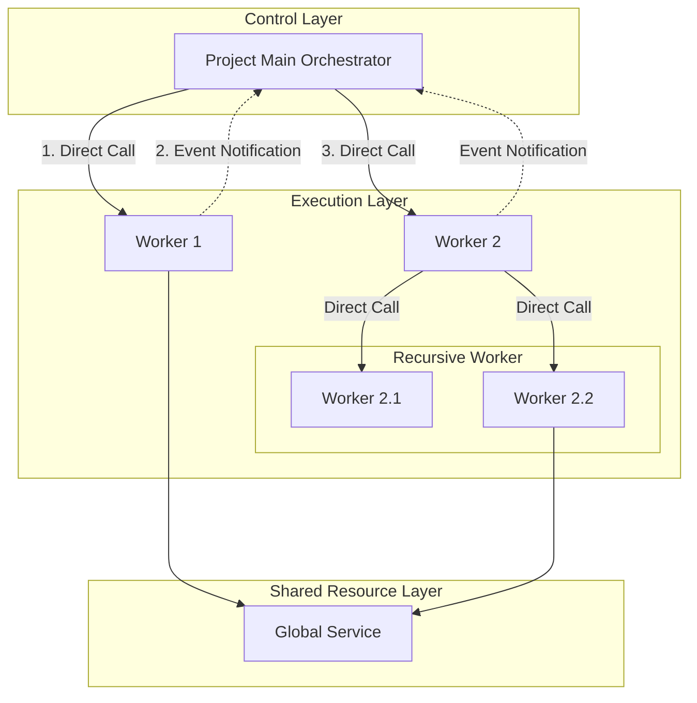

# Orchestrator-Worker 패턴 설계 가이드

시스템의 복잡도를 제어하기 위해 기능을 독립적인 단위로 분리하고, 각 객체의 **명확한 역할 분담**과 **제어권 흐름(호출 및 이벤트 규약)**을 확립하는 것을 목적으로 합니다.

## 시스템 아키텍처 구조

시스템은 제어 계층, 실행 계층, 공용 자원 계층으로 명확히 구분됩니다.



## 핵심 원칙 요약

| 원칙 | 설명 |
|------|------|
| 단방향 제어 | Orchestrator → Worker 방향으로만 직접 호출 |
| 이벤트 기반 보고 | Worker는 이벤트로만 상위에 알림 |
| 수평적 고립 | Worker 간 직접 통신 금지 |
| 재귀적 구조 | 복잡한 Worker는 Sub-Orchestrator로 확장 |
| 상태 공유 | 공유 상태는 Service로 분리 |

## 구성 요소 및 역할

### Orchestrator (Main)

| 항목 | 설명 |
|------|------|
| 역할 | 전체 시스템의 시나리오 흐름을 제어하고 중재 |
| 책임 | 워커 객체 소유, 워커 이벤트 수신 후 다음 동작 결정 |
| 제약 | 직접적인 비즈니스 로직 연산 지양 |

### Worker

| 항목 | 설명 |
|------|------|
| 역할 | 할당된 특정 기능을 수행하는 독립적인 실행 단위 |
| 책임 | 오직 자신의 임무 수행에만 집중 |
| 제약 | 상위 객체나 형제 객체(다른 워커)의 존재를 알지 못함 |
| 확장 | 내부 로직이 복잡해지면 Sub-Orchestrator로 재귀적 확장 |

### Service

| 항목 | 설명 |
|------|------|
| 역할 | 시스템 전역에서 공유되어야 하는 기능이나 상태 제공 |
| 책임 | 애플리케이션 내에서 단일 인스턴스(Single Instance)로 관리 |
| 특징 | 상태(State)를 지속적으로 보유하고 관리 |
| Utility와 차이 | Utility는 무상태(Stateless), Service는 상태 보유 |

## 호출 및 통신 규약

객체 간의 결합도를 낮추고 유지보수성을 높이기 위한 통신 규칙입니다.

### 하향식 호출 (Direct Command)

```
Orchestrator → Worker
```

상위 객체는 하위 워커의 메서드를 직접 호출하여 작업을 지시합니다.

### 상향식 보고 (Event Notification)

```
Worker → Orchestrator (이벤트 발행)
```

워커는 상위 객체를 참조(Reference)하지 않습니다. 작업 완료, 오류 발생, 상태 변경 시 오직 **이벤트(Event)**를 발행하여 외부에 알립니다.

### 수평적 고립 (Isolation)

```
Worker ↔ Worker (금지)
```

워커끼리는 서로 직접 호출할 수 없습니다. 반드시 오케스트레이터를 거쳐야 합니다.

```
Worker A 이벤트 발행 → Orchestrator 수신 → Worker B 호출
```

## 구조적 확장 및 변경 기준

### 워커의 재귀적 분할 (Recursive Division)

하나의 워커가 단일 책임 원칙(SRP)을 위반할 정도로 비대해지거나 논리적 단계가 복잡해지면:
- 내부 로직을 여러 하위 워커로 분할
- 해당 워커는 중간 관리자(Sub-Orchestrator) 역할 수행

### 워커 간 의존성 해소 (Dependency Resolution)

특정 워커가 다른 워커의 기능이나 데이터에 의존해야 하는 상황 발생 시:

| 상황 | 해결 방법 |
|------|----------|
| 데이터/공통 기능 공유 필요 | Service로 분리하여 오케스트레이터가 주입 |
| 기능적으로 너무 긴밀하게 연결 | 하나의 워커로 병합 |
| 흐름 제어(Flow Control) 필요 | 제어 로직을 오케스트레이터로 이관 |

## 구현 예제

### Worker (실행 담당)

```csharp
// FileParserWorker.cs
public class FileParserWorker
{
    public event Action<bool> OnParseCompleted;

    public void StartParsing()
    {
        bool success = true;
        OnParseCompleted?.Invoke(success);
    }
}
```

### Service (공유 자원)

```csharp
// LogService.cs
public class LogService
{
    public void WriteLog(string message)
    {
        // 전역 로깅 처리
    }
}
```

### Orchestrator (흐름 제어)

```csharp
// MainOrchestrator.cs
public class MainOrchestrator
{
    private readonly FileParserWorker _parser;
    private readonly DbUploaderWorker _uploader;
    private readonly LogService _logger;

    public MainOrchestrator()
    {
        _parser = new FileParserWorker();
        _uploader = new DbUploaderWorker();
        _logger = new LogService();

        _parser.OnParseCompleted += HandleParseResult;
    }

    public void Run()
    {
        _logger.WriteLog("프로세스 시작");
        _parser.StartParsing();
    }

    private void HandleParseResult(bool success)
    {
        if (success)
            _uploader.Upload();
        else
            _logger.WriteLog("파싱 실패");
    }
}
```