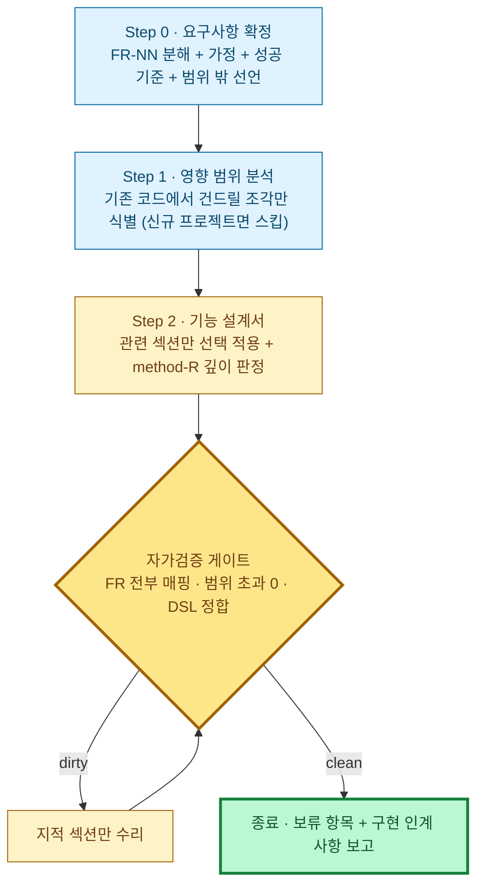

# 특정 요구사항 설계 요청 프롬프트

> **특정 요구사항(신규 기능 추가 · 기존 기능 변경) 하나를 입력받아, 그 요구사항의 영향 범위로 한정된 기능 설계 문서를 생성하는** 작업 지시문이다. 이 프롬프트에 **설계할 요구사항을 직접 입력**하고, 기존 프로젝트가 있으면 **대상 코드·문서를 첨부**해 실행한다.
> 시스템 **전체**를 분석·재설계할 때는 [AS-IS 프롬프트](./system-design-as-is-prompt.md) → [TO-BE 프롬프트](./system-design-to-be-prompt.md) 파이프라인을 쓰고, 사이트/화면 **전체**를 설계할 때는 [사이트 설계 프롬프트](./site-design-prompt.md)를 쓴다. 이 프롬프트는 **요구사항 하나가 건드리는 부분만** 깊게 설계한다 — 요구사항과 무관한 영역은 분석·재설계하지 않는다.
> 원칙: **두괄식 · 다이어그램 1차 표현 · 간결·쉬운 설명 · project-guides 충실 준수**. 모든 설명은 **최대한 간결하고 쉬운 문장**으로 쓴다(짧은 문장·불필요한 수식어 제거·전문용어는 처음 1회 풀어쓰기). 종료는 정성 표현이 아니라 §설계-검증의 기계검증으로만 판정한다.
> 설계 의미와 다이어그램 표기는 아래 가이드를 인용해 따른다(여기서 재서술하지 않음).

## 설계 의미·표기는 가이드를 따른다 (링크)

| 가이드 | 이 프롬프트에서의 역할 |
|---|---|
| [method-R.md](../guides/method-R.md) | **최상위 설계 철학** — 4계층 재귀분할(매크로→시스템→모듈→상세)·통신모드(L1 메시지·L2 선택·L3/L4 이벤트)·**method-R 6원칙**·멈춤 휴리스틱·불균등 깊이 |
| [system-design-framework.md](../guides/system-design-framework.md) | 산출물 양식 — **8섹션 골격**(§1 Input Datas … §8 Screen Layout). 이 프롬프트는 요구사항과 관련된 섹션만 **선택 적용**한다 |
| [orchestrator-worker-pattern-guide.md](../guides/orchestrator-worker-pattern-guide.md) | **6모듈**(Main·core·gateways·service·utils·config) 분류 + **O-W 6원칙** |
| [architecture-pattern-diagram-guide.md](../guides/architecture-pattern-diagram-guide.md) | 섹션 성격별 **다이어그램 종류 선택** |
| [system-flow-document-guide.md](../guides/system-flow-document-guide.md) | **최소조각→전체** 서술·책임 소유 표 |
| [job-flow-diagram-guide.md](../guides/job-flow-diagram-guide.md) · [navigation](../guides/navigation-diagram-guide.md) · [state](../guides/state-diagram-guide.md) · [screen-layout](../guides/screen-layout-guide.md) | `jobflow`·`navigation`·`state`·`layout` DSL 의미·문법 |

> **6원칙 혼동 금지**: **method-R 6원칙**(method-R.md 핵심원칙)과 **O-W 6원칙**(orchestrator-worker §2 표)은 서로 다른 세트다. 위반 지적 시 어느 세트·어느 원칙인지 출처를 붙인다.

## 다이어그램 표기 (가이드 DSL 직접 사용)

다이어그램은 **확장 DSL 펜스**(` ```jobflow `·` ```navigation `·` ```state `·` ```layout `)와 ` ```mermaid ` 블록으로 삽입한다 — **어떤 다이어그램도 다른 포맷으로 변환·치환하지 않는다**(예: `jobflow` 를 `sequenceDiagram`·`flowchart` 로 바꾸지 않는다). 섹션 성격별 표기는 [architecture-pattern-diagram-guide](../guides/architecture-pattern-diagram-guide.md) 선택 규칙을 따른다.

| 설계 내용 성격 | 표기 |
|---|---|
| 영향 범위·모듈 경계 조감 | mermaid `flowchart` |
| 클래스·정적 구성 (필요 시) | mermaid `classDiagram` |
| **객체 간 호출·이벤트·반환값 흐름** | **`jobflow`** ([job-flow-diagram-guide](../guides/job-flow-diagram-guide.md)) |
| 화면·API·프로세스 흐름 | `navigation` |
| 상태·라이프사이클 | `state` |
| 화면 레이아웃 | `layout` |
| 데이터 모델 | mermaid `erDiagram`(요구사항이 건드리는 부분만, 전체 ERD 금지) |
| 시간 순서 외부 시스템 대화 | mermaid `sequenceDiagram` |

- **로직 흐름은 `jobflow` DSL 로 그린다 — sequenceDiagram 으로 대체하지 않는다.** jobflow 헤더는 조율자가 있으면 `orchestrator: X`, 외부 경계·Choreography 면 `scope: X` (method-R).
- **텍스트(ASCII) 박스·트리 다이어그램 전역 금지** ([prd-writing-guide](../guides/prd-writing-guide.md) 정책과 동일).
- **다이어그램 하단 흐름 설명(필수)**: 모든 다이어그램 바로 아래에 **짧은 문장 불릿**으로 핵심 흐름을 나열한다(한 불릿=한 단계·한 문장, 3~6개). 노드/엣지를 그대로 옮기지 말고 "무엇이 무엇을 왜 하는지"를 쉬운 말로.
- **두괄식 템플릿**: `## 0. 한눈에 보기 — {요구사항 한 줄}` → 영향 범위 조감 다이어그램 1개 → **범례**(🟢 신규 · 🟡 변경 · ⚪ 무변경-경계만 표시) → **요지** 불릿 3~5(요구사항 한 줄 / 어떻게 푸는지 / 대표 흐름 / 리스크).

---

## 0. 한눈에 보기 — 4단계 + 자가검증 게이트



**요지**
- 입력받은 요구사항을 검증 가능한 항목(`FR-NN`)으로 분해하고, **모든 FR 이 설계 요소에 1:1 매핑**될 때까지 진행한다.
- 설계 범위는 요구사항의 영향 범위로 한정한다 — 무관한 영역의 분석·개선 제안은 금지(발견한 문제는 보고만).
- 양식은 8섹션([framework](../guides/system-design-framework.md)) 중 **관련 섹션 선택 적용**, 깊이는 method-R 멈춤 휴리스틱, 로직 흐름은 `jobflow` DSL.
- 산출물: `docs/design/{DATE}/feature/{slug}/feature-design.md` 단일 문서.

---

## Step 0. 요구사항 확정

설계를 시작하기 전에 입력받은 요구사항을 확정한다. 요구사항이 모호하면 임의로 진행하지 말고 무엇이 불명확한지 선택지와 함께 제시한다.

1. **날짜·경로 확정**: `DATE`(`YYYY.MM.DD`) 1회 고정 — 입력받은 날짜 > session currentDate > `bash date +%Y.%m.%d`. `slug` 는 요구사항을 나타내는 소문자 kebab-case 3~5단어(한글 금지).
2. **요구사항 분해**: 입력받은 요구사항을 검증 가능한 항목 `FR-01`, `FR-02`, … 로 분해한 표를 만든다(항목 · 한 줄 설명 · Must/Should/Optional). 이후 모든 설계 요소는 FR 번호로 추적한다.
3. **명시적 가정**: 요구사항이 말하지 않은 부분을 채운 가정을 표로 고정(가정 · 근거 · 틀렸을 때 영향). 가정 없이 조용히 해석하지 않는다.
4. **성공 기준**: "이 설계대로 구현되면 무엇이 검증 가능하게 달라지는가"를 FR 별 1줄로.
5. **범위 밖 선언(Out of Scope)**: 이번 설계에서 **다루지 않는 것**을 명시한다. 이후 단계에서 범위 밖 항목을 설계하면 P0 위반이다.

## Step 1. 영향 범위 분석 (기존 프로젝트가 있을 때만)

첨부된 코드·문서에서 **요구사항이 건드리는 조각만** 식별한다. 신규 프로젝트면 이 단계를 건너뛰고 Step 2 에서 신규 구조를 설계한다.

- **영향 조각 표**: 조각(모듈/클래스/화면/API) · 실제 경로 · 변경 종류(🟢 신규 · 🟡 변경 · ⚪ 인터페이스만 접촉) · 관련 FR. 실경로만 인용하고 환각 인용을 금지한다.
- **현재 동작 요약**: 영향 조각의 현재 흐름을 3~6불릿으로. 전체 시스템 분석은 하지 않는다 — 전체 분석이 필요할 정도로 영향이 넓으면 **[AS-IS](./system-design-as-is-prompt.md)→[TO-BE](./system-design-to-be-prompt.md) 파이프라인으로 전환을 권고**하고 멈춘다.
- **6모듈 위치 판정**: 영향 조각과 신규 조각이 [O-W 6모듈](../guides/orchestrator-worker-pattern-guide.md)(Main·core·gateways·service·utils·config) 중 어디에 속하는지/속해야 하는지 표기.
- **발견한 무관 문제**: 분석 중 발견한 요구사항 무관 문제는 수정·재설계하지 말고 말미 "보고 사항"에 목록으로만 남긴다.

## Step 2. 기능 설계서 — `docs/design/{DATE}/feature/{slug}/feature-design.md`

요구사항을 method-R 깊이·순서로 설계하고 단일 문서로 작성한다.

- **두괄식 §0**: 위 두괄식 템플릿(조감 다이어그램 + 범례 + 요지). 조감은 영향 범위만 — 무변경 영역은 경계 노드(⚪)로만 표시.
- **섹션 선택 적용**: [framework](../guides/system-design-framework.md) 8섹션 중 요구사항과 관련된 섹션만 채운다. 각 섹션 채택 여부를 문서 서두에 표(섹션 · 적용/제외 · 제외 사유 1줄)로 고정한다. **형식을 맞추려 빈 섹션을 날조하지 않는다** — UI 없는 요구사항에 §6 Navigation·§8 Layout 을 억지로 만들지 않는다.
- **method-R 깊이 판정**: 요구사항이 4계층(매크로/시스템/모듈/상세) 중 어디에 걸치는지 판정하고, 걸치는 계층만 하향 설계한다. 멈춤 휴리스틱 적용(단순 워커 과분해 금지·고위험만 더 깊이). 통신모드는 계층 규칙(L1 메시지 강제 · L2 선택+근거 1줄 · L3/L4 이벤트 강제)을 따른다.
- **로직 흐름**: FR 을 실현하는 대표 흐름을 `jobflow` DSL 로(헤더 `orchestrator:`/`scope:` 명시, round-trip 금지). 상태 변화가 있는 객체는 `state`, 화면·API 가 있으면 `navigation` + 페이지별 `layout`.
- **데이터·계약**: 신규/변경 데이터는 mermaid `erDiagram`(건드리는 부분만). 모듈 경계를 넘는 호출·이벤트는 계약 표(이름 · 방향 · payload · 실패 처리)로.
- **추적성(필수)**: 말미에 **FR ↔ 설계 요소 매핑 표**(FR-NN · 반영 위치 §앵커 · 상태[반영/부분/보류]). 보류는 사유 1줄 필수. Step 1 을 수행했다면 영향 조각 표와도 ID/경로 일치.
- **구현 인계 사항**: 구현 단계가 따라야 할 지침 3~7불릿([code-structure-guidelines](../guides/code-structure-guidelines.md)·[project-structure-guide](../guides/project-structure-guide.md) 준수 전제) + 예상 리스크.

## 설계-검증. 작성 후 자가검증 (종료 게이트 — 위반 0까지 지적 섹션만 수리→재검증)

**P0 (반드시 수정)**
- FR 매핑 누락 — 매핑 표에 없는 FR 이 있거나, 어떤 FR 에도 대응하지 않는 설계 요소가 있음
- **범위 초과** — Out of Scope 선언 항목 또는 요구사항 무관 영역을 설계·개선함
- 섹션 날조 — 제외해야 할 섹션을 형식 맞추려 채움 / 채택 표와 본문 불일치
- 근거 없는 인용 — Step 1 영향 조각 표에 없는 경로·코드를 설계 근거로 인용(환각 인용)
- **로직 흐름을 `jobflow` 아닌 sequenceDiagram 으로 그림** / ASCII 다이어그램 사용

**P1 (권장)**
- §0 두괄식 조감 누락 / 다이어그램 하단 흐름 설명 누락
- method-R·O-W 6원칙 위반(어느 세트·어느 원칙인지 명시) / L2 통신모드 선택 근거 누락
- DSL self-check 위반(jobflow round-trip / navigation 분기 라벨 괄호 / state 시작·종료 누락)
- 경계 계약 표 누락(모듈 경계를 넘는 호출·이벤트가 있는데 payload·실패 처리 미기재)
- 가정·성공 기준·Out of Scope 중 일부 누락

**종료**: 위반 0 → 종료하고 **① 보류 FR 과 사유 ② Step 1 에서 발견한 무관 문제 목록 ③ 구현 인계 사항** 을 보고한다. 이 설계서는 [PRD](../guides/prd-writing-guide.md) 의 해당 Part 입력, 또는 [멀티 에이전트 협업 프롬프트](./multi-agent-task-prompt.md)·[통합 테스트 프롬프트](./comprehensive-test-prompt.md)의 구현·검증 입력으로 인계할 수 있다.
