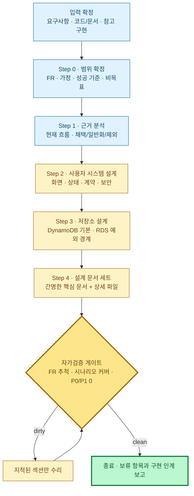

# 프론트엔드 사용자·회원 시스템 설계 생성 프롬프트

> **회원제 사이트에 공통으로 필요한 프론트엔드 사용자 영역과 프론트엔드 구현에 필요한 백엔드·데이터 계약을 설계하는** 작업 지시문이다. 이 프롬프트에 **대상 프로젝트·요구사항**을 입력하고, 기존 프로젝트나 참고 구현이 있으면 **코드·문서 경로**를 함께 제공해 실행한다.
> 기본 범위는 **프로토타입 수준의 회원 기능**이다 — 회원가입(약관 동의→가입 폼→가입 API)·로그인·로그아웃·세션 확인·자기 정보 조회/수정·비밀번호 변경·회원 탈퇴. 연락처 소유 검증, 계정 복구, 세션 갱신/기기 관리, 탈퇴 유예, 실명확인/KYC, 소셜 로그인, 다중 인증(MFA), 조직/역할 관리는 요구사항이 있을 때 확장한다.
> 기본 회원 데이터 저장소는 **DynamoDB**다. 복잡한 조인·다중 엔터티 트랜잭션·강한 관계 무결성이 핵심인 비즈니스 데이터만 근거를 남기고 RDS로 분리한다. "DynamoDB 사용"을 "인증 직접 구현"으로 해석하지 않는다.
> 이 프롬프트는 **설계 문서 생성용**이다. 회원 영역과 무관한 전체 백엔드·비즈니스 기능을 재설계하거나 구현하지 않는다. 시스템 전체 재설계가 필요하면 [AS-IS 프롬프트](./system-design-as-is-prompt.md) → [TO-BE 프롬프트](./system-design-to-be-prompt.md)로 전환한다.
> 원칙: **두괄식 · 다이어그램 1차 표현 · 근거와 제안 분리 · 보편적 명명 · 간결하고 쉬운 설명**. 산출물은 **간명한 핵심 문서 + 상세 파일 2계층**으로 작성한다 — 핵심 문서는 처음 읽는 사람이 5~10분 안에 전체 구조와 핵심 결정을 파악하는 문서고, 계약·데이터·검증의 깊이는 전부 상세 파일에 담는다. 종료는 정성 판단이 아니라 아래 설계-검증 게이트로 판정한다.

## 입력

가능한 입력을 먼저 수집한다. 제공되지 않은 값은 코드·문서에서 확인하고, 확인할 수 없으면 가정과 영향을 명시한다.

| 입력 | 확인할 내용 |
|---|---|
| 대상 프로젝트 | 루트 경로, 프레임워크, 라우터, 상태 관리, API 클라이언트, 배포 구조 |
| 제품 요구사항 | 사용자 유형, 가입 자격, 로그인 식별자, 필수 검증 채널, 권한, 성공 기준 |
| 인증 방식 | 관리형 Identity Provider(IdP), 자체 인증 서비스, 비밀번호, 패스키, 소셜 로그인 적용 여부 |
| 세션 정책 | access/refresh 방식, 만료·유휴 시간, 기기 수, 전체 로그아웃, 재인증 조건 |
| 개인정보 정책 | 수집 필드, 필수/선택 동의, 보유 기간, 탈퇴 유예, 익명화, 법적 보존 |
| 참고 구현 | 코드·문서 경로, 참고할 흐름, 복제하면 안 되는 서비스 고유 규칙 |
| 비즈니스 저장소 | DynamoDB 외 RDS 사용 영역, 데이터 소유권, 기존 연동 계약 |

로그인 식별자(사용자명/이메일/휴대폰), 검증 채널, 탈퇴 방식(즉시/유예/익명화)은 결과를 크게 바꾸므로 반드시 입력 또는 명시적 가정으로 확정한다.

## 설계 의미·표기는 가이드를 따른다

| 가이드 | 이 프롬프트에서의 역할 |
|---|---|
| [method-R.md](../guides/method-R.md) | 사용자 시스템 경계→서비스→프론트엔드 모듈의 하향 분해와 통신 방식 |
| [system-design-framework.md](../guides/system-design-framework.md) | Input Datas부터 Screen Layout까지 8섹션 산출물 골격 |
| [orchestrator-worker-pattern-guide.md](../guides/orchestrator-worker-pattern-guide.md) | UI 흐름 조율자·검증기·API gateway·세션 서비스의 책임 분리 |
| [architecture-pattern-diagram-guide.md](../guides/architecture-pattern-diagram-guide.md) | 설계 내용 성격에 맞는 다이어그램 선택 |
| [job-flow-diagram-guide.md](../guides/job-flow-diagram-guide.md) | 객체 호출·이벤트·반환값 흐름의 `jobflow` DSL |
| [navigation-diagram-guide.md](../guides/navigation-diagram-guide.md) | Page·API·화면 이동 판단의 `navigation` DSL |
| [state-diagram-guide.md](../guides/state-diagram-guide.md) | 계정·세션·화면 내부 상태의 `state` DSL |
| [screen-layout-guide.md](../guides/screen-layout-guide.md) | 페이지 구조의 `layout` DSL |
| [project-structure-guide.md](../guides/project-structure-guide.md) | 프론트엔드 feature 중심 모듈 배치와 파일 명명 |

## 다이어그램 표기

가이드의 확장 DSL 펜스(`jobflow`·`navigation`·`state`·`layout`)를 그대로 사용한다. 다른 형식으로 변환·치환하지 않는다.

| 설계 내용 | 표기 |
|---|---|
| 사용자 시스템 경계·신뢰 경계·모듈 조감 | Mermaid `flowchart` |
| 논리 데이터 관계 | Mermaid `erDiagram` |
| 객체 호출·이벤트·결과 연결 | `jobflow` |
| 화면·API·이동 판단 | `navigation` |
| 계정·세션·challenge·화면 내부 상태 | `state` |
| 페이지 구조 | `layout` |

- `jobflow` 첫 줄은 단일 조율자가 있으면 `orchestrator: X`, 자율 협력 경계면 `scope: X`로 쓴다. 모든 객체를 `Object:`에 선언하고, 매 단계 조율자로 되돌아가는 round-trip 표기를 금지한다.
- `navigation`에는 라우트가 있는 Page, 사용자에게 보이는 주요 오버레이, 이동을 결정하는 API/처리만 둔다. 내부 모듈 협력은 넣지 않는다. API는 `(/auth/login)`, 판단은 `(validate_form)`, 데이터는 백틱 노드로 표기하고 분기 라벨 뒤에 괄호를 쓰지 않는다.
- `state`는 `<s>` 시작, `(State)` 상태, 괄호 없는 Action, `<e>` 종료를 사용한다. 다른 Page로의 이동은 넣지 않는다.
- `layout`은 네비게이션에 등장한 모든 Page를 대상으로 한다. 좌표·픽셀·스타일 값은 넣지 않는다.
- 모든 다이어그램 바로 아래에는 핵심 흐름을 3~6개의 짧은 문장 불릿으로 설명한다.
- ASCII 박스·트리 다이어그램은 금지한다. DynamoDB 물리 설계를 관계형 ERD 하나로 대신하지 않는다.

---

## 0. 한눈에 보기 — 분석부터 검증까지



**요지**

- 기존 구현은 근거로 분석하되, 최종 설계에는 서비스 고유 명칭·라우트·스키마·취약한 인증 방식을 복제하지 않는다.
- 프론트엔드는 인증 상태와 사용자 경험을 조율하지만, 인증·인가의 최종 권위는 서버에 둔다.
- 회원·프로필·식별자·동의와 애플리케이션이 소유하는 세션 메타데이터는 DynamoDB를 기본값으로 설계한다.
- 모든 요구사항을 적용 가능한 화면·API·상태·데이터·테스트까지 추적하고, 비적용은 사유를 남긴 뒤 누락이 0일 때 종료한다.

---

## 공통 기준 네비게이션 — 프로토타입 베이스라인

아래 다이어그램은 특정 서비스의 구현을 복제한 예시가 아니라, 회원제 웹사이트 **프로토타입**이 공통으로 출발할 기준 흐름이다. 정상 흐름과 `invalid`·`error` 대표 분기만 남긴다. 세분화된 오류 분기(rate limit, network/timeout, 서버 오류 구분)와 확장 기능의 흐름은 프로토타입 검증 뒤 상세 설계에서 추가한다. 대상 프로젝트를 설계할 때는 실제 라우트·인증 방식으로 치환하되, 제외하는 분기는 `제외 근거 · 관련 FR`을 남긴다.

오류·완료 안내는 별도 Page를 만들지 않고 같은 Page 안의 메시지로 처리한다. 라우트 이동 없이 Page 내부 컴포넌트가 바뀌는 것을 표기해야 할 때만 `Page(Component)`를 쓴다.

### 화면 색인

| 표기 | 기준 라우트 | 접근 | 역할 |
|---|---|---|---|
| `LandingPage` | `/` | 공개 | 로그인·회원가입·보호 기능 진입점 |
| `SignupTermsPage` | `/signup/terms` | 게스트 전용 | 약관 확인과 필수 동의 |
| `SignupFormPage` | `/signup` | 게스트 전용 | 가입 정보 입력과 가입 요청 |
| `LoginPage` | `/login` | 게스트 전용 | 로그인 |
| `ApplicationHomePage` | 프로젝트별 | 인증 필요 | 로그인 후 기본 목적지 |
| `AccountPage` | `/account` | 인증 필요 | 자기 정보 조회·수정, 비밀번호 변경, 탈퇴 진입 |
| `WithdrawalPage` | `/account/withdrawal` | 인증 필요 | 탈퇴 영향 확인과 최종 요청 |

### 1. 공개 진입·보호 라우트

```navigation
Browser --> LandingPage : 사이트 진입
LandingPage --> LoginPage : 로그인
LandingPage --> SignupTermsPage : 회원가입
LandingPage --> (guard_protected_route) : 보호 기능 CTA
Browser --> (guard_protected_route) : 보호 URL 직접 진입
(guard_protected_route) --> (/auth/session)
(/auth/session) --> ApplicationHomePage : active
(/auth/session) --> LoginPage : anonymous
```

- 보호 라우트는 세션 확인이 끝나기 전까지 보호 콘텐츠를 렌더링하지 않는다.
- 세션 만료·확인 실패는 프로토타입에서는 `anonymous`와 동일하게 LoginPage로 보낸다.
- 인증된 사용자가 로그인·가입 URL로 들어오면 ApplicationHomePage로 보낸다.

### 2. 회원가입

```navigation
LandingPage --> SignupTermsPage : 회원가입
SignupTermsPage --> (/legal/terms)
(/legal/terms) --> SignupTermsPage
SignupTermsPage --> SignupFormPage : 동의하고 계속하기
SignupTermsPage --> LandingPage : 취소
SignupFormPage --> (validate_signup_form) : 가입 제출
(validate_signup_form) --> SignupFormPage : invalid
(validate_signup_form) --> (/auth/signup) : valid
(/auth/signup) --> SignupFormPage : error
(/auth/signup) --> ApplicationHomePage : success
SignupFormPage --> LoginPage : 이미 계정이 있어요
```

- 약관은 진입 시 로드하고, 필수 동의가 없으면 계속하기를 막는다.
- 폼 검증 실패와 서버 오류(식별자 중복 포함)는 같은 Page에서 입력을 보존하고 메시지로 표시한다.
- 가입 성공은 자동 로그인으로 처리하고 ApplicationHomePage로 이동한다.
- 필수 동의의 문서 버전·동의 시각은 가입 요청과 함께 서버에 저장한다.

### 3. 로그인·로그아웃

```navigation
LandingPage --> LoginPage : 로그인
LoginPage --> (validate_login_form) : 로그인 제출
(validate_login_form) --> LoginPage : invalid
(validate_login_form) --> (/auth/login) : valid
(/auth/login) --> LoginPage : error
(/auth/login) --> ApplicationHomePage : success
LoginPage --> SignupTermsPage : 회원가입
ApplicationHomePage --> (/auth/logout) : 로그아웃
(/auth/logout) --> LandingPage
```

- 자격 증명 오류는 계정 존재를 노출하지 않는 일반 메시지로 같은 Page에 표시한다.
- 로그인 성공은 ApplicationHomePage로 이동한다. `returnTo`를 쓰면 내부 경로만 허용한다.
- 로그아웃은 서버 세션 폐기와 로컬 인증 상태 제거 후 LandingPage로 이동하며, 서버 오류여도 로컬 상태는 제거한다.

### 4. 자기 정보·비밀번호 변경·회원 탈퇴

```navigation
ApplicationHomePage --> AccountPage : 내 계정
AccountPage --> (/users/me)
(/users/me) --> AccountPage
AccountPage --> (validate_profile_form) : 정보 저장
(validate_profile_form) --> AccountPage : invalid
(validate_profile_form) --> (/users/me/profile) : valid
(/users/me/profile) --> AccountPage : error
(/users/me/profile) --> AccountPage : saved
AccountPage --> (validate_new_password) : 비밀번호 변경
(validate_new_password) --> AccountPage : invalid
(validate_new_password) --> (/users/me/password) : valid
(/users/me/password) --> AccountPage : error
(/users/me/password) --> AccountPage : changed
AccountPage --> WithdrawalPage : 회원 탈퇴
WithdrawalPage --> AccountPage : 취소
WithdrawalPage --> (/users/me/withdrawal) : 탈퇴 확인
(/users/me/withdrawal) --> WithdrawalPage : error
(/users/me/withdrawal) --> LandingPage : success
```

- AccountPage는 진입 시 자기 정보를 조회하고, 조회·저장 오류는 같은 Page의 메시지와 재시도로 처리한다.
- 비밀번호 변경은 현재 비밀번호 확인을 포함한 한 번의 제출로 처리한다.
- 탈퇴는 영향 안내와 명시적 확인 후 요청하고, 성공하면 세션을 폐기하고 LandingPage로 이동한다.
- 프로필 저장 충돌(409)·민감 변경 재인증은 확장 지점으로 두고 프로토타입에서는 마지막 쓰기를 적용한다.

### 논리 API 매핑

| 표기 | 역할 |
|---|---|
| `(/legal/terms)` | 최신 약관·동의 문서 조회 |
| `(/auth/signup)` | 가입 생성과 자동 로그인 세션 발급 |
| `(/auth/login)` · `(/auth/session)` · `(/auth/logout)` | 로그인, 세션 확인, 세션 폐기 |
| `(/users/me)` · `(/users/me/profile)` · `(/users/me/password)` | 자기 정보 조회, 수정, 비밀번호 변경 |
| `(/users/me/withdrawal)` | 탈퇴 요청 |

실제 endpoint가 다르면 프로젝트 계약으로 바꾼다. 화면에서 IdP SDK를 직접 호출하더라도 설계 문서에는 사용자 이동을 좌우하는 논리 경계를 위 표기 수준으로 남긴다.

### 프로토타입 이후 확장 지점

채택하는 확장 기능은 같은 표기 수준의 독립 `navigation`으로 추가하고, 채택하지 않으면 적용 여부만 기록한다.

- 연락처 소유 검증(이메일·휴대폰 코드 발송/확인/재발송)
- 계정 복구(비밀번호 재설정 요청·일회성 링크)
- refresh 기반 세션 갱신과 401 처리, 복수 탭 동기화
- 기기/세션 목록과 선택·전체 폐기
- 민감 변경(식별자·비밀번호·탈퇴) 재인증
- 탈퇴 유예·취소·완료 상태 안내

---

## Step 0. 요구사항·범위 확정

1. **날짜·경로**: `DATE`를 `YYYY.MM.DD`로 한 번 확정한다. 산출물은 핵심 문서 `docs/design/{DATE}/frontend-user/frontend-user-design.md` 와 상세 파일 `docs/design/{DATE}/frontend-user/details/{NN}-{slug}.md` 세트다.
2. **요구사항 분해**: 요구사항을 검증 가능한 `FR-01`, `FR-02`, …로 분해하고 Must/Should/Optional, 성공 기준을 붙인다.
3. **가정**: 확인되지 않은 정책은 `가정 · 근거 · 틀렸을 때 영향 · 확인 필요 여부`로 기록한다. 조용히 채우지 않는다.
4. **범위 밖**: 회원 영역과 무관한 주문·정산·콘텐츠 등 비즈니스 기능은 인터페이스 경계만 표시하고 재설계하지 않는다.
5. **결정 로그**: 인증 방식, 로그인 식별자, 자동 로그인, 세션 저장 방식, 탈퇴 유예, 재가입 정책, DynamoDB 테이블 전략을 선택지·결정·근거로 기록한다.

### 공통 필수 범위

아래 흐름은 프로토타입의 기본 설계 범위다. 제품 정책상 제공하지 않는 기능도 조용히 삭제하지 말고 **제외 근거와 대체 사용자 흐름**을 적는다.

| 기능군 | 최소 설계 범위 |
|---|---|
| 회원가입 | 약관 동의, 입력 검증, 식별자 중복, 가입 요청, 자동 로그인 |
| 로그인 | 자격 증명 검증, 실패 메시지, 로그인 후 기본 목적지 이동 |
| 세션 | 앱 시작 시 세션 확인, 만료 시 재로그인 |
| 로그아웃 | 서버 세션 폐기, 로컬 인증 상태·민감 캐시 제거 |
| 자기 정보 | 조회, 수정, 저장 실패 시 입력 보존 |
| 보안 설정 | 현재 비밀번호 확인을 포함한 비밀번호 변경 |
| 회원 탈퇴 | 영향 안내, 명시적 확인, 탈퇴 요청, 세션 폐기 |
| 접근 제어 | 공개/게스트 전용/인증 필요 라우트 |

연락처 소유 검증, 계정 복구, 세션 갱신/기기 관리, 탈퇴 유예·취소, 소셜 로그인, 패스키, MFA, 초대 가입, 보호자 동의, 관리자 승인, 조직 전환은 확장 항목이다. 적용 여부를 명시하고 요구사항이 있을 때 같은 깊이로 설계한다.

## Step 1. 기존·참고 구현 분석

기존 프로젝트가 있으면 실제 코드·문서에서 아래 항목을 조사한다. 신규 프로젝트면 `greenfield`로 표시하고 이 단계를 가정 인벤토리로 대체한다.

- 라우트와 Page/Component, 공개·게스트 전용·보호 라우트, 딥링크 진입점
- 인증 store/context, 앱 초기화, 토큰 저장, API interceptor, 401/403 처리
- 회원가입·로그인·프로필·비밀번호·탈퇴 UI와 로딩/오류/빈 상태
- 사용자 API 계약, 오류 코드, 인증 주체 추출 방식, 세션 폐기 방식
- 사용자 스키마·테이블·인덱스·TTL·조건부 쓰기, 개인정보 보유 정책
- 관련 테스트, 분석 이벤트, 감사 로그, 운영 알람

근거 표는 `관찰 항목 · 실제 경로/라인 · 현재 동작 · 범용 설계 판단`으로 작성한다. 참고 구현은 아래 세 범주로 분리한다.

1. **채택**: 그대로 일반화할 수 있는 패턴과 이유.
2. **개선 후 채택**: 의도는 유효하지만 보안·접근성·일관성을 보완할 패턴.
3. **제외**: 브랜드, 도메인 규칙, 하드코딩 endpoint, 특정 필드/라우트, 취약한 인증·암호화·로그 방식.

실제로 확인하지 않은 파일·동작을 근거로 인용하지 않는다. `토큰 존재 = 인증 완료`, 브라우저 영속 저장소의 장기 토큰, 클라이언트가 보낸 `userId` 신뢰, 비밀번호·토큰·OTP 로그 출력, 약한 비밀번호 해시, 무기한 토큰, 단일 확인 후 즉시 hard delete 같은 구현은 기준 설계로 복제하지 않는다.

## Step 2. 사용자 시스템 설계 원칙

### 인증·인가 경계

- 인증 방식은 **관리형 IdP 사용** 또는 **전용 인증 서비스** 중 하나로 명확히 정한다. 관리형 IdP를 쓰면 위임한 자격 증명·연락처 검증·인증 세션의 Source of Truth(SoT)는 IdP이며 DynamoDB에 중복 저장하지 않는다. 애플리케이션 프로필은 `provider + subject`와 불변 `userId`의 매핑으로 연결한다.
- 자체 인증이면 비밀번호 원문·복호화 가능한 비밀번호를 저장하지 않는다. Argon2id·scrypt 같은 검증된 적응형 암호 해시와 사용자별 salt를 전용 인증 경계에서 사용한다. 알고리즘·비용 파라미터 버전, 성능 측정, 로그인 시 rehash/migration, 상수 시간 비교, pepper를 쓸 때의 KMS/비밀 회전 정책을 정한다.
- API는 검증된 토큰/세션의 불변 `sub` 또는 `userId`를 인증 주체로 사용한다. body/query의 사용자 ID를 권위로 삼지 않는다.
- 클라이언트 라우트 가드는 민감 화면의 순간 노출을 막는 사용자 경험 수단이다. 모든 API는 서버에서 인증·권한·계정 상태를 다시 검사한다.
- 역할(Role), 계정 상태(Status), 클라이언트 인증 상태를 분리한다. 계정 상태는 `PENDING_VERIFICATION`, `ACTIVE`, `LOCKED`, `SUSPENDED`, `DELETION_PENDING`, `DELETED`를 기본으로 하고, `GUEST`는 계정 상태가 아닌 클라이언트 주체 상태로 둔다.
- `라우트/API × 역할 × 계정 상태` 접근 행렬은 서버 `default-deny`를 기본값으로 한다. 알 수 없는 상태, IdP 동기화 실패, 권한 판정 실패는 fail-closed로 거부하고 안전한 복구 흐름을 제공한다.

### 인증 방식별 데이터 소유권·정합성

- `자격 증명 · provider subject · 연락처 검증 · token/session · 인증 잠금 · 앱 userId · 서비스 프로필 · 동의 · 서비스 계정 상태 · 탈퇴 작업`별 SoT·쓰기 주체·읽기 주체를 표로 확정한다.
- **관리형 IdP**는 위임 범위의 자격 증명, provider subject, token/session, 검증·인증 잠금 상태를 소유한다. DynamoDB는 로컬 `userId`, provider-subject 매핑, 서비스 프로필·동의·서비스 계정 상태·탈퇴 작업을 기본으로 소유한다. `Session`은 필요한 경우 비권위 기기 표시 메타데이터로만 둔다.
- `provider + subject` 매핑은 `attribute_not_exists` 조건부 생성으로 덮어쓰기를 막는다. 로컬 profile·provider map·가입 intent finalize는 가능한 한 같은 DynamoDB transaction에 넣는다. 이미 매핑이 있으면 새 사용자를 만들지 않고 기존 `userId`로 수렴하며, IdP 성공 뒤 finalize 충돌은 기존 매핑 재조회·멱등 재시도·reconciliation로 복구한다.
- **자체 인증**은 DynamoDB 또는 분리한 인증 저장소에 `IdentityClaim`, `Session`, `VerificationChallenge`, `PasswordResetChallenge`를 설계하고 전용 인증 서비스만 접근하게 한다.
- `TransactWriteItems`는 IdP 변경까지 원자화하지 못한다. 관리형 IdP 가입·식별자 변경·탈퇴는 `멱등 intent/예약 → IdP 변경 → 로컬 finalize` 또는 근거 있는 역순으로 설계하고, 단계 상태·실패 정리·재시도·정합성 점검을 둔다. 이를 단일 트랜잭션이라고 표현하지 않는다.
- `IdP 상태 ↔ DynamoDB 계정 상태 ↔ 세션 수락 여부` 전이 표를 만들고, 유예 탈퇴 중 IdP disable/delete와 취소 시 재활성화 순서를 정한다.
- 인증 방식, SoT, IdP 연계 순서, token 검증, 탈퇴 차단 시점 같은 보안 결정은 미해결 가정으로 `clean` 처리할 수 없다.

### 프론트엔드 인증 상태

- 앱 시작 상태를 `unknown/restoring`으로 두고 `anonymous`와 구분한다. 보호 콘텐츠는 복원 완료 전에 렌더링하지 않는다.
- 최소 상태는 `restoring`, `anonymous`, `authenticating`, `authenticated`, `expired`다. 세션 갱신을 채택하면 `refreshing`·`revoked`를 추가한다.
- 세션 갱신을 채택하면 동시 401은 여러 요청을 하나로 합치는 single-flight 방식으로 갱신 요청 하나만 보내고, 원 요청 재시도는 한 번으로 제한해 401 무한 루프를 막는다.
- 네트워크 오류와 세션 만료를 구분한다. 갱신 실패가 확정되면 민감 캐시를 비우고 안전한 로그인 흐름으로 전환한다.
- 브라우저 웹의 우선 후보는 token을 브라우저 JavaScript에 노출하지 않는 Backend For Frontend(BFF) 또는 서버 세션과 `Secure`·`HttpOnly`·`SameSite` 쿠키다. SPA가 API를 직접 호출해야 하면 메모리의 짧은 access token과 회전·재사용 탐지를 적용한 refresh/session 쿠키 같은 대안을 XSS·CSRF·모바일/SSR 제약과 함께 비교한다. 인증 token을 `localStorage`·`sessionStorage`에 두지 않는다.
- 서명 token은 허용 알고리즘, 서명, `iss`, `aud`, `exp`, `nbf`, token type, `kid`/키 회전 실패를 검증한다. opaque token은 introspection·cache·장애 시 fail-closed 정책을 정한다.
- refresh token은 family 단위 회전·재사용 탐지·전체 폐기를 설계한다. 로그인·권한 상승·재인증 후에는 session ID를 교체해 세션 고정을 막는다.
- 쿠키는 `Secure`, `HttpOnly`, `SameSite`, 최소 `Path`/`Domain`, 만료를 확정한다. 쿠키 인증 endpoint는 Origin 검증 또는 CSRF token과 명시적 credentialed CORS allowlist를 적용한다.
- redirect형 OIDC/OAuth를 쓰면 Authorization Code + PKCE, `state`, `nonce`, callback 오류, exact redirect URI allowlist를 설계하고 implicit flow를 금지한다. 관련 callback navigation과 jobflow를 조건부 필수 산출물로 둔다.
- 현재/전체 로그아웃, 탈퇴, 잠금·정지별 **세션 종료 성공 조건과 access-token 거부 시점**을 정한다. `sid`/session version 검사, denylist, opaque session 등 즉시 거부 수단을 쓰거나 짧은 잔여 유효시간과 위험을 명시한다. 네트워크 단절로 HttpOnly cookie 만료를 확인하지 못한 상태를 완료로 표시하지 않는다.
- 로그인 후 복귀 경로는 내부 allowlist로 검증해 open redirect를 막는다. 로그인·로그아웃 상태는 다른 탭과 동기화한다.

### 화면·폼·오류

- 서버 검증을 최종 권위로 두되 클라이언트 검증으로 빠른 피드백을 제공한다. 같은 규칙을 여러 Page에 복제하지 않는다.
- 모든 제출은 중복 클릭 방지, 취소/timeout, 입력 보존, 재시도 가능 여부를 정의한다.
- 400/401/403/404/409/410/422/429/5xx를 구분하고 기계 판독 가능한 오류 코드→사용자 메시지→복구 행동 매핑 표를 만든다.
- 자격 증명 또는 안전한 소유 증명 전의 로그인·복구·재발송 요청은 계정 존재 여부가 노출되지 않도록 같은 외부 응답과 유사한 처리 시간을 사용한다. 유효한 자격 증명이 확인된 뒤에만 미검증·잠김·정지·탈퇴 대기 상태와 복구 경로를 구체적으로 안내한다.
- 일반 프로필 변경과 이메일·휴대폰·비밀번호·탈퇴 같은 민감 변경을 분리한다. 민감 변경에는 재인증·검증·감사 이벤트를 적용한다.
- WCAG 2.2 AA를 기준으로 키보드, 초점 이동, 오류 요약, 필드-오류 연결, `aria-live`, 표준 `autocomplete` 속성을 설계한다.

## Step 3. DynamoDB 기본 설계와 RDS 경계

### 접근 패턴 우선

엔터티/ERD부터 그리지 말고 접근 패턴을 먼저 작성한다. 각 패턴에 `호출 주체 · 빈도 · 키 조건 · 정합성 · PK/SK · GSI · 조건부 쓰기 · 트랜잭션 · TTL · 멱등성`을 매핑한다.

최소 접근 패턴은 다음과 같다. IdP에 위임한 패턴은 DynamoDB 모델을 만들지 말고 `IdP 계약 · 앱에서 필요한 결과 · 실패 처리`로 대체한다.

- 불변 사용자 ID로 계정 상태·프로필 조회
- provider subject로 로컬 사용자 ID 매핑
- 사용자별 동의 버전 이력 조회
- 프로필 버전 조건부 수정과 충돌 감지
- 탈퇴 요청 상태·삭제 작업 조회, 식별자 재사용 금지 기간 확인
- 중복 가입/탈퇴 요청의 멱등 결과 조회
- **자체 인증일 때만** 정규화된 로그인 식별자의 소유권 선점, 세션 ID 직접 조회, 사용자별 세션 조회·폐기, 연락처 검증·비밀번호 재설정 challenge의 발급·소비

### 논리·물리 모델 원칙

- 공통 항목 후보는 `MemberProfile`, `ProviderSubjectMap`, `Consent`, `DeletionRequest`, `DeletedIdentityTombstone`, `IdempotencyRecord`다. 자체 인증일 때만 `IdentityClaim`, `Session`, `VerificationChallenge`, `PasswordResetChallenge`를 추가한다. 실제 접근 패턴이 없는 항목은 만들지 않는다.
- 하나의 PK 규칙을 모든 항목에 강제하지 않는다. 기본 후보는 프로필 `USER#{userId}`, provider 매핑 `PROVIDER#{provider}#{subject}`, 자체 인증 식별자 `IDENTITY#{hmacFingerprint}`, 세션 직접 조회 `SESSION#{sessionFingerprint}`, 멱등 요청 `IDEMPOTENCY#{principal}#{operation}#{key}`다. 단일/복수 테이블 선택에 맞게 실제 PK/SK를 확정한다.
- 원문 이메일·휴대폰을 키에 노출하지 않는다. 식별자별 정규화 정책을 명시하고 이메일을 무조건 전체 소문자화하지 않는다. 휴대폰은 적용 국가 정책에 맞는 E.164 등 표준 형식을 검토한다. HMAC 지문은 key version·충돌 처리·KMS 접근 권한을 설계하고, 회전 중 모든 활성 버전 조회와 dual-write/rekey, 이전 버전 폐기 조건으로 고유성을 유지한다.
- 식별자 고유성은 eventual-consistent GSI 선조회로 보장하지 않는다. base-table uniqueness item의 조건부 쓰기 또는 `TransactWriteItems`로 프로필·식별자 소유권을 원자 생성한다.
- 미검증 식별자 예약은 `expiresAt`과 상태를 조건부 검사해 TTL 삭제를 기다리지 않고 재선점할 수 있게 한다. 식별자 변경은 새 claim 예약→검증→프로필 교체→기존 claim 해제의 트랜잭션 또는 saga로 설계한다.
- 자체 인증의 저엔트로피 OTP는 서버 비밀키 기반 HMAC verifier, 짧은 만료, 원자적 시도 차감·일회성 소비, 발송/검증 rate limit을 함께 적용한다. 고엔트로피 reset/verification token과 refresh token은 원문이 아닌 verifier/지문만 저장한다. 모든 만료는 `expiresAt`을 직접 검사하고 TTL은 지연 삭제·비용 정리 용도로만 사용한다.
- 멱등 레코드는 principal, operation, idempotency key, request digest, `IN_PROGRESS/COMPLETED/FAILED` 상태, 안전한 응답 참조, 보유 기간을 가지며 가능하면 실제 mutation과 같은 트랜잭션에서 기록한다.
- 프로필 변경은 `version`과 조건부 쓰기로 동시 수정에 의한 덮어쓰기를 막는다. API에는 충돌(409) 복구 흐름을 둔다.
- GSI는 실제 조회 패턴별로 최소 projection만 둔다. request path의 `Scan`, 무제한 item collection, hot partition, 400KB item 한도 위험을 검토한다.
- `access pattern × 예상 월 요청량 × item 크기 × 읽기 일관성 × GSI 쓰기 증폭 × Streams/백업 비용` 추정 표를 만든다. 저·불규칙 트래픽은 On-Demand를 기본 후보로 삼고, 예측 가능한 지속 부하는 Provisioned+Auto Scaling 전환 기준과 비교한다.
- PITR, KMS 암호화, 최소 권한 IAM, 백업/복구, 데이터 분류별 보유·삭제 정책을 포함한다. 복원 후 탈퇴 데이터가 되살아나지 않도록 최소 삭제 ledger/tombstone을 재적용하는 절차를 두고 legal hold와 일반 보존을 구분한다. 고용량 감사 이벤트는 사용자 item collection에 계속 누적하지 않는다.
- 단일/복수 테이블은 access pattern·격리·비용 근거로 선택한다. "DynamoDB이므로 단일 테이블"을 전제로 두지 않는다.
- 다중 리전 쓰기를 선택하면 Global Tables 복제만으로 전역 고유성을 가정하지 않는다. 식별자·provider 매핑의 단일 writer/home region 또는 별도 전역 uniqueness 조정자를 정하고 장애 전환 중 쓰기 정책을 명시한다.

### RDS 예외 기준

아래 조건이 실제로 필요한 영역만 RDS 후보로 둔다.

- 여러 엔터티에 걸친 강한 관계형 트랜잭션과 참조 무결성
- 복잡한 조인·집계·가변 조건 보고서가 핵심인 조회
- 주문·정산·계약처럼 관계형 제약 자체가 비즈니스 규칙인 데이터

회원 프로필·동의·서비스 계정 상태의 기본 SoT는 DynamoDB에 유지한다. 복잡한 회원 리포트는 읽기 모델/분석 저장소를 먼저 검토하고, 관계형 비즈니스 규칙이 소유하는 데이터만 RDS SoT로 둔다.

RDS를 쓰면 `데이터/필드 · SoT · 쓰기 주체 · 읽기 주체 · 동기화 지연 허용치 · 삭제 책임` 소유권 표를 작성한다. 한 요청에서 프론트엔드 또는 API가 DynamoDB와 RDS를 무보호 이중 쓰기하지 않는다. DynamoDB Streams 또는 RDS transactional outbox의 소유 저장소, event version·ordering, retry/DLQ, 멱등 inbox, reconciliation 주기와 허용 지연을 정하고 두 저장소는 불변 `userId`로 연결한다. RDS 장애가 기본 로그인까지 불필요하게 전파되지 않도록 의존 방향을 정한다.

### 탈퇴 오케스트레이션

- RDS 사용 여부와 무관하게 IdP·DynamoDB·객체 저장소·메시징·외부 비즈니스 저장소 중 둘 이상을 건드리면 분산 삭제 작업으로 설계한다.
- 순서는 `탈퇴 intent/재인증 → 서비스 계정 차단 → 세션 폐기 → 유예 → 불가역 삭제 시작 → 저장소별 삭제/익명화 → tombstone/완료 증거`를 기본 후보로 삼고 정책 근거로 조정한다.
- 불가역 삭제 전까지만 취소·보상을 허용한다. 삭제 시작 뒤에는 삭제된 개인정보를 복원하지 않고 멱등한 정방향 재시도와 수동 재처리로 완료한다.
- 삭제 작업 상태는 `QUEUED`, `RUNNING`, `RETRYING`, `FAILED`, `COMPLETED`로 분리하고 단계별 idempotency key, retry 상한, DLQ, 운영자 재처리, 완료 증거를 둔다.
- 저장소별 삭제·익명화·법적 보존 책임과 IdP disable/delete, 식별자 tombstone 생성, 백업 복원 후 재삭제 순서를 표로 작성한다.

## Step 4. 설계 문서 작성 — 핵심 문서 + 상세 파일

산출물은 2계층이다. **핵심 문서**는 처음 읽는 사람이 5~10분 안에 전체 구조와 핵심 결정을 파악하는 문서고, **상세 파일**은 아래 상세 파일 규격(§1~§13 등)의 깊이를 전부 담는 문서다. 핵심 문서의 모든 항목은 대응 상세 파일 링크를 갖는다(상세가 불필요하면 `상세 없음` 명시).

### 핵심 문서 — `docs/design/{DATE}/frontend-user/frontend-user-design.md`

아래 순서로, **화면 2~3장(약 200줄) 이내**로 작성한다. 항목당 `대표 다이어그램 최대 1개(항목 5 대표 흐름만 최대 2개) + 불릿 3~6 + 상세 파일 링크`만 담고, 전체 예외 분기·필드 단위 계약·물리 키 설계·체크리스트성 정책 나열은 상세 파일로 옮긴다.

1. **한눈에 보기**: 요구사항 한 줄, 범위/범위 밖, 핵심 가정 + 브라우저·프론트엔드·Auth/User API·IdP(선택)·DynamoDB·RDS(선택)의 신뢰 경계 조감도 1장.
2. **핵심 결정 표**: 인증 방식, 로그인 식별자, 세션 저장 방식, 탈퇴 유예/재가입, DynamoDB 테이블 전략 등 Step 0 결정 로그의 확정본을 `결정 · 선택지 · 근거 한 줄`로.
3. **요구사항 요약 표**: `FR-NN · 한 줄 · Must/Should/Optional · 상태`. 성공 기준·가정·접근 행렬 상세는 상세 파일로.
4. **전체 네비게이션 + 화면 색인**: 사용자 상태별 대표 진입과 회원 수명주기를 요약한 전체 `navigation` 1장 + `Page · route · 접근 · 역할` 색인 표. 시나리오별 상세 navigation 은 상세 파일로.
5. **대표 흐름 1~2개**: 가입→자동 로그인, 로그인→세션 발급 같은 핵심 `jobflow` 1~2장. 나머지 흐름은 상세 파일로.
6. **데이터 한눈에**: 논리 `erDiagram` 1장 + `항목 · SoT · 저장소` 표. 접근 패턴·물리 키·GSI·RDS 경계 상세는 상세 파일로.
7. **미해결 이슈·구현 인계**: 보류 FR, 보류 보안 결정, 구현 순서를 3~7개 불릿으로.
8. **상세 파일 인덱스**: `파일 · 다루는 § · 한 줄`.

### 상세 파일 — `docs/design/{DATE}/frontend-user/details/{NN}-{slug}.md`

아래 규격들을 담는다. **한 §섹션 = 한 파일**을 기본으로 하되 밀접한 섹션은 한 파일로 합칠 수 있다(합침은 인덱스에 명시). `NN` 은 § 번호와 1:1(`01`~`13`), § 번호가 없는 "참고 구현과 범용화 판단"·"요구사항·행위자·접근 행렬"은 `00-reference-and-requirements` 한 파일로 담는다. slug 은 소문자 kebab-case 2~4단어(한글 금지). 각 파일 서두에 `> 대상: 핵심 문서 {항목}` + `> 관련 FR: FR-NN…` 인용블록을 두고 두괄식으로 시작한다. 깊이 제한 없음 — 기존 수준의 상세를 그대로 유지한다.

### 참고 구현과 범용화 판단

- 실제 근거 인벤토리
- 채택/개선 후 채택/제외 표
- 현재 구현의 보안·정합성 결함은 `현재 관찰`로만 기록하고 목표 설계와 혼합하지 않는다.

### 요구사항·행위자·접근 행렬

- `FR-NN` 요구사항, 성공 기준, 우선순위, 가정, Out of Scope
- 행위자, 역할, 계정 상태 정의
- `라우트/API × 역할 × 계정 상태` 접근 행렬과 거부 시 사용자 흐름

### §1. Input Datas

- 공통 앱 데이터와 인증 방식별 데이터를 분리한다. 관리형 IdP에 위임한 자격 증명·token/session·challenge는 IdP 계약으로, 앱 프로필·동의·서비스 계정 상태·탈퇴 작업은 DynamoDB 데이터로 작성한다.
- 자체 인증이면 식별자, credential verifier, 세션, verification/password-reset challenge를 인증 전용 데이터로 추가한다.
- 필드별 필수/선택, 수집 목적, 개인정보/민감정보 등급, SoT, 보유 기간, 마스킹/암호화, 삭제 방식
- 프론트엔드에서 보관 가능한 데이터와 보관하면 안 되는 데이터를 분리한다.

### §2. Key Events

- 가입 시작/완료, 식별자 선점, 검증 발송/완료/만료
- 로그인 성공/실패, 계정 잠김/정지, 세션 갱신/폐기/만료
- 프로필·식별자·비밀번호 변경, 재인증 요구
- 탈퇴 요청/취소/유예 만료/익명화·삭제 완료/실패
- 이벤트별 생산자·소비자·payload 최소 필드·중복 처리·감사 여부

### §3. Services List

- Page/route guard, auth bootstrap, user/session store, form/validation, API gateway, cache invalidation, cross-tab sync의 책임
- Auth API, User API, IdP, DynamoDB repository, deletion worker, 알림 gateway의 경계
- 각 책임의 소유 모듈과 금지된 책임을 함께 적는다. 자격 증명 검증과 권한 판단을 UI/store에 두지 않는다.

### §4. PBS

Mermaid `flowchart`로 사용자 시스템→기능군→단위 프로세스를 분해한다. 최소 기능군은 가입, 로그인/세션, 프로필/보안, 탈퇴, 접근 제어다. 채택한 확장 기능(검증, 복구 등)은 같은 수준으로 추가한다.

### §5. Job Flow

아래 흐름을 각각 `jobflow`로 작성한다. 인증 방식에 맞지 않는 흐름은 제외 근거와 대체 흐름을 적는다.

1. 가입 — 약관 동의 증빙→가입 요청→프로필 생성→자동 로그인
2. 로그인→세션 발급→사용자 bootstrap
3. 앱 시작 세션 확인→복원 또는 재로그인
4. 로그아웃→서버 폐기→로컬 민감 상태 정리
5. 프로필 수정과 비밀번호 변경
6. 탈퇴 요청→세션 폐기→삭제/익명화

확장 기능(연락처 검증, 계정 복구, 세션 갱신, 탈퇴 유예)을 채택하면 해당 흐름을 같은 형식으로 추가한다. 각 흐름 뒤에 객체 책임 표, 주요 이벤트/계약 표, 정상·예외 시나리오 설명을 둔다.

### §6. Navigation

전체 사용자 네비게이션 한 장은 핵심 문서에 둔다. 상세 파일에는 위 **공통 기준 네비게이션**을 실제 프로젝트 라우트·정책으로 치환해 아래 시나리오를 독립 `navigation` 블록으로 작성한다. 기준 흐름을 그대로 복사하지 말고 실제 Page/API 근거와 관련 FR을 붙인다.

1. 회원가입 — 약관 동의→가입 폼→가입 API→자동 로그인
2. 로그인·로그아웃
3. 보호 라우트 직접 진입·세션 확인·만료 재로그인
4. 자기 정보 조회·수정과 비밀번호 변경
5. 회원 탈퇴

각 시나리오에는 정상 흐름과 함께 검증 실패(invalid)·대표 오류(error)·취소 분기를 포함한다. 세분화된 오류 분기와 확장 기능 시나리오는 채택할 때 추가한다.

### §7. State

최소한 아래 상태도를 `state` DSL로 작성한다.

- **계정 수명주기**: `Active → DeletionPending/Deleted`를 기본으로 하고, 채택한 확장(검증 대기, 잠금, 정지, 유예 취소)이 있으면 분기를 추가한다.
- **클라이언트 세션**: `Restoring → Anonymous/Authenticated → Expired`. 세션 갱신을 채택하면 `Refreshing`을 추가한다.
- **주요 화면/컴포넌트**: 가입, 로그인, 프로필 편집, 비밀번호 변경, 탈퇴 확인의 idle/validating/submitting/success/error 상태

각 수명주기에는 `전이 · actor · guard · side effect` 표를 붙인다. 상태 변화가 없는 안내 화면은 생략할 수 있으나 대상과 생략 사유를 표로 남긴다.

### §8. Screen Layout

- 네비게이션의 모든 Page마다 `layout` 블록을 하나씩 작성한다.
- Page 목록 표에 route, 공개 범위, 진입 조건, 주요 컴포넌트, API, 로딩/오류/빈 상태, 반응형 변화, 접근성 요구를 적는다.
- 중요한 재인증·탈퇴 확인·세션 만료 오버레이는 소속 Page의 컴포넌트로 명시한다.

### §9. API·오류 계약

- endpoint, method, 인증/CSRF, request, success response, 오류 코드, 멱등성 키, rate limit, timeout/retry, 감사 이벤트를 표로 작성한다.
- signed token은 algorithm allowlist·signature·issuer·audience·`exp`/`nbf`·token type·`kid`/key rotation을, opaque token은 introspection/cache/fail-closed를 계약에 적는다. 쿠키 endpoint는 속성·Origin/CSRF·credentialed CORS 정책을 함께 적는다.
- 로그아웃 endpoint는 성공 조건, cookie 만료 응답, IdP/refresh family 폐기 결과, access-token revocation latency, network timeout 시 pending/retry 계약을 적는다.
- 401(인증 필요/만료), 403(권한 부족), 404(노출 방지), 409(고유성/버전 충돌), 410(만료/삭제), 422(검증), 429(제한)의 프론트엔드 표시와 복구 행동을 구분한다.
- 가입·검증·탈퇴 같은 재시도 가능한 쓰기는 중복 요청의 동일 결과 또는 안전한 충돌을 보장한다.
- 응답 DTO는 비밀번호 해시, token 지문, 내부 보안 상태 같은 필드를 allowlist 방식으로 제외한다.

### §10. DynamoDB·RDS 데이터 설계

- 논리 관계 `erDiagram`, access pattern 표, 물리 item/key 표, GSI 표를 모두 작성한다.
- 인증 방식별 SoT 표와 관리형 IdP 연계 intent/finalize/재처리 상태를 작성한다. IdP 위임 항목은 DynamoDB item을 만들지 않는다.
- 각 item은 PK/SK, 주요 속성, 조건식, TTL, 민감도, 생성/갱신/삭제 주체, 관련 FR을 가진다.
- 고유성·동시성·멱등성·TTL 지연·hot partition·비용 최적화 근거를 별도 소절로 설명한다.
- RDS가 없으면 "불필요" 근거를 적고, 있으면 SoT/동기화/실패 복구/탈퇴 처리 표를 작성한다.

### §11. 보안·개인정보·접근성

- XSS, CSRF, CORS, CSP, 세션 고정, refresh 재사용, 계정 열거, brute force, credential stuffing, open redirect, replay 위협과 방어를 표로 작성한다.
- 비밀번호·access/refresh token·OTP·원문 개인정보는 URL, 로그, 분석 이벤트, 오류 추적 도구에 남기지 않는다. 자체 인증의 검증·재설정 링크는 짧은 만료의 고엔트로피 일회성 opaque token만 허용하고 서버에는 verifier만 저장한다. Referrer 전송과 로그/분석 수집을 차단하고, 즉시 제한 세션으로 교환한 뒤 `history.replaceState` 등으로 주소에서 제거한다. IdP가 복구를 소유하면 hosted recovery/IdP 일회성 계약이 동등한 속성을 보장하는지 검증하고 앱 저장소에 token/verifier를 중복 저장하지 않는다.
- 서비스 약관 수락, 필수 개인정보 처리의 법적 근거, 철회 가능한 선택적 개인정보·마케팅 동의를 분리한다. 종류·버전·동의 시각·철회 가능 여부·철회 효과를 서버에 증빙한다.
- 탈퇴 문구와 실제 삭제/익명화/법적 보존 범위가 일치해야 한다.
- 키보드만으로 완료 가능한지, 초점/오류 공지, 색상 외 상태 표현, 입력 자동완성, 모바일 화면을 검증한다.

### §12. 테스트·관측성

- 단위, 컴포넌트, API 계약, 통합, E2E, 접근성, 보안, 동시성, TTL 지연, 장애 복구 테스트를 설계한다.
- `계정 상태 × 역할 × 네트워크 × token 상태 × 복수 탭/기기` 테스트 매트릭스를 만든다.
- 가입/로그인/탈퇴 퍼널, 실패율, 지연, 429, 삭제 backlog를 관측한다. 채택한 확장 기능(검증, 갱신, 복구)의 퍼널은 같은 수준으로 추가한다.
- 핵심 인증·삭제 흐름별 SLI/SLO와 경보 임계치, 담당자, runbook을 정한다. refresh 재사용, 계정 잠금 급증, deletion `FAILED`/backlog는 별도 보안·운영 경보로 둔다.
- 제품 분석 이벤트와 보안 감사 이벤트를 분리하고 correlation ID·결과 코드·재시도 횟수만 기록한다. 민감 payload는 기록하지 않는다. 감사 이벤트는 보유 기간·최소 권한·위변조 방지 정책을 갖는다.

### §13. 추적성·미해결 이슈·구현 인계

- `FR-NN ↔ 적용 가능한 Page/Component ↔ API ↔ jobflow/navigation/state/layout ↔ 데이터 계약/access pattern/item ↔ 테스트` 매핑 표를 작성한다. 적용되지 않는 열은 `N/A + 사유`로 표시하며 형식을 맞추기 위한 Page·API·item을 만들지 않는다.
- Must 보류와 보안 핵심 결정 보류는 종료를 막는다. Should/Optional 보류는 사유, 위험, 결정권자, 확인 시점을 적고 허용할 수 있다.
- 구현 순서, feature flag/마이그레이션, 기존 세션·계정 이관, 롤백, 운영 준비 사항을 3~7개 불릿으로 인계한다. 핵심 문서의 "미해결 이슈·구현 인계" 요약과 일치해야 한다.

## 시나리오 상세 체크리스트

### 회원가입

- 필수/선택 약관을 분리하고 문서 버전·동의 시각을 기록한다.
- 로그인 식별자를 정규화하고, 중복은 조건부 쓰기로 막아 폼에 오류로 표시한다.
- 중복 제출을 막고, 가입 성공 시 자동 로그인 여부를 명시한다.
- 이미 로그인한 사용자의 가입 Page 접근은 기본 홈으로 보낸다.

### 로그인·로그아웃·세션

- 잘못된 자격 증명은 계정 존재를 노출하지 않는 일반 메시지로 처리한다.
- 서버 확인 전 보호 데이터 노출을 막는다.
- 세션 만료 시 재로그인으로 보내고, 로그아웃 시 로컬 인증 상태와 민감 캐시를 제거한다.
- 로그아웃 뒤 브라우저 뒤로가기로 보호 화면이 보이지 않게 한다.

### 자기 정보·보안 설정

- 저장 실패 시 입력을 보존하고 재시도를 제공한다.
- 비밀번호 변경은 현재 비밀번호 확인을 요구한다.
- 변경 후 세션 유지/폐기 정책을 명시한다.

### 탈퇴

- 탈퇴 영향(삭제·보존 범위)을 구체적으로 안내하고 명시적 확인을 받는다.
- 요청 즉시 세션을 폐기하고 보호 API 접근을 막는다.
- 완료 문구는 실제 삭제·보존 범위를 과장하지 않는다.

확장 기능(연락처 검증, 계정 복구, 세션 목록/전체 로그아웃, 탈퇴 유예·재가입)을 채택하면 해당 체크리스트를 상세 설계에서 추가한다.

## 설계-검증 게이트

작성 후 **핵심 문서 + 상세 파일 세트 전체**를 Critic 관점으로 검사한다. 위반이 있으면 지적된 섹션만 수정하고 다시 검사한다.

### P0 — 반드시 수정

- 회원가입·로그인·세션·자기 정보·로그아웃·탈퇴 중 하나가 설계 또는 명시적 제외/대체 흐름 없이 누락됨
- FR 매핑 행이 없거나, 적용 가능한 설계 열이 비어 있거나, 비적용 열의 `N/A + 사유`가 없음
- 네비게이션의 모든 Page에 정확히 하나의 layout이 없거나, 상태 변화가 있는 Page/Component에 state가 없거나, 상태 변화가 없는 대상에 생략 사유가 없음
- 클라이언트 token 존재 또는 route guard만으로 인증·권한을 확정함
- `라우트/API × 역할 × 계정 상태` 행렬·서버 default-deny·알 수 없는 상태의 fail-closed 중 하나가 없음
- signed/opaque token 검증, refresh family 회전·재사용 폐기, cookie/CSRF/CORS, session ID 교체 중 선택한 방식에 필요한 통제가 없음
- 비밀번호·OTP·refresh/reset token 원문 저장/로그 또는 body의 `userId` 신뢰를 허용함. 단, 즉시 교환·제거하는 고엔트로피 일회성 검증/reset URL token은 위 §11 정책으로만 허용함
- 관리형 IdP와 DynamoDB의 SoT, subject↔userId 매핑, 비원자 연계 단계·실패 재처리가 없음
- 관리형 IdP 선택 시 provider-subject 조건부 고유 매핑, profile/map/intent finalize 원자성, 기존 매핑 수렴, finalize 충돌 복구 중 하나가 없음
- DynamoDB 접근 패턴과 PK/SK/GSI가 매핑되지 않음
- 고유성을 GSI 선조회만으로 보장하거나 TTL 삭제를 만료 판정의 즉시성 근거로 사용함
- 식별자 고유성·프로필 동시성·쓰기 멱등성·탈퇴 보존/삭제 정책이 없음
- 외부 경계가 둘 이상인 탈퇴에 계정 차단·세션 폐기·불가역 경계·정방향 재시도·삭제 작업 상태/운영 재처리가 없음
- 로그아웃 시 서버 세션 폐기와 로컬 인증 상태 제거가 없음
- 계정·클라이언트 세션·삭제 작업 상태를 혼합하거나 필수 복귀/종료 전이가 없음
- 근거 없는 파일/동작을 인용하거나 참고 서비스의 브랜드·도메인·URL·스키마를 보편 설계에 복제함
- `jobflow`를 sequenceDiagram으로 치환하거나 ASCII 다이어그램을 사용함

### P1 — 종료 전 수정

- 핵심 문서 간명성 위반: 화면 2~3장 초과, 항목당 대표 다이어그램 1개 초과(항목 5 는 2개 초과), 전체 분기·필드 단위 계약·물리 키 설계 혼입, 상세 파일 인덱스와 실제 파일 불일치·깨진 링크
- 핵심 문서 두괄식 조감 또는 다이어그램 하단 3~6개 설명이 없음
- 검증 실패(invalid)·대표 오류(error)·취소·세션 만료 흐름이 없음
- jobflow round-trip, navigation 분기 라벨 괄호, state 시작/종료 누락, layout 컨테이너 문법 위반
- API 오류→UI 복구 매핑 또는 개인정보 분류가 없음
- RDS 사용 근거·SoT·동기화·이중 쓰기 방지 또는 탈퇴 saga가 불명확함
- 접근성, 민감 로그 차단, 감사 이벤트, 경합/TTL 지연 테스트가 없음
- 결정하지 않은 정책을 가정 표에 남기지 않고 암묵적으로 선택함

### 종료 조건

검증 결과 표는 `등급/ID · 위치 · 근거 · 수정 · 상태` 열을 사용한다. 카운트는 아래처럼 계산한다.

- `unmapped_fr_count`: 매핑 행이 없거나 적용 가능한 열이 비어 있고 `N/A + 사유`도 없는 FR 수
- `uncovered_page_count`: layout 누락/중복 Page 수 + state 누락 대상 수 + 생략 사유 누락 대상 수
- `unresolved_must_fr_count`: 상태가 부분/보류인 Must FR 수
- `unresolved_security_decision_count`: 인증 방식·SoT·token/cookie·권한·탈퇴 불가역 경계 중 미확정 결정 수
- `active_placeholder_count`: 최종 문서 세트(핵심 문서 + 상세 파일)에 남은 `TODO`, `TBD`, `미정`, 빈 필수 셀 수
- `p0_count`, `p1_count`: 마지막 검증 결과 표에서 상태가 `open`인 각 등급 행 수

`clean := p0_count == 0 AND p1_count == 0 AND unmapped_fr_count == 0 AND uncovered_page_count == 0 AND unresolved_must_fr_count == 0 AND unresolved_security_decision_count == 0 AND active_placeholder_count == 0`

`clean`이면 종료하고 **① 보류한 Should/Optional FR과 사유 ② RDS 예외 영역 또는 불필요 근거 ③ 구현 인계 사항 ④ 참고 구현에서 의도적으로 채택하지 않은 항목**을 보고한다.
