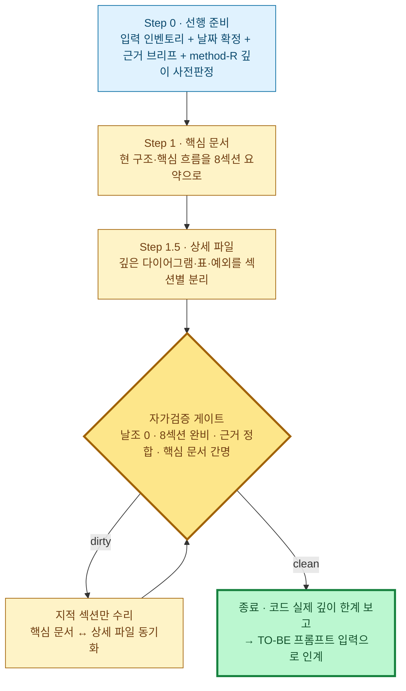

# AS-IS 설계 분석 문서 생성 프롬프트

> **소스 코드/문서를 분석해 현 상태(AS-IS) 설계 분석 문서를 생성하는** 작업 지시문이다. 이 프롬프트에 **분석할 코드·문서를 첨부**하고 **분석 요구사항을 직접 입력**해 실행한다.
> 원칙: **두괄식 · 다이어그램 1차 표현 · 간결·쉬운 설명 · project-guides 충실 준수**. 모든 설명은 **최대한 간결하고 쉬운 문장**으로 쓴다(짧은 문장·불필요한 수식어 제거·전문용어는 처음 1회 풀어쓰기). 산출물은 **핵심 문서 + 상세 파일 2계층**이다 — 핵심 문서는 처음 읽는 사람이 5~10분 안에 전체를 파악하는 간명한 문서로 유지하고, 깊은 다이어그램·표·예외 나열은 전부 상세 파일로 분리한다. AS-IS 는 **현 코드를 있는 그대로** 역추출한다(개선·목표는 [TO-BE 프롬프트](./system-design-to-be-prompt.md)의 몫). 종료는 정성 표현이 아니라 §AS-IS-검증의 기계검증으로만 판정한다.
> 설계 의미와 다이어그램 표기는 아래 가이드를 인용해 따른다(여기서 재서술하지 않음).

## 설계 의미·표기는 가이드를 따른다 (링크)

| 가이드 | 이 프롬프트에서의 역할 |
|---|---|
| [method-R.md](../guides/method-R.md) | **최상위 설계 철학** — 4계층 재귀분할(매크로→시스템→모듈→상세)·통신모드(L1 메시지·L2 선택·L3/L4 이벤트)·**method-R 6원칙**·멈춤 휴리스틱·불균등 깊이·Job Flow 표기 계약 |
| [system-design-framework.md](../guides/system-design-framework.md) | 산출물 양식 — **8섹션 골격**(§1 Input Datas … §8 Screen Layout) verbatim |
| [orchestrator-worker-pattern-guide.md](../guides/orchestrator-worker-pattern-guide.md) | **6모듈**(Main·core·gateways·service·utils·config) 분류 + **O-W 6원칙** |
| [architecture-pattern-diagram-guide.md](../guides/architecture-pattern-diagram-guide.md) | 섹션 성격별 **다이어그램 종류 선택** |
| [system-flow-document-guide.md](../guides/system-flow-document-guide.md) | **최소조각→전체** 서술·재귀 개방 게이트·책임 소유 표 |
| [job-flow-diagram-guide.md](../guides/job-flow-diagram-guide.md) · [navigation](../guides/navigation-diagram-guide.md) · [state](../guides/state-diagram-guide.md) · [screen-layout](../guides/screen-layout-guide.md) | `jobflow`·`navigation`·`state`·`layout` DSL 의미·문법 |

> **6원칙 혼동 금지**: **method-R 6원칙**(method-R.md 핵심원칙)과 **O-W 6원칙**(orchestrator-worker §2 표)은 서로 다른 세트다. 위반 지적 시 어느 세트·어느 원칙인지 출처를 붙인다. 둘 다 SoT 로 채점한다.

## 다이어그램 표기 (가이드 DSL 직접 사용)

project-guides 의 가이드들은 다이어그램을 **확장 DSL 펜스**(` ```jobflow `·` ```navigation `·` ```state `·` ```layout `)와 ` ```mermaid ` 블록으로 문서에 삽입한다. 이 프롬프트도 **가이드에 있는 그 다이어그램 코드 형식을 그대로** 쓴다 — **어떤 다이어그램도 다른 포맷으로 변환·치환하지 않는다**(예: `jobflow` 를 `sequenceDiagram`·`flowchart` 로 바꾸지 않는다). 섹션 성격별 표기는 [architecture-pattern-diagram-guide](../guides/architecture-pattern-diagram-guide.md) 선택 규칙을 따른다.

| 섹션 성격 (framework §) | 표기 |
|---|---|
| 계층·의존성·토폴로지·모듈 경계 (조감 §0) | mermaid `flowchart` |
| 클래스·Handler·전체 정적 구성 (§0-1) | mermaid `classDiagram` (actor·boundary·orchestrator·worker·gateway·state 만) |
| §4 PBS 기능 트리 | mermaid `flowchart`(System→Group→Process) |
| **객체·이벤트·반환값 (§5 Job Flow)** | **`jobflow`** ([job-flow-diagram-guide](../guides/job-flow-diagram-guide.md)) |
| 화면·API·메시지 (§6 Navigation) | `navigation` |
| 상태·라이프사이클 (§7 State) | `state` |
| 데이터 모델 | mermaid `erDiagram`(흐름 필요분만, 전체 ERD 금지) |
| 시간 순서 외부 시스템 대화 | mermaid `sequenceDiagram` |
| 화면 레이아웃 (§8) | `layout`(비중 낮음) |

- **job flow 는 `jobflow` DSL 로 그린다 — sequenceDiagram 으로 대체하지 않는다.** jobflow 는 오케스트레이터 관점의 흐름(모든 `-->` 가 조율자 시점)·분기(`.true`/`.false`/`.값`)·반환값(`.result`)·경계 메시지(`.message`/`MessageBus`)를 담지만, sequenceDiagram 은 이를 못 담고 job-flow 가이드가 금지하는 round-trip 을 강제한다.
- **jobflow 헤더**: 흐름을 조율하는 단일 객체가 있으면 `orchestrator: X`, 외부 경계·Choreography 면 `scope: X` (method-R).
- 한 섹션엔 **3종 세트**를 함께 적는다: (1) 분해 기준 (2) 대표 다이어그램 (3) 상세 흐름 링크 — **AS-IS 는 핵심 문서 `§N` 요약에서 `as-is/details/as-is-{N}-{slug}.md` 상세 파일로** 링크한다(상세가 불필요한 섹션은 `상세 없음` 명시).
- **두괄식 템플릿**: `## 0. 한눈에 보기 — {부제}` → 조감 다이어그램 1개(굵은 테두리=핵심 책임) → **요지** 불릿 3~5(전체 그림 / 핵심 책임·데이터 흐름 / 현 구조 약점) → 최소 조각 표 → 핵심 발견 이슈 표 — Step 1 의 §0 필수 구성과 동일. AS-IS 는 현 상태 역추출이므로 🟢 신규·🟡 변경 범례를 쓰지 않는다. 심각도 마커: 🔴 P0·🟠 P1·🟡 운영·🟢 기술부채.
- **다이어그램 하단 흐름 설명(필수)**: 모든 다이어그램 바로 아래에 **짧은 문장 불릿**으로 그 다이어그램의 핵심 흐름을 나열한다(한 불릿=한 단계·한 문장, 3~6개). 다이어그램만으로 흐름을 못 읽는 독자를 위한 최소 캡션 — 노드/엣지를 그대로 옮기지 말고 "무엇이 무엇을 왜 하는지"를 쉬운 말로.
- **§6 Navigation 은 전체→시나리오 순서로 작성한다**: 핵심 문서 §6 에는 전체 화면 이동을 관통하는 전체 `navigation` 1장(+ 하단 설명)만 두고, 상세 파일에서 각 시나리오별 독립 `navigation` 블록과 상세 설명(트리거 조건 · 관련 화면/API · 주요 분기 · 예외 흐름)이 이어지게 한다.
- **핵심 문서 2대 전체 다이어그램(§5+§6)**: 핵심 문서는 **§5 의 `jobflow` 1장 + §6 의 `navigation` 1장** — 이 두 장만 읽어도 시스템의 **전체 주요 흐름**(무엇이 어떤 순서로 조율되고, 화면/메시지가 어떻게 이동하는지)을 파악할 수 있어야 한다. 두 다이어그램은 조각 일부가 아니라 **진입점부터 핵심 결과까지 주요 흐름 전체를 관통**하게 그린다(깊은 분기·예외·시나리오별 흐름은 상세 파일).

---

## 0. 한눈에 보기 — AS-IS 3단계 + 자가검증 게이트



**요지**
- method-R([method-R.md](../guides/method-R.md))로 "무슨 깊이·순서로 쪼갤지"를 판정하되, **코드가 실제 도달한 깊이까지만** 역추출한다(없는 계층 날조 금지).
- 양식은 8섹션([framework](../guides/system-design-framework.md)), 서술은 최소조각→전체([system-flow](../guides/system-flow-document-guide.md)), 다이어그램은 위 선택표. **§5 Job Flow 는 `jobflow` DSL**.
- 산출물 3종: 핵심 문서 `as-is/system-design-as-is.md` · 상세 파일 `as-is/details/as-is-{N}-{slug}.md`(다수) · `_evidence-brief.md`. **핵심 문서는 화면 2~3장을 넘기지 않는다** — 깊이는 상세 파일로.

---

## Step 0. 선행 준비 (한 번만 · 산출물 영속화로 재사용)

1. **날짜 확정**: `DATE`(`YYYY.MM.DD`) 1회 고정 — 입력받은 날짜 > session currentDate > `bash date +%Y.%m.%d`. 이후 모든 경로에 동일 DATE. **이 DATE 를 TO-BE 프롬프트에도 인계.**
2. **입력 근거 인벤토리**: 첨부/지정된 분석 대상을 실제 `ls`/glob 으로 확인해 표로 고정(실경로만 인용). 후보: `docs/코드분석/`·`docs/코드리뷰/` → `docs/design/<날짜>/code-analysis/*` → **없으면 소스코드 직접 분석**(어느 트리를 근거로 삼는지 표에 명시).
3. **근거 브리프 파일 생성** — `docs/design/{DATE}/_evidence-brief.md` 로 저장. 이후 모든 단계·TO-BE 는 원본 대신 이 파일 인용(독립 근거 읽기 병렬). 필수 4항목: **근거 인벤토리 표** / **이슈 목록**(`R-NN`+심각도+위치 — TO-BE 변경점 C-0X 의 입력) / **최소 조각 4~8개**(조각·종류·한줄 책임) / **method-R 깊이 사전판정 표**.
4. **method-R 깊이 사전판정**: 후보 분할 단위를 4계층에 배치하고 "어느 부분을 어느 깊이까지" 멈춤 휴리스틱으로 표시(불균등 허용). 3번 브리프에 포함.

---

## Step 1. AS-IS 핵심 문서 — `docs/design/{DATE}/as-is/system-design-as-is.md`

현 코드를 **있는 그대로** method-R 4계층 + 8섹션 골격으로 역추출한다. 핵심 문서는 **전체를 읽지 않고 5~10분 안에 현 시스템의 전반과 문제를 파악**하는 문서다 — 여기엔 요약만 남기고 깊이는 Step 1.5 상세 파일로 보낸다.

- **본문 골격**: [framework](../guides/system-design-framework.md) 8섹션(§0 조감 + §1~§8) **verbatim 섹션명**, [system-flow](../guides/system-flow-document-guide.md) "최소조각→전체" 순서. 각 섹션은 "현재 코드가 이 섹션을 어떻게 구현하는가". 다이어그램은 위 선택표.
- **간명성 가드**: 섹션당 `분해 기준 1~2줄 + 대표 다이어그램 최대 1개 + 핵심 흐름 불릿 3~6 + 상세 파일 링크`만 담는다. 전체 예외·오류 분기, 보조 다이어그램, 근거 라인 표, 필드 단위 표, 데이터 모델·경계 계약 전문은 핵심 문서에 넣지 않고 상세 파일로 옮긴다. **핵심 문서는 화면 2~3장(약 200줄)을 넘기지 않는다.**
- **§0 한눈에 보기(필수 구성)**: 조감 다이어그램 1개 → 요지 불릿 3~5 → 최소 조각 표(4~8개) → 핵심 발견 이슈 표(`R-0X`·심각도·위치·한 줄).
- **method-R 역추출**: 매크로(외부경계·진입점)→시스템(현 서비스/번들 경계)→모듈(서비스 내부 책임)→상세(복잡 워커). 핵심 문서 §5 에는 **전체 주요 흐름을 한 장으로 관통하는 대표 job flow 1장**(보통 시스템 계층 — 진입점→핵심 처리→결과 반환이 모두 보이게)만 `jobflow` DSL 로(`orchestrator:`/`scope:` 헤더 명시) 두고, 나머지 계층·조각별 job flow 는 상세 파일에 둔다. §6 의 전체 `navigation` 1장과 합쳐 **두 장만으로 전체 주요 흐름이 파악**되어야 한다.
- **깊이 날조 금지**(P0): 코드에 없는 계층을 형식 맞추려 추가하지 않는다. 발견한 6원칙 위반(method-R/O-W 어느 세트인지 명시)은 **그대로 노출**해 TO-BE 개선 근거(R-0X)로 둔다(AS-IS 에서 임의 교정 금지).
- **§3 Services List**: 6모듈 분류 표 + 모듈 경계 다이어그램(orchestrator→worker 단방향, gateway 캡슐화).
- **두괄식** + 말미에 **상세 파일 인덱스**(파일명·대상 §·한 줄). 근거문서↔본문 섹션↔이슈 ID(R-0X) 매핑 표는 상세 파일에 둔다.

---

## Step 1.5. AS-IS 상세 파일 — `docs/design/{DATE}/as-is/details/as-is-{N}-{slug}.md`

핵심 문서가 요약으로 넘긴 깊이를 담는 파일. **한 섹션(또는 method-R 분할 단위) = 한 파일**, 독립 파일 병렬 작성. 깊이 제한 없음 — 현 코드가 도달한 깊이까지 전부 담는다.

- **네이밍**: `N` 은 핵심 문서 섹션 번호와 1:1(임의 금지). slug 은 소문자 kebab-case 2~4단어(한글 금지). 서두 인용블록 `> 대상: 핵심 문서 §N` + `> 근거: _evidence-brief.md 해당 항목`.
- **담는 것**: 계층·조각별 전체 `jobflow`, 시나리오별 `navigation`·`state`·`layout` 전체(§6 상세 파일은 핵심 문서의 전체 네비게이션에 이어 시나리오별 `navigation` 블록 + 상세 설명 순으로 구성), 예외·오류 분기, 근거 표(관찰 항목·실제 경로/라인·현재 동작), 책임 소유 표, 데이터 모델·경계 계약 전문, 근거문서↔섹션↔이슈(R-0X) 매핑 표.
- 상세가 필요 없는 섹션(= 핵심 문서 요약이 그 섹션의 전부이고, 상세로 넘길 깊이가 코드에 없는 경우)만 파일을 만들지 않고 핵심 문서 해당 섹션에 `상세 없음`을 명시한다.
- 핵심 문서가 수리로 바뀌면 **영향 상세 파일만 동기화**한다(무관 파일 동결).

---

## AS-IS-검증. 작성 후 자가검증 (종료 게이트 — 위반 0까지 지적 섹션만 수리→재검증)

**P0 (반드시 수정)**: AS-IS 깊이 날조 / 정규 8섹션(§1~§8) 누락(§0 누락은 P1) / 근거 인벤토리·브리프 미참조·환각 인용 / **§5 Job Flow 를 `jobflow` 아닌 sequenceDiagram 으로 그림** / **핵심 문서가 상세로 넘긴 깊이가 상세 파일 어디에도 없음**(내용 유실 — 요약만 남고 전체 job flow·근거 표·데이터 모델·경계 계약이 사라짐. 코드에 그 깊이가 있는데 상세 파일이 0개인 경우 포함).
**P1 (권장)**: §0 두괄식 조감 누락 / 책임 소유 표 모호 / 3종 세트 누락(상세 흐름 링크는 `details/` 상세 파일로) / **§5 대표 `jobflow`·§6 전체 `navigation` 이 전체 주요 흐름을 관통하지 않음**(일부 조각·시나리오만 표현해 두 장만으로 전체 흐름 파악 불가) / **§6 Navigation 전체→시나리오 순서 위반**(전체 `navigation` 없이 시나리오만 나열, 또는 시나리오별 상세 설명 누락) / **핵심 문서 간명성 위반**(섹션당 대표 다이어그램 1개 초과·상세 수준 내용 혼입·화면 2~3장 초과) / **핵심 문서↔상세 파일 불일치**(§번호·`R-0X`·인덱스 누락·깨진 링크) / 6원칙 위반을 노출 대신 임의 교정.
**종료**: P0 위반 0 → 종료하고 **① 코드가 도달 못해 담지 못한 계층/깊이 한계 ② 남은 P1** 을 보고. 산출물 3종 + `DATE` 를 [TO-BE 프롬프트](./system-design-to-be-prompt.md) 입력으로 인계.
