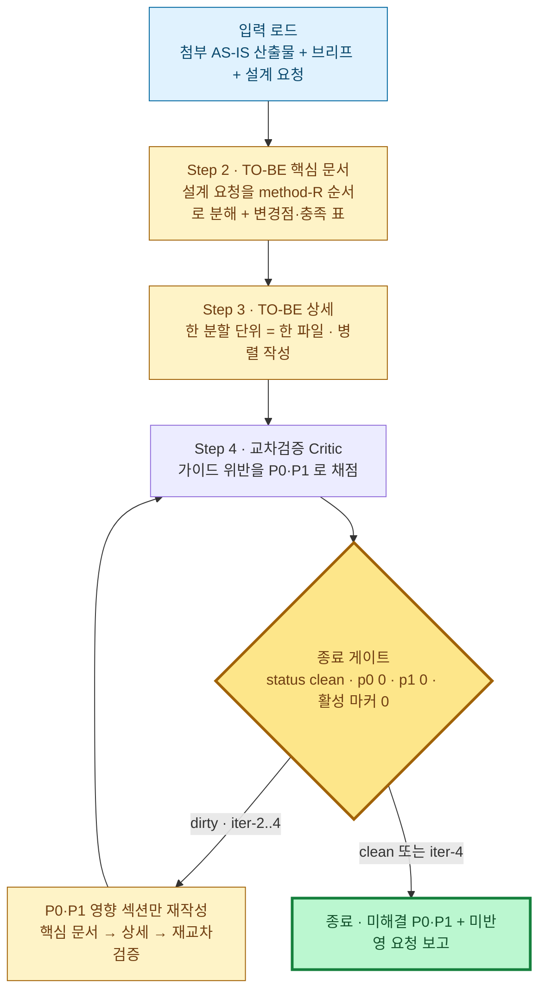

# TO-BE 설계 분석 문서 생성 프롬프트

> **AS-IS 산출물을 대상으로, 설계 요청에 맞게 TO-BE 설계 분석 문서(+교차검증)를 생성하는** 작업 지시문이다. 이 프롬프트에 **AS-IS 산출물([AS-IS 프롬프트](./system-design-as-is-prompt.md) 결과)을 첨부**하고 **설계 요청(변경·목표 요구사항)을 직접 입력**해 실행한다. 첨부 AS-IS 를 현 상태 기준으로 삼아 요청을 method-R 순서·깊이로 반영한다. 설계 요청이 없으면 AS-IS 브리프의 이슈(R-0X) 전체 해소를 기본 요청으로 삼는다.
> 원칙: **두괄식 · 다이어그램 1차 표현 · 간결·쉬운 설명 · project-guides 충실 준수**. 모든 설명은 **최대한 간결하고 쉬운 문장**으로 쓴다(짧은 문장·불필요한 수식어 제거·전문용어는 처음 1회 풀어쓰기). 산출물은 **핵심 문서 + 상세 파일 2계층**이다 — 핵심 문서(본문)는 처음 읽는 사람이 5~10분 안에 "무엇이 왜 바뀌는지"를 파악하는 간명한 문서로 유지하고, 깊은 다이어그램·표·계약은 전부 상세 파일로 분리한다. **종료조건(§5 단일 술어) 충족까지 자가검증·자가수복하며 무중단 진행**하고, 품질·종료는 종료조건의 기계검증으로만 판정한다. `DATE`·`_evidence-brief.md` 는 AS-IS 가 확정·생성한 값을 그대로 재사용한다.
> 설계 의미와 다이어그램 표기는 아래 가이드를 인용해 따른다(여기서 재서술하지 않음).

## 설계 의미·표기는 가이드를 따른다 (링크)

| 가이드 | 이 프롬프트에서의 역할 |
|---|---|
| [method-R.md](../guides/method-R.md) | **최상위 설계 철학** — 4계층 재귀분할·통신모드(L1 메시지·L2 선택·L3/L4 이벤트)·**method-R 6원칙**·멈춤 휴리스틱·불균등 깊이·Job Flow 표기 계약 |
| [system-design-framework.md](../guides/system-design-framework.md) | 산출물 양식 — **8섹션 골격**(§1 Input Datas … §8 Screen Layout) verbatim |
| [orchestrator-worker-pattern-guide.md](../guides/orchestrator-worker-pattern-guide.md) | **6모듈**(Main·core·gateways·service·utils·config) + **O-W 6원칙** |
| [architecture-pattern-diagram-guide.md](../guides/architecture-pattern-diagram-guide.md) | 섹션 성격별 **다이어그램 종류 선택** |
| [system-flow-document-guide.md](../guides/system-flow-document-guide.md) | **최소조각→전체** 서술·재귀 개방 게이트·책임 소유 표 |
| [job-flow-diagram-guide.md](../guides/job-flow-diagram-guide.md) · [navigation](../guides/navigation-diagram-guide.md) · [state](../guides/state-diagram-guide.md) · [screen-layout](../guides/screen-layout-guide.md) | `jobflow`·`navigation`·`state`·`layout` DSL 의미·문법 |

> **6원칙 혼동 금지**: **method-R 6원칙**(method-R.md)과 **O-W 6원칙**(orchestrator-worker §2)은 서로 다른 세트다. 위반 지적 시 어느 세트·어느 원칙인지 출처를 붙인다. 둘 다 SoT 로 채점한다.

## 다이어그램 표기 (가이드 DSL 직접 사용)

project-guides 의 가이드들은 다이어그램을 **확장 DSL 펜스**(` ```jobflow `·` ```navigation `·` ```state `·` ```layout `)와 ` ```mermaid ` 블록으로 문서에 삽입한다. 이 프롬프트도 **가이드에 있는 그 다이어그램 코드 형식을 그대로** 쓴다 — **어떤 다이어그램도 다른 포맷으로 변환·치환하지 않는다**(예: `jobflow` 를 `sequenceDiagram`·`flowchart` 로 바꾸지 않는다). 섹션 성격별 표기는 [architecture-pattern-diagram-guide](../guides/architecture-pattern-diagram-guide.md) 선택 규칙을 따른다.

| 섹션 성격 (framework §) | 표기 |
|---|---|
| 계층·의존성·토폴로지·모듈 경계 (조감 §0) | mermaid `flowchart` |
| 클래스·Handler·전체 정적 구성 (§0-1) | mermaid `classDiagram` (actor·boundary·orchestrator·worker·gateway·state 만) |
| §4 PBS 기능 트리 | mermaid `flowchart`(System→Group→Process) |
| **객체·이벤트·반환값 (§5 Job Flow)** | **`jobflow`** ([job-flow-diagram-guide](../guides/job-flow-diagram-guide.md)) |
| 화면·API·메시지 (§6 Navigation) | `navigation` |
| 상태·라이프사이클 (§7 State) | `state` |
| 데이터 모델 | mermaid `erDiagram`(흐름 필요분만, 전체 ERD 금지) |
| 시간 순서 외부 시스템 대화 | mermaid `sequenceDiagram` |
| 화면 레이아웃 (§8) | `layout`(비중 낮음) |

- **job flow 는 `jobflow` DSL 로 그린다 — sequenceDiagram 으로 대체하지 않는다.** jobflow 는 오케스트레이터 관점의 흐름(모든 `-->` 가 조율자 시점)·분기(`.true`/`.false`/`.값`)·반환값(`.result`)·경계 메시지(`.message`/`MessageBus`)를 담지만, sequenceDiagram 은 이를 못 담고 job-flow 가이드가 금지하는 round-trip 을 강제한다.
- **jobflow 헤더**: 흐름을 조율하는 단일 객체가 있으면 `orchestrator: X`, 외부 경계·Choreography 면 `scope: X` (method-R).
- 한 섹션엔 **3종 세트**: (1) 분해 기준 (2) 다이어그램 (3) 상세 흐름 링크 — **TO-BE 는 `system-design-to-be-{N.M}-{slug}.md` 상세 파일명·§번호를** 적는다.
- **두괄식 템플릿**: `## 0. 한눈에 보기 — {부제}` → 조감 다이어그램 1개 → **범례**(🟢 신규·🟡 변경·굵은 테두리=핵심 책임) → **요지** 불릿 3~5. 상세 파일은 `## 0` 위에 `> 대상: §{N.M} · 변경점 C-0X (해소 R-0X)` + `> 핵심 파일: <경로>` 인용블록. 심각도: 🔴 P0·🟠 P1·🟡 운영·🟢 기술부채.
- **다이어그램 하단 흐름 설명(필수)**: 모든 다이어그램 바로 아래에 **짧은 문장 불릿**으로 그 다이어그램의 핵심 흐름을 나열한다(한 불릿=한 단계·한 문장, 3~6개). 다이어그램만으로 흐름을 못 읽는 독자를 위한 최소 캡션 — 노드/엣지를 그대로 옮기지 말고 "무엇이 무엇을 왜 하는지"를 쉬운 말로.
- **§6 Navigation 은 전체→시나리오 순서로 작성한다**: 핵심 문서 §6 에는 전체 화면 이동을 관통하는 전체 `navigation` 1장(+ 하단 설명)만 두고, 상세 파일에서 각 시나리오별 독립 `navigation` 블록과 상세 설명(트리거 조건 · 관련 화면/API · 주요 분기 · 예외 흐름)이 이어지게 한다.
- **핵심 문서 2대 전체 다이어그램(§5+§6)**: 핵심 문서는 **§5 의 `jobflow` 1장 + §6 의 `navigation` 1장** — 이 두 장만 읽어도 **변경 반영 후 시스템의 전체 주요 흐름**을 파악할 수 있어야 한다. 두 다이어그램은 변경 조각 일부가 아니라 **진입점부터 핵심 결과까지 주요 흐름 전체를 관통**하게 그린다(계층·시나리오별 흐름과 깊은 분기·예외는 상세 파일).

---

## 0. 한눈에 보기 — TO-BE 3단계 + 종료 게이트 + 반복 루프



**요지**
- **첨부 AS-IS + 설계 요청**을 입력으로 "요청 반영 목표 8섹션"을 method-R 순서·깊이로 작성. 차이는 "6원칙 위반→해소"·"R-0X 이슈→변경점 C-0X" 로 서술.
- 양식은 8섹션([framework](../guides/system-design-framework.md)), 다이어그램은 위 선택표. **§5 Job Flow 는 `jobflow` DSL**.
- **본문은 간명한 핵심 문서** — 섹션당 대표 다이어그램 최대 1개 + 요지 불릿 + 상세 파일 링크만 담고, 깊이는 전부 상세 파일로. **§5 전체 주요 흐름 `jobflow` 1장 + §6 전체 `navigation` 1장** 두 장만으로 변경 반영 후 전체 주요 흐름이 파악되어야 한다. 요청↔변경점 충족 표가 본문 §0 에 있다.
- 근거 브리프 재사용, 반복 시 P0/P1 지목 섹션만 재작성(독립 상세·영향 파일 병렬). 종료: `status=clean AND p0=0 AND p1=0 AND 활성 마커 0`, dirty 면 최대 3회 반복(iter-1..4).

### 단계 입출력

| Step | 입력 | 산출물 |
|---|---|---|
| 2 | 첨부 AS-IS + 브리프 + 설계 요청 | `to-be/system-design-to-be.md`(핵심 문서) + 분해유형 판정 |
| 3 | Step 2 분해대상 섹션 목록 | `to-be/system-design-to-be-{N\|N.M}-{slug}.md`(다수, 병렬) |
| 4 | Step 2·3 + AS-IS + 브리프 | `review/cross-review-iter-{N}.md` |
| 5(반복) | Step 4 의 P0/P1 지목 섹션 | 영향 섹션만 덮어쓰기 + 다음 회차 review |

---

## Step 2. TO-BE 핵심 문서 — `docs/design/{DATE}/to-be/system-design-to-be.md`

AS-IS 와 동일 8섹션 골격으로, **설계 요청**을 method-R 순서·깊이를 강제해 목표 분해로 작성한다. 본문은 **전체를 읽지 않고 5~10분 안에 "설계 요청이 어떻게 반영됐고 무엇이 바뀌는지" 파악**하는 핵심 문서다 — 여기엔 요약만 남기고 깊이는 Step 3 상세 파일로 보낸다.

- **간명성 가드**: 섹션당 `분해 기준 1~2줄 + 대표 다이어그램 최대 1개 + 핵심 불릿 3~6 + 상세 파일 링크`만 담는다. **§5 는 변경 반영 후 전체 주요 흐름을 한 장으로 관통하는 대표 `jobflow` 1장, §6 은 전체 `navigation` 1장** — 이 두 장만으로 전체 주요 흐름이 파악되어야 한다. 계층·시나리오별 전체 `jobflow` 세트, navigation/state 전체, 데이터 모델·API 계약 전문은 본문에 넣지 않고 상세 파일로 옮긴다. **본문은 화면 2~3장(약 200줄)을 넘기지 않는다.**
- **요청 반영**: 설계 요청을 method-R 4계층으로 분해 — "요청을 만족하려면 매크로/시스템/모듈/상세의 무엇이 바뀌는가". 본문 주요 소제목은 method-R 계층 또는 L2 서비스·L3/L4 승격 워커에 1:1 대응. 요청 무관 부분은 AS-IS 유지 명시(변경 최소화).
- **본문 골격**: AS-IS 와 동일 8섹션 verbatim("바뀐 8섹션"). 차이는 "6원칙 위반→해소"(예: Worker↔Worker 직접호출=O-W 수평적 고립·method-R 원칙3 위반 → Orchestrator 경유). **§5 Job Flow 는 `jobflow` DSL**(본문엔 전체 주요 흐름을 관통하는 대표 1장, 나머지는 상세 파일).
- **method-R 강제**: 매크로→시스템→모듈→상세 하향. (a) **L2 통신모드 재결정** 근거 1줄 (b) 노출된 6원칙 위반 교정 (c) 목표 깊이를 멈춤 휴리스틱으로(고위험만 더 깊이).
- **§0 한눈에 보기(필수 구성)**: method-R 4계층 zoom-in mermaid `flowchart`(classDef 계층 색) → 요지 불릿 3~5 → **설계 요청 ↔ 변경점 충족 표**(요청 항목·`C-0X`·반영 위치[상세 파일]·상태[반영/부분/보류]) → **변경점 요약 표**(`C-0X`·`🔴→✅`·한 줄·해소 `R-0X` 또는 `요청`·상세 파일). 설계 요청이 비어 폴백된 경우 충족 표의 요청 항목 컬럼은 해소 대상 R-0X 이슈 각각을 나열한다.
- **추적성**: 이슈 R-0X ↔ 변경점 C-0X 1:1 — 위 두 표가 SoT. 요청이 새로 요구한 변경점은 `C-0X (요청)` 로 구분.
- **분해유형 판정(1회)**: (A) 8섹션 전면 재설계형 → 상세파일 `{0..8}-{slug}` / (B) 변경점 나열형 → "변경 시나리오" 소절 §3.1~§3.N → 상세파일 `{3.1..3.N}-{slug}`. 본문 말미에 판정 1줄 + **상세 파일 인덱스**(파일명·대상 §·한 줄) 명기, 혼용 금지.

---

## Step 3. TO-BE 상세 — `docs/design/{DATE}/to-be/system-design-to-be-{N|N.M}-{slug}.md`

"**method-R 한 분할 단위 = 한 파일**". 입력은 Step 2 의 분해대상 섹션 목록. 핵심 문서가 요약으로 넘긴 깊이(전체 흐름·예외 분기·계약·데이터 모델)를 여기서 전부 담는다 — 깊이 제한 없음.

**네이밍**: 분해유형은 Step 2 판정 따름(A→`{0..8}-{slug}` / B→`{3.1..3.N}-{slug}`). N.M 은 부모 본문 섹션 번호에서 파생(임의 금지, 1:1). slug 은 소문자 kebab-case 3~5단어(한글 금지). C-0X↔N.M 끝자리 평행(C-01↔3.1), 서두 인용블록에 `> 대상: §{N.M} · C-0X (해소 R-0X)` + `> 핵심 파일: <경로>`.

**작성 규칙**
- **두괄식**: `## 0. 한눈에 보기` + 요지(AS-IS 문제→TO-BE 해법 (1)(2)(3)).
- **섹션 성격→다이어그램**(위 선택표): 객체·협력·파이프라인·기동=**`jobflow`** / 화면·메시지=`navigation` / 상태=`state` / 스키마=mermaid `erDiagram` / 클래스=mermaid `classDiagram` / 시간순 외부대화=mermaid `sequenceDiagram`.
- **method-R 통신모드대로** job flow(L3·L4 내부 이벤트). 멈춤(노드1개=함수1줄) 도달 시 중단. 복잡 워커는 Sub-Orchestrator 승격 → 별도 상세 파일.
- **DSL self-check**: jobflow round-trip 금지(매 단계 조율자로 되돌리지 말고 직접 chaining) / navigation 은 API·`(process)`·백틱 `message` 노드 별도 보존, 분기 라벨 괄호 금지, 전체 네비게이션에 이어 시나리오별 블록 + 상세 설명 순서 유지 / state 시작·종료 누락 금지.
- **독립 상세 파일 병렬 작성**.

---

## Step 4. 교차 검증 (Critic) — `docs/design/{DATE}/review/cross-review-iter-{N}.md`

**비판적 Critic** 시각으로 Step 2·3 + 첨부 AS-IS + 브리프를 교차 검증한다(AS-IS 도 함께 — 날조·8섹션 결함이 TO-BE 로 전파됐는지). N 은 1부터.

**frontmatter(파일 첫 줄)**: `iteration` / `status: clean|dirty` / `p0_count` / `p1_count` (YAML).
**마커**: `### **P0-{slug}**`(굵게) 아래 `- 근거:` / `- 위치:` / `- 수정 방향:`. slug prefix `as-is-`/`tobe-`/`cross-`.

**P0 (반드시 수정)**
- method-R 단계 순서 역전·건너뛰기 / 통신모드 위반(L1 비메시지·L3/L4 비이벤트)
- 조각 간 직접 호출(method-R 원칙3·O-W 수평적 고립) / Choreography 에 결과 연결자(method-R 원칙5)
- AS-IS 깊이 날조 / 정규 8섹션(§1~§8) 누락(§0 누락은 P1)
- 상세파일 N.M ↔ 본문 섹션 번호 1:1 불일치 / 분해유형 혼용
- 근거 인벤토리·브리프 미참조·환각 인용
- **§5 Job Flow 를 `jobflow` 아닌 sequenceDiagram 으로 그림**

**P1 (권장)**
- L2 모드 선택 근거 누락 / 보조 계약 누락(데이터 소유권·메시지 계약·실패처리) / 불균등 깊이 미적용(단순 워커 L4 과분해)
- 6원칙 일부 위반(method-R·O-W 둘 다 SoT, 어느 세트·원칙인지 명시)
- DSL self-check 위반(**jobflow round-trip** / navigation API·`(process)`·`message` 노드 누락·강등 / 분기 라벨 괄호 / **navigation 전체→시나리오 순서 위반**(전체 `navigation` 없이 시나리오만 나열, 또는 시나리오별 상세 설명 누락) / state 시작·종료 누락)
- 3종 세트 누락(분해 기준/다이어그램/상세 흐름 링크) / §0 두괄식 조감 누락 / 책임 소유 표 모호
- **본문 §0 충족 표·변경점 표·상세 파일 인덱스 누락·불일치**(ID/파일명/§번호·깨진 링크) / **설계 요청 미반영·부분반영을 충족 표에 '반영'으로 오기**
- **핵심 문서 간명성 위반**(섹션당 대표 다이어그램 1개 초과·상세 수준 내용 혼입·화면 2~3장 초과) / **§5 대표 `jobflow`·§6 전체 `navigation` 이 전체 주요 흐름을 관통하지 않음**(일부 변경 조각·시나리오만 표현해 두 장만으로 전체 흐름 파악 불가)
- AS-IS↔TO-BE 일관성·다이어그램↔본문 충돌 / 두괄식 미준수

**결산**: 말미에 우선순위 권고 표(우선순위|마커|핵심) + `P0 {n}건, P1 {n}건. status={clean|dirty}.` 한 줄(frontmatter 와 자기정합). clean 이면 회귀검사 표(체크 항목|위치|결과 ✅+라인)로 신규 회귀 0건 증명.

---

## Step 5. 반복 및 종료

**종료 판정(단일 술어)**: `clean := status=="clean" AND p0_count==0 AND p1_count==0 AND (이번 회차 지적 영역 활성 P0-/P1- 마커==0)`. 마커 스캔은 이번 회차 지적 항목 영역으로 한정(본문 인용의 `P0-1` 류와 구분). frontmatter↔본문 불일치 시 본문 카운트 채택. **iter-1 이 clean 이면 즉시 종료.**

**반복(최대 3회 = iter-1..4)**: iter-1 dirty 면 (영향 섹션 수리 → 다음 회차 review) 를 최대 3회. 한 회차: ① 본문 P0/P1 **지목 섹션만** 덮어쓰기(무관 섹션 동결) ② 영향 `to-be-{N.M}-*.md` 만 재작성(무관 파일 병렬) ③ 본문·상세 변경 시 본문 §0 충족 표·변경점 표·상세 파일 인덱스 동기화 ④ 다음 `cross-review-iter-{N+1}.md`(직전 대비 diff 중심). iter-4 dirty 여도 종료처리.

**frontmatter 깨짐**: YAML 파싱 불가 또는 필드 누락/형식 불일치 시 해당 회차 내 1회 보정 재작성(iter 번호 상한에 미가산).

**보존·종료처리**: 본문·상세는 매 회차 덮어쓰기(최신만). 회차 이력은 `cross-review-iter-{N}.md`(최대 4). `_evidence-brief.md`·첨부 AS-IS 는 불변(재생성 안 함, AS-IS 결함은 Step 4 마커로 보고만). 종료 직전 마지막 review 회귀검사 표로 신규 회귀 0건 재확인. iter-4 도달 시 **미해결 P0/P1 + 의도적 미분해 부분 + 설계 요청 중 미반영·보류 항목**을 사용자에게 명시 보고.
