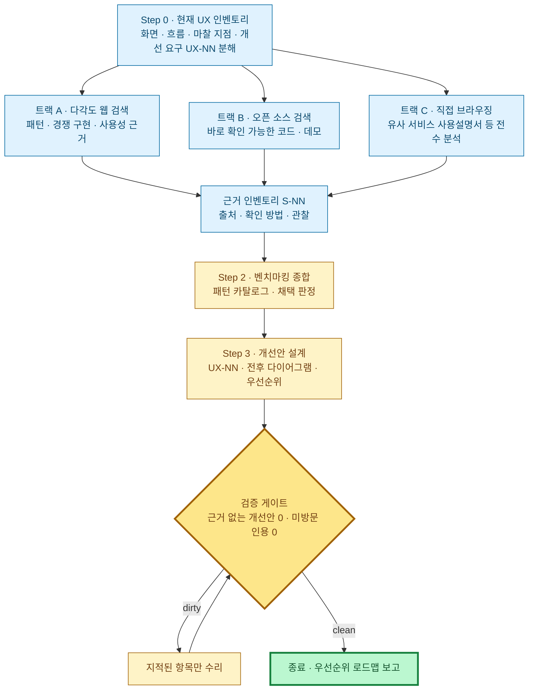

# UX/UI 개선 설계 프롬프트 (리서치 기반)

> **대상 프로젝트의 UX/UI를 광범위한 리서치를 근거로 개선하는 설계 문서를 생성하는** 작업 지시문이다. 이 프롬프트에 **대상 프로젝트(코드·문서 경로)와 개선 요구**를 입력하고, 알고 있는 **유사 서비스 후보**가 있으면 함께 제공해 실행한다.
> 리서치는 세 트랙을 모두 수행한다 — **① 다각도 웹 검색(최대한 많은 검색) ② 오픈 소스 등 바로 확인할 수 있는 소스 검색 ③ 유사 서비스 사이트 직접 브라우징(사용설명서·도움말 등 직접 방문 가능한 페이지 전수 분석)**. 시간이 많이 걸리더라도 트랙 ③의 전수 분석을 생략하지 않는다.
> 원칙: **두괄식 · 다이어그램 1차 표현 · 근거 없는 개선안 금지 · 검증 가능한 출처만 인용**. 모든 개선안은 근거 인벤토리의 출처(`S-NN`)와 연결되어야 하고, 방문·확인하지 않은 출처를 인용하면 P0 위반이다. 종료는 정성 판단이 아니라 §검증 게이트의 기계검증으로만 판정한다.
> 이 프롬프트는 **개선 설계 문서 생성용**이다. 화면 전체를 처음부터 설계하려면 [사이트 설계 프롬프트](./site-design-prompt.md)를, 시스템 구조 재설계는 [AS-IS](./system-design-as-is-prompt.md)→[TO-BE](./system-design-to-be-prompt.md)를 쓴다.

## 입력

| 입력 | 확인할 내용 |
|---|---|
| 대상 프로젝트 | 루트 경로, 프레임워크, 라우터, 주요 화면·흐름, 디자인 시스템/컴포넌트 라이브러리 유무 |
| 개선 요구 | 개선하고 싶은 화면·흐름·문제 의식, 성공 기준. 없으면 전체 화면을 대상으로 마찰 지점을 발굴 |
| 사용자 정보 | 주 사용자 유형, 사용 맥락(데스크톱/모바일, 빈도), 접근성 요구 수준 |
| 유사 서비스 후보 | 사용자가 지정한 벤치마킹 대상. 없으면 Step 1 검색으로 직접 발굴 |
| 제약 | 브랜드/디자인 토큰, 기술 제약, 변경 불가 영역 |

## 설계 의미·표기는 가이드를 따른다 (링크)

| 가이드 | 이 프롬프트에서의 역할 |
|---|---|
| [navigation-diagram-guide.md](../guides/navigation-diagram-guide.md) | 개선 전/후 화면·API·이동 판단의 `navigation` DSL |
| [screen-layout-guide.md](../guides/screen-layout-guide.md) | 개선 전/후 페이지 구조의 `layout` DSL |
| [state-diagram-guide.md](../guides/state-diagram-guide.md) | 화면 내부 상태(로딩·검증·오류·빈 상태)의 `state` DSL |
| [architecture-pattern-diagram-guide.md](../guides/architecture-pattern-diagram-guide.md) | 설계 내용 성격에 맞는 다이어그램 선택 |
| [site-design-prompt.md](./site-design-prompt.md) | 개선 범위가 사이트 전체 재설계로 커질 때의 전환 대상 |

## 다이어그램 표기

- 가이드의 확장 DSL 펜스(`navigation`·`layout`·`state`)를 그대로 사용한다. 다른 형식으로 변환·치환하지 않으며, ASCII 박스·트리 다이어그램은 금지한다.
- **개선안은 전/후 비교로 표현한다**: 변경이 있는 흐름은 `navigation` 전/후, 변경이 있는 화면은 `layout` 전/후를 나란히 둔다. 변경 없는 쪽이 자명하면 후(改)만 두고 "현행 유지 기준" 1줄을 남긴다.
- **Navigation 은 전체→시나리오 순서로 작성한다**: 개선 대상 전체를 관통하는 전체 `navigation` 1장을 먼저 두고, 각 시나리오별 독립 `navigation` 블록과 상세 설명(트리거 조건 · 관련 화면/API · 주요 분기 · 예외 흐름)이 이어지게 한다.
- **다이어그램 하단 흐름 설명(필수)**: 모든 다이어그램 바로 아래에 짧은 문장 불릿 3~6개로 핵심 흐름을 설명한다.

---

## 0. 한눈에 보기 — 리서치 3트랙 + 검증 게이트

**요지**

- 개선안은 리서치에서 발굴한 **검증 가능한 근거** 위에서만 제안한다. "일반적으로 좋다"는 상식만으로 개선안을 만들지 않는다.
- 리서치는 세 트랙을 모두 수행하고, 트랙별 최소 기준(아래 명시)을 채운다. 검색·방문 기록을 로그로 남겨 재검증할 수 있게 한다.
- 개선안은 전/후 다이어그램과 우선순위·예상 효과로 표현하고, 모든 개선안(`UX-NN`)은 근거(`S-NN`)와 1:1 이상 연결한다.

---

## Step 0. 현재 UX 인벤토리와 개선 요구 확정

1. **날짜·경로**: `DATE`(`YYYY.MM.DD`)를 1회 확정한다. 산출물은 핵심 문서 `docs/design/{DATE}/ux-ui/ux-ui-improvement.md` 와 상세 파일 `docs/design/{DATE}/ux-ui/details/*.md`(리서치 로그 포함) 세트다.
2. **화면·흐름 인벤토리**: 실제 라우터·페이지 컴포넌트를 근거로 `화면 · 라우트 · 역할 · 주요 흐름` 표를 만든다. 추측으로 채우지 않는다.
3. **마찰 지점 후보**: 현재 구현에서 관찰되는 UX 문제 후보를 `관찰 · 위치(경로/화면) · 영향` 표로 수집한다. 이 단계에서는 판단하지 않고 관찰만 기록한다.
4. **개선 요구 분해**: 입력받은 개선 요구를 검증 가능한 항목 `UX-NN` 으로 분해한다(항목 · 대상 화면/흐름 · Must/Should/Optional · 성공 기준). 개선 요구가 없으면 3의 마찰 지점 후보에서 도출한다.
5. **유사 서비스 선정**: 대상 프로젝트와 목적·사용자·핵심 흐름이 겹치는 서비스를 **2~4개** 선정한다(입력 후보 우선, 부족하면 트랙 A 검색으로 발굴). 선정 근거를 `서비스 · 유사한 점 · 벤치마킹할 흐름` 표로 남긴다.

## Step 1. 리서치 — 3트랙 모두 수행

세 트랙을 모두 수행하고 결과를 **근거 인벤토리** 하나로 모은다. 어떤 트랙도 "해당 없음"으로 건너뛰지 않는다(수행했으나 성과가 없으면 시도 기록을 남긴다).

### 트랙 A. 다각도 웹 검색 — 최대한 많은 검색

검색은 한두 번으로 끝내지 않는다. **개선 대상 화면/흐름마다 아래 관점을 조합한 검색 매트릭스**를 만들어 체계적으로 수행한다.

| 관점 | 검색 예시 |
|---|---|
| 패턴 명칭 | "{기능} UX pattern", "{기능} best practices", "empty state design" |
| 경쟁 구현 | "{유사 서비스} {기능} how it works", "{도메인} UI comparison" |
| 사용성·접근성 근거 | "{패턴} usability study", NN/g 아티클, WCAG 관련 기준 |
| 안티패턴 | "{패턴} dark pattern", "{기능} UX mistakes" |
| 디자인 시스템 | Material · HIG · 주요 오픈 디자인 시스템의 해당 컴포넌트 지침 |

- **최소 기준**: 개선 대상 화면/흐름당 서로 다른 관점의 검색 **3회 이상**, 전체 세션에서 유효 출처 확보까지 반복.
- 모든 검색을 `검색어 · 도구 · 채택한 결과 · 버린 이유` 로그로 상세 파일에 남긴다.
- 검색 결과 요약문만 읽고 인용하지 않는다 — 채택할 출처는 본문을 열어 확인한다.

### 트랙 B. 오픈 소스 · 바로 확인할 수 있는 소스

주장이 아니라 **동작하는 구현**을 근거로 삼는다.

- 유사 기능을 구현한 오픈 소스 프로젝트를 검색한다(GitHub 검색, awesome 리스트, 오픈 소스 대안 서비스). 채택 시 `저장소 · 파일 경로 · 관찰한 구현 방식`을 기록한다 — 저장소 이름만으로 인용하지 않고 실제 코드/문서를 연다.
- 공개 데모·플레이그라운드·스토리북처럼 **즉시 조작해 확인할 수 있는 소스**를 우선한다. 확인 불가(비공개·빌드 필요·죽은 링크) 소스는 근거로 채택하지 않는다.
- **최소 기준**: 채택하는 핵심 패턴마다 실제로 열어 확인한 소스 **1개 이상**.

### 트랙 C. 유사 서비스 직접 브라우징 — 전수 분석

Step 0 에서 선정한 유사 서비스를 브라우저 도구(또는 웹 fetch)로 **직접 방문**한다. **시간이 많이 걸리더라도, 직접 방문할 수 있는 종류의 페이지는 모두 분석한다.**

1. **방문 대상 페이지 유형**(서비스마다 전부 시도): 공개 랜딩·기능 소개, 가입/온보딩 흐름의 공개 구간, **사용설명서·도움말 센터·FAQ·가이드 문서**, 릴리스 노트·공식 블로그의 UX 관련 글, 공개 데모·스크린샷·동영상 소개 페이지, 요금/플랜 페이지의 기능 표.
2. **사용설명서·도움말 센터는 전수 순회한다**: 목차/사이트맵/카테고리 페이지를 먼저 수집해 하위 문서 목록을 만들고, 개선 대상 흐름과 관련된 문서는 **모두** 열어 읽는다. 관련 없는 카테고리는 목록에 "관련 없음" 판정만 남기고 제외할 수 있다.
3. **페이지 방문 로그(필수)**: 방문한 모든 페이지를 `URL · 제목 · 핵심 관찰(화면 구성·용어·흐름·안내 방식) · UX-NN 관련성` 표로 상세 파일에 남긴다. 사용설명서에서 파악한 화면 구성·조작 순서는 짧은 인용 또는 요약으로 가져온다.
4. **접근 불가 처리**: 로그인 벽·유료 벽·차단된 페이지는 우회하지 않고 `접근 불가 + 사유`로 기록한다. 접속하지 않은 페이지를 방문한 것처럼 기록하는 것은 P0 위반이다.

### 근거 인벤토리 — 모든 트랙의 수렴점

| 열 | 내용 |
|---|---|
| `S-NN` | 출처 ID. 이후 모든 인용은 이 ID 로 |
| 유형 | 검색 문서 / 오픈 소스 / 직접 브라우징 / 사용설명서 |
| 출처 | URL 또는 저장소·파일 경로 |
| 확인 방법 | 본문 정독 / 코드 확인 / 직접 조작 / 문서 전수 순회 |
| 관찰 | 이 출처에서 실제로 확인한 사실 (의견과 구분) |
| 관련 `UX-NN` | 연결되는 개선 항목 |

## Step 2. 벤치마킹 종합 — 패턴 카탈로그

근거 인벤토리를 UX 패턴 단위로 종합한다.

- **패턴 카탈로그**: `패턴 · 관찰한 출처(S-NN, 가급적 2개 이상) · 우리 프로젝트 현재 상태 · 판정` 표. 판정은 세 범주 — **채택**(그대로 적용) / **개선 후 채택**(우리 맥락에 맞게 변형, 변형 근거 명시) / **제외**(브랜드 고유 요소, 우리 사용자와 안 맞음, 안티패턴 — 사유 명시).
- 단일 출처에서만 관찰된 패턴을 채택할 때는 "단일 출처" 위험을 명시한다.
- 유사 서비스의 브랜드·문구·고유 도메인 규칙은 복제하지 않는다 — 패턴(구조·순서·피드백 방식)만 가져온다.

## Step 3. 개선안 설계

1. **개선안 표(핵심)**: `UX-NN · 대상 화면/흐름 · 현재 문제 · 근거(S-NN) · 개선안 · 우선순위(P1/P2/P3) · 예상 효과 · 구현 난이도`. 모든 행은 근거 열이 비어 있으면 안 된다.
2. **전/후 다이어그램**: 흐름이 바뀌는 개선안은 `navigation` 전/후(전체→시나리오 순서), 화면 구조가 바뀌는 개선안은 `layout` 전/후, 상태 처리(로딩·오류·빈 상태)가 바뀌는 개선안은 `state`로 표현한다.
3. **접근성**: 개선안이 WCAG 2.2 AA 기준(키보드 조작, 초점 이동, 오류 안내, 색 대비, 터치 타깃)을 해치지 않는지 항목별로 점검하고, 접근성 자체가 개선되는 항목은 명시한다.
4. **로드맵**: 우선순위·의존 관계 기준으로 적용 순서를 3~7불릿으로 인계한다. 큰 개선(정보 구조 개편 수준)은 [사이트 설계 프롬프트](./site-design-prompt.md) 전환을 권고 항목으로 남긴다.

## 산출물

- **핵심 문서** `docs/design/{DATE}/ux-ui/ux-ui-improvement.md` — 두괄식 §0(개선 요약 + 개선안 표) → 벤치마킹 종합(패턴 카탈로그) → 개선안별 전/후 다이어그램 → 로드맵. 화면 2~3장 이내, 깊이는 상세 파일로.
- **상세 파일** `docs/design/{DATE}/ux-ui/details/*.md` — ① 검색 로그(트랙 A) ② 오픈 소스 확인 기록(트랙 B) ③ 페이지 방문 로그·사용설명서 순회 기록(트랙 C) ④ 근거 인벤토리 전체 ⑤ 시나리오별 상세 navigation/layout/state.

## 검증 게이트 — 위반 0까지 지적 항목만 수리→재검증

**P0 (반드시 수정)**

- 근거 없는 개선안 — `UX-NN` 에 연결된 `S-NN` 이 없거나, 인벤토리에 없는 출처를 인용함
- 미방문 인용 — 접속·확인하지 않은 URL/저장소/페이지를 확인한 것처럼 기록함(환각 인용)
- 리서치 트랙 누락 — 세 트랙 중 하나라도 수행 기록(로그)이 없음
- 트랙 C 전수 분석 누락 — 선정한 유사 서비스의 사용설명서/도움말 순회 기록이 없거나, 방문 로그 없이 결론만 있음
- 유사 서비스의 브랜드·문구·고유 규칙을 개선안에 복제함
- ASCII 다이어그램 사용, `navigation`/`layout`/`state` 를 다른 형식으로 치환함

**P1 (종료 전 수정)**

- 트랙별 최소 기준 미달(화면/흐름당 검색 3회 미만 · 핵심 패턴의 확인 소스 0개 · 유사 서비스 2개 미만)을 사유 없이 방치함
- 패턴 카탈로그의 판정(채택/개선 후 채택/제외) 또는 제외 사유 누락
- 전/후 비교 없이 개선 후 다이어그램만 있고 현행 기준 설명도 없음
- navigation 전체→시나리오 순서 위반, 다이어그램 하단 불릿 설명 누락
- 접근성 점검 누락, 우선순위·로드맵 누락
- 핵심 문서 간명성 위반(화면 2~3장 초과 · 리서치 로그 원문 혼입)

**종료 조건**

- `ungrounded_ux_count`: 근거(S-NN) 연결이 없는 UX-NN 수
- `unvisited_citation_count`: 방문·확인 기록 없이 인용된 출처 수
- `missing_track_count`: 수행 로그가 없는 리서치 트랙 수 (0~3)
- `p0_count` · `p1_count`: 마지막 검증에서 `open` 상태인 각 등급 위반 수

`clean := p0_count == 0 AND p1_count == 0 AND ungrounded_ux_count == 0 AND unvisited_citation_count == 0 AND missing_track_count == 0`

`clean` 이면 종료하고 **① 우선순위 로드맵 ② 채택하지 않은 패턴과 사유 ③ 접근 불가로 분석하지 못한 페이지 목록 ④ 후속 리서치가 필요한 미해결 질문**을 보고한다.
