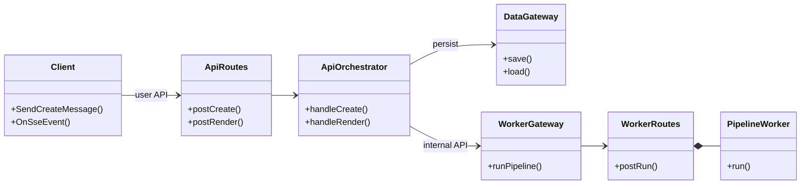

# Service Flow Document Guide

## 목적

여러 백엔드/워커/외부 시스템이 협력하는 프로젝트에서 `SERVICE_FLOW.md` 형식의 문서를 작성하기 위한 가이드다.
목표는 "전체 시스템 구성을 한눈에 이해하고, 각 서비스 내부 흐름으로 재귀적으로 내려갈 수 있는 문서"를 만드는 것이다.

이 문서는 다음 가이드를 함께 사용한다.

- [job-flow-diagram-guide.md](job-flow-diagram-guide.md): 객체 간 메서드 호출·이벤트 흐름
- [navigation-diagram-guide.md](navigation-diagram-guide.md): 화면/API/내부 API 흐름
- [orchestrator-worker-pattern-guide.md](orchestrator-worker-pattern-guide.md): orchestrator, worker, gateway 역할 분리

## 언제 쓰는가

- 서비스가 2개 이상이고, 서비스 간 호출 경계를 명확히 해야 할 때
- Client, API gateway, backend service, worker, batch, external API 가 섞여 있을 때
- 현재 코드 기준의 실제 런타임 흐름을 문서화해야 할 때
- 신규 구성원에게 시스템 전체 구조와 주요 시나리오를 빠르게 설명해야 할 때
- PRD 보다 코드에 가까운 운영/구현 기준 문서가 필요할 때

## 핵심 원칙

### 1. 현재 코드 기준으로 쓴다

`SERVICE_FLOW.md` 는 희망 설계 문서가 아니라 현재 코드의 호출 구조를 설명하는 문서다.
TO-BE 문서가 따로 있다면 본문에 "현재 주 흐름"과 "남아 있는 호환/legacy 경계"를 구분해 적는다.

### 2. 먼저 큰 그림, 그 다음 내부 트리

문서의 읽는 순서는 항상 다음과 같다.

1. 서비스 목록과 책임
2. 전체 시스템 클래스 다이어그램
3. 최상위 서비스 간 jobflow
4. API/navigation 흐름
5. 서비스별 orchestrator/worker 내부 jobflow
6. 공통 런타임/운영 경계
7. 서비스별 소유 책임 표

### 3. 다이어그램 역할을 섞지 않는다

| 다이어그램 | 사용 목적 | 쓰면 안 되는 것 |
|---|---|---|
| `mermaid classDiagram` | 전체 시스템 구성, 소유 관계, 호출 경계 | 상세 시나리오 순서 |
| `jobflow` | 객체 간 메서드 호출, 이벤트, 반환값 흐름 | HTTP path, query parameter, payload |
| `navigation` | 화면/API/프로세스 흐름 | 클래스 내부 private 호출 |

### 4. jobflow 에 HTTP 경로를 쓰지 않는다

`jobflow` 는 `Object.Method` 형식만 사용한다.
HTTP path 는 `navigation` 블록이나 라우트 표에만 쓴다.

잘못된 예:

```jobflow
Client.POST /reports/:id/render --> ReportDataApi.POST /internal/render/report
```

올바른 예:

```jobflow
Client.SendRenderReportMessage --> ChatServer.HandleRenderReportMessage
ChatServer.HandleRenderReportMessage --> ReportDataApi.HandleRenderSavedReport
ReportDataApi.HandleRenderSavedReport --> ReportRenderer.RenderReport
```

### 5. Client 입력과 반응을 명확히 구분한다

- Client 가 보내는 입력: `Client.Send...Message`
- Client 내부 반응: `Client.On...`
- 서버 이벤트: `Service.OnProgress`, `Gateway.OnEvent`

예:

```jobflow
Client.SendCreateReportMessage --> ChatServer.HandleCreateReportMessage
ChatServer.HandleCreateReportMessage.result --> Client.OnReportCreated
ReportDataApi.OnProgress --> ChatServer.OnProgress
```

### 6. 서비스 경계와 내부 객체 경계를 분리한다

한 jobflow 에 모든 것을 넣지 않는다.

- 최상위 jobflow: 서비스 간 메시지만 표시
- 서비스별 jobflow: 해당 서비스의 route/orchestrator/gateway/worker 표시
- worker 내부 jobflow: 복잡한 파이프라인이 있을 때만 별도 섹션으로 분리

## 권장 파일명

서비스 디렉터리나 백엔드 루트에 둔다.

```text
backend/services/SERVICE_FLOW.md
backend/SERVICE_FLOW.md
docs/SERVICE_FLOW.md
```

TO-BE 문서가 필요하면 별도 파일로 둔다.

```text
SERVICE_FLOW-tobe.md
SERVICE_FLOW-problems.md
```

## 작성 전 조사 체크리스트

문서를 쓰기 전에 코드에서 다음을 확인한다.

- 서비스 entrypoint: `main`, `server`, `run`, `bootstrap`
- route mount 파일과 실제 endpoint 목록
- orchestrator/sub-orchestrator 클래스
- gateway 클래스와 base URL/env
- worker 클래스와 public method
- shared runtime: auth, metrics, shutdown, disconnect/cancel 처리
- DB gateway/repository의 주요 저장 책임
- SSE/WebSocket/queue/batch 같은 비동기 경계
- legacy/public compatibility route 가 남아 있는지 여부

## 표준 목차

아래 목차를 기본으로 사용한다.

```markdown
# Service Flow — <시스템 요약>

> 객체 협력은 [job-flow-diagram-guide.md](...) 를 따른다.
> 화면/API 흐름은 [navigation-diagram-guide.md](...) 를 따른다.
> jobflow 에서는 Object.Method / Object.OnEvent 를 기본으로 표기하고 HTTP 경로·파라미터는 쓰지 않는다.
> HTTP/API 이름은 navigation 블록에서만 표기한다.
> Client 입력은 Client.Send...Message, Client 내부 반응은 Client.On... 으로 표기한다.

## 0. 현재 구성

### 0-1. 전체 시스템 클래스 다이어그램

## 1. API 레벨 흐름

### 1-1. 사용자 입력 API
### 1-2. 내부 API
### 1-3. public/legacy/compatibility API

## 2. <service-a> 트리

### 2-1. 서비스 경계
### 2-2. 내부 orchestrator/worker 흐름

## 3. <service-b> 트리

## 4. <worker-service> 트리

## 5. 공통 런타임 경계

## 6. 서비스별 소유 경계
```

프로젝트가 작으면 섹션 수를 줄여도 되지만, `0. 현재 구성`, `API 레벨 흐름`, `서비스별 소유 경계`는 유지한다.

## 섹션별 작성법

### 0. 현재 구성

서비스 목록을 표로 먼저 쓴다.

```markdown
| 서비스 | 기본 포트 | 한 줄 책임 | 외부로 받는 주요 메시지 | 다른 서비스로 보내는 메시지 |
|---|---:|---|---|---|
| **api-server** | 8080 | Client 진입점, auth, routing | 사용자 API 요청 | worker, data-api |
| **worker** | 8081 | 장기 작업 실행 | 내부 작업 요청 | external-api |
```

그 다음 현재 주 흐름과 예외 흐름을 짧게 쓴다.

```markdown
현재 주요 사용자 작업 흐름은 `api-server` 를 먼저 지난다.
단, `data-api` 에는 admin CRUD 와 이전 화면 호환용 public route 가 남아 있다.
```

### 0-1. 전체 시스템 클래스 다이어그램

Mermaid `classDiagram` 을 사용한다.
목적은 전체 구성을 한 화면에 보여주는 것이므로 너무 세부적인 private method 는 넣지 않는다.



권장 표현:

- route 파일은 `<ServiceName>Routes`
- 내부 흐름 제어는 `<Domain>Orchestrator` 또는 `<Domain>SubOrch`
- 외부/타 서비스 호출은 `<Target>Gateway`
- 순수 작업 단위는 `<Domain>Worker`
- shared bootstrap/auth/metrics 는 `SharedRuntime` 으로 묶는다

### 최상위 jobflow

서비스 간 메시지만 표시한다.

```jobflow
master: BackendServices
Object: Client, ApiServer, DataApi, Worker

Client.SendCreateMessage --> ApiServer.HandleCreateMessage
ApiServer.HandleCreateMessage --> DataApi.HandleCreateRequest
DataApi.HandleCreateRequest --> Worker.RunPipeline
Worker.RunPipeline.result --> DataApi.HandleCreateRequest.result
DataApi.HandleCreateRequest.result --> ApiServer.HandleCreateMessage.result
ApiServer.HandleCreateMessage.result --> Client.OnCreated
```

이 블록에서 route handler, repository, private method 는 빼고 서비스 이름만 남긴다.

### API 레벨 흐름

`navigation` 을 사용한다.
동적 segment 는 정규화하고 hyphen 은 underscore 로 바꾼다.

```navigation
CreatePage --> (/items)
(/items) --> CreatePage : progress
(/items) --> CreatePage : result
(/items) --> CreatePage : error

ApiServer --> (/internal/jobs/create)
(/internal/jobs/create) --> ApiServer : progress
(/internal/jobs/create) --> ApiServer : done
(/internal/jobs/create) --> ApiServer : error
```

API 표에는 실제 endpoint 를 적어도 된다.

```markdown
| 라우트 | 소유 객체 | 역할 |
|---|---|---|
| `POST /items` | `ApiOrchestrator` | 생성 요청 |
| `POST /internal/jobs/create` | `JobSubOrch` | 내부 작업 실행 |
```

### 서비스별 트리

각 서비스는 route 경계에서 시작해 orchestrator, gateway, worker 순으로 내려간다.

```jobflow
master: ApiOrchestrator
Object: Client, ApiRoutes, ApiOrchestrator, JobSubOrch, WorkerGateway
Client.SendCreateMessage --> ApiRoutes.HandleCreate
ApiRoutes.HandleCreate --> ApiOrchestrator.HandleCreate
ApiOrchestrator.HandleCreate --> JobSubOrch.HandleCreate
JobSubOrch.HandleCreate --> WorkerGateway.RunPipeline
WorkerGateway.RunPipeline.result --> JobSubOrch.HandleCreate.result
JobSubOrch.HandleCreate.result --> ApiOrchestrator.HandleCreate.result
ApiOrchestrator.HandleCreate.result --> Client.OnCreated
```

객체 표를 붙이면 신규 독자가 읽기 쉽다.

```markdown
| 객체 | 역할 |
|---|---|
| **ApiRoutes** | HTTP/SSE 경계 |
| **ApiOrchestrator** | 사용자 요청의 제어 흐름 |
| **WorkerGateway** | worker 내부 API 호출 캡슐화 |
```

### Worker 파이프라인

3단계 이상이고 실패/진행률/중간 산출물이 중요한 경우 별도 섹션으로 분리한다.

```jobflow
master: PipelineWorker
Object: PipelineWorker, Validate, Enrich, Execute, Summarize
PipelineWorker.Run --> Validate.Run
Validate.Run.result --> Enrich.Run
Enrich.Run.result --> Execute.Run
Execute.Run.result --> Summarize.Run
Summarize.Run.result --> PipelineWorker.Run.result
```

### 공통 런타임 경계

여러 서비스가 공통 bootstrap 을 쓰면 별도 섹션으로 정리한다.

```jobflow
master: ServiceRuntime
Object: ServiceRuntime, AuthMiddleware, MetricsRegistry, ClientDisconnectWorker, RouteHandler
ServiceRuntime.Start --> AuthMiddleware.Install
AuthMiddleware.Install.result --> MetricsRegistry.Install
MetricsRegistry.Install.result --> RouteHandler.Mount
RouteHandler.Mount.result --> ServiceRuntime.Listen
ClientDisconnectWorker.OnResponseClose --> RouteHandler.AbortWork
```

SSE, WebSocket, queue consumer, graceful shutdown, timeout/cancel 정책은 여기에 적는다.

### 서비스별 소유 경계

마지막에는 책임과 소유 서비스를 표로 닫는다.

```markdown
| 책임 | 소유 서비스 | 내부 master |
|---|---|---|
| Client 진입점 | `api-server` | `ApiOrchestrator` |
| 장기 작업 실행 | `worker` | `PipelineWorker` |
| 저장소 CRUD | `data-api` | `ReportSubOrch` + route handler |
```

## 용어 규칙

### 객체 이름

- 서비스: `ChatServer`, `ReportDataApi`, `ReportGenerator`
- route 경계: `ChatServerRoutes`, `ReportDataApiRoutes`
- orchestrator: `ChatOrchestrator`, `ReportSubOrch`
- gateway: `ReportDataApiGateway`, `MysqlGateway`, `WhatapGateway`
- worker: `TemplateGeneratorWorker`, `ReferencePickerWorker`
- shared 함수 묶음: 실제 클래스가 아니어도 역할 이름을 쓸 수 있다. 예: `DataSourceBuilder`

### 메서드 이름

문서 메서드는 코드 public method 를 우선 사용한다.
코드에 정확한 메서드가 없지만 역할을 표현해야 하면 `Handle...`, `Build...`, `Run...`, `On...` 처럼 일관된 이름을 쓴다.

### 이벤트 이름

- 진행률: `OnProgress`
- SSE event 전달: `OnEvent`
- 완료: `OnDone`, `OnCreated`, `OnRendered`
- 오류: `OnError`

## 작성 체크리스트

- [ ] 서비스 표에 모든 런타임 서비스가 들어갔다.
- [ ] 전체 시스템 classDiagram 이 있다.
- [ ] 최상위 jobflow 는 서비스 간 메시지만 보여준다.
- [ ] jobflow 에 HTTP path, parameter, JSON payload 를 쓰지 않았다.
- [ ] HTTP path 는 navigation 또는 route 표에만 있다.
- [ ] Client 입력은 `Client.Send...Message` 로 썼다.
- [ ] Client 반응은 `Client.On...` 으로 썼다.
- [ ] 내부 API, public API, legacy/compatibility API 를 구분했다.
- [ ] 각 서비스의 master/orchestrator 가 명확하다.
- [ ] gateway 는 외부 서비스/저장소 호출 캡슐화로 표현했다.
- [ ] worker 내부 파이프라인은 별도 jobflow 로 분리했다.
- [ ] SSE/queue/shutdown/cancel 같은 비동기 경계를 설명했다.
- [ ] 마지막에 서비스별 소유 경계 표가 있다.
- [ ] 현재 코드와 맞지 않는 TO-BE 표현을 현재 흐름처럼 쓰지 않았다.

## 검증 방법

문서 작성 후 다음을 확인한다.

```bash
rg -n "TODO|미정|나중에|임시" SERVICE_FLOW.md
rg -n "직접 호출|legacy|compatibility|internal" SERVICE_FLOW.md
git diff --check -- SERVICE_FLOW.md
```

프로젝트에 Mermaid 렌더러가 있으면 classDiagram 렌더링도 확인한다.
문서만 변경했다면 테스트 실행은 필수가 아니지만, route 이름이나 클래스 이름을 코드에서 가져온 경우 `rg` 로 실제 존재 여부를 확인한다.

## 안티패턴

### 1. 한 다이어그램에 모든 것을 넣기

나쁜 문서는 하나의 jobflow 에 Client, HTTP path, DB query, worker private method, 외부 API 를 모두 넣는다.
좋은 문서는 최상위, 서비스 내부, worker 내부로 나눈다.

### 2. 설계 희망사항을 현재 코드처럼 쓰기

TO-BE 는 별도 섹션이나 별도 파일에 둔다.
현재 문서에는 "현재 주 흐름", "남아 있는 호환 경계"를 분리해 적는다.

### 3. route 를 객체처럼 남용하기

`(/reports/render)` 는 navigation 에서만 쓴다.
jobflow 에서는 `ReportDataApi.HandleRenderSavedReport` 로 쓴다.

### 4. gateway 를 생략하기

서비스 간 호출이 있으면 gateway 를 명시한다.
gateway 는 auth header 전달, SSE adapter, retry/timeout, base URL 같은 중요한 경계를 숨기기 때문이다.

### 5. 소유 경계를 표로 닫지 않기

다이어그램만 있으면 책임자가 흐려진다.
마지막 표로 "어느 서비스가 무엇을 소유하는지"를 반드시 확정한다.
